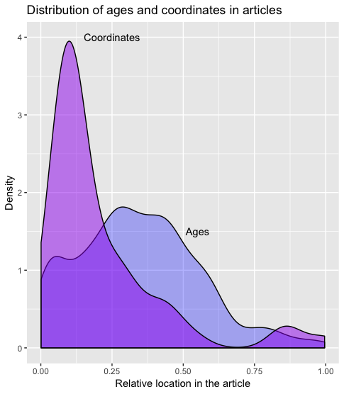

```{r setup, include=FALSE}
knitr::opts_chunk$set(echo = TRUE, message=FALSE, warning = FALSE)
```

## 1. Abstract ##

Machine learning technology promises a more efficient and scalable approach to locating and aggregating data and information from the burgeoning scientific literature. Realizing this promise requires provision of applications, data resources, and the documentation of key tools. GeoDeepDive provides a digital library and computing infrastructure upon which to build and deploy these components. Here we show how a workflow within a single domain can be developed to generate a new understanding of the distribution of ice-rafted debris (IRD) records in both space and time. We use regular expressions and natural language-processing utilities to extract and plot reliable latitude-longitude pairs from publications containing IRD, as well extract age events from those publications. This workflow and resulting R package provides researchers from the geosciences and allied disciplines a general set of tools for querying spatiotemporal information from GeoDeepDive for their own science questions.

Key Words: Text and data mining, Pliocene, Pleistocene, ice-rafted debris


### 2. Introduction and Workflow Overview

Peer-reviewed papers communicate knowledge to their audience through figures, text and tables.  Efforts to improve the practice of data archiving have been increasing (“AGU Publications Data Policy,”; FAIRsharing Team, 2018) as individuals and groups recognize the importance of data sharing to help improve science outcomes.  Despite improved efforts to better curate data, however, a large volume of data and information still exists exclusively in published form as text within manuscripts, embedded in tables, or graphically within figures.  The volume of published literature makes meta-analysis difficult, and as such, new automated software tools are being developed to extract information directly from the scientific literature. Various fields are developing tools for automated extraction of meaningful information from the scientific literature, including natural language processing (NLP) and other forms of machine learning (ML), the vast majority of which is being developed and deployed over general and freely available content, like Twitter feeds and publication abstracts. Currently, the development of new software tools is outpacing their deployment over digital libraries and infrastructures that can serve the unique needs of geoscientists.

GeoDeepDive (geodeepdive.org) is a digital library and computing system that currently contains over 11 million publications from multiple different commercial and open-access content providers. Early versions of GeoDeepDive have been used to automatically find and extract fossil occurrences from the scientific literature (Peters et al., 2014) as well as find instances of stromatolite occurrences, with the goal of better understanding stromatolite resurgences in the geological past (Peters et al., 2017). However, the newness of GeoDeepDive as a platform and the limited nature of software tools that take advantage of it has limited the scope of its impact.  Here we provide a sample workflow that leads the reader through key, public elements of GeoDeepDive, with a goal of retrieving documents on the distribution of ice-rafted debris (IRD) from the Pliocene to present. We choose to focus our effort on IRD because of the near uniqueness of the acronym in the geoscience literature and because IRD is almost exclusively restricted to ocean settings, thus simplifying our ability to identify false positives – occurrences of IRD that do not refer to ice-rafted debris – in our training dataset.  Furthermore, IRD distribution in marine sediments provides a key constraint on cryosphere development, yielding insight into past climate evolution (e.g., Hemming, 2004).

One implementation of GeoDeepDive uses sentences as the atomic unit, managing the sentence-level data within a PostgreSQL database.  Each sentence within a paper is identified by a unique document id (`gddid`, an internally unique identifier to accommodate publications that may or may not have their own formal DOI) and a sentence number that is assigned and unique within the paper.  A separate table relates `gddid`s to publication metadata (e.g. title, journal, authors, etc.).  In this way, GeoDeepDive workflows and the individual steps within these workflows can be thought of as operating at two distinct levels: the sentence level and the document level.  Because GeoDeepDive (GDD) also provides unique IDs for each journal and links these to the sentence IDs, journal-level analytics are possible. GDD makes use of Stanford NLP (Manning et al., 2014), so it is also possible to obtain word-level analysis using indexing within sentences. For the purposes of this paper we will focus on "sentence"- and "document"-level properties.


**Figure 1**: *Workflow used to go from a list of documents that mention ice-rafted debris (IRD; IRD is the actual search string in this case) and (Pliocene or Pleistocene or Holocene) to a vetted set of the documents, and finally a summary of the documents and relevant information.*

This paper presents a sample workflow, intended to provide meaningful but simplified results, with the main goal of illustrating the potential of GDD, and to provide users with some understanding of how GDD can be used to extract information from text.  In this example workflow, we will identify papers with mentions of ice-rafted debris (IRD) in the Pliocene and Pleistocene (Fig. 1), extract space and time coordinates using an R Toolkit called geodiveR (github.com/EarthCubeGeochron/geodiveR), and store the data and code in a GitHub repository (github.com/EarthCubeGeoChron).

Many publications document the existence of IRD at the level of individual marine drilling sites, but assembling this information across publications into large-scale mapped syntheses is a non-trivial task that has traditionally taken years of painstaking literature compilation (Heinrich, 1988; Hemming, 2004; Ruddiman, 1977; Stern and Lisiecki, 2013). A comprehensive, accurate database of IRD deposits and their spatial distribution extracted with software from the published scientific literature can help the scientific community better understand and characterize ice sheet dynamics over the last 5.3 million years, ideally leading to a better understanding of how glaciers respond to changes in climate and ocean circulation.

#### 2.1 Initial Returns and RegEx
Processing the entirety of the documents within GDD is time consuming, as it contains over 11 million peer-reviewed publications. For any given problem, such as finding all instances of IRD, only a fraction of the total library is relevant.  Using a set of keywords reduces the overall data volume by identifying a subset of all documents that are potentially relevant (i.e., if a document does not contain one or more of the given terms it is unlikely to be relevant, but if it has the terms it should be examined).  For this step, one can use straightforward string matching and take advantage of the GDD public API. Here, we chose a number of terms that would help us identify a set of papers that would give us sufficient breadth of documents, while still reducing the overall size of the corpus.  We used the acronym “IRD”, as well as a number of constraints on geologic time intervals, “Holocene”, “Pleistocene” and “Pliocene” (in our example dataset, this returned 5,315 total documents; Figure 2).  Useful information about these terms can be derived from the “snippets” route of GeoDeepDive’s API, which harnesses an ElasticSearch index spanning the full text layer of all PDFs with a “native” text layer (i.e., PDFs with searchable text in them already, which constitutes the vast majority of PDFs distributed by GDD publishers):

https://geodeepdive.org/api/snippets?term=IRD&full_results=true

The response to this API call is a JSON object that indicates the total number of “hits” of the term, basic bibliographic citation information for each document containing the term, including link to original PDF distributed by the publisher, and a “snippet” of text around mentions of the term in the full text of the document. By default, the matching terms are highlighted with HTML tags (to remove the tags, the parameter “&clean=true” can be added to the URL). Because of the large number of results in the case above, a link to the next page of documents containing the term is also provided, allowing large results sets to be scrolled through by the client.

To combine multiple terms and require that they are both present in a document:

https://geodeepdive.org/api/snippets?term=IRD,Pleistocene&inclusive=TRUE&full_results=true

The GeoDeepDive API provides this level functionality publicly, but it is designed to be deployed in user-constructed applications and is suitable only for limited data extraction tasks. The PostgreSQL representation of the document text data provides a different structure that we focus on here.

Matching in Postgres uses existing PostgreSQL text and string functions, while further text processing uses regular expression matching in R using the stringr package.  The use of the Stanford NLP library allows GDD workflows to take advantage of parts-of-speech tagging, and more advanced NLP tools.  This work is limited to using string matching.

<!--Figure 2: GDD corpus vs some possible domain term searches and IRD. -->

#### 2.2 Subsetting and Cleaning

We begin our analysis with a subset of the data that was pared down from the total set of the corpus.  The subset of papers may still include papers that are not appropriate (IRD may refer to something other than ice-rafted debris).  To obtain a training dataset, we run the same text matching rules that we used to match documents at the sentence level. The rules we use become more complex: for example, “IRD” must be located in a sentence with another term (e.g., “IRD” and “Holocene”).  These additional rules restrict the total list returned to n documents for which any sentence contains a match to the keyword.

Searching for `IRD` as a keyword retrieves articles that use `IRD` as an acronym for Ice-Rafted Debris, but it also retrieves articles mentioning the French Research Institute IRD (Institute of Research for Development).  Throughout this paper we will refer to *rules*; generally these are statements that can resolve to a boolean (TRUE/FALSE) output.  So for example, within our subset we could search for all occurrences of `IRD` and `CNRS`:

```{r, eval=FALSE, echo=TRUE}
sentence <- "this,is,a,IRD,and,CNRS,sentence,we,didnt,want,."
stringr::str_detect(sentence, "IRD") & !stringr::str_detect(sentence, "CNRS")
```

This statement will evaluate to `TRUE` if `IRD` appears in a sentence without `CNRS`.  If we apply this sentence-level test at the document level (`any(test == TRUE)`) we can estimate which papers are most likely to have the correct mention of `IRD` for our purposes. This then further reduces the number of papers (and sentences) for our test.

### 3. Extracting Data

After cleaning and subsetting, we develop tests and workflows to extract information through an iterative process.  In many cases this requires further text matching, and packages in R such as `stringr` were helpful for accomplishing this task.  Additional support can come from the NLP output that can be generated for the data.  In all of these cases, we generate clear rules to be tested, and then apply them to the document.

Because understanding both the IRD distribution in ocean sediments and the timing of the deposition of IRD through the Pliocene-Pleistocene is critical for interpreting past ice sheet dynamics, spatial coordinates and geochronologic constraints of the IRD deposits need to be identified within the paper.  As with the earlier cleaning process, any paper that contains neither spatial coordinates or ages, or one but not the other, is not of interest for this application.

Extracting the spatial location and age of an IRD occurrence within a paper that contains ‘IRD’, however, is not sufficient.  We need to be able to distinguish between a reported age and an age related to the event we are interested in, and so again we must develop general rules that allow us to distinguish all ages from ages of interest, and all spatial locations from spatial locations of interest.


### Exploratory Itteration

There are a number of reasons to continue to refine the rules used to discover data in this workflow.  First, extraction of text from the PDF and optical character recognition (OCR) is not always accurate, so that some sentences and words are parsed incorrectly.  This problem is particularly acute for geographic coordinates (below). Second, many words have multiple meanings, leading to false positives using only string-matching, as the IRD example above illustrates.  Third, different disciplines and journals use different standards for reporting.  For example, if we were interested in paleoecological information we would need to know that `paleoecology` and `palaeoecology` refer to similar concepts.  Similarly, `ice rafted debris` may also be referred to as `sand sized layers` in the marine context (Ruddiman, 1977).  Fourth, the context and placement of words matters.  For example, temporal information like ‘Holocene’ and ‘Pliocene’ may be found in the Methods, where they refer to marine core locations, or in the Discussion, where they might refer to global climate trends.

Some potential pitfalls include
  * OCR matching - commonly mistaken letters (O, Q, o)
  * Age reporting variety (e.g., kyr vs. ka)
  * GDD sentence construction

Repeatedly reviewing matches at the sentence level and at the document level (i.e., “Why did this match or why didn't this paper return a match?”), then refining the workflow rule-sets accordingly, is critical to developing a clear workflow and high-value corpus. In many cases, beginning with very broad tests and slowly paring down to more precise tests is an appropriate pattern.  In this case, tools like RMarkdown are very helpful for interactive data exploration, using packages like `DT` and `leaflet` (Cheng et al., 2018; Xie et al., 2019).  We can assess the distribution of age-like elements within a paper and determine if they match with our initial expectations (e.g. "Why does *Debris fields in the Miocene* contain Holocene-aged matches?"; "Why does a paper about Korea report locations in Belize?").  Depending on the success of the algorithm, the tests can be revised and the process repeated until an acceptable match is found.


### Reproducible and Validated Workflows

As the workflow develops and refines, we can begin to report on patterns and findings.  Some of these may be semi-qualitative (e.g. "We find the majority of sites are dated to the LGM"), while others may involve statistical analysis (e.g., "The presence of IRD declines linearly with decreasing latitude ($p$ < $0.05$)").  In an analysis where the underlying dataset is static or a data version has been frozen, it is reasonable to develop a paper and report these findings.

However, the publication database in GDD is far from static; the GDD infrastructure acquires more than 10,000 papers per day from multiple different sources.  Given this, it is likely that some patterns will change over time as more information is brought to bear. For example, the addition of new records may reveal previously undiscovered search artifacts within the publication record that produce false positives or false negatives.  For this reason the use of assertions or testable statements that can be evaluated to TRUE or FALSE within the workflow become critically important.  In R we can use the `assertthat` package to provide support for test-driven development and assertions within the workflow.

Test-driven development is common in software development.  As developers create new features, a good practice is to first develop tests for the features, to ensure that feature behavior matches expectations.  The analogy in our scientific workflow is that findings are features, and as we report on them we want to be assured that those findings are valid.  In R the `assertthat` package provides a tool for testing statements, and providing robust feedback through custom error messages (Wickham, 2019).

```{r eval=FALSE}
howmany_dates <- all_sentences %>%
  mutate(hasAge = stringr::str_detect(words, "regular expression for dates")) %>%
  group_by(gddid) %>%
  summarise(age_sentences = any(hasAge),
            n = n())

# We initially find that less than 10% of papers have dates in them, and report that as an important finding in the paper.

percent_ages <- sum(howmany_dates$age_sentences) / nrow(howmany_dates)

assertthat::assert_that(percent_ages < 0.1, msg = "More than 10% of papers have ages.")
```
Text Box 1. From sentences returned by GDD (all_sentences) create a new column called ‘hasAge’ that is a boolean variable to test whether an age is found.  Once the variable has been created, group the data to test whether any of the papers (each with a unique gddid) has an age reported in the paper, and then count the total number of reported ages within the paper.  If we expect that most papers won’t have reported ages, we can create an assertion, in this case that only 10% of papers have a reported age.  If this assertion fails, then a custom error message is returned.

With these elements we now have an iterative process that is also responsive to the underlying data.  We have mapped out the general overview of our reported findings and developed clear tests under which our findings are valid.  We can create a document that combines our code and text in an integrated manner, supporting FAIR Principles (Wilkinson et al., 2016), and making the most out of the new technology. In the following section we will run through this workflow in detail.


### 6. Ice Rafted Debris Case Study and Discussion

#### 6.1 Finding Spatial Matches

To begin, we load the packages that will be used, and then import the data:

```{r hide_devtools, results='hide', message=FALSE, echo=FALSE, warning=FALSE}
devtools::install_github('EarthCubeGeochron/geodiveR')
```

```{r load_data, message=FALSE, warning = FALSE}

library(geodiveR)

library(jsonlite) # (Ooms et al., 2018)
library(readr) # (Wickham et al., 2018)
library(dplyr) # (Wickham et al., 2019)
library(stringr)
library(leaflet)
library(purrr) # (Henry et al., 2019)
library(DT)
library(assertthat)

sourcing <- list.files('R', pattern = ".R$", full.names = TRUE) %>%
  map(source, echo = FALSE, print = FALSE, verbose = FALSE)

publications <- fromJSON(txt = 'input/bibjson', flatten = TRUE)

if(!file.exists('input/sentences_nlp352')){
  data(nlp)
  full_nlp <- nlp
  rm(nlp)
  colnames(full_nlp) <- c('_gddid', 'sentence', 'wordIndex',
                          'word', 'partofspeech', 'specialclass',
                          'wordsAgain', 'wordtype', 'wordmodified')
} else {

  full_nlp <- readr::read_tsv('input/sentences_nlp352',
                         trim_ws = TRUE,
                         col_names = c('_gddid', 'sentence', 'wordIndex',
                                       'word', 'partofspeech', 'specialclass',
                                       'wordsAgain', 'wordtype', 'wordmodified'))
}

#  uses the clean_corpus.R function within geodiveR
#  (implements the IRD search-and-refinement rules mentioned
#   above in ‘Exploratory Iteration’)

nlp_clean <- clean_corpus(x = full_nlp, pubs = publications)

nlp <- nlp_clean$nlp

```

From this set of code we obtain an output object that includes a key for the publication (`_gddid`, linking to the `publications` variable), the sentence number of the parsed text, and then both the parsed text and some results from natural language processing. We also obtain a list of gddids to keep or drop given the regular expressions we used to find instances of IRD in the affiliations or references sections of the papers. This analysis provides 82 publications:

```{r demo_table, warning=FALSE, echo = FALSE}

short_table <- nlp  %>%
  filter(1:nrow(nlp) %in% 1) %>%
  str_replace('-LRB-', '(') %>%
  str_replace('-RRB-', ')') %>%
  as.data.frame(stringsAsFactors = FALSE)

rownames(short_table) <- colnames(nlp_clean)
colnames(short_table) <- 'value'

short_table[nchar(short_table[,1])>40,1] <-
  paste0('<code>', substr(short_table[nchar(short_table[,1])>40, 1], 1, 30), ' ... }</code>')

rownames(short_table) <- colnames(nlp)

short_table$description <- c("Unique article identifier",
                             "Unique sentence identifier within article",
                             "Index of words within sentence",
                             "Verbatim OCR word",
                             "Parts of speech, based on <a href='https://www.ling.upenn.edu/courses/Fall_2003/ling001/penn_treebank_pos.html'>Penn State TreeView</a>",
                             "Special classes (numbers, dates, &cetera)",
                             "Words again",
                             "Word types, based on <a href='http://universaldependencies.org/introduction.html'>universal dependencies</a>.",
                             "The word that the <code>wordtype</code> is modifying.")

short_table %>%
  datatable(escape = FALSE, rownames = TRUE, options = list(dom='t'))

```


## 6.2 Extracting Spatial Coordinates

We are interested in using GDD to obtain site coordinates for locations that contain IRD data spanning the last 5 million years.  The goal is to provide relevant site information for use in meta-analysis, or for comparing results to existing geographic locations from the relevant geocoded publications and then linking back to the publications using DOIs.

To obtain geographical coordinates from the paper we must consider several potential issues.  The first is that not all coordinates will necessarily refer to an actual ocean core.  We may also, inadvertently, find numeric objects that appear to be coordinates, but are in fact simply numbers.  Therefore, we must identify what exactly we think coordinates might look like and build a regular expression (or set of regular expressions) to accurately extract these values.  Since we will process DMS coordinates differently than DD coordinates, we generate two regular expressions:

```{r regex_degrees}
dms_regex <- "[\\{,]([-]?[1]?[0-9]{1,2}?)(?:(?:,[°◦o],)|(?:[O])|(?:,`{2},))([1]?[0-9]{1,2}(?:.[0-9]*)),[′'`]?[,]?([[0-9]{0,2}]?)[\"]?[,]?([NESWnesw]?),"

 dd_regex <- "[\\{,][-]?[1]?[0-9]{1,2}\\.[0-9]{1,}[,]?[NESWnesw],"

```

These regular expressions allow for negative or positive coordinate systems, that may start with a `1`, and then are followed by one or two digits (`{1,2}`).  From there we see differences in the structure, reflecting the need to capture the degree symbols, or, in the case of decimal degrees, the decimal component of the coordinates.  The regular expressions are more rigorous (i.e., have fewer matching options) for the decimal degrees than for DMS coordinates.  DMS coordinates reported in documents may be interpreted in non-standard ways by OCR.

The regex commands were constructed using capture (and non-capture) groups to work with the `stringr` package (Wickham and RStudio, 2019), so that we obtain five elements from any match, including the full match, the degrees, the minutes, the seconds (which may be an empty string), and the quadrant (NESW).

```{r, regex_apply}
degmin <- str_match_all(nlp$word, dms_regex)
decdeg <- str_match_all(nlp$word, dd_regex)
```

Since the documents are broken up into sentences we expect that all coordinates are reported as pairs, and so we are most interested in finding all the records that show up with pairs of coordinates.  We start by matching up the publications with sentences that have coordinate pairs:

```{r, coord_dtable, echo = FALSE}

coord_pairs <- sapply(degmin, function(x)length(x) %% 2 == 0 & length(x) > 0) |
  sapply(decdeg, function(x)length(x) %% 2 == 0 & length(x) > 0)

things <- nlp %>%
  filter(coord_pairs) %>%
  inner_join(publications, by = "_gddid") %>%
  select(`_gddid`, word, year, title) %>%
  mutate(word = gsub(',', ' ', word)) %>%
  mutate(word = str_replace_all(word, '-LRB-', '(')) %>%
  mutate(word = str_replace_all(word, '-RRB-', ')')) %>%
  mutate(word = str_replace_all(word, '" "', ','))

things %>% select(-`_gddid`) %>% datatable

```

Even here, we can see that many of these matches work, but that some of the matches are incomplete.  There appears to be a much lower proportion of sites returned than we might otherwise expect.  Given that there are `r length(unique(nlp$"_gddid"))` articles in the NLP dataset, it is surprising that only `r length(unique(things$"_gddid"))` appear to support regex matches to coordinate pairs.  We would expect that the description of sites or locations using coordinate pairs should be common practice. The observed outcome is likely to be, in part, an issue with the OCR/regex processing. A next iterative step would be to go over the potential matches more thoroughly to find additional methods of detecting the coordinate systems.


## 6.3 Converting Coordinates

Given the geographic coordinate strings, we need to be able to transform them to reliable latitude and longitude pairs with sufficient confidence to actually map the records.  These two functions convert the GeoDeepDive (GDD) word elements pulled out by the regular expression searches into decimal degrees that can account for reported locations.

```{r, extract_coords}

convert_dec <- function(x, i) {

  drop_comma <- gsub(',', '', x) %>%
    substr(., c(1,1), nchar(.) - 1) %>%
    as.numeric %>%
    unlist

  domain <- (str_detect(x, 'N') * 1 +
    str_detect(x, 'E') * 1 +
    str_detect(x, 'W') * -1 +
    str_detect(x, 'S') * -1) *
    drop_comma

  publ <- match(nlp$`_gddid`[i], publications$`_gddid`)

  point_pairs <- data.frame(sentence = nlp$word[i],
                            lat = domain[str_detect(x, 'N') | str_detect(x, 'S')],
                            lng = domain[str_detect(x, 'E') | str_detect(x, 'W')],
                            publications[publ,],
                            stringsAsFactors = FALSE)

  return(point_pairs)
}

convert_dm <- function(x, i) {

  # We use the `i` index so that we can keep the coordinate outputs from the
  #  regex in a smaller list.
  dms <- data.frame(deg = as.numeric(x[,2]),
                    min = as.numeric(x[,3]) / 60,
                    sec = as.numeric(x[,4]) / 60 ^ 2,
                    stringsAsFactors = FALSE)

  dms <- rowSums(dms, na.rm = TRUE)

  domain <- (str_detect(x[,5], 'N') * 1 +
    str_detect(x[,5], 'E') * 1 +
    str_detect(x[,5], 'W') * -1 +
    str_detect(x[,5], 'S') * -1) *
    dms

  publ <- match(nlp$`_gddid`[i], publications$`_gddid`)

  point_pairs <- data.frame(sentence = nlp$word[i],
                            lat = domain[x[,5] %in% c('N', 'S')],
                            lng = domain[x[,5] %in% c('E', 'W')],
                            publications[publ,],
                            stringsAsFactors = FALSE)

  return(point_pairs)
}

```

Once we are done converting coordinate strings to reliable latitude and longitude pairs, we need to apply those functions to the set of records we've extracted to build a composite table:

```{r leaflet_plot}

coordinates <- list()
coord_idx <- 1

for (i in 1:length(decdeg)) {
  if ((length(decdeg[[i]]) %% 2 == 0 |
      length(degmin[[i]]) %% 2 == 0) & length(degmin[[i]]) > 0) {

    if (any(str_detect(decdeg[[i]], '[NS]')) &
       sum(str_detect(decdeg[[i]], '[EW]')) == sum(str_detect(decdeg[[i]], '[NS]'))) {
      coordinates[[coord_idx]] <- convert_dec(decdeg[[i]], i)
      coord_idx <- coord_idx + 1
    }
    if (any(str_detect(degmin[[i]], '[NS]')) &
       sum(str_detect(degmin[[i]], '[EW]')) == sum(str_detect(degmin[[i]], '[NS]'))) {
      coordinates[[coord_idx]] <- convert_dm(degmin[[i]], i)
      coord_idx <- coord_idx + 1
    }
  }
}

coordinates_df <- coordinates %>% bind_rows %>%
  mutate(sentence = gsub(',', ' ', sentence)) %>%
  mutate(sentence = str_replace_all(sentence, '-LRB-', '(')) %>%
  mutate(sentence = str_replace_all(sentence, '-RRB-', ')')) %>%
  mutate(sentence = str_replace_all(sentence, '" "', ','))

coordinates_df$doi <- coordinates_df$identifier %>% map(function(x) x$id) %>% unlist

leaflet(coordinates_df) %>%
  addProviderTiles(providers$Esri.WorldImagery) %>%
  addCircleMarkers(popup = paste0('<b>', coordinates_df$title, '</b><br>',
                                  '<a href=https://doi.org/',
                                  coordinates_df$doi,'>Publication Link</a><br>',
                                  '<b>Sentence:</b><br>',
                                  '<small>',gsub(',', ' ', coordinates_df$sentence),
                                  '</small>'))

```

**Figure 3**: *Leaflet map depicting sites that mention IRD and contain coordinate information and an IRD event. Each dot can be clicked to pull up: the title of the paper, the link to the publication, the sentence(s) containing spatial coordinates and other relevant IRD information. Out of the 150 papers in the test dataset, we found 11 papers with extractable spatial coordinates, comprising a total of 30 coordinate pairs (References included in leaflet map include: Baeten et al., 2014; Cofaigh et al., 2001; Ikehara and Itaki, 2007; Incarbona et al., 2008; Kaboth et al., 2016; Prokopenko et al., 2002; Rea et al., 2016; Rosell-Melé et al., 1997; Seki et al., 2005; Simon et al., 2013; Stoner et al., 1994).*



**Figure 4**: *Relative location of ages and spatial coordinates reported in GDD documents (i.e., are ages or spatial coordinates generally located at the beginning, middle, or end of a paper?).*

After cleaning and subsetting the corpus, we find 11 papers with 30 coordinate pairs out of 150 documents in the IRDDive test dataset (Fig. 3). This test suggests further improvements that can be made to the current methods.  First, in some cases, we find papers where IRD is simply referenced, and the paper does not report primary data. To circumvent this issue, we need to know where in these papers IRD is being mentioned. Targeting certain parts of the paper, like the Methods, might ensure we are only obtaining coordinates for IRD data (see Figure 4). Second, in some cases we find IRD but no coordinates or other core metadata; some papers simply do not contain coordinate information. Third, some papers mention IRD in the core data for continental cores (see Fig. 3 Central Asia location). These might possibly be valid instances of IRD in lacustrine deposits, or might represent papers that mention IRD without representing primary data. By removing documents that mention 'continental (place name)' these apparent false positives can be cleaned further. Another option is to cross-reference the returned IRD coordinates with the location of continents and remove coordinate pairs that fall within the continental boundaries. A fourth and last step would be to further refine the regex to obtain additional mentions of IRD, e.g. as 'IRD-rich layers', ‘IRD-rich deposits’, ‘Heinrich layers’, etc.

## 6.4 Extracting ages and age ranges

After the corpus of documents is cleaned and coordinates are obtained, we aimed to extract ages and age ranges that may be associated with IRD events. This requires building regex's that pull dates with many different naming conventions. For example, we need to consider:

| Age reference |
| -----------   |
| years BP      |
| kyr BP        |
| ka BP         |
| a BP          |
| Ma BP         |
| etc.          |

For this, we can use the `browse()` function to look for different naming conventions and then start pulling ages and age ranges associated with them.

```{r, eval=FALSE}

is_date <- str_detect(nlp$word, ",BP,")

nlp$word[is_date]

date_range <- str_detect(full_nlp$word,
                   "(\\d+(?:[.]\\d+)*),((?:-{1,2})|(?:to)),(\\d+(?:[.]\\d+)*),([a-zA-Z]+,BP),")

date_match <- str_match(full_nlp$word,
                         "(\\d+(?:[.]\\d+)*),((?:-{1,2})|(?:to)),(\\d+(?:[.]\\d+)*),([a-zA-Z]+,BP),") %>% na.omit()

browse(x = data.frame(gddid = x$`_gddid`[ird_word&!france],
                      words = x$word[ird_word&!france]),
       pubs = publications)

number <- str_detect(full_nlp$word,
                         ",(\\d+(?:[\\.\\s]\\d+){0,1}),.*?,yr,")
```

Output from pulling and cleaning dates using regex

| Age ranges          |
| -----------         |
| "76,to,62,kyr,BP,"  |
| "6,--,6.4,kyr,BP,"  |
| "6,to,3,kyr,BP,"    |
| "11,--,10,kyr,BP,"  |
| "6.0,--,6.7,kyr,BP,"|

| Age captures     |
| -----------      |
| "76"  "to" "62"  |
| "6"   "--" "6.4" |
| "6"   "to" "3"   |
| "11"  "--" "10"  |
| "6.0" "--" "6.7" |

| Date Label  |
| ----------- |
| "kyr,BP"    |
| "kyr,BP"    |
| "kyr,BP"    |
| "kyr,BP"    |
| "kyr,BP"    |

At this stage of the workflow, we only know that these ages are mentioned in papers that also mention IRDs; we do not know if these ages are associated with specific IRD events.  Nonetheless, when we plot the data, we observe clusters that are consistent with IRD distributions found in the primary literature but with some notable exceptions (e.g., over land). We have successfully identified instances of dates in the papers where there are references to IRD (Table 1) and we can, as a next step, begin to match the dates to specific units.

**Table 1**. *Examples of extracted ages from sentences within IRD papers.*
```{r datetable, echo=FALSE}

is_date <- str_detect(nlp$word, ",BP,")

date_range <- str_detect(full_nlp$word,
                   "(\\d+(?:[.]\\d+)*),((?:-{1,2})|(?:to)),(\\d+(?:[.]\\d+)*),([a-zA-Z]+,BP),")

date_match <- str_match(full_nlp$word,
                         "(\\d+(?:[.]\\d+)*),((?:-{1,2})|(?:to)),(\\d+(?:[.]\\d+)*),([a-zA-Z]+,BP),") %>% na.omit()


number <- str_detect(full_nlp$word,
                        ",(\\d+(?:[\\.\\s]\\d+){0,1}),.*?,yr,")

browse(x = data.frame(gddid = full_nlp$`_gddid`[number|date_range],
                                words = full_nlp$word[number|date_range]),
                 pubs = publications)

```

##  7. Conclusions

Here we have provided a model workflow to obtain coordinate and age information associated with IRD deposits, a GitHub Repository for open code development and sharing, and an R toolkit (github.com/EarthCubeGeochron/geodiveR).  The specific case study showcased here is designed to help researchers study the dynamics of ice sheets over the last 5 million years, while GeoDeepDive and the post-processing analytical workflows shown here will be helpful to those wanting to query for space and time information using GeoDeepDive. This will allow other researchers to import their own data from their own search logic, and output text and coordinates relevant to a researcher’s question. The GitHub Repository and R package can act as building blocks that serve researchers not only in the geosciences, but allied disciplines as well.

##  8. References

AGU Publications Data Policy [WWW Document], n.d. . Publications. URL https://publications.agu.org/author-resource-center/publication-policies/data-policy/ (accessed 10.23.19).

Baeten, N.J., Laberg, J.S., Vanneste, M., Forsberg, C.F., Kvalstad, T.J., Forwick, M., Vorren, T.O., Haflidason, H., 2014. Origin of shallow submarine mass movements and their glide planes—Sedimentological and geotechnical analyses from the continental slope off northern Norway. J. Geophys. Res. Earth Surf. 119, 2335–2360. https://doi.org/10.1002/2013JF003068

Cheng, J., Karambelkar, B., Xie, Y., Wickham, H., Russell, K., Johnson, K., Schloerke, B., library),  jQuery F. and contributors (jQuery, library), V.A. (Leaflet, library), C. (Leaflet, library), L. contributors (Leaflet, plugin), L.P. contributors (Leaflet P., plugin), B.C. (leaflet-measure, plugin), J.D. (Leaflet T., plugin), B.B. (Leaflet M., plugin), N.A. (Leaflet M., plugin), L.V. (Leaflet awesome-markers, plugin), D.M. (Leaflet E., plugin), K.A. (Proj4Leaflet, plugin), R.K. (leaflet-locationfilter, plugin), M. (leaflet-omnivore, Bostock  (topojson), M., RStudio, 2018. leaflet: Create Interactive Web Maps with the JavaScript “Leaflet” Library.

Cofaigh, C.Ó., Dowdeswell, J.A., Pudsey, C.J., 2001. Late Quaternary Iceberg Rafting along the Antarctic Peninsula Continental Rise and in the Weddell and Scotia Seas. Quat. Res. 56, 308–321. https://doi.org/10.1006/qres.2001.2267

FAIRsharing Team, 2018. Joint Data Archiving Policy. https://doi.org/10.25504/FAIRSHARING.Z67HT2

Heinrich, H., 1988. Origin and Consequences of Cyclic Ice Rafting in the Northeast Atlantic Ocean During the Past 130,000 Years. Quat. Res. 29, 142–152. https://doi.org/10.1016/0033-5894(88)90057-9

Hemming, S.R., 2004. Heinrich events: Massive late Pleistocene detritus layers of the North Atlantic and their global climate imprint. Rev Geophys 42, RG1005. https://doi.org/10.1029/2003rg000128

Henry, L., Wickham, H., RStudio, 2019. purrr: Functional Programming Tools.
Ikehara, K., Itaki, T., 2007. Millennial-scale fluctuations in seasonal sea-ice and deep-water formation in the Japan Sea during the late Quaternary. Palaeogeogr. Palaeoclimatol. Palaeoecol., Quaternary Paleoceanography of the Japan Sea and its linkage with Asian Monsoon 247, 131–143. https://doi.org/10.1016/j.palaeo.2006.11.026

Incarbona, A., Stefano, E.D., Patti, B., Pelosi, N., Bonomo, S., Mazzola, S., Sprovieri, R., Tranchida, G., Zgozi, S., Bonanno, A., 2008. Holocene millennial-scale productivity variations in the Sicily Channel (Mediterranean Sea). Paleoceanography 23. https://doi.org/10.1029/2007PA001581

Kaboth, S., Bahr, A., Reichart, G.-J., Jacobs, B., Lourens, L.J., 2016. New insights into upper MOW variability over the last 150kyr from IODP 339 Site U1386 in the Gulf of Cadiz. Mar. Geol., STRATIGRAPHIC AND SEDIMENTARY SIGNIFICANCE OF THE MEDITERRANEAN OUTFLOW WATER AND ITS CONCEPTUAL IMPLICATIONS 377, 136–145. https://doi.org/10.1016/j.margeo.2015.08.014

Manning, C., Surdeanu, M., Bauer, J., Finkel, J., Bethard, S., McClosky, D., 2014. The Stanford CoreNLP Natural Language Processing Toolkit. Association for Computational Linguistics, pp. 55–60. https://doi.org/10.3115/v1/P14-5010

Ooms, J., Lang, D.T., Hilaiel, L., 2018. jsonlite: A Robust, High Performance JSON Parser and Generator for R.

Peters, S.E., Husson, J.M., Wilcots, J., 2017. The rise and fall of stromatolites in shallow marine environments. Geology 45, 487–490. https://doi.org/10.1130/G38931.1

Peters, S.E., Zhang, C., Livny, M., Ré, C., 2014. A Machine Reading System for Assembling Synthetic Paleontological Databases. PLOS ONE 9, e113523. https://doi.org/10.1371/journal.pone.0113523

Prokopenko, A.A., Karabanov, E.B., Williams, D.F., Khursevich, G.K., 2002. The Stability and the Abrupt Ending of the Last Interglaciation in Southeastern Siberia. Quat. Res. 58, 56–59. https://doi.org/10.1006/qres.2002.2329

Rea, D.K., Moore, T.C., Hassold, N., Pluijm, B. van der, 2016. Do magnetic fabrics of marine deposits preserve orbital forcing? A test case in the Southern Ocean, Antarctic Peninsula. Lithosphere 8, 751–756. https://doi.org/10.1130/L566.1

Rosell-Melé, A., Maslin, M.A., Maxwell, J.R., Schaeffer, P., 1997. Biomarker evidence for “Heinrich” events. Geochim. Cosmochim. Acta 61, 1671–1678. https://doi.org/10.1016/S0016-7037(97)00046-X

Ruddiman, W.F., 1977. Late Quaternary deposition of ice-rafted sand in the subpolar North Atlantic (lat 40° to 65°N). Geol. Soc. Am. Bull. 88, 1813. https://doi.org/10.1130/0016-7606(1977)88<1813:LQDOIS>2.0.CO;2

Seki, O., Kawamura, K., Sakamoto, T., Ikehara, M., Nakatsuka, T., Wakatsuchi, M., 2005. Decreased surface salinity in the Sea of Okhotsk during the last glacial period estimated from alkenones. Geophys. Res. Lett. 32. https://doi.org/10.1029/2004GL022177

Simon, M.H., Arthur, K.L., Hall, I.R., Peeters, F.J.C., Loveday, B.R., Barker, S., Ziegler, M., Zahn, R., 2013. Millennial-scale Agulhas Current variability and its implications for salt-leakage through the Indian–Atlantic Ocean Gateway. Earth Planet. Sci. Lett. 383, 101–112. https://doi.org/10.1016/j.epsl.2013.09.035

Stern, J.V., Lisiecki, L.E., 2013. North Atlantic circulation and reservoir age changes over the past 41,000 years. Geophys. Res. Lett. 40, 3693–3697. https://doi.org/10.1002/grl.50679

Stoner, J.S., Channell, J.E.T., Hillaire-Marcel, C., Mareschal, J.-C., 1994. High-resolution rock magnetic study of a Late Pleistocene core from the Labrador Sea. Can. J. Earth Sci. 31, 104–114. https://doi.org/10.1139/e94-009

Wickham, H., 2019. assertthat: Easy Pre and Post Assertions.
Wickham, H., François, R., Henry, L., Müller, K., RStudio, 2019. dplyr: A Grammar of Data Manipulation.

Wickham, H., Hester, J., Francois, R., R), R.C.T. (Date time code adapted from, RStudio, implementation), J.J. (grisu3, implementation), M.J. (grisu3, 2018. readr: Read Rectangular Text Data.

Wickham, H., RStudio, 2019. stringr: Simple, Consistent Wrappers for Common String Operations.

Wilkinson, M.D., Dumontier, M., Aalbersberg, Ij.J., Appleton, G., Axton, M., Baak, A., Blomberg, N., Boiten, J.-W., da Silva Santos, L.B., Bourne, P.E., Bouwman, J., Brookes, A.J., Clark, T., Crosas, M., Dillo, I., Dumon, O., Edmunds, S., Evelo, C.T., Finkers, R., Gonzalez-Beltran, A., Gray, A.J.G., Groth, P., Goble, C., Grethe, J.S., Heringa, J., ’t Hoen, P.A.., Hooft, R., Kuhn, T., Kok, R., Kok, J., Lusher, S.J., Martone, M.E., Mons, A., Packer, A.L., Persson, B., Rocca-Serra, P., Roos, M., van Schaik, R., Sansone, S.-A., Schultes, E., Sengstag, T., Slater, T., Strawn, G., Swertz, M.A., Thompson, M., van der Lei, J., van Mulligen, E., Velterop, J., Waagmeester, A., Wittenburg, P., Wolstencroft, K., Zhao, J., Mons, B., 2016. The FAIR Guiding Principles for scientific data management and stewardship. Sci. Data 3. https://doi.org/10.1038/sdata.2016.18

Xie, Y., Cheng, J., Tan, X., Allaire, J.J., Girlich, M., Ellis, G.F., Rauh, J., htmlwidgets/lib),  jQuery contributors (jQuery in, htmlwidgets/lib), S.L. (DataTables in, htmlwidgets/lib), B.R. (selectize js in, htmlwidgets/lib), L.G. (noUiSlider in, htmlwidgets/lib), B.S. (jquery highlight js in, Inc, Rs., 2019. DT: A Wrapper of the JavaScript Library “DataTables.”

##  9. Data Availability
All data are publicly available at [http://github.com/EarthCubeGeoChron/IRDDive]() and [http://github.com/EarthCubeGeochron/geodiveR]().

##  10. Acknowledgements
Funding for this research was provided by the National Science Foundation (#EAR-1740694 to Goring, Marcott, Meyers, Peters, Singer, and Williams). The authors also acknowledge I. Ross, J. Czaplewski, A. Zaffos, E. Ito, and J. Husson for helpful discussions.

##  11. Author Contributions
All authors contributed to study design. J.M., S.Y., and S.J.G. performed analysis and developed the GitHub repository and R package. J.M., S.J.G., and S.A.M. wrote the paper with input from the rest of the authors.
