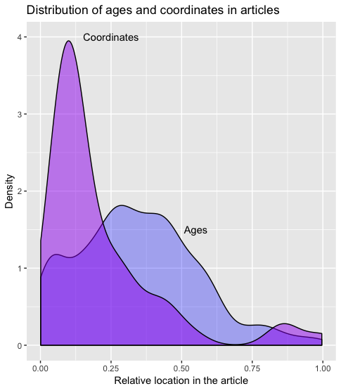

## 1. Abstract ##

Machine learning technology promises a more efficient and scalable approach to locating and aggregating data and information from the burgeoning scientific literature. Realizing this promise requires provision of applications, data resources, and the documentation of key tools. GeoDeepDive provides a digital library and computing infrastructure upon which to build and deploy these components. Here we show how a workflow within a single domain can be developed to generate a new understanding of the distribution of ice-rafted debris (IRD) records in both space and time. We use regular expressions and natural language-processing utilities to extract and plot reliable latitude-longitude pairs from publications containing IRD, as well extract age events from those publications. This workflow and resulting R package provides researchers from the geosciences and allied disciplines a general set of tools for querying spatiotemporal information from GeoDeepDive for their own science questions.

Key Words: Text and data mining, Pliocene, Pleistocene, ice-rafted debris


### 2. Introduction and Workflow Overview

Peer-reviewed papers communicate knowledge to their audience through figures, text and tables.  Efforts to improve the practice of data archiving have been increasing (“AGU Publications Data Policy,”; FAIRsharing Team, 2018) as individuals and groups recognize the importance of data sharing to help improve science outcomes.  Despite improved efforts to better curate data, however, a large volume of data and information still exists exclusively in published form as text within manuscripts, embedded in tables, or graphically within figures.  The volume of published literature makes meta-analysis difficult, and as such, new automated software tools are being developed to extract information directly from the scientific literature. Various fields are developing tools for automated extraction of meaningful information from the scientific literature, including natural language processing (NLP) and other forms of machine learning (ML), the vast majority of which is being developed and deployed over general and freely available content, like Twitter feeds and publication abstracts. Currently, the development of new software tools is outpacing their deployment over digital libraries and infrastructures that can serve the unique needs of geoscientists.

GeoDeepDive (geodeepdive.org) is a digital library and computing system that currently contains over 11 million publications from multiple different commercial and open-access content providers. Early versions of GeoDeepDive have been used to automatically find and extract fossil occurrences from the scientific literature (Peters et al., 2014) as well as find instances of stromatolite occurrences, with the goal of better understanding stromatolite resurgences in the geological past (Peters et al., 2017). However, the newness of GeoDeepDive as a platform and the limited nature of software tools that take advantage of it has limited the scope of its impact.  Here we provide a sample workflow that leads the reader through key, public elements of GeoDeepDive, with a goal of retrieving documents on the distribution of ice-rafted debris (IRD) from the Pliocene to present. We choose to focus our effort on IRD because of the near uniqueness of the acronym in the geoscience literature and because IRD is almost exclusively restricted to ocean settings, thus simplifying our ability to identify false positives – occurrences of IRD that do not refer to ice-rafted debris – in our training dataset.  Furthermore, IRD distribution in marine sediments provides a key constraint on cryosphere development, yielding insight into past climate evolution (e.g., Hemming, 2004).

One implementation of GeoDeepDive uses sentences as the atomic unit, managing the sentence-level data within a PostgreSQL database.  Each sentence within a paper is identified by a unique document id (`gddid`, an internally unique identifier to accommodate publications that may or may not have their own formal DOI) and a sentence number that is assigned and unique within the paper.  A separate table relates `gddid`s to publication metadata (e.g. title, journal, authors, etc.).  In this way, GeoDeepDive workflows and the individual steps within these workflows can be thought of as operating at two distinct levels: the sentence level and the document level.  Because GeoDeepDive (GDD) also provides unique IDs for each journal and links these to the sentence IDs, journal-level analytics are possible. GDD makes use of Stanford NLP (Manning et al., 2014), so it is also possible to obtain word-level analysis using indexing within sentences. For the purposes of this paper we will focus on "sentence"- and "document"-level properties.


**Figure 1**: *Workflow used to go from a list of documents that mention ice-rafted debris (IRD; IRD is the actual search string in this case) and (Pliocene or Pleistocene or Holocene) to a vetted set of the documents, and finally a summary of the documents and relevant information.*

This paper presents a sample workflow, intended to provide meaningful but simplified results, with the main goal of illustrating the potential of GDD, and to provide users with some understanding of how GDD can be used to extract information from text.  In this example workflow, we will identify papers with mentions of ice-rafted debris (IRD) in the Pliocene and Pleistocene (Fig. 1), extract space and time coordinates using an R Toolkit called geodiveR (github.com/EarthCubeGeochron/geodiveR), and store the data and code in a GitHub repository (github.com/EarthCubeGeoChron).

Many publications document the existence of IRD at the level of individual marine drilling sites, but assembling this information across publications into large-scale mapped syntheses is a non-trivial task that has traditionally taken years of painstaking literature compilation (Heinrich, 1988; Hemming, 2004; Ruddiman, 1977; Stern and Lisiecki, 2013). A comprehensive, accurate database of IRD deposits and their spatial distribution extracted with software from the published scientific literature can help the scientific community better understand and characterize ice sheet dynamics over the last 5.3 million years, ideally leading to a better understanding of how glaciers respond to changes in climate and ocean circulation.

#### 2.1 Initial Returns and RegEx
Processing the entirety of the documents within GDD is time consuming, as it contains over 11 million peer-reviewed publications. For any given problem, such as finding all instances of IRD, only a fraction of the total library is relevant.  Using a set of keywords reduces the overall data volume by identifying a subset of all documents that are potentially relevant (i.e., if a document does not contain one or more of the given terms it is unlikely to be relevant, but if it has the terms it should be examined).  For this step, one can use straightforward string matching and take advantage of the GDD public API. Here, we chose a number of terms that would help us identify a set of papers that would give us sufficient breadth of documents, while still reducing the overall size of the corpus.  We used the acronym “IRD”, as well as a number of constraints on geologic time intervals, “Holocene”, “Pleistocene” and “Pliocene” (in our example dataset, this returned 5,315 total documents; Figure 2).  Useful information about these terms can be derived from the “snippets” route of GeoDeepDive’s API, which harnesses an ElasticSearch index spanning the full text layer of all PDFs with a “native” text layer (i.e., PDFs with searchable text in them already, which constitutes the vast majority of PDFs distributed by GDD publishers):

https://geodeepdive.org/api/snippets?term=IRD&full_results=true

The response to this API call is a JSON object that indicates the total number of “hits” of the term, basic bibliographic citation information for each document containing the term, including link to original PDF distributed by the publisher, and a “snippet” of text around mentions of the term in the full text of the document. By default, the matching terms are highlighted with HTML tags (to remove the tags, the parameter “&clean=true” can be added to the URL). Because of the large number of results in the case above, a link to the next page of documents containing the term is also provided, allowing large results sets to be scrolled through by the client.

To combine multiple terms and require that they are both present in a document:

https://geodeepdive.org/api/snippets?term=IRD,Pleistocene&inclusive=TRUE&full_results=true

The GeoDeepDive API provides this level functionality publicly, but it is designed to be deployed in user-constructed applications and is suitable only for limited data extraction tasks. The PostgreSQL representation of the document text data provides a different structure that we focus on here.

Matching in Postgres uses existing PostgreSQL text and string functions, while further text processing uses regular expression matching in R using the stringr package.  The use of the Stanford NLP library allows GDD workflows to take advantage of parts-of-speech tagging, and more advanced NLP tools.  This work is limited to using string matching.

<!--Figure 2: GDD corpus vs some possible domain term searches and IRD. -->

#### 2.2 Subsetting and Cleaning

We begin our analysis with a subset of the data that was pared down from the total set of the corpus.  The subset of papers may still include papers that are not appropriate (IRD may refer to something other than ice-rafted debris).  To obtain a training dataset, we run the same text matching rules that we used to match documents at the sentence level. The rules we use become more complex: for example, “IRD” must be located in a sentence with another term (e.g., “IRD” and “Holocene”).  These additional rules restrict the total list returned to n documents for which any sentence contains a match to the keyword.

Searching for `IRD` as a keyword retrieves articles that use `IRD` as an acronym for Ice-Rafted Debris, but it also retrieves articles mentioning the French Research Institute IRD (Institute of Research for Development).  Throughout this paper we will refer to *rules*; generally these are statements that can resolve to a boolean (TRUE/FALSE) output.  So for example, within our subset we could search for all occurrences of `IRD` and `CNRS`:


```r
sentence <- "this,is,a,IRD,and,CNRS,sentence,we,didnt,want,."
stringr::str_detect(sentence, "IRD") & !stringr::str_detect(sentence, "CNRS")
```

This statement will evaluate to `TRUE` if `IRD` appears in a sentence without `CNRS`.  If we apply this sentence-level test at the document level (`any(test == TRUE)`) we can estimate which papers are most likely to have the correct mention of `IRD` for our purposes. This then further reduces the number of papers (and sentences) for our test.

### 3. Extracting Data

After cleaning and subsetting, we develop tests and workflows to extract information through an iterative process.  In many cases this requires further text matching, and packages in R such as `stringr` were helpful for accomplishing this task.  Additional support can come from the NLP output that can be generated for the data.  In all of these cases, we generate clear rules to be tested, and then apply them to the document.

Because understanding both the IRD distribution in ocean sediments and the timing of the deposition of IRD through the Pliocene-Pleistocene is critical for interpreting past ice sheet dynamics, spatial coordinates and geochronologic constraints of the IRD deposits need to be identified within the paper.  As with the earlier cleaning process, any paper that contains neither spatial coordinates or ages, or one but not the other, is not of interest for this application.

Extracting the spatial location and age of an IRD occurrence within a paper that contains ‘IRD’, however, is not sufficient.  We need to be able to distinguish between a reported age and an age related to the event we are interested in, and so again we must develop general rules that allow us to distinguish all ages from ages of interest, and all spatial locations from spatial locations of interest.


### Exploratory Itteration

There are a number of reasons to continue to refine the rules used to discover data in this workflow.  First, extraction of text from the PDF and optical character recognition (OCR) is not always accurate, so that some sentences and words are parsed incorrectly.  This problem is particularly acute for geographic coordinates (below). Second, many words have multiple meanings, leading to false positives using only string-matching, as the IRD example above illustrates.  Third, different disciplines and journals use different standards for reporting.  For example, if we were interested in paleoecological information we would need to know that `paleoecology` and `palaeoecology` refer to similar concepts.  Similarly, `ice rafted debris` may also be referred to as `sand sized layers` in the marine context (Ruddiman, 1977).  Fourth, the context and placement of words matters.  For example, temporal information like ‘Holocene’ and ‘Pliocene’ may be found in the Methods, where they refer to marine core locations, or in the Discussion, where they might refer to global climate trends.

Some potential pitfalls include
  * OCR matching - commonly mistaken letters (O, Q, o)
  * Age reporting variety (e.g., kyr vs. ka)
  * GDD sentence construction

Repeatedly reviewing matches at the sentence level and at the document level (i.e., “Why did this match or why didn't this paper return a match?”), then refining the workflow rule-sets accordingly, is critical to developing a clear workflow and high-value corpus. In many cases, beginning with very broad tests and slowly paring down to more precise tests is an appropriate pattern.  In this case, tools like RMarkdown are very helpful for interactive data exploration, using packages like `DT` and `leaflet` (Cheng et al., 2018; Xie et al., 2019).  We can assess the distribution of age-like elements within a paper and determine if they match with our initial expectations (e.g. "Why does *Debris fields in the Miocene* contain Holocene-aged matches?"; "Why does a paper about Korea report locations in Belize?").  Depending on the success of the algorithm, the tests can be revised and the process repeated until an acceptable match is found.


### Reproducible and Validated Workflows

As the workflow develops and refines, we can begin to report on patterns and findings.  Some of these may be semi-qualitative (e.g. "We find the majority of sites are dated to the LGM"), while others may involve statistical analysis (e.g., "The presence of IRD declines linearly with decreasing latitude ($p$ < $0.05$)").  In an analysis where the underlying dataset is static or a data version has been frozen, it is reasonable to develop a paper and report these findings.

However, the publication database in GDD is far from static; the GDD infrastructure acquires more than 10,000 papers per day from multiple different sources.  Given this, it is likely that some patterns will change over time as more information is brought to bear. For example, the addition of new records may reveal previously undiscovered search artifacts within the publication record that produce false positives or false negatives.  For this reason the use of assertions or testable statements that can be evaluated to TRUE or FALSE within the workflow become critically important.  In R we can use the `assertthat` package to provide support for test-driven development and assertions within the workflow.

Test-driven development is common in software development.  As developers create new features, a good practice is to first develop tests for the features, to ensure that feature behavior matches expectations.  The analogy in our scientific workflow is that findings are features, and as we report on them we want to be assured that those findings are valid.  In R the `assertthat` package provides a tool for testing statements, and providing robust feedback through custom error messages (Wickham, 2019).


```r
howmany_dates <- all_sentences %>%
  mutate(hasAge = stringr::str_detect(words, "regular expression for dates")) %>%
  group_by(gddid) %>%
  summarise(age_sentences = any(hasAge),
            n = n())

# We initially find that less than 10% of papers have dates in them, and report that as an important finding in the paper.

percent_ages <- sum(howmany_dates$age_sentences) / nrow(howmany_dates)

assertthat::assert_that(percent_ages < 0.1, msg = "More than 10% of papers have ages.")
```
Text Box 1. From sentences returned by GDD (all_sentences) create a new column called ‘hasAge’ that is a boolean variable to test whether an age is found.  Once the variable has been created, group the data to test whether any of the papers (each with a unique gddid) has an age reported in the paper, and then count the total number of reported ages within the paper.  If we expect that most papers won’t have reported ages, we can create an assertion, in this case that only 10% of papers have a reported age.  If this assertion fails, then a custom error message is returned.

With these elements we now have an iterative process that is also responsive to the underlying data.  We have mapped out the general overview of our reported findings and developed clear tests under which our findings are valid.  We can create a document that combines our code and text in an integrated manner, supporting FAIR Principles (Wilkinson et al., 2016), and making the most out of the new technology. In the following section we will run through this workflow in detail.


### 6. Ice Rafted Debris Case Study and Discussion

#### 6.1 Finding Spatial Matches

To begin, we load the packages that will be used, and then import the data:


```r
library(geodiveR)

library(jsonlite) # (Ooms et al., 2018)
library(readr) # (Wickham et al., 2018)
library(dplyr) # (Wickham et al., 2019)
library(stringr)
library(leaflet)
library(purrr) # (Henry et al., 2019)
library(DT)
library(assertthat)

sourcing <- list.files('R', pattern = ".R$", full.names = TRUE) %>%
  map(source, echo = FALSE, print = FALSE, verbose = FALSE)

publications <- fromJSON(txt = 'input/bibjson', flatten = TRUE)

if(!file.exists('input/sentences_nlp352')){
  data(nlp)
  full_nlp <- nlp
  rm(nlp)
  colnames(full_nlp) <- c('_gddid', 'sentence', 'wordIndex',
                          'word', 'partofspeech', 'specialclass',
                          'wordsAgain', 'wordtype', 'wordmodified')
} else {

  full_nlp <- readr::read_tsv('input/sentences_nlp352',
                         trim_ws = TRUE,
                         col_names = c('_gddid', 'sentence', 'wordIndex',
                                       'word', 'partofspeech', 'specialclass',
                                       'wordsAgain', 'wordtype', 'wordmodified'))
}

#  uses the clean_corpus.R function within geodiveR
#  (implements the IRD search-and-refinement rules mentioned
#   above in ‘Exploratory Iteration’)

nlp_clean <- clean_corpus(x = full_nlp, pubs = publications)

nlp <- nlp_clean$nlp
```

From this set of code we obtain an output object that includes a key for the publication (`_gddid`, linking to the `publications` variable), the sentence number of the parsed text, and then both the parsed text and some results from natural language processing. We also obtain a list of gddids to keep or drop given the regular expressions we used to find instances of IRD in the affiliations or references sections of the papers. This analysis provides 82 publications:

<!--html_preserve--><div id="htmlwidget-72ff090a1cb18ee1ceb1" style="width:100%;height:auto;" class="datatables html-widget"></div>
<script type="application/json" data-for="htmlwidget-72ff090a1cb18ee1ceb1">{"x":{"filter":"none","data":[["_gddid","sentence","wordIndex","word","partofspeech","specialclass","wordsAgain","wordtype","wordmodified"],["550578e8e1382326932d8d3a","1","<code>{1,2,3,4,5,6,7,8,9,10,11,12,13 ... }<\/code>","<code>{ARTICLE,IN,PRESS,Quaternary,S ... }<\/code>","<code>{NN,IN,NNP,NNP,NNP,NNP,CD,(,CD ... }<\/code>","<code>{O,O,O,O,O,O,NUMBER,O,DATE,O,D ... }<\/code>","<code>{article,in,PRESS,Quaternary,S ... }<\/code>","<code>{nsubj,case,compound,compound, ... }<\/code>","<code>{90,6,6,6,6,1,6,0,6,0,13,0,1,1 ... }<\/code>"],["Unique article identifier","Unique sentence identifier within article","Index of words within sentence","Verbatim OCR word","Parts of speech, based on <a href='https://www.ling.upenn.edu/courses/Fall_2003/ling001/penn_treebank_pos.html'>Penn State TreeView<\/a>","Special classes (numbers, dates, &cetera)","Words again","Word types, based on <a href='http://universaldependencies.org/introduction.html'>universal dependencies<\/a>.","The word that the <code>wordtype<\/code> is modifying."]],"container":"<table class=\"display\">\n  <thead>\n    <tr>\n      <th> <\/th>\n      <th>value<\/th>\n      <th>description<\/th>\n    <\/tr>\n  <\/thead>\n<\/table>","options":{"dom":"t","order":[],"autoWidth":false,"orderClasses":false,"columnDefs":[{"orderable":false,"targets":0}]}},"evals":[],"jsHooks":[]}</script><!--/html_preserve-->


## 6.2 Extracting Spatial Coordinates

We are interested in using GDD to obtain site coordinates for locations that contain IRD data spanning the last 5 million years.  The goal is to provide relevant site information for use in meta-analysis, or for comparing results to existing geographic locations from the relevant geocoded publications and then linking back to the publications using DOIs.

To obtain geographical coordinates from the paper we must consider several potential issues.  The first is that not all coordinates will necessarily refer to an actual ocean core.  We may also, inadvertently, find numeric objects that appear to be coordinates, but are in fact simply numbers.  Therefore, we must identify what exactly we think coordinates might look like and build a regular expression (or set of regular expressions) to accurately extract these values.  Since we will process DMS coordinates differently than DD coordinates, we generate two regular expressions:


```r
dms_regex <- "[\\{,]([-]?[1]?[0-9]{1,2}?)(?:(?:,[°◦o],)|(?:[O])|(?:,`{2},))([1]?[0-9]{1,2}(?:.[0-9]*)),[′'`]?[,]?([[0-9]{0,2}]?)[\"]?[,]?([NESWnesw]?),"

 dd_regex <- "[\\{,][-]?[1]?[0-9]{1,2}\\.[0-9]{1,}[,]?[NESWnesw],"
```

These regular expressions allow for negative or positive coordinate systems, that may start with a `1`, and then are followed by one or two digits (`{1,2}`).  From there we see differences in the structure, reflecting the need to capture the degree symbols, or, in the case of decimal degrees, the decimal component of the coordinates.  The regular expressions are more rigorous (i.e., have fewer matching options) for the decimal degrees than for DMS coordinates.  DMS coordinates reported in documents may be interpreted in non-standard ways by OCR.

The regex commands were constructed using capture (and non-capture) groups to work with the `stringr` package (Wickham and RStudio, 2019), so that we obtain five elements from any match, including the full match, the degrees, the minutes, the seconds (which may be an empty string), and the quadrant (NESW).


```r
degmin <- str_match_all(nlp$word, dms_regex)
decdeg <- str_match_all(nlp$word, dd_regex)
```

Since the documents are broken up into sentences we expect that all coordinates are reported as pairs, and so we are most interested in finding all the records that show up with pairs of coordinates.  We start by matching up the publications with sentences that have coordinate pairs:

<!--html_preserve--><div id="htmlwidget-6485f13e58f106f46d65" style="width:100%;height:auto;" class="datatables html-widget"></div>
<script type="application/json" data-for="htmlwidget-6485f13e58f106f46d65">{"x":{"filter":"none","data":[["1","2","3","4","5","6","7","8","9","10","11","12","13","14","15","16","17","18","19","20","21","22","23","24","25","26","27","28"],["{To address the stability and duration of the last interglaciation in continental Asia , the advanced hydraulic piston cores BDP96-2 ( 53 ◦ 41 48 N , 108 ◦ 21 06 E ) and BDP-98 ( 53 ◦ 44 48 N , 108 ◦ 24 34 E ) of the Baikal Drilling Project ( BDP-Members , 1997 , 2000 ) were sampled at 1 cm ( ca. 250 yr ) and 2 cm ( 350 -- 400 yr ) , respectively .}","{Location , lithology , and chronology Location and sedimentary environment Core PC-013 was collected from the Greenland rise , north of the Eirik Ridge on the northern flank of a subsidiary ridge ( 58 `` 13 ` N , 48 `` 22 ` W ) , at a water depth of 3380 m ( Fig. 1 ) .}","{Site 1101 ( latitude 64 ° 22.3 ′ S , longitude 70 ° 15.6 ′ W , 3280 m ) is located on Drift 4 , one in a series of eight drift deposits that occur along the northwest flank of the Antarctic Peninsula continental rise ( Fig. 1 ; Barker et al. , 1999 ; Uenzelmann-Neben , 2006 ) .}","{On Table 1 Core inventory Core 9404468 9404469 9404470 9404471 9404472 9404473 9404474 9404475 9404476 13/01-U -02 13/01-U -02 Latitude WGS84 57 ° 45.078 ′ 57 ° 45.281 ′ 57 ° 45.357 ′ 57 ° 45.540 ′ 57 ° 45.982 ′ 58 ° 16.084 ′ 58 ° 15.511 ′ 58 ° 14.772 ′ 58 ° 13.728 ′ 57 ° 59.085 ′ 57 ° 59.085 ′ Longitude WGS84 8 ° 35.133 ′ 8 ° 35.170 ′ 8 ° 35.191 ′ 8 ° 35.171 ′ 8 ° 35.219 ′ 5 ° 51.608 ′ 5 ° 50.763 ′ 5 ° 49.588 ′ 5 ° 47.939 ′ 8 ° 22.008 ′ 8 ° 22.008 ′ Water depth ( m ) 279 290 292 300 340 339 343 348 339 505 505 Core type Gravity Gravity Gravity Gravity Gravity Gravity Gravity Gravity Gravity Borehole Borehole Core length / interval ( m ) 2.70 4.00 3.00 3.30 4.05 2.55 2.95 3.40 2.50 90.0 -- 90.5 110.0 -- 110.3 boomer records , reflections are more variable in character , and subunits appear to vary in thickness over short distances ( Fig. 6 ) .}","{Site 963 -LSB- 4 -RSB- Sedimentary material of Ocean Drilling Program ( ODP ) Hole 963D ( longitude 37 ° 02.1480 N , latitude 13 ° 10.6860 E ) was recovered in the Sicily Strait between the Adventure Bank and the Gela basin , at 469.1 m below sea level ( Figure 1 ) .}","{-LSB- 26 -RSB- During the Vicomed I cruise , carried out from September to October 1986 , 32.5 % of F. profunda was found in water samples at station SIC ( 37 ° 27.30 N ; 11 ° 32.70 E ) , which is only a few kilometers away from ODP Site 963 , when the base of the summer thermocline was located at about 55 m depth .}","{CORE STRATIGRAPHY The cores were dated using a combination of biostratigraphy ( diatoms and radiolaria ) and chemical ( barium ) and isotope TABLE 1 Site Information on Sediment Cores Discussed in This Paper from the Continental Rise of the Antarctic Peninsula and the Weddell and Scotia Seas1 Core number Location Water depth Recovery ( m ) ( m ) Antarctic Peninsula Weddell and Scotia Seas PC106 PC108 PC110 PC111 PC113 PC038 PC041 KC083 PC079 KC064 KC097 66 ◦ 18.8 S , 76 ◦ 58.7 W 65 ◦ 42 S , 73 ◦ 38 W 65 ◦ 08.8 S , 70 ◦ 35.3 W 64 ◦ 19 S , 70 ◦ 26.2 W 63 ◦ 27.3 S , 68 ◦ 58 W 63 ◦ 10.0 S , 42 ◦ 43.5 W 62 ◦ 04.0 S , 40 ◦ 35.0 W 59 ◦ 22.2 S , 42 ◦ 43.5 W 56 ◦ 45.0 S , 43 ◦ 16.9 W 53 ◦ 52.1 S , 48 ◦ 20.3 W 53 ◦ 21.0 S , 54 ◦ 41.0 W 3662 3601 3025 3357 3552 3802 3310 3900 3733 4304 3058 9.27 9.15 7.55 10.93 10.80 5.96 9.35 2.3 8.0 3.2 2.82 1 Core locations are shown in Figures 1 and 2 .}","{Cores 1 2 3 4 5 6 7 8 SU92-03 PE109-13 KC24-19 MD03-2697 MD99-2331 MD95-2040 MD95-2042 MD99-2339 Latitude N 43 ° 11.750 42 ° 34.32 ′ 42 ° 08.98 ′ 42 ° 09 ′ 59 N 42 ° 09 ′ 00 N 40 ° 34.91 ′ 37 ° 47.99 ′ 35 ° 14.76 ′ Longitude W 10 ° 6.780 9 ° 41.4 ′ 10 ° 29.96 ′ 9 ° 42 ′ 10 W 09 ° 40 ′ 90 W 9 ° 51 .}","{MD04-2820CQ MD04-2820CQ was retrieved from the Goban Spur area ( 49 05.290 N ; 13 25.900 W ; Fig. 1 ) and is a reoccupation of the OMEX-2K core site ( see Hall and McCave , 1998a , b ; Scourse et al. , 2000 ; Haapaniemi et al. , 2010 ) .}","{A gravity core , GH95 -- 1208 ( lat 43 ° 46 ′ N , long 138 ° 50 ′ E , water depth 3435 m ) , was collected during the GH 95 cruise of the R/V Hakurei-Maru of the Geological Survey of Japan from the eastern margin of the Japan Basin in the northeastern Japan Sea .}","{A piston core , MD01 -- 2407 ( lat 37 ° 11 ′ N , long 134 ° 11 ′ E , water depth 930 m ) , was collected during the IMAGES-WEPAMA cruise of the R/V Marion Dufresne from a small depression on the Oki Ridge in the southwestern Japan Sea .}","{Lithological Data The 16 m long Calypso core ( giant piston core ) GS10-163-3PC ( 68 ° 05.0978 ′ N , 09 ° 52.1969 ′ E , 1178 m water depth ) was retrieved with R/V G.O. Sars in June 2010 ( Figures 2 and 3 ) .}","{Map showing sampling location of core PC-2 ( latitude : 50 ° 23.70 N , longitude : 148 ° 19.40 E , water depth : 1258 m , core length : 10.23 m ) in the Sea of Okhotsk .}","{MeanHoloceneBenthicForaminiferafli13CandCd/Ca , WaterColumnCdandPhosporuCsoncentrationasn , dCalculated Foraminiferal Water Column Cd Partition Coefficients Core SectionAge , Water Samples / • 13C , Cd/Ca , Cdwater , P , Dtt kyr Depmth , Rel • licaat % esP0DB -LSB- • mmolol-l -LSB- lnmko • - l • -RSB- gmko • ` l • thisstudBy oy -LSB- l1e992 -RSB- SO75-26KL SO82-05 M16004 M23414 Hol ( 3.0-8 .5 ) Hol ( 0-9 ) Hol ( 0.6-9 .6 ) Hol ( 3.0-8 .9 ) 1099 1416 1512 2196 8/14 4/8 4/8 10/24 1.015 1.347 1.030 1.120 0.047 0.103 0.036 0.081 0.17 b 0.24 d 0.17 b 0.24 d 0.86 n.a. 1.21 n.a. 3.1 c 4.3 e 2.1 c 3.3 e 1.3 1.5 1.6 2.2 a Numberof sampledepths/numboefranalyses .}","{Environmental setting The studied core MD04-2861 is located in the Arabian Sea , off the tectonically-active Makran margin ( 24.13 N ; 63.91 E ; 2049 m depth ) ( Bourget et al. , 2011 ; Ellouz-Zimmermann et al. , 2007 ; Kukowski et al. , 2001 ; Fig. 1A ) .}","{Core ID VC03 VC04 VC05 VC06 VC07 VC08 VC09 VC10 VC11 VC12 VC13 VC14 Latitude 69 10.810 N 69 09.970 N 69 09.600 N 69 08.940 N 69 08.620 N 69 08.350 N 69 05.790 N 69 05.950 N 69 06.900 N 69 53.120 N 69 58.460 N 69 56.970 N Longitude 51 11.610 W 51 10.150 W 51 31.630 W 52 04.140 W 52 18.880 W 52 38.240 W 51 23.650 W 51 31.220 W 52 25.600 W 51 53.150 W 51 44.470 W 51 40.350 W Area Disko Disko Disko Disko Disko Disko Disko Disko Disko Vaigat Vaigat Vaigat Depth -LSB- m -RSB- 545 263 389 439 439 429 294 351 410 616 341 386 Length -LSB- m -RSB- 1.57 1.10 5.87 4.94 5.46 3.91 5.98 4.86 3.25 3.66 3.40 4.66 cores should be treated as estimates .}","{DOI : 10.1002 / jqs .1503 Late Holocene environmental conditions in Coronation Gulf , southwestern Canadian Arctic Archipelago : evidence from dinoflagellate cysts , other non-pollen palynomorphs , and pollen ANNA J. PIEN ´ KOWSKI \" 1, \" * , y PETA J. MUDIE \" 2\" JOHN H. ENGLAND \" 1\" JOHN N. SMITH3 and MARK F. A. FURZE4 1Department of Earth and Atmospheric Sciences , University of Alberta , Edmonton , Alberta , Canada 2Geological Survey of Canada -- Atlantic , Dartmouth , Nova Scotia , Canada 3Department of Fisheries and Oceans , Bedford Institute of Oceanography , Dartmouth , Nova Scotia , Canada 4Earth and Planetary Science Division , Department of Physical Sciences , Grant MacEwan University , Edmonton , Alberta , Canada Received 19 November 2010 ; Revised 22 February 2011 ; Accepted 27 February 2011 ABSTRACT : Boxcore 99LSSL-001 ( 68.0958 N , 114.1868 W ; 211 m water depth ) from Coronation Gulf represents the first decadalscale marine palynology and late Holocene sediment record for the southwestern part of the Northwest Passage .}","{Materials and methods Core materials Boxcore 99LSSL-001 was retrieved from southwestern Coronation Gulf ( 68.0958 N , 114.1868 W ; Tundra Northwest research cruise , CCGS Louis S. St-Laurent , 1999 ) in a small , deep ( 211 m ) basin 48 km NE of the Coppermine River mouth ( Fig. 1b ) .}","{( f ) Percentage of N. pachyderma ( s. ) from core DAPC2 ( 58 58.100 N , 09 36.750 W , 1709 m water depth ) ( Knutz et al. , 2007 ) .}","{( g ) Ice-rafted debris flux from core DAPC2 ( 58 58.100 N , 09 36.750 W , 1709 m water depth ) ( Knutz et al. , 2007 ) .}","{( h ) Records of ice-rafted debris from core P-013 ( 58 12.59 N , 47 22.40 W , 3380 m water depth ) ( powder blue fill ) ( Hillaire-Marcel and Bilodeau , 2000 ) and core SU8118 ( 37 460N , 10 110W , 3135 m depth ) ( light blue ) ( Bard et al. , 2000 ) showing Heinrich events 0e2 .}","{307 hole U1317E samples ( drilled at 51 22.80 N , 11 43.10 W ; 792.2 m water depth ) .}","{Core location and oceanography Marine sediment core CD154 17-17K ( 33 ◦ 19.2 S ; 29 ◦ 28.2 E ; 3333 m water depth ) was recovered from the Natal Valley , south west Indian Ocean during the RRS Charles Darwin Cruise 154 ( Hall and Zahn , 2004 ) .}","{Lithic fragments ( &gt; 150 μm fraction ) were counted in marine sediment core MD02-2588 , ( 41 ◦ 19.9 S ; 25 ◦ 49.4 E ; 2907 m water depth ) every 2 cm between Marine Isotope Stages ( MIS ) 1 -- 5 .}","{However , a recently published high-resolution record from the Ag - ulhas Bank , South Atlantic ( Marino et al. , 2013 ) ( sediment core MD96-2080 , 36 ◦ 19.2 S , 19 ◦ 28.2 E , 2488 m water depth , Fig. 1 ) spanning MIS 5 -- 8 offers the opportunity to compare both loca - tions on millennial-scale basis , as both records overlap during the period between 76 -- 98 kyr .}","{In the present study , to provide further information about the origin of the Heinrich layers ( HL ) and the effect of the HE on oceanographic conditions , we have examined the distributions of selected types of biomarkers ( C37alkenones , tetrapyrrole pigments and aromatic hydrocarbons ) in the core BOFS 5K ( East Thulean Rise ; 50 ° 41.3 N , 21 ° 51.9 ` W , 3547m water depth ; Fig. 1 ; McCave , 1989 ) , in which the HL ( I-IV ) were located from the relative abundance of coarse fraction lithic debris ( ice rafted debris , IRD ) and whole core magnetic susceptibility ( Fig. 2a , b Maslin , 1993 ; Maslin et al. , 1995 ) .}","{Site U1386 Integrated Ocean Drilling Program ( IODP ) Site U1386 was drilled during Expedition 339 in November to January 2011/2012 and is located southeast of the Portuguese Margin mounded on the Faro Drift along the Alvarez Cabral Moat at 36 ° 49.68 ′ N ; − 7 ° 45.32 ′ W in 561 m water depth ( Fig. 1B and C ) .}","{Lon 7 ° 45.32 W 9 ° 43.97 E 7 ° 31.80 W 2 ° 37.26 E Water depth ( m ) 561 501 1170 1841 Water mass Upper MOW1 LIW2 Lower MOW3 WMDW4 Table 2 Age control points used for the construction of the chronology at Site U1386 based on alignment of the normalized Br counts at Site U1386 to the planktic δ18O Record of the Iberian Margin core MD01-2444 ( Barker et al. , 2011 ; Hodell et al. , 2013 ) ( Fig. 2A and B ) .}"],["2002","1994","2009","2008","2008","2008","2001","2015","2016","2007","2007","2014","2005","2000","2011","2017","2011","2011","2012","2012","2012","2012","2013","2013","2013","1997","2015","2015"],["The Stability and the Abrupt Ending of the Last Interglaciation in Southeastern Siberia","High-resolution rock magnetic study of a Late Pleistocene core from the Labrador Sea","Mid-Pliocene to Recent abyssal current flow along the Antarctic Peninsula: Results from ODP Leg 178, Site 1101","Postglacial depositional environments and sedimentation rates in the Norwegian Channel off southern Norway","Holocene millennial-scale productivity variations in the Sicily Channel (Mediterranean Sea)","Holocene millennial-scale productivity variations in the Sicily Channel (Mediterranean Sea)","Late Quaternary Iceberg Rafting along the Antarctic Peninsula Continental Rise and in the Weddell and Scotia Seas","Atlantic sea surface temperatures estimated from planktonic foraminifera off the Iberian Margin over the last 40Ka BP","Last glacial period cryptotephra deposits in an eastern North Atlantic marine sequence: Exploring linkages to the Greenland ice-cores","Millennial-scale fluctuations in seasonal sea-ice and deep-water formation in the Japan Sea during the late Quaternary","Millennial-scale fluctuations in seasonal sea-ice and deep-water formation in the Japan Sea during the late Quaternary","Origin of shallow submarine mass movements and their glide planes-Sedimentological and geotechnical analyses from the continental slope off northern Norway","Decreased surface salinity in the Sea of Okhotsk during the last glacial period estimated from alkenones","Upper ocean circulation in the glacial North Atlantic from benthic foraminiferal isotope and trace element fingerprinting","New Arabian Sea records help decipher orbital timing of Indo-Asian monsoon","Seafloor geomorphology and glacimarine sedimentation associated with fast-flowing ice sheet outlet glaciers in Disko Bay, West Greenland","Late Holocene environmental conditions in Coronation Gulf, southwestern Canadian Arctic Archipelago: evidence from dinoflagellate cysts, other non-pollen palynomorphs, and pollen","Late Holocene environmental conditions in Coronation Gulf, southwestern Canadian Arctic Archipelago: evidence from dinoflagellate cysts, other non-pollen palynomorphs, and pollen","Response of the Irish Ice Sheet to abrupt climate change during the last deglaciation","Response of the Irish Ice Sheet to abrupt climate change during the last deglaciation","Response of the Irish Ice Sheet to abrupt climate change during the last deglaciation","Ice-rafting from the British–Irish ice sheet since the earliest Pleistocene (2.6 million years ago): implications for long-term mid-latitudinal ice-sheet growth in the North Atlantic region","Millennial-scale Agulhas Current variability and its implications for salt-leakage through the Indian–Atlantic Ocean Gateway","Millennial-scale Agulhas Current variability and its implications for salt-leakage through the Indian–Atlantic Ocean Gateway","Millennial-scale Agulhas Current variability and its implications for salt-leakage through the Indian–Atlantic Ocean Gateway","Biomarker evidence for “Heinrich” events","New insights into upper MOW variability over the last 150kyr from IODP 339 Site U1386 in the Gulf of Cadiz","New insights into upper MOW variability over the last 150kyr from IODP 339 Site U1386 in the Gulf of Cadiz"]],"container":"<table class=\"display\">\n  <thead>\n    <tr>\n      <th> <\/th>\n      <th>word<\/th>\n      <th>year<\/th>\n      <th>title<\/th>\n    <\/tr>\n  <\/thead>\n<\/table>","options":{"order":[],"autoWidth":false,"orderClasses":false,"columnDefs":[{"orderable":false,"targets":0}]}},"evals":[],"jsHooks":[]}</script><!--/html_preserve-->

Even here, we can see that many of these matches work, but that some of the matches are incomplete.  There appears to be a much lower proportion of sites returned than we might otherwise expect.  Given that there are 81 articles in the NLP dataset, it is surprising that only 20 appear to support regex matches to coordinate pairs.  We would expect that the description of sites or locations using coordinate pairs should be common practice. The observed outcome is likely to be, in part, an issue with the OCR/regex processing. A next iterative step would be to go over the potential matches more thoroughly to find additional methods of detecting the coordinate systems.


## 6.3 Converting Coordinates

Given the geographic coordinate strings, we need to be able to transform them to reliable latitude and longitude pairs with sufficient confidence to actually map the records.  These two functions convert the GeoDeepDive (GDD) word elements pulled out by the regular expression searches into decimal degrees that can account for reported locations.


```r
convert_dec <- function(x, i) {

  drop_comma <- gsub(',', '', x) %>%
    substr(., c(1,1), nchar(.) - 1) %>%
    as.numeric %>%
    unlist

  domain <- (str_detect(x, 'N') * 1 +
    str_detect(x, 'E') * 1 +
    str_detect(x, 'W') * -1 +
    str_detect(x, 'S') * -1) *
    drop_comma

  publ <- match(nlp$`_gddid`[i], publications$`_gddid`)

  point_pairs <- data.frame(sentence = nlp$word[i],
                            lat = domain[str_detect(x, 'N') | str_detect(x, 'S')],
                            lng = domain[str_detect(x, 'E') | str_detect(x, 'W')],
                            publications[publ,],
                            stringsAsFactors = FALSE)

  return(point_pairs)
}

convert_dm <- function(x, i) {

  # We use the `i` index so that we can keep the coordinate outputs from the
  #  regex in a smaller list.
  dms <- data.frame(deg = as.numeric(x[,2]),
                    min = as.numeric(x[,3]) / 60,
                    sec = as.numeric(x[,4]) / 60 ^ 2,
                    stringsAsFactors = FALSE)

  dms <- rowSums(dms, na.rm = TRUE)

  domain <- (str_detect(x[,5], 'N') * 1 +
    str_detect(x[,5], 'E') * 1 +
    str_detect(x[,5], 'W') * -1 +
    str_detect(x[,5], 'S') * -1) *
    dms

  publ <- match(nlp$`_gddid`[i], publications$`_gddid`)

  point_pairs <- data.frame(sentence = nlp$word[i],
                            lat = domain[x[,5] %in% c('N', 'S')],
                            lng = domain[x[,5] %in% c('E', 'W')],
                            publications[publ,],
                            stringsAsFactors = FALSE)

  return(point_pairs)
}
```

Once we are done converting coordinate strings to reliable latitude and longitude pairs, we need to apply those functions to the set of records we've extracted to build a composite table:


```r
coordinates <- list()
coord_idx <- 1

for (i in 1:length(decdeg)) {
  if ((length(decdeg[[i]]) %% 2 == 0 |
      length(degmin[[i]]) %% 2 == 0) & length(degmin[[i]]) > 0) {

    if (any(str_detect(decdeg[[i]], '[NS]')) &
       sum(str_detect(decdeg[[i]], '[EW]')) == sum(str_detect(decdeg[[i]], '[NS]'))) {
      coordinates[[coord_idx]] <- convert_dec(decdeg[[i]], i)
      coord_idx <- coord_idx + 1
    }
    if (any(str_detect(degmin[[i]], '[NS]')) &
       sum(str_detect(degmin[[i]], '[EW]')) == sum(str_detect(degmin[[i]], '[NS]'))) {
      coordinates[[coord_idx]] <- convert_dm(degmin[[i]], i)
      coord_idx <- coord_idx + 1
    }
  }
}

coordinates_df <- coordinates %>% bind_rows %>%
  mutate(sentence = gsub(',', ' ', sentence)) %>%
  mutate(sentence = str_replace_all(sentence, '-LRB-', '(')) %>%
  mutate(sentence = str_replace_all(sentence, '-RRB-', ')')) %>%
  mutate(sentence = str_replace_all(sentence, '" "', ','))

coordinates_df$doi <- coordinates_df$identifier %>% map(function(x) x$id) %>% unlist

leaflet(coordinates_df) %>%
  addProviderTiles(providers$Esri.WorldImagery) %>%
  addCircleMarkers(popup = paste0('<b>', coordinates_df$title, '</b><br>',
                                  '<a href=https://doi.org/',
                                  coordinates_df$doi,'>Publication Link</a><br>',
                                  '<b>Sentence:</b><br>',
                                  '<small>',gsub(',', ' ', coordinates_df$sentence),
                                  '</small>'))
```

<!--html_preserve--><div id="htmlwidget-e90cb92d8cc1db0d0f4a" style="width:672px;height:480px;" class="leaflet html-widget"></div>
<script type="application/json" data-for="htmlwidget-e90cb92d8cc1db0d0f4a">{"x":{"options":{"crs":{"crsClass":"L.CRS.EPSG3857","code":null,"proj4def":null,"projectedBounds":null,"options":{}}},"calls":[{"method":"addProviderTiles","args":["Esri.WorldImagery",null,null,{"errorTileUrl":"","noWrap":false,"detectRetina":false}]},{"method":"addCircleMarkers","args":[[53,53,58.2166666666667,-64.3716666666667,2.148,37.0358,27.3,37.455,-18.8,-8.8,-27.3,-10,-4,-22.2,-45,-52.1,-21,43.7666666666667,37.1833333333333,68.0849633333333,23.7,50.395,-19.2,-33.32,-19.9,-41.3316666666667,-19.2,-36.32,50.6883333333333,36.828],[108,108,-48.3666666666667,-70.26,10.686,13.1781,32.7,11.545,-58.7,-35.3,-26.2,-43.5,-35,-43.5,-16.9,-20.3,-41,138.833333333333,134.183333333333,9.86994833333333,19.4,148.323333333333,28.2,29.47,49.4,25.8233333333333,28.2,19.47,-21.865,-7.75533333333333],10,null,null,{"interactive":true,"className":"","stroke":true,"color":"#03F","weight":5,"opacity":0.5,"fill":true,"fillColor":"#03F","fillOpacity":0.2},null,null,["<b>The Stability and the Abrupt Ending of the Last Interglaciation in Southeastern Siberia<\/b><br><a href=https://doi.org/10.1006/qres.2002.2329>Publication Link<\/a><br><b>Sentence:<\/b><br><small>{To address the stability and duration of the last interglaciation in continental Asia   the advanced hydraulic piston cores BDP96-2 ( 53 ◦ 41 48 N   108 ◦ 21 06 E ) and BDP-98 ( 53 ◦ 44 48 N   108 ◦ 24 34 E ) of the Baikal Drilling Project ( BDP-Members   1997   2000 ) were sampled at 1 cm ( ca. 250 yr ) and 2 cm ( 350 -- 400 yr )   respectively .}<\/small>","<b>The Stability and the Abrupt Ending of the Last Interglaciation in Southeastern Siberia<\/b><br><a href=https://doi.org/10.1006/qres.2002.2329>Publication Link<\/a><br><b>Sentence:<\/b><br><small>{To address the stability and duration of the last interglaciation in continental Asia   the advanced hydraulic piston cores BDP96-2 ( 53 ◦ 41 48 N   108 ◦ 21 06 E ) and BDP-98 ( 53 ◦ 44 48 N   108 ◦ 24 34 E ) of the Baikal Drilling Project ( BDP-Members   1997   2000 ) were sampled at 1 cm ( ca. 250 yr ) and 2 cm ( 350 -- 400 yr )   respectively .}<\/small>","<b>High-resolution rock magnetic study of a Late Pleistocene core from the Labrador Sea<\/b><br><a href=https://doi.org/10.1139/e94-009>Publication Link<\/a><br><b>Sentence:<\/b><br><small>{Location   lithology   and chronology Location and sedimentary environment Core PC-013 was collected from the Greenland rise   north of the Eirik Ridge on the northern flank of a subsidiary ridge ( 58 `` 13 ` N   48 `` 22 ` W )   at a water depth of 3380 m ( Fig. 1 ) .}<\/small>","<b>Mid-Pliocene to Recent abyssal current flow along the Antarctic Peninsula: Results from ODP Leg 178, Site 1101<\/b><br><a href=https://doi.org/10.1016/j.palaeo.2009.09.011>Publication Link<\/a><br><b>Sentence:<\/b><br><small>{Site 1101 ( latitude 64 ° 22.3 ′ S   longitude 70 ° 15.6 ′ W   3280 m ) is located on Drift 4   one in a series of eight drift deposits that occur along the northwest flank of the Antarctic Peninsula continental rise ( Fig. 1 ; Barker et al.   1999 ; Uenzelmann-Neben   2006 ) .}<\/small>","<b>Holocene millennial-scale productivity variations in the Sicily Channel (Mediterranean Sea)<\/b><br><a href=https://doi.org/10.1029/2007PA001581>Publication Link<\/a><br><b>Sentence:<\/b><br><small>{Site 963 -LSB- 4 -RSB- Sedimentary material of Ocean Drilling Program ( ODP ) Hole 963D ( longitude 37 ° 02.1480 N   latitude 13 ° 10.6860 E ) was recovered in the Sicily Strait between the Adventure Bank and the Gela basin   at 469.1 m below sea level ( Figure 1 ) .}<\/small>","<b>Holocene millennial-scale productivity variations in the Sicily Channel (Mediterranean Sea)<\/b><br><a href=https://doi.org/10.1029/2007PA001581>Publication Link<\/a><br><b>Sentence:<\/b><br><small>{Site 963 -LSB- 4 -RSB- Sedimentary material of Ocean Drilling Program ( ODP ) Hole 963D ( longitude 37 ° 02.1480 N   latitude 13 ° 10.6860 E ) was recovered in the Sicily Strait between the Adventure Bank and the Gela basin   at 469.1 m below sea level ( Figure 1 ) .}<\/small>","<b>Holocene millennial-scale productivity variations in the Sicily Channel (Mediterranean Sea)<\/b><br><a href=https://doi.org/10.1029/2007PA001581>Publication Link<\/a><br><b>Sentence:<\/b><br><small>{-LSB- 26 -RSB- During the Vicomed I cruise   carried out from September to October 1986   32.5 % of F. profunda was found in water samples at station SIC ( 37 ° 27.30 N ; 11 ° 32.70 E )   which is only a few kilometers away from ODP Site 963   when the base of the summer thermocline was located at about 55 m depth .}<\/small>","<b>Holocene millennial-scale productivity variations in the Sicily Channel (Mediterranean Sea)<\/b><br><a href=https://doi.org/10.1029/2007PA001581>Publication Link<\/a><br><b>Sentence:<\/b><br><small>{-LSB- 26 -RSB- During the Vicomed I cruise   carried out from September to October 1986   32.5 % of F. profunda was found in water samples at station SIC ( 37 ° 27.30 N ; 11 ° 32.70 E )   which is only a few kilometers away from ODP Site 963   when the base of the summer thermocline was located at about 55 m depth .}<\/small>","<b>Late Quaternary Iceberg Rafting along the Antarctic Peninsula Continental Rise and in the Weddell and Scotia Seas<\/b><br><a href=https://doi.org/10.1006/qres.2001.2267>Publication Link<\/a><br><b>Sentence:<\/b><br><small>{CORE STRATIGRAPHY The cores were dated using a combination of biostratigraphy ( diatoms and radiolaria ) and chemical ( barium ) and isotope TABLE 1 Site Information on Sediment Cores Discussed in This Paper from the Continental Rise of the Antarctic Peninsula and the Weddell and Scotia Seas1 Core number Location Water depth Recovery ( m ) ( m ) Antarctic Peninsula Weddell and Scotia Seas PC106 PC108 PC110 PC111 PC113 PC038 PC041 KC083 PC079 KC064 KC097 66 ◦ 18.8 S   76 ◦ 58.7 W 65 ◦ 42 S   73 ◦ 38 W 65 ◦ 08.8 S   70 ◦ 35.3 W 64 ◦ 19 S   70 ◦ 26.2 W 63 ◦ 27.3 S   68 ◦ 58 W 63 ◦ 10.0 S   42 ◦ 43.5 W 62 ◦ 04.0 S   40 ◦ 35.0 W 59 ◦ 22.2 S   42 ◦ 43.5 W 56 ◦ 45.0 S   43 ◦ 16.9 W 53 ◦ 52.1 S   48 ◦ 20.3 W 53 ◦ 21.0 S   54 ◦ 41.0 W 3662 3601 3025 3357 3552 3802 3310 3900 3733 4304 3058 9.27 9.15 7.55 10.93 10.80 5.96 9.35 2.3 8.0 3.2 2.82 1 Core locations are shown in Figures 1 and 2 .}<\/small>","<b>Late Quaternary Iceberg Rafting along the Antarctic Peninsula Continental Rise and in the Weddell and Scotia Seas<\/b><br><a href=https://doi.org/10.1006/qres.2001.2267>Publication Link<\/a><br><b>Sentence:<\/b><br><small>{CORE STRATIGRAPHY The cores were dated using a combination of biostratigraphy ( diatoms and radiolaria ) and chemical ( barium ) and isotope TABLE 1 Site Information on Sediment Cores Discussed in This Paper from the Continental Rise of the Antarctic Peninsula and the Weddell and Scotia Seas1 Core number Location Water depth Recovery ( m ) ( m ) Antarctic Peninsula Weddell and Scotia Seas PC106 PC108 PC110 PC111 PC113 PC038 PC041 KC083 PC079 KC064 KC097 66 ◦ 18.8 S   76 ◦ 58.7 W 65 ◦ 42 S   73 ◦ 38 W 65 ◦ 08.8 S   70 ◦ 35.3 W 64 ◦ 19 S   70 ◦ 26.2 W 63 ◦ 27.3 S   68 ◦ 58 W 63 ◦ 10.0 S   42 ◦ 43.5 W 62 ◦ 04.0 S   40 ◦ 35.0 W 59 ◦ 22.2 S   42 ◦ 43.5 W 56 ◦ 45.0 S   43 ◦ 16.9 W 53 ◦ 52.1 S   48 ◦ 20.3 W 53 ◦ 21.0 S   54 ◦ 41.0 W 3662 3601 3025 3357 3552 3802 3310 3900 3733 4304 3058 9.27 9.15 7.55 10.93 10.80 5.96 9.35 2.3 8.0 3.2 2.82 1 Core locations are shown in Figures 1 and 2 .}<\/small>","<b>Late Quaternary Iceberg Rafting along the Antarctic Peninsula Continental Rise and in the Weddell and Scotia Seas<\/b><br><a href=https://doi.org/10.1006/qres.2001.2267>Publication Link<\/a><br><b>Sentence:<\/b><br><small>{CORE STRATIGRAPHY The cores were dated using a combination of biostratigraphy ( diatoms and radiolaria ) and chemical ( barium ) and isotope TABLE 1 Site Information on Sediment Cores Discussed in This Paper from the Continental Rise of the Antarctic Peninsula and the Weddell and Scotia Seas1 Core number Location Water depth Recovery ( m ) ( m ) Antarctic Peninsula Weddell and Scotia Seas PC106 PC108 PC110 PC111 PC113 PC038 PC041 KC083 PC079 KC064 KC097 66 ◦ 18.8 S   76 ◦ 58.7 W 65 ◦ 42 S   73 ◦ 38 W 65 ◦ 08.8 S   70 ◦ 35.3 W 64 ◦ 19 S   70 ◦ 26.2 W 63 ◦ 27.3 S   68 ◦ 58 W 63 ◦ 10.0 S   42 ◦ 43.5 W 62 ◦ 04.0 S   40 ◦ 35.0 W 59 ◦ 22.2 S   42 ◦ 43.5 W 56 ◦ 45.0 S   43 ◦ 16.9 W 53 ◦ 52.1 S   48 ◦ 20.3 W 53 ◦ 21.0 S   54 ◦ 41.0 W 3662 3601 3025 3357 3552 3802 3310 3900 3733 4304 3058 9.27 9.15 7.55 10.93 10.80 5.96 9.35 2.3 8.0 3.2 2.82 1 Core locations are shown in Figures 1 and 2 .}<\/small>","<b>Late Quaternary Iceberg Rafting along the Antarctic Peninsula Continental Rise and in the Weddell and Scotia Seas<\/b><br><a href=https://doi.org/10.1006/qres.2001.2267>Publication Link<\/a><br><b>Sentence:<\/b><br><small>{CORE STRATIGRAPHY The cores were dated using a combination of biostratigraphy ( diatoms and radiolaria ) and chemical ( barium ) and isotope TABLE 1 Site Information on Sediment Cores Discussed in This Paper from the Continental Rise of the Antarctic Peninsula and the Weddell and Scotia Seas1 Core number Location Water depth Recovery ( m ) ( m ) Antarctic Peninsula Weddell and Scotia Seas PC106 PC108 PC110 PC111 PC113 PC038 PC041 KC083 PC079 KC064 KC097 66 ◦ 18.8 S   76 ◦ 58.7 W 65 ◦ 42 S   73 ◦ 38 W 65 ◦ 08.8 S   70 ◦ 35.3 W 64 ◦ 19 S   70 ◦ 26.2 W 63 ◦ 27.3 S   68 ◦ 58 W 63 ◦ 10.0 S   42 ◦ 43.5 W 62 ◦ 04.0 S   40 ◦ 35.0 W 59 ◦ 22.2 S   42 ◦ 43.5 W 56 ◦ 45.0 S   43 ◦ 16.9 W 53 ◦ 52.1 S   48 ◦ 20.3 W 53 ◦ 21.0 S   54 ◦ 41.0 W 3662 3601 3025 3357 3552 3802 3310 3900 3733 4304 3058 9.27 9.15 7.55 10.93 10.80 5.96 9.35 2.3 8.0 3.2 2.82 1 Core locations are shown in Figures 1 and 2 .}<\/small>","<b>Late Quaternary Iceberg Rafting along the Antarctic Peninsula Continental Rise and in the Weddell and Scotia Seas<\/b><br><a href=https://doi.org/10.1006/qres.2001.2267>Publication Link<\/a><br><b>Sentence:<\/b><br><small>{CORE STRATIGRAPHY The cores were dated using a combination of biostratigraphy ( diatoms and radiolaria ) and chemical ( barium ) and isotope TABLE 1 Site Information on Sediment Cores Discussed in This Paper from the Continental Rise of the Antarctic Peninsula and the Weddell and Scotia Seas1 Core number Location Water depth Recovery ( m ) ( m ) Antarctic Peninsula Weddell and Scotia Seas PC106 PC108 PC110 PC111 PC113 PC038 PC041 KC083 PC079 KC064 KC097 66 ◦ 18.8 S   76 ◦ 58.7 W 65 ◦ 42 S   73 ◦ 38 W 65 ◦ 08.8 S   70 ◦ 35.3 W 64 ◦ 19 S   70 ◦ 26.2 W 63 ◦ 27.3 S   68 ◦ 58 W 63 ◦ 10.0 S   42 ◦ 43.5 W 62 ◦ 04.0 S   40 ◦ 35.0 W 59 ◦ 22.2 S   42 ◦ 43.5 W 56 ◦ 45.0 S   43 ◦ 16.9 W 53 ◦ 52.1 S   48 ◦ 20.3 W 53 ◦ 21.0 S   54 ◦ 41.0 W 3662 3601 3025 3357 3552 3802 3310 3900 3733 4304 3058 9.27 9.15 7.55 10.93 10.80 5.96 9.35 2.3 8.0 3.2 2.82 1 Core locations are shown in Figures 1 and 2 .}<\/small>","<b>Late Quaternary Iceberg Rafting along the Antarctic Peninsula Continental Rise and in the Weddell and Scotia Seas<\/b><br><a href=https://doi.org/10.1006/qres.2001.2267>Publication Link<\/a><br><b>Sentence:<\/b><br><small>{CORE STRATIGRAPHY The cores were dated using a combination of biostratigraphy ( diatoms and radiolaria ) and chemical ( barium ) and isotope TABLE 1 Site Information on Sediment Cores Discussed in This Paper from the Continental Rise of the Antarctic Peninsula and the Weddell and Scotia Seas1 Core number Location Water depth Recovery ( m ) ( m ) Antarctic Peninsula Weddell and Scotia Seas PC106 PC108 PC110 PC111 PC113 PC038 PC041 KC083 PC079 KC064 KC097 66 ◦ 18.8 S   76 ◦ 58.7 W 65 ◦ 42 S   73 ◦ 38 W 65 ◦ 08.8 S   70 ◦ 35.3 W 64 ◦ 19 S   70 ◦ 26.2 W 63 ◦ 27.3 S   68 ◦ 58 W 63 ◦ 10.0 S   42 ◦ 43.5 W 62 ◦ 04.0 S   40 ◦ 35.0 W 59 ◦ 22.2 S   42 ◦ 43.5 W 56 ◦ 45.0 S   43 ◦ 16.9 W 53 ◦ 52.1 S   48 ◦ 20.3 W 53 ◦ 21.0 S   54 ◦ 41.0 W 3662 3601 3025 3357 3552 3802 3310 3900 3733 4304 3058 9.27 9.15 7.55 10.93 10.80 5.96 9.35 2.3 8.0 3.2 2.82 1 Core locations are shown in Figures 1 and 2 .}<\/small>","<b>Late Quaternary Iceberg Rafting along the Antarctic Peninsula Continental Rise and in the Weddell and Scotia Seas<\/b><br><a href=https://doi.org/10.1006/qres.2001.2267>Publication Link<\/a><br><b>Sentence:<\/b><br><small>{CORE STRATIGRAPHY The cores were dated using a combination of biostratigraphy ( diatoms and radiolaria ) and chemical ( barium ) and isotope TABLE 1 Site Information on Sediment Cores Discussed in This Paper from the Continental Rise of the Antarctic Peninsula and the Weddell and Scotia Seas1 Core number Location Water depth Recovery ( m ) ( m ) Antarctic Peninsula Weddell and Scotia Seas PC106 PC108 PC110 PC111 PC113 PC038 PC041 KC083 PC079 KC064 KC097 66 ◦ 18.8 S   76 ◦ 58.7 W 65 ◦ 42 S   73 ◦ 38 W 65 ◦ 08.8 S   70 ◦ 35.3 W 64 ◦ 19 S   70 ◦ 26.2 W 63 ◦ 27.3 S   68 ◦ 58 W 63 ◦ 10.0 S   42 ◦ 43.5 W 62 ◦ 04.0 S   40 ◦ 35.0 W 59 ◦ 22.2 S   42 ◦ 43.5 W 56 ◦ 45.0 S   43 ◦ 16.9 W 53 ◦ 52.1 S   48 ◦ 20.3 W 53 ◦ 21.0 S   54 ◦ 41.0 W 3662 3601 3025 3357 3552 3802 3310 3900 3733 4304 3058 9.27 9.15 7.55 10.93 10.80 5.96 9.35 2.3 8.0 3.2 2.82 1 Core locations are shown in Figures 1 and 2 .}<\/small>","<b>Late Quaternary Iceberg Rafting along the Antarctic Peninsula Continental Rise and in the Weddell and Scotia Seas<\/b><br><a href=https://doi.org/10.1006/qres.2001.2267>Publication Link<\/a><br><b>Sentence:<\/b><br><small>{CORE STRATIGRAPHY The cores were dated using a combination of biostratigraphy ( diatoms and radiolaria ) and chemical ( barium ) and isotope TABLE 1 Site Information on Sediment Cores Discussed in This Paper from the Continental Rise of the Antarctic Peninsula and the Weddell and Scotia Seas1 Core number Location Water depth Recovery ( m ) ( m ) Antarctic Peninsula Weddell and Scotia Seas PC106 PC108 PC110 PC111 PC113 PC038 PC041 KC083 PC079 KC064 KC097 66 ◦ 18.8 S   76 ◦ 58.7 W 65 ◦ 42 S   73 ◦ 38 W 65 ◦ 08.8 S   70 ◦ 35.3 W 64 ◦ 19 S   70 ◦ 26.2 W 63 ◦ 27.3 S   68 ◦ 58 W 63 ◦ 10.0 S   42 ◦ 43.5 W 62 ◦ 04.0 S   40 ◦ 35.0 W 59 ◦ 22.2 S   42 ◦ 43.5 W 56 ◦ 45.0 S   43 ◦ 16.9 W 53 ◦ 52.1 S   48 ◦ 20.3 W 53 ◦ 21.0 S   54 ◦ 41.0 W 3662 3601 3025 3357 3552 3802 3310 3900 3733 4304 3058 9.27 9.15 7.55 10.93 10.80 5.96 9.35 2.3 8.0 3.2 2.82 1 Core locations are shown in Figures 1 and 2 .}<\/small>","<b>Late Quaternary Iceberg Rafting along the Antarctic Peninsula Continental Rise and in the Weddell and Scotia Seas<\/b><br><a href=https://doi.org/10.1006/qres.2001.2267>Publication Link<\/a><br><b>Sentence:<\/b><br><small>{CORE STRATIGRAPHY The cores were dated using a combination of biostratigraphy ( diatoms and radiolaria ) and chemical ( barium ) and isotope TABLE 1 Site Information on Sediment Cores Discussed in This Paper from the Continental Rise of the Antarctic Peninsula and the Weddell and Scotia Seas1 Core number Location Water depth Recovery ( m ) ( m ) Antarctic Peninsula Weddell and Scotia Seas PC106 PC108 PC110 PC111 PC113 PC038 PC041 KC083 PC079 KC064 KC097 66 ◦ 18.8 S   76 ◦ 58.7 W 65 ◦ 42 S   73 ◦ 38 W 65 ◦ 08.8 S   70 ◦ 35.3 W 64 ◦ 19 S   70 ◦ 26.2 W 63 ◦ 27.3 S   68 ◦ 58 W 63 ◦ 10.0 S   42 ◦ 43.5 W 62 ◦ 04.0 S   40 ◦ 35.0 W 59 ◦ 22.2 S   42 ◦ 43.5 W 56 ◦ 45.0 S   43 ◦ 16.9 W 53 ◦ 52.1 S   48 ◦ 20.3 W 53 ◦ 21.0 S   54 ◦ 41.0 W 3662 3601 3025 3357 3552 3802 3310 3900 3733 4304 3058 9.27 9.15 7.55 10.93 10.80 5.96 9.35 2.3 8.0 3.2 2.82 1 Core locations are shown in Figures 1 and 2 .}<\/small>","<b>Millennial-scale fluctuations in seasonal sea-ice and deep-water formation in the Japan Sea during the late Quaternary<\/b><br><a href=https://doi.org/10.1016/j.palaeo.2006.11.026>Publication Link<\/a><br><b>Sentence:<\/b><br><small>{A gravity core   GH95 -- 1208 ( lat 43 ° 46 ′ N   long 138 ° 50 ′ E   water depth 3435 m )   was collected during the GH 95 cruise of the R/V Hakurei-Maru of the Geological Survey of Japan from the eastern margin of the Japan Basin in the northeastern Japan Sea .}<\/small>","<b>Millennial-scale fluctuations in seasonal sea-ice and deep-water formation in the Japan Sea during the late Quaternary<\/b><br><a href=https://doi.org/10.1016/j.palaeo.2006.11.026>Publication Link<\/a><br><b>Sentence:<\/b><br><small>{A piston core   MD01 -- 2407 ( lat 37 ° 11 ′ N   long 134 ° 11 ′ E   water depth 930 m )   was collected during the IMAGES-WEPAMA cruise of the R/V Marion Dufresne from a small depression on the Oki Ridge in the southwestern Japan Sea .}<\/small>","<b>Origin of shallow submarine mass movements and their glide planes-Sedimentological and geotechnical analyses from the continental slope off northern Norway<\/b><br><a href=https://doi.org/10.1002/2013JF003068>Publication Link<\/a><br><b>Sentence:<\/b><br><small>{Lithological Data The 16 m long Calypso core ( giant piston core ) GS10-163-3PC ( 68 ° 05.0978 ′ N   09 ° 52.1969 ′ E   1178 m water depth ) was retrieved with R/V G.O. Sars in June 2010 ( Figures 2 and 3 ) .}<\/small>","<b>Decreased surface salinity in the Sea of Okhotsk during the last glacial period estimated from alkenones<\/b><br><a href=https://doi.org/10.1029/2004GL022177>Publication Link<\/a><br><b>Sentence:<\/b><br><small>{Map showing sampling location of core PC-2 ( latitude : 50 ° 23.70 N   longitude : 148 ° 19.40 E   water depth : 1258 m   core length : 10.23 m ) in the Sea of Okhotsk .}<\/small>","<b>Decreased surface salinity in the Sea of Okhotsk during the last glacial period estimated from alkenones<\/b><br><a href=https://doi.org/10.1029/2004GL022177>Publication Link<\/a><br><b>Sentence:<\/b><br><small>{Map showing sampling location of core PC-2 ( latitude : 50 ° 23.70 N   longitude : 148 ° 19.40 E   water depth : 1258 m   core length : 10.23 m ) in the Sea of Okhotsk .}<\/small>","<b>Millennial-scale Agulhas Current variability and its implications for salt-leakage through the Indian–Atlantic Ocean Gateway<\/b><br><a href=https://doi.org/10.1016/j.epsl.2013.09.035>Publication Link<\/a><br><b>Sentence:<\/b><br><small>{Core location and oceanography Marine sediment core CD154 17-17K ( 33 ◦ 19.2 S ; 29 ◦ 28.2 E ; 3333 m water depth ) was recovered from the Natal Valley   south west Indian Ocean during the RRS Charles Darwin Cruise 154 ( Hall and Zahn   2004 ) .}<\/small>","<b>Millennial-scale Agulhas Current variability and its implications for salt-leakage through the Indian–Atlantic Ocean Gateway<\/b><br><a href=https://doi.org/10.1016/j.epsl.2013.09.035>Publication Link<\/a><br><b>Sentence:<\/b><br><small>{Core location and oceanography Marine sediment core CD154 17-17K ( 33 ◦ 19.2 S ; 29 ◦ 28.2 E ; 3333 m water depth ) was recovered from the Natal Valley   south west Indian Ocean during the RRS Charles Darwin Cruise 154 ( Hall and Zahn   2004 ) .}<\/small>","<b>Millennial-scale Agulhas Current variability and its implications for salt-leakage through the Indian–Atlantic Ocean Gateway<\/b><br><a href=https://doi.org/10.1016/j.epsl.2013.09.035>Publication Link<\/a><br><b>Sentence:<\/b><br><small>{Lithic fragments ( > 150 μm fraction ) were counted in marine sediment core MD02-2588   ( 41 ◦ 19.9 S ; 25 ◦ 49.4 E ; 2907 m water depth ) every 2 cm between Marine Isotope Stages ( MIS ) 1 -- 5 .}<\/small>","<b>Millennial-scale Agulhas Current variability and its implications for salt-leakage through the Indian–Atlantic Ocean Gateway<\/b><br><a href=https://doi.org/10.1016/j.epsl.2013.09.035>Publication Link<\/a><br><b>Sentence:<\/b><br><small>{Lithic fragments ( > 150 μm fraction ) were counted in marine sediment core MD02-2588   ( 41 ◦ 19.9 S ; 25 ◦ 49.4 E ; 2907 m water depth ) every 2 cm between Marine Isotope Stages ( MIS ) 1 -- 5 .}<\/small>","<b>Millennial-scale Agulhas Current variability and its implications for salt-leakage through the Indian–Atlantic Ocean Gateway<\/b><br><a href=https://doi.org/10.1016/j.epsl.2013.09.035>Publication Link<\/a><br><b>Sentence:<\/b><br><small>{However   a recently published high-resolution record from the Ag - ulhas Bank   South Atlantic ( Marino et al.   2013 ) ( sediment core MD96-2080   36 ◦ 19.2 S   19 ◦ 28.2 E   2488 m water depth   Fig. 1 ) spanning MIS 5 -- 8 offers the opportunity to compare both loca - tions on millennial-scale basis   as both records overlap during the period between 76 -- 98 kyr .}<\/small>","<b>Millennial-scale Agulhas Current variability and its implications for salt-leakage through the Indian–Atlantic Ocean Gateway<\/b><br><a href=https://doi.org/10.1016/j.epsl.2013.09.035>Publication Link<\/a><br><b>Sentence:<\/b><br><small>{However   a recently published high-resolution record from the Ag - ulhas Bank   South Atlantic ( Marino et al.   2013 ) ( sediment core MD96-2080   36 ◦ 19.2 S   19 ◦ 28.2 E   2488 m water depth   Fig. 1 ) spanning MIS 5 -- 8 offers the opportunity to compare both loca - tions on millennial-scale basis   as both records overlap during the period between 76 -- 98 kyr .}<\/small>","<b>Biomarker evidence for “Heinrich” events<\/b><br><a href=https://doi.org/10.1016/S0016-7037(97)00046-X>Publication Link<\/a><br><b>Sentence:<\/b><br><small>{In the present study   to provide further information about the origin of the Heinrich layers ( HL ) and the effect of the HE on oceanographic conditions   we have examined the distributions of selected types of biomarkers ( C37alkenones   tetrapyrrole pigments and aromatic hydrocarbons ) in the core BOFS 5K ( East Thulean Rise ; 50 ° 41.3 N   21 ° 51.9 ` W   3547m water depth ; Fig. 1 ; McCave   1989 )   in which the HL ( I-IV ) were located from the relative abundance of coarse fraction lithic debris ( ice rafted debris   IRD ) and whole core magnetic susceptibility ( Fig. 2a   b Maslin   1993 ; Maslin et al.   1995 ) .}<\/small>","<b>New insights into upper MOW variability over the last 150kyr from IODP 339 Site U1386 in the Gulf of Cadiz<\/b><br><a href=https://doi.org/10.1016/j.margeo.2015.08.014>Publication Link<\/a><br><b>Sentence:<\/b><br><small>{Site U1386 Integrated Ocean Drilling Program ( IODP ) Site U1386 was drilled during Expedition 339 in November to January 2011/2012 and is located southeast of the Portuguese Margin mounded on the Faro Drift along the Alvarez Cabral Moat at 36 ° 49.68 ′ N ; − 7 ° 45.32 ′ W in 561 m water depth ( Fig. 1B and C ) .}<\/small>"],null,null,{"interactive":false,"permanent":false,"direction":"auto","opacity":1,"offset":[0,0],"textsize":"10px","textOnly":false,"className":"","sticky":true},null]}],"limits":{"lat":[-64.3716666666667,68.0849633333333],"lng":[-70.26,148.323333333333]}},"evals":[],"jsHooks":[]}</script><!--/html_preserve-->

**Figure 3**: *Leaflet map depicting sites that mention IRD and contain coordinate information and an IRD event. Each dot can be clicked to pull up: the title of the paper, the link to the publication, the sentence(s) containing spatial coordinates and other relevant IRD information. Out of the 150 papers in the test dataset, we found 11 papers with extractable spatial coordinates, comprising a total of 30 coordinate pairs (References included in leaflet map include: Baeten et al., 2014; Cofaigh et al., 2001; Ikehara and Itaki, 2007; Incarbona et al., 2008; Kaboth et al., 2016; Prokopenko et al., 2002; Rea et al., 2016; Rosell-Melé et al., 1997; Seki et al., 2005; Simon et al., 2013; Stoner et al., 1994).*



**Figure 4**: *Relative location of ages and spatial coordinates reported in GDD documents (i.e., are ages or spatial coordinates generally located at the beginning, middle, or end of a paper?).*

After cleaning and subsetting the corpus, we find 11 papers with 30 coordinate pairs out of 150 documents in the IRDDive test dataset (Fig. 3). This test suggests further improvements that can be made to the current methods.  First, in some cases, we find papers where IRD is simply referenced, and the paper does not report primary data. To circumvent this issue, we need to know where in these papers IRD is being mentioned. Targeting certain parts of the paper, like the Methods, might ensure we are only obtaining coordinates for IRD data (see Figure 4). Second, in some cases we find IRD but no coordinates or other core metadata; some papers simply do not contain coordinate information. Third, some papers mention IRD in the core data for continental cores (see Fig. 3 Central Asia location). These might possibly be valid instances of IRD in lacustrine deposits, or might represent papers that mention IRD without representing primary data. By removing documents that mention 'continental (place name)' these apparent false positives can be cleaned further. Another option is to cross-reference the returned IRD coordinates with the location of continents and remove coordinate pairs that fall within the continental boundaries. A fourth and last step would be to further refine the regex to obtain additional mentions of IRD, e.g. as 'IRD-rich layers', ‘IRD-rich deposits’, ‘Heinrich layers’, etc.

## 6.4 Extracting ages and age ranges

After the corpus of documents is cleaned and coordinates are obtained, we aimed to extract ages and age ranges that may be associated with IRD events. This requires building regex's that pull dates with many different naming conventions. For example, we need to consider:

| Age reference |
| -----------   |
| years BP      |
| kyr BP        |
| ka BP         |
| a BP          |
| Ma BP         |
| etc.          |

For this, we can use the `browse()` function to look for different naming conventions and then start pulling ages and age ranges associated with them.


```r
is_date <- str_detect(nlp$word, ",BP,")

nlp$word[is_date]

date_range <- str_detect(full_nlp$word,
                   "(\\d+(?:[.]\\d+)*),((?:-{1,2})|(?:to)),(\\d+(?:[.]\\d+)*),([a-zA-Z]+,BP),")

date_match <- str_match(full_nlp$word,
                         "(\\d+(?:[.]\\d+)*),((?:-{1,2})|(?:to)),(\\d+(?:[.]\\d+)*),([a-zA-Z]+,BP),") %>% na.omit()

browse(x = data.frame(gddid = x$`_gddid`[ird_word&!france],
                      words = x$word[ird_word&!france]),
       pubs = publications)

number <- str_detect(full_nlp$word,
                         ",(\\d+(?:[\\.\\s]\\d+){0,1}),.*?,yr,")
```

Output from pulling and cleaning dates using regex

| Age ranges          |
| -----------         |
| "76,to,62,kyr,BP,"  |
| "6,--,6.4,kyr,BP,"  |
| "6,to,3,kyr,BP,"    |
| "11,--,10,kyr,BP,"  |
| "6.0,--,6.7,kyr,BP,"|

| Age captures     |
| -----------      |
| "76"  "to" "62"  |
| "6"   "--" "6.4" |
| "6"   "to" "3"   |
| "11"  "--" "10"  |
| "6.0" "--" "6.7" |

| Date Label  |
| ----------- |
| "kyr,BP"    |
| "kyr,BP"    |
| "kyr,BP"    |
| "kyr,BP"    |
| "kyr,BP"    |

At this stage of the workflow, we only know that these ages are mentioned in papers that also mention IRDs; we do not know if these ages are associated with specific IRD events.  Nonetheless, when we plot the data, we observe clusters that are consistent with IRD distributions found in the primary literature but with some notable exceptions (e.g., over land). We have successfully identified instances of dates in the papers where there are references to IRD (Table 1) and we can, as a next step, begin to match the dates to specific units.

**Table 1**. *Examples of extracted ages from sentences within IRD papers.*
<!--html_preserve--><div id="htmlwidget-0935847e0892a3d4853f" style="width:100%;height:auto;" class="datatables html-widget"></div>
<script type="application/json" data-for="htmlwidget-0935847e0892a3d4853f">{"x":{"filter":"none","data":[["<small><a title =\"550578e8e1382326932d8d3a\" href = \"550578e8e1382326932d8d3a\">55...d8d3a<\/a><\/small>","<small><a title =\"550578e8e1382326932d8d3a\" href = \"550578e8e1382326932d8d3a\">55...d8d3a<\/a><\/small>","<small><a title =\"550578e8e1382326932d8d3a\" href = \"550578e8e1382326932d8d3a\">55...d8d3a<\/a><\/small>","<small><a title =\"550578e8e1382326932d8d3a\" href = \"550578e8e1382326932d8d3a\">55...d8d3a<\/a><\/small>","<small><a title =\"550578e8e1382326932d8d3a\" href = \"550578e8e1382326932d8d3a\">55...d8d3a<\/a><\/small>","<small><a title =\"550578e8e1382326932d8d3a\" href = \"550578e8e1382326932d8d3a\">55...d8d3a<\/a><\/small>","<small><a title =\"54b43267e138239d8684f409\" href = \"54b43267e138239d8684f409\">54...4f409<\/a><\/small>","<small><a title =\"54b43267e138239d8684f409\" href = \"54b43267e138239d8684f409\">54...4f409<\/a><\/small>","<small><a title =\"5506bbd2e1382326932d928b\" href = \"5506bbd2e1382326932d928b\">55...d928b<\/a><\/small>","<small><a title =\"54f53508e13823054496a3e7\" href = \"54f53508e13823054496a3e7\">54...6a3e7<\/a><\/small>","<small><a title =\"54f53508e13823054496a3e7\" href = \"54f53508e13823054496a3e7\">54...6a3e7<\/a><\/small>","<small><a title =\"54b43266e138239d8684f1fd\" href = \"54b43266e138239d8684f1fd\">54...4f1fd<\/a><\/small>","<small><a title =\"54b43266e138239d8684f1fd\" href = \"54b43266e138239d8684f1fd\">54...4f1fd<\/a><\/small>","<small><a title =\"54b43266e138239d8684f1fd\" href = \"54b43266e138239d8684f1fd\">54...4f1fd<\/a><\/small>","<small><a title =\"54b43266e138239d8684f1fd\" href = \"54b43266e138239d8684f1fd\">54...4f1fd<\/a><\/small>","<small><a title =\"54b43266e138239d8684f1fd\" href = \"54b43266e138239d8684f1fd\">54...4f1fd<\/a><\/small>","<small><a title =\"56f90a5ecf58f177a501f62d\" href = \"56f90a5ecf58f177a501f62d\">56...1f62d<\/a><\/small>","<small><a title =\"56f90a5ecf58f177a501f62d\" href = \"56f90a5ecf58f177a501f62d\">56...1f62d<\/a><\/small>","<small><a title =\"56f90a5ecf58f177a501f62d\" href = \"56f90a5ecf58f177a501f62d\">56...1f62d<\/a><\/small>","<small><a title =\"56f90a5ecf58f177a501f62d\" href = \"56f90a5ecf58f177a501f62d\">56...1f62d<\/a><\/small>","<small><a title =\"56f90a5ecf58f177a501f62d\" href = \"56f90a5ecf58f177a501f62d\">56...1f62d<\/a><\/small>","<small><a title =\"56f90a5ecf58f177a501f62d\" href = \"56f90a5ecf58f177a501f62d\">56...1f62d<\/a><\/small>","<small><a title =\"56f90a5ecf58f177a501f62d\" href = \"56f90a5ecf58f177a501f62d\">56...1f62d<\/a><\/small>","<small><a title =\"56f90a5ecf58f177a501f62d\" href = \"56f90a5ecf58f177a501f62d\">56...1f62d<\/a><\/small>","<small><a title =\"56f90a5ecf58f177a501f62d\" href = \"56f90a5ecf58f177a501f62d\">56...1f62d<\/a><\/small>","<small><a title =\"56f90a5ecf58f177a501f62d\" href = \"56f90a5ecf58f177a501f62d\">56...1f62d<\/a><\/small>","<small><a title =\"56f90a5ecf58f177a501f62d\" href = \"56f90a5ecf58f177a501f62d\">56...1f62d<\/a><\/small>","<small><a title =\"56f90a5ecf58f177a501f62d\" href = \"56f90a5ecf58f177a501f62d\">56...1f62d<\/a><\/small>","<small><a title =\"56f90a5ecf58f177a501f62d\" href = \"56f90a5ecf58f177a501f62d\">56...1f62d<\/a><\/small>","<small><a title =\"56f90a5ecf58f177a501f62d\" href = \"56f90a5ecf58f177a501f62d\">56...1f62d<\/a><\/small>","<small><a title =\"56f90a5ecf58f177a501f62d\" href = \"56f90a5ecf58f177a501f62d\">56...1f62d<\/a><\/small>","<small><a title =\"56f90a5ecf58f177a501f62d\" href = \"56f90a5ecf58f177a501f62d\">56...1f62d<\/a><\/small>","<small><a title =\"56f90a5ecf58f177a501f62d\" href = \"56f90a5ecf58f177a501f62d\">56...1f62d<\/a><\/small>","<small><a title =\"56f90a5ecf58f177a501f62d\" href = \"56f90a5ecf58f177a501f62d\">56...1f62d<\/a><\/small>","<small><a title =\"56f90a5ecf58f177a501f62d\" href = \"56f90a5ecf58f177a501f62d\">56...1f62d<\/a><\/small>","<small><a title =\"56f90a5ecf58f177a501f62d\" href = \"56f90a5ecf58f177a501f62d\">56...1f62d<\/a><\/small>","<small><a title =\"56f90a5ecf58f177a501f62d\" href = \"56f90a5ecf58f177a501f62d\">56...1f62d<\/a><\/small>","<small><a title =\"56f90a5ecf58f177a501f62d\" href = \"56f90a5ecf58f177a501f62d\">56...1f62d<\/a><\/small>","<small><a title =\"56f90a5ecf58f177a501f62d\" href = \"56f90a5ecf58f177a501f62d\">56...1f62d<\/a><\/small>","<small><a title =\"56f90a5ecf58f177a501f62d\" href = \"56f90a5ecf58f177a501f62d\">56...1f62d<\/a><\/small>","<small><a title =\"56f90a5ecf58f177a501f62d\" href = \"56f90a5ecf58f177a501f62d\">56...1f62d<\/a><\/small>","<small><a title =\"56f90a5ecf58f177a501f62d\" href = \"56f90a5ecf58f177a501f62d\">56...1f62d<\/a><\/small>","<small><a title =\"56f90a5ecf58f177a501f62d\" href = \"56f90a5ecf58f177a501f62d\">56...1f62d<\/a><\/small>","<small><a title =\"56f90a5ecf58f177a501f62d\" href = \"56f90a5ecf58f177a501f62d\">56...1f62d<\/a><\/small>","<small><a title =\"56f90a5ecf58f177a501f62d\" href = \"56f90a5ecf58f177a501f62d\">56...1f62d<\/a><\/small>","<small><a title =\"56f90a5ecf58f177a501f62d\" href = \"56f90a5ecf58f177a501f62d\">56...1f62d<\/a><\/small>","<small><a title =\"56f90a5ecf58f177a501f62d\" href = \"56f90a5ecf58f177a501f62d\">56...1f62d<\/a><\/small>","<small><a title =\"56f90a5ecf58f177a501f62d\" href = \"56f90a5ecf58f177a501f62d\">56...1f62d<\/a><\/small>","<small><a title =\"57de7163cf58f122deb42215\" href = \"57de7163cf58f122deb42215\">57...42215<\/a><\/small>","<small><a title =\"57de7163cf58f122deb42215\" href = \"57de7163cf58f122deb42215\">57...42215<\/a><\/small>","<small><a title =\"57de7163cf58f122deb42215\" href = \"57de7163cf58f122deb42215\">57...42215<\/a><\/small>","<small><a title =\"57de7163cf58f122deb42215\" href = \"57de7163cf58f122deb42215\">57...42215<\/a><\/small>","<small><a title =\"57de7163cf58f122deb42215\" href = \"57de7163cf58f122deb42215\">57...42215<\/a><\/small>","<small><a title =\"57de7163cf58f122deb42215\" href = \"57de7163cf58f122deb42215\">57...42215<\/a><\/small>","<small><a title =\"57de7163cf58f122deb42215\" href = \"57de7163cf58f122deb42215\">57...42215<\/a><\/small>","<small><a title =\"57de7163cf58f122deb42215\" href = \"57de7163cf58f122deb42215\">57...42215<\/a><\/small>","<small><a title =\"57de7163cf58f122deb42215\" href = \"57de7163cf58f122deb42215\">57...42215<\/a><\/small>","<small><a title =\"57de7163cf58f122deb42215\" href = \"57de7163cf58f122deb42215\">57...42215<\/a><\/small>","<small><a title =\"57de7163cf58f122deb42215\" href = \"57de7163cf58f122deb42215\">57...42215<\/a><\/small>","<small><a title =\"57de7163cf58f122deb42215\" href = \"57de7163cf58f122deb42215\">57...42215<\/a><\/small>","<small><a title =\"57de7163cf58f122deb42215\" href = \"57de7163cf58f122deb42215\">57...42215<\/a><\/small>","<small><a title =\"57de7163cf58f122deb42215\" href = \"57de7163cf58f122deb42215\">57...42215<\/a><\/small>","<small><a title =\"57de7163cf58f122deb42215\" href = \"57de7163cf58f122deb42215\">57...42215<\/a><\/small>","<small><a title =\"57de7163cf58f122deb42215\" href = \"57de7163cf58f122deb42215\">57...42215<\/a><\/small>","<small><a title =\"57de7163cf58f122deb42215\" href = \"57de7163cf58f122deb42215\">57...42215<\/a><\/small>","<small><a title =\"57de7163cf58f122deb42215\" href = \"57de7163cf58f122deb42215\">57...42215<\/a><\/small>","<small><a title =\"57de7163cf58f122deb42215\" href = \"57de7163cf58f122deb42215\">57...42215<\/a><\/small>","<small><a title =\"57de7163cf58f122deb42215\" href = \"57de7163cf58f122deb42215\">57...42215<\/a><\/small>","<small><a title =\"57de7163cf58f122deb42215\" href = \"57de7163cf58f122deb42215\">57...42215<\/a><\/small>","<small><a title =\"57de7163cf58f122deb42215\" href = \"57de7163cf58f122deb42215\">57...42215<\/a><\/small>","<small><a title =\"57de7163cf58f122deb42215\" href = \"57de7163cf58f122deb42215\">57...42215<\/a><\/small>","<small><a title =\"57de7163cf58f122deb42215\" href = \"57de7163cf58f122deb42215\">57...42215<\/a><\/small>","<small><a title =\"57de7163cf58f122deb42215\" href = \"57de7163cf58f122deb42215\">57...42215<\/a><\/small>","<small><a title =\"57de7163cf58f122deb42215\" href = \"57de7163cf58f122deb42215\">57...42215<\/a><\/small>","<small><a title =\"568f0cd8cf58f11e8bd69a63\" href = \"568f0cd8cf58f11e8bd69a63\">56...69a63<\/a><\/small>","<small><a title =\"568f0cd8cf58f11e8bd69a63\" href = \"568f0cd8cf58f11e8bd69a63\">56...69a63<\/a><\/small>","<small><a title =\"568f0cd8cf58f11e8bd69a63\" href = \"568f0cd8cf58f11e8bd69a63\">56...69a63<\/a><\/small>","<small><a title =\"58bcd0c6cf58f152cfe8fa29\" href = \"58bcd0c6cf58f152cfe8fa29\">58...8fa29<\/a><\/small>","<small><a title =\"58bcd0c6cf58f152cfe8fa29\" href = \"58bcd0c6cf58f152cfe8fa29\">58...8fa29<\/a><\/small>","<small><a title =\"58bcd0c6cf58f152cfe8fa29\" href = \"58bcd0c6cf58f152cfe8fa29\">58...8fa29<\/a><\/small>","<small><a title =\"58bcd0c6cf58f152cfe8fa29\" href = \"58bcd0c6cf58f152cfe8fa29\">58...8fa29<\/a><\/small>","<small><a title =\"58bcd0c6cf58f152cfe8fa29\" href = \"58bcd0c6cf58f152cfe8fa29\">58...8fa29<\/a><\/small>","<small><a title =\"58bcd0c6cf58f152cfe8fa29\" href = \"58bcd0c6cf58f152cfe8fa29\">58...8fa29<\/a><\/small>","<small><a title =\"58bcd0c6cf58f152cfe8fa29\" href = \"58bcd0c6cf58f152cfe8fa29\">58...8fa29<\/a><\/small>","<small><a title =\"58bcd0c6cf58f152cfe8fa29\" href = \"58bcd0c6cf58f152cfe8fa29\">58...8fa29<\/a><\/small>","<small><a title =\"58bcd0c6cf58f152cfe8fa29\" href = \"58bcd0c6cf58f152cfe8fa29\">58...8fa29<\/a><\/small>","<small><a title =\"58bcd0c6cf58f152cfe8fa29\" href = \"58bcd0c6cf58f152cfe8fa29\">58...8fa29<\/a><\/small>","<small><a title =\"58bcd0c6cf58f152cfe8fa29\" href = \"58bcd0c6cf58f152cfe8fa29\">58...8fa29<\/a><\/small>","<small><a title =\"58bcd0c6cf58f152cfe8fa29\" href = \"58bcd0c6cf58f152cfe8fa29\">58...8fa29<\/a><\/small>","<small><a title =\"58bcd0c6cf58f152cfe8fa29\" href = \"58bcd0c6cf58f152cfe8fa29\">58...8fa29<\/a><\/small>","<small><a title =\"58bcd0c6cf58f152cfe8fa29\" href = \"58bcd0c6cf58f152cfe8fa29\">58...8fa29<\/a><\/small>","<small><a title =\"58bcd0c6cf58f152cfe8fa29\" href = \"58bcd0c6cf58f152cfe8fa29\">58...8fa29<\/a><\/small>","<small><a title =\"58bcd0c6cf58f152cfe8fa29\" href = \"58bcd0c6cf58f152cfe8fa29\">58...8fa29<\/a><\/small>","<small><a title =\"58bcd0c6cf58f152cfe8fa29\" href = \"58bcd0c6cf58f152cfe8fa29\">58...8fa29<\/a><\/small>","<small><a title =\"58bcd0c6cf58f152cfe8fa29\" href = \"58bcd0c6cf58f152cfe8fa29\">58...8fa29<\/a><\/small>","<small><a title =\"58bcd0c6cf58f152cfe8fa29\" href = \"58bcd0c6cf58f152cfe8fa29\">58...8fa29<\/a><\/small>","<small><a title =\"58bcd0c6cf58f152cfe8fa29\" href = \"58bcd0c6cf58f152cfe8fa29\">58...8fa29<\/a><\/small>","<small><a title =\"58bcd0c6cf58f152cfe8fa29\" href = \"58bcd0c6cf58f152cfe8fa29\">58...8fa29<\/a><\/small>","<small><a title =\"58bcd0c6cf58f152cfe8fa29\" href = \"58bcd0c6cf58f152cfe8fa29\">58...8fa29<\/a><\/small>","<small><a title =\"58bcd0c6cf58f152cfe8fa29\" href = \"58bcd0c6cf58f152cfe8fa29\">58...8fa29<\/a><\/small>","<small><a title =\"5749c086cf58f1aa78e6f4f5\" href = \"5749c086cf58f1aa78e6f4f5\">57...6f4f5<\/a><\/small>","<small><a title =\"56f8f2a7cf58f16fca2ddb52\" href = \"56f8f2a7cf58f16fca2ddb52\">56...ddb52<\/a><\/small>","<small><a title =\"56f8f2a7cf58f16fca2ddb52\" href = \"56f8f2a7cf58f16fca2ddb52\">56...ddb52<\/a><\/small>","<small><a title =\"56f8f2a7cf58f16fca2ddb52\" href = \"56f8f2a7cf58f16fca2ddb52\">56...ddb52<\/a><\/small>","<small><a title =\"56f8f2a7cf58f16fca2ddb52\" href = \"56f8f2a7cf58f16fca2ddb52\">56...ddb52<\/a><\/small>","<small><a title =\"56f8f2a7cf58f16fca2ddb52\" href = \"56f8f2a7cf58f16fca2ddb52\">56...ddb52<\/a><\/small>","<small><a title =\"56f8f2a7cf58f16fca2ddb52\" href = \"56f8f2a7cf58f16fca2ddb52\">56...ddb52<\/a><\/small>","<small><a title =\"54b43279e138239d868524dc\" href = \"54b43279e138239d868524dc\">54...524dc<\/a><\/small>","<small><a title =\"54b43279e138239d868524dc\" href = \"54b43279e138239d868524dc\">54...524dc<\/a><\/small>","<small><a title =\"54b43279e138239d868524dc\" href = \"54b43279e138239d868524dc\">54...524dc<\/a><\/small>","<small><a title =\"54b43279e138239d868524dc\" href = \"54b43279e138239d868524dc\">54...524dc<\/a><\/small>","<small><a title =\"54b43279e138239d868524dc\" href = \"54b43279e138239d868524dc\">54...524dc<\/a><\/small>","<small><a title =\"54b43279e138239d868524dc\" href = \"54b43279e138239d868524dc\">54...524dc<\/a><\/small>","<small><a title =\"54b43279e138239d868524dc\" href = \"54b43279e138239d868524dc\">54...524dc<\/a><\/small>","<small><a title =\"54b43279e138239d868524dc\" href = \"54b43279e138239d868524dc\">54...524dc<\/a><\/small>","<small><a title =\"54b43279e138239d868524dc\" href = \"54b43279e138239d868524dc\">54...524dc<\/a><\/small>","<small><a title =\"54b43279e138239d868524dc\" href = \"54b43279e138239d868524dc\">54...524dc<\/a><\/small>","<small><a title =\"54b43279e138239d868524dc\" href = \"54b43279e138239d868524dc\">54...524dc<\/a><\/small>","<small><a title =\"54b43279e138239d868524dc\" href = \"54b43279e138239d868524dc\">54...524dc<\/a><\/small>","<small><a title =\"54b43279e138239d868524dc\" href = \"54b43279e138239d868524dc\">54...524dc<\/a><\/small>","<small><a title =\"54b43279e138239d868524dc\" href = \"54b43279e138239d868524dc\">54...524dc<\/a><\/small>","<small><a title =\"5a2e655fcf58f1635d799dd0\" href = \"5a2e655fcf58f1635d799dd0\">5a...99dd0<\/a><\/small>","<small><a title =\"5a2e655fcf58f1635d799dd0\" href = \"5a2e655fcf58f1635d799dd0\">5a...99dd0<\/a><\/small>","<small><a title =\"5a2e655fcf58f1635d799dd0\" href = \"5a2e655fcf58f1635d799dd0\">5a...99dd0<\/a><\/small>","<small><a title =\"5a2e655fcf58f1635d799dd0\" href = \"5a2e655fcf58f1635d799dd0\">5a...99dd0<\/a><\/small>","<small><a title =\"5a2e655fcf58f1635d799dd0\" href = \"5a2e655fcf58f1635d799dd0\">5a...99dd0<\/a><\/small>","<small><a title =\"5a2e655fcf58f1635d799dd0\" href = \"5a2e655fcf58f1635d799dd0\">5a...99dd0<\/a><\/small>","<small><a title =\"5a2e655fcf58f1635d799dd0\" href = \"5a2e655fcf58f1635d799dd0\">5a...99dd0<\/a><\/small>","<small><a title =\"5a2e655fcf58f1635d799dd0\" href = \"5a2e655fcf58f1635d799dd0\">5a...99dd0<\/a><\/small>","<small><a title =\"568ee0d4cf58f11e8bd69762\" href = \"568ee0d4cf58f11e8bd69762\">56...69762<\/a><\/small>","<small><a title =\"568ee0d4cf58f11e8bd69762\" href = \"568ee0d4cf58f11e8bd69762\">56...69762<\/a><\/small>","<small><a title =\"568ee0d4cf58f11e8bd69762\" href = \"568ee0d4cf58f11e8bd69762\">56...69762<\/a><\/small>","<small><a title =\"568ee0d4cf58f11e8bd69762\" href = \"568ee0d4cf58f11e8bd69762\">56...69762<\/a><\/small>","<small><a title =\"568ee0d4cf58f11e8bd69762\" href = \"568ee0d4cf58f11e8bd69762\">56...69762<\/a><\/small>","<small><a title =\"568ee0d4cf58f11e8bd69762\" href = \"568ee0d4cf58f11e8bd69762\">56...69762<\/a><\/small>","<small><a title =\"568ee0d4cf58f11e8bd69762\" href = \"568ee0d4cf58f11e8bd69762\">56...69762<\/a><\/small>","<small><a title =\"568ee0d4cf58f11e8bd69762\" href = \"568ee0d4cf58f11e8bd69762\">56...69762<\/a><\/small>","<small><a title =\"54b43266e138239d8684f0b3\" href = \"54b43266e138239d8684f0b3\">54...4f0b3<\/a><\/small>","<small><a title =\"54b43266e138239d8684f0b3\" href = \"54b43266e138239d8684f0b3\">54...4f0b3<\/a><\/small>","<small><a title =\"54b43266e138239d8684f0b3\" href = \"54b43266e138239d8684f0b3\">54...4f0b3<\/a><\/small>","<small><a title =\"54b43266e138239d8684f0b3\" href = \"54b43266e138239d8684f0b3\">54...4f0b3<\/a><\/small>","<small><a title =\"54b43266e138239d8684f0b3\" href = \"54b43266e138239d8684f0b3\">54...4f0b3<\/a><\/small>","<small><a title =\"54b43266e138239d8684f0b3\" href = \"54b43266e138239d8684f0b3\">54...4f0b3<\/a><\/small>","<small><a title =\"54b43266e138239d8684f0b3\" href = \"54b43266e138239d8684f0b3\">54...4f0b3<\/a><\/small>","<small><a title =\"54b43266e138239d8684f0b3\" href = \"54b43266e138239d8684f0b3\">54...4f0b3<\/a><\/small>","<small><a title =\"54b43266e138239d8684f0b3\" href = \"54b43266e138239d8684f0b3\">54...4f0b3<\/a><\/small>","<small><a title =\"54b43266e138239d8684f0b3\" href = \"54b43266e138239d8684f0b3\">54...4f0b3<\/a><\/small>","<small><a title =\"54b43266e138239d8684f0b3\" href = \"54b43266e138239d8684f0b3\">54...4f0b3<\/a><\/small>","<small><a title =\"54b43266e138239d8684f0b3\" href = \"54b43266e138239d8684f0b3\">54...4f0b3<\/a><\/small>","<small><a title =\"54b43266e138239d8684f0b3\" href = \"54b43266e138239d8684f0b3\">54...4f0b3<\/a><\/small>","<small><a title =\"54b43266e138239d8684f0b3\" href = \"54b43266e138239d8684f0b3\">54...4f0b3<\/a><\/small>","<small><a title =\"54b43266e138239d8684f0b3\" href = \"54b43266e138239d8684f0b3\">54...4f0b3<\/a><\/small>","<small><a title =\"54b43266e138239d8684f0b3\" href = \"54b43266e138239d8684f0b3\">54...4f0b3<\/a><\/small>","<small><a title =\"54b43266e138239d8684f0b3\" href = \"54b43266e138239d8684f0b3\">54...4f0b3<\/a><\/small>","<small><a title =\"54b43266e138239d8684f0b3\" href = \"54b43266e138239d8684f0b3\">54...4f0b3<\/a><\/small>","<small><a title =\"54b43266e138239d8684f0b3\" href = \"54b43266e138239d8684f0b3\">54...4f0b3<\/a><\/small>","<small><a title =\"54b43266e138239d8684f0b3\" href = \"54b43266e138239d8684f0b3\">54...4f0b3<\/a><\/small>","<small><a title =\"55077988e1382326932d959f\" href = \"55077988e1382326932d959f\">55...d959f<\/a><\/small>","<small><a title =\"5804c1f8cf58f15c39fc6017\" href = \"5804c1f8cf58f15c39fc6017\">58...c6017<\/a><\/small>","<small><a title =\"5804c1f8cf58f15c39fc6017\" href = \"5804c1f8cf58f15c39fc6017\">58...c6017<\/a><\/small>","<small><a title =\"54b43266e138239d8684f23e\" href = \"54b43266e138239d8684f23e\">54...4f23e<\/a><\/small>","<small><a title =\"54b43266e138239d8684f23e\" href = \"54b43266e138239d8684f23e\">54...4f23e<\/a><\/small>","<small><a title =\"54b43266e138239d8684f23e\" href = \"54b43266e138239d8684f23e\">54...4f23e<\/a><\/small>","<small><a title =\"55c8666acf58f1a8110ba4e6\" href = \"55c8666acf58f1a8110ba4e6\">55...ba4e6<\/a><\/small>","<small><a title =\"54cf2343e138236bcc92ab65\" href = \"54cf2343e138236bcc92ab65\">54...2ab65<\/a><\/small>","<small><a title =\"54cf2343e138236bcc92ab65\" href = \"54cf2343e138236bcc92ab65\">54...2ab65<\/a><\/small>","<small><a title =\"54cf2343e138236bcc92ab65\" href = \"54cf2343e138236bcc92ab65\">54...2ab65<\/a><\/small>","<small><a title =\"5506d239e1382326932d92e4\" href = \"5506d239e1382326932d92e4\">55...d92e4<\/a><\/small>","<small><a title =\"5506d239e1382326932d92e4\" href = \"5506d239e1382326932d92e4\">55...d92e4<\/a><\/small>","<small><a title =\"54b43277e138239d86851ff6\" href = \"54b43277e138239d86851ff6\">54...51ff6<\/a><\/small>","<small><a title =\"54b43277e138239d86851ff6\" href = \"54b43277e138239d86851ff6\">54...51ff6<\/a><\/small>","<small><a title =\"54b43277e138239d86851ff6\" href = \"54b43277e138239d86851ff6\">54...51ff6<\/a><\/small>","<small><a title =\"54b43277e138239d86851ff6\" href = \"54b43277e138239d86851ff6\">54...51ff6<\/a><\/small>","<small><a title =\"54b43277e138239d86851ff6\" href = \"54b43277e138239d86851ff6\">54...51ff6<\/a><\/small>","<small><a title =\"54b43277e138239d86851ff6\" href = \"54b43277e138239d86851ff6\">54...51ff6<\/a><\/small>","<small><a title =\"54b43277e138239d86851ff6\" href = \"54b43277e138239d86851ff6\">54...51ff6<\/a><\/small>","<small><a title =\"54b43277e138239d86851ff6\" href = \"54b43277e138239d86851ff6\">54...51ff6<\/a><\/small>","<small><a title =\"54b43277e138239d86851ff6\" href = \"54b43277e138239d86851ff6\">54...51ff6<\/a><\/small>","<small><a title =\"54b43277e138239d86851ff6\" href = \"54b43277e138239d86851ff6\">54...51ff6<\/a><\/small>","<small><a title =\"54b43277e138239d86851ff6\" href = \"54b43277e138239d86851ff6\">54...51ff6<\/a><\/small>","<small><a title =\"54b43277e138239d86851ff6\" href = \"54b43277e138239d86851ff6\">54...51ff6<\/a><\/small>","<small><a title =\"54b43277e138239d86851ff6\" href = \"54b43277e138239d86851ff6\">54...51ff6<\/a><\/small>","<small><a title =\"54b43277e138239d86851ff6\" href = \"54b43277e138239d86851ff6\">54...51ff6<\/a><\/small>","<small><a title =\"54b43277e138239d86851ff6\" href = \"54b43277e138239d86851ff6\">54...51ff6<\/a><\/small>","<small><a title =\"54b43277e138239d86851ff6\" href = \"54b43277e138239d86851ff6\">54...51ff6<\/a><\/small>","<small><a title =\"54b43277e138239d86851ff6\" href = \"54b43277e138239d86851ff6\">54...51ff6<\/a><\/small>","<small><a title =\"54b43277e138239d86851ff6\" href = \"54b43277e138239d86851ff6\">54...51ff6<\/a><\/small>","<small><a title =\"54b43277e138239d86851ff6\" href = \"54b43277e138239d86851ff6\">54...51ff6<\/a><\/small>","<small><a title =\"55f42deecf58f16256a222e5\" href = \"55f42deecf58f16256a222e5\">55...222e5<\/a><\/small>","<small><a title =\"55f42deecf58f16256a222e5\" href = \"55f42deecf58f16256a222e5\">55...222e5<\/a><\/small>","<small><a title =\"55f42deecf58f16256a222e5\" href = \"55f42deecf58f16256a222e5\">55...222e5<\/a><\/small>","<small><a title =\"55f42deecf58f16256a222e5\" href = \"55f42deecf58f16256a222e5\">55...222e5<\/a><\/small>","<small><a title =\"55f42deecf58f16256a222e5\" href = \"55f42deecf58f16256a222e5\">55...222e5<\/a><\/small>","<small><a title =\"55f42deecf58f16256a222e5\" href = \"55f42deecf58f16256a222e5\">55...222e5<\/a><\/small>","<small><a title =\"55f42deecf58f16256a222e5\" href = \"55f42deecf58f16256a222e5\">55...222e5<\/a><\/small>","<small><a title =\"58bc6064cf58f124d0f1989a\" href = \"58bc6064cf58f124d0f1989a\">58...1989a<\/a><\/small>","<small><a title =\"58bc6064cf58f124d0f1989a\" href = \"58bc6064cf58f124d0f1989a\">58...1989a<\/a><\/small>","<small><a title =\"58bc6064cf58f124d0f1989a\" href = \"58bc6064cf58f124d0f1989a\">58...1989a<\/a><\/small>","<small><a title =\"58bc6064cf58f124d0f1989a\" href = \"58bc6064cf58f124d0f1989a\">58...1989a<\/a><\/small>","<small><a title =\"58bc6064cf58f124d0f1989a\" href = \"58bc6064cf58f124d0f1989a\">58...1989a<\/a><\/small>","<small><a title =\"58bc6064cf58f124d0f1989a\" href = \"58bc6064cf58f124d0f1989a\">58...1989a<\/a><\/small>","<small><a title =\"58bc6064cf58f124d0f1989a\" href = \"58bc6064cf58f124d0f1989a\">58...1989a<\/a><\/small>","<small><a title =\"58bc6064cf58f124d0f1989a\" href = \"58bc6064cf58f124d0f1989a\">58...1989a<\/a><\/small>","<small><a title =\"58bc6064cf58f124d0f1989a\" href = \"58bc6064cf58f124d0f1989a\">58...1989a<\/a><\/small>","<small><a title =\"58bc6064cf58f124d0f1989a\" href = \"58bc6064cf58f124d0f1989a\">58...1989a<\/a><\/small>","<small><a title =\"58bc6064cf58f124d0f1989a\" href = \"58bc6064cf58f124d0f1989a\">58...1989a<\/a><\/small>","<small><a title =\"58bc6064cf58f124d0f1989a\" href = \"58bc6064cf58f124d0f1989a\">58...1989a<\/a><\/small>","<small><a title =\"58bc6064cf58f124d0f1989a\" href = \"58bc6064cf58f124d0f1989a\">58...1989a<\/a><\/small>","<small><a title =\"58bc6064cf58f124d0f1989a\" href = \"58bc6064cf58f124d0f1989a\">58...1989a<\/a><\/small>","<small><a title =\"58bc6064cf58f124d0f1989a\" href = \"58bc6064cf58f124d0f1989a\">58...1989a<\/a><\/small>","<small><a title =\"58bc6064cf58f124d0f1989a\" href = \"58bc6064cf58f124d0f1989a\">58...1989a<\/a><\/small>","<small><a title =\"58bc6064cf58f124d0f1989a\" href = \"58bc6064cf58f124d0f1989a\">58...1989a<\/a><\/small>","<small><a title =\"58bc6064cf58f124d0f1989a\" href = \"58bc6064cf58f124d0f1989a\">58...1989a<\/a><\/small>","<small><a title =\"58bc6064cf58f124d0f1989a\" href = \"58bc6064cf58f124d0f1989a\">58...1989a<\/a><\/small>","<small><a title =\"58bc6064cf58f124d0f1989a\" href = \"58bc6064cf58f124d0f1989a\">58...1989a<\/a><\/small>","<small><a title =\"58bc6064cf58f124d0f1989a\" href = \"58bc6064cf58f124d0f1989a\">58...1989a<\/a><\/small>","<small><a title =\"58bc6064cf58f124d0f1989a\" href = \"58bc6064cf58f124d0f1989a\">58...1989a<\/a><\/small>","<small><a title =\"58bc6064cf58f124d0f1989a\" href = \"58bc6064cf58f124d0f1989a\">58...1989a<\/a><\/small>","<small><a title =\"58bc6064cf58f124d0f1989a\" href = \"58bc6064cf58f124d0f1989a\">58...1989a<\/a><\/small>","<small><a title =\"58bc6064cf58f124d0f1989a\" href = \"58bc6064cf58f124d0f1989a\">58...1989a<\/a><\/small>","<small><a title =\"58bc6064cf58f124d0f1989a\" href = \"58bc6064cf58f124d0f1989a\">58...1989a<\/a><\/small>","<small><a title =\"58bc6064cf58f124d0f1989a\" href = \"58bc6064cf58f124d0f1989a\">58...1989a<\/a><\/small>","<small><a title =\"58bc6064cf58f124d0f1989a\" href = \"58bc6064cf58f124d0f1989a\">58...1989a<\/a><\/small>","<small><a title =\"58bc6064cf58f124d0f1989a\" href = \"58bc6064cf58f124d0f1989a\">58...1989a<\/a><\/small>","<small><a title =\"58bc6064cf58f124d0f1989a\" href = \"58bc6064cf58f124d0f1989a\">58...1989a<\/a><\/small>","<small><a title =\"58bc6064cf58f124d0f1989a\" href = \"58bc6064cf58f124d0f1989a\">58...1989a<\/a><\/small>","<small><a title =\"58bc6064cf58f124d0f1989a\" href = \"58bc6064cf58f124d0f1989a\">58...1989a<\/a><\/small>","<small><a title =\"58bc6064cf58f124d0f1989a\" href = \"58bc6064cf58f124d0f1989a\">58...1989a<\/a><\/small>","<small><a title =\"58bc6064cf58f124d0f1989a\" href = \"58bc6064cf58f124d0f1989a\">58...1989a<\/a><\/small>","<small><a title =\"58bc6064cf58f124d0f1989a\" href = \"58bc6064cf58f124d0f1989a\">58...1989a<\/a><\/small>","<small><a title =\"58bc6064cf58f124d0f1989a\" href = \"58bc6064cf58f124d0f1989a\">58...1989a<\/a><\/small>","<small><a title =\"58bc6064cf58f124d0f1989a\" href = \"58bc6064cf58f124d0f1989a\">58...1989a<\/a><\/small>","<small><a title =\"58bc6064cf58f124d0f1989a\" href = \"58bc6064cf58f124d0f1989a\">58...1989a<\/a><\/small>","<small><a title =\"58bc6064cf58f124d0f1989a\" href = \"58bc6064cf58f124d0f1989a\">58...1989a<\/a><\/small>","<small><a title =\"58bc6064cf58f124d0f1989a\" href = \"58bc6064cf58f124d0f1989a\">58...1989a<\/a><\/small>","<small><a title =\"58bc6064cf58f124d0f1989a\" href = \"58bc6064cf58f124d0f1989a\">58...1989a<\/a><\/small>","<small><a title =\"58bc6064cf58f124d0f1989a\" href = \"58bc6064cf58f124d0f1989a\">58...1989a<\/a><\/small>","<small><a title =\"54cd7d0fe138236bcc92a483\" href = \"54cd7d0fe138236bcc92a483\">54...2a483<\/a><\/small>","<small><a title =\"54cd7d0fe138236bcc92a483\" href = \"54cd7d0fe138236bcc92a483\">54...2a483<\/a><\/small>","<small><a title =\"54cd7d0fe138236bcc92a483\" href = \"54cd7d0fe138236bcc92a483\">54...2a483<\/a><\/small>","<small><a title =\"54cd7d0fe138236bcc92a483\" href = \"54cd7d0fe138236bcc92a483\">54...2a483<\/a><\/small>","<small><a title =\"54cd7d0fe138236bcc92a483\" href = \"54cd7d0fe138236bcc92a483\">54...2a483<\/a><\/small>","<small><a title =\"5790fe6bcf58f15c1c98ad67\" href = \"5790fe6bcf58f15c1c98ad67\">57...8ad67<\/a><\/small>","<small><a title =\"5790fe6bcf58f15c1c98ad67\" href = \"5790fe6bcf58f15c1c98ad67\">57...8ad67<\/a><\/small>","<small><a title =\"5790fe6bcf58f15c1c98ad67\" href = \"5790fe6bcf58f15c1c98ad67\">57...8ad67<\/a><\/small>","<small><a title =\"54fcbe5ee138239936c6de0e\" href = \"54fcbe5ee138239936c6de0e\">54...6de0e<\/a><\/small>","<small><a title =\"54fcbe5ee138239936c6de0e\" href = \"54fcbe5ee138239936c6de0e\">54...6de0e<\/a><\/small>","<small><a title =\"54fcbe5ee138239936c6de0e\" href = \"54fcbe5ee138239936c6de0e\">54...6de0e<\/a><\/small>","<small><a title =\"54fcbe5ee138239936c6de0e\" href = \"54fcbe5ee138239936c6de0e\">54...6de0e<\/a><\/small>","<small><a title =\"54fcbe5ee138239936c6de0e\" href = \"54fcbe5ee138239936c6de0e\">54...6de0e<\/a><\/small>","<small><a title =\"54fcbe5ee138239936c6de0e\" href = \"54fcbe5ee138239936c6de0e\">54...6de0e<\/a><\/small>","<small><a title =\"54fcbe5ee138239936c6de0e\" href = \"54fcbe5ee138239936c6de0e\">54...6de0e<\/a><\/small>","<small><a title =\"54fcbe5ee138239936c6de0e\" href = \"54fcbe5ee138239936c6de0e\">54...6de0e<\/a><\/small>","<small><a title =\"54fcbe5ee138239936c6de0e\" href = \"54fcbe5ee138239936c6de0e\">54...6de0e<\/a><\/small>","<small><a title =\"54fcbe5ee138239936c6de0e\" href = \"54fcbe5ee138239936c6de0e\">54...6de0e<\/a><\/small>","<small><a title =\"54fcbe5ee138239936c6de0e\" href = \"54fcbe5ee138239936c6de0e\">54...6de0e<\/a><\/small>","<small><a title =\"54fcbe5ee138239936c6de0e\" href = \"54fcbe5ee138239936c6de0e\">54...6de0e<\/a><\/small>","<small><a title =\"54fcbe5ee138239936c6de0e\" href = \"54fcbe5ee138239936c6de0e\">54...6de0e<\/a><\/small>","<small><a title =\"54fcbe5ee138239936c6de0e\" href = \"54fcbe5ee138239936c6de0e\">54...6de0e<\/a><\/small>","<small><a title =\"54fcbe5ee138239936c6de0e\" href = \"54fcbe5ee138239936c6de0e\">54...6de0e<\/a><\/small>","<small><a title =\"54fcbe5ee138239936c6de0e\" href = \"54fcbe5ee138239936c6de0e\">54...6de0e<\/a><\/small>","<small><a title =\"54fcbe5ee138239936c6de0e\" href = \"54fcbe5ee138239936c6de0e\">54...6de0e<\/a><\/small>","<small><a title =\"54fcbe5ee138239936c6de0e\" href = \"54fcbe5ee138239936c6de0e\">54...6de0e<\/a><\/small>","<small><a title =\"54fcbe5ee138239936c6de0e\" href = \"54fcbe5ee138239936c6de0e\">54...6de0e<\/a><\/small>","<small><a title =\"54fcbe5ee138239936c6de0e\" href = \"54fcbe5ee138239936c6de0e\">54...6de0e<\/a><\/small>","<small><a title =\"54fcbe5ee138239936c6de0e\" href = \"54fcbe5ee138239936c6de0e\">54...6de0e<\/a><\/small>","<small><a title =\"54fcbe5ee138239936c6de0e\" href = \"54fcbe5ee138239936c6de0e\">54...6de0e<\/a><\/small>","<small><a title =\"54fcbe5ee138239936c6de0e\" href = \"54fcbe5ee138239936c6de0e\">54...6de0e<\/a><\/small>","<small><a title =\"56906ccfcf58f1585852f526\" href = \"56906ccfcf58f1585852f526\">56...2f526<\/a><\/small>","<small><a title =\"58cd133ccf58f1a7e025a8d3\" href = \"58cd133ccf58f1a7e025a8d3\">58...5a8d3<\/a><\/small>","<small><a title =\"58cd133ccf58f1a7e025a8d3\" href = \"58cd133ccf58f1a7e025a8d3\">58...5a8d3<\/a><\/small>","<small><a title =\"58cd133ccf58f1a7e025a8d3\" href = \"58cd133ccf58f1a7e025a8d3\">58...5a8d3<\/a><\/small>","<small><a title =\"58cd133ccf58f1a7e025a8d3\" href = \"58cd133ccf58f1a7e025a8d3\">58...5a8d3<\/a><\/small>","<small><a title =\"58cd133ccf58f1a7e025a8d3\" href = \"58cd133ccf58f1a7e025a8d3\">58...5a8d3<\/a><\/small>","<small><a title =\"58cd133ccf58f1a7e025a8d3\" href = \"58cd133ccf58f1a7e025a8d3\">58...5a8d3<\/a><\/small>","<small><a title =\"58cd133ccf58f1a7e025a8d3\" href = \"58cd133ccf58f1a7e025a8d3\">58...5a8d3<\/a><\/small>","<small><a title =\"58cd133ccf58f1a7e025a8d3\" href = \"58cd133ccf58f1a7e025a8d3\">58...5a8d3<\/a><\/small>","<small><a title =\"58cd133ccf58f1a7e025a8d3\" href = \"58cd133ccf58f1a7e025a8d3\">58...5a8d3<\/a><\/small>","<small><a title =\"58cd133ccf58f1a7e025a8d3\" href = \"58cd133ccf58f1a7e025a8d3\">58...5a8d3<\/a><\/small>","<small><a title =\"58cd133ccf58f1a7e025a8d3\" href = \"58cd133ccf58f1a7e025a8d3\">58...5a8d3<\/a><\/small>","<small><a title =\"58cd133ccf58f1a7e025a8d3\" href = \"58cd133ccf58f1a7e025a8d3\">58...5a8d3<\/a><\/small>","<small><a title =\"580aaadfcf58f1bdea6f5438\" href = \"580aaadfcf58f1bdea6f5438\">58...f5438<\/a><\/small>","<small><a title =\"5801ff6acf58f11d2d408685\" href = \"5801ff6acf58f11d2d408685\">58...08685<\/a><\/small>","<small><a title =\"568eea27cf58f11e8bd69806\" href = \"568eea27cf58f11e8bd69806\">56...69806<\/a><\/small>","<small><a title =\"568eea27cf58f11e8bd69806\" href = \"568eea27cf58f11e8bd69806\">56...69806<\/a><\/small>","<small><a title =\"54cc6b86e138236bcc92a002\" href = \"54cc6b86e138236bcc92a002\">54...2a002<\/a><\/small>","<small><a title =\"54cc6b86e138236bcc92a002\" href = \"54cc6b86e138236bcc92a002\">54...2a002<\/a><\/small>","<small><a title =\"54cc6b86e138236bcc92a002\" href = \"54cc6b86e138236bcc92a002\">54...2a002<\/a><\/small>","<small><a title =\"54cc6b86e138236bcc92a002\" href = \"54cc6b86e138236bcc92a002\">54...2a002<\/a><\/small>","<small><a title =\"54b4327ce138239d86852e8c\" href = \"54b4327ce138239d86852e8c\">54...52e8c<\/a><\/small>","<small><a title =\"54b4327ce138239d86852e8c\" href = \"54b4327ce138239d86852e8c\">54...52e8c<\/a><\/small>","<small><a title =\"54b4327ce138239d86852e8c\" href = \"54b4327ce138239d86852e8c\">54...52e8c<\/a><\/small>","<small><a title =\"54b4327ce138239d86852e8c\" href = \"54b4327ce138239d86852e8c\">54...52e8c<\/a><\/small>","<small><a title =\"59021c9bcf58f11131bae620\" href = \"59021c9bcf58f11131bae620\">59...ae620<\/a><\/small>","<small><a title =\"59021c9bcf58f11131bae620\" href = \"59021c9bcf58f11131bae620\">59...ae620<\/a><\/small>","<small><a title =\"59021c9bcf58f11131bae620\" href = \"59021c9bcf58f11131bae620\">59...ae620<\/a><\/small>","<small><a title =\"59021c9bcf58f11131bae620\" href = \"59021c9bcf58f11131bae620\">59...ae620<\/a><\/small>","<small><a title =\"577ef543cf58f1ab4c4ab525\" href = \"577ef543cf58f1ab4c4ab525\">57...ab525<\/a><\/small>","<small><a title =\"55075de2e1382326932d9538\" href = \"55075de2e1382326932d9538\">55...d9538<\/a><\/small>","<small><a title =\"57ff9942cf58f1164ccca4bb\" href = \"57ff9942cf58f1164ccca4bb\">57...ca4bb<\/a><\/small>","<small><a title =\"55052064e1382326932d8bce\" href = \"55052064e1382326932d8bce\">55...d8bce<\/a><\/small>","<small><a title =\"55052064e1382326932d8bce\" href = \"55052064e1382326932d8bce\">55...d8bce<\/a><\/small>","<small><a title =\"55052064e1382326932d8bce\" href = \"55052064e1382326932d8bce\">55...d8bce<\/a><\/small>","<small><a title =\"55052064e1382326932d8bce\" href = \"55052064e1382326932d8bce\">55...d8bce<\/a><\/small>","<small><a title =\"55077b64e1382326932d95ab\" href = \"55077b64e1382326932d95ab\">55...d95ab<\/a><\/small>","<small><a title =\"55077b64e1382326932d95ab\" href = \"55077b64e1382326932d95ab\">55...d95ab<\/a><\/small>","<small><a title =\"55077b64e1382326932d95ab\" href = \"55077b64e1382326932d95ab\">55...d95ab<\/a><\/small>","<small><a title =\"573030c4cf58f150abca16fe\" href = \"573030c4cf58f150abca16fe\">57...a16fe<\/a><\/small>","<small><a title =\"54b43247e138239d86849bea\" href = \"54b43247e138239d86849bea\">54...49bea<\/a><\/small>","<small><a title =\"54e3e5bee138237cc914fab9\" href = \"54e3e5bee138237cc914fab9\">54...4fab9<\/a><\/small>","<small><a title =\"54e3e5bee138237cc914fab9\" href = \"54e3e5bee138237cc914fab9\">54...4fab9<\/a><\/small>","<small><a title =\"54e3e5bee138237cc914fab9\" href = \"54e3e5bee138237cc914fab9\">54...4fab9<\/a><\/small>","<small><a title =\"54e3e5bee138237cc914fab9\" href = \"54e3e5bee138237cc914fab9\">54...4fab9<\/a><\/small>","<small><a title =\"54cd3e08e138236bcc92a36c\" href = \"54cd3e08e138236bcc92a36c\">54...2a36c<\/a><\/small>","<small><a title =\"54cd3e08e138236bcc92a36c\" href = \"54cd3e08e138236bcc92a36c\">54...2a36c<\/a><\/small>","<small><a title =\"54cd3e08e138236bcc92a36c\" href = \"54cd3e08e138236bcc92a36c\">54...2a36c<\/a><\/small>","<small><a title =\"54cd3e08e138236bcc92a36c\" href = \"54cd3e08e138236bcc92a36c\">54...2a36c<\/a><\/small>","<small><a title =\"54cd3e08e138236bcc92a36c\" href = \"54cd3e08e138236bcc92a36c\">54...2a36c<\/a><\/small>","<small><a title =\"54cd3e08e138236bcc92a36c\" href = \"54cd3e08e138236bcc92a36c\">54...2a36c<\/a><\/small>","<small><a title =\"54cd3e08e138236bcc92a36c\" href = \"54cd3e08e138236bcc92a36c\">54...2a36c<\/a><\/small>","<small><a title =\"54cd3e08e138236bcc92a36c\" href = \"54cd3e08e138236bcc92a36c\">54...2a36c<\/a><\/small>","<small><a title =\"54cd3e08e138236bcc92a36c\" href = \"54cd3e08e138236bcc92a36c\">54...2a36c<\/a><\/small>","<small><a title =\"54cd3e08e138236bcc92a36c\" href = \"54cd3e08e138236bcc92a36c\">54...2a36c<\/a><\/small>","<small><a title =\"54cd3e08e138236bcc92a36c\" href = \"54cd3e08e138236bcc92a36c\">54...2a36c<\/a><\/small>","<small><a title =\"54cd3e08e138236bcc92a36c\" href = \"54cd3e08e138236bcc92a36c\">54...2a36c<\/a><\/small>","<small><a title =\"54cd3e08e138236bcc92a36c\" href = \"54cd3e08e138236bcc92a36c\">54...2a36c<\/a><\/small>","<small><a title =\"54cd3e08e138236bcc92a36c\" href = \"54cd3e08e138236bcc92a36c\">54...2a36c<\/a><\/small>","<small><a title =\"54cd3e08e138236bcc92a36c\" href = \"54cd3e08e138236bcc92a36c\">54...2a36c<\/a><\/small>","<small><a title =\"54cd3e08e138236bcc92a36c\" href = \"54cd3e08e138236bcc92a36c\">54...2a36c<\/a><\/small>","<small><a title =\"54cd3e08e138236bcc92a36c\" href = \"54cd3e08e138236bcc92a36c\">54...2a36c<\/a><\/small>","<small><a title =\"54cd3e08e138236bcc92a36c\" href = \"54cd3e08e138236bcc92a36c\">54...2a36c<\/a><\/small>","<small><a title =\"54cd3e08e138236bcc92a36c\" href = \"54cd3e08e138236bcc92a36c\">54...2a36c<\/a><\/small>","<small><a title =\"54cd3e08e138236bcc92a36c\" href = \"54cd3e08e138236bcc92a36c\">54...2a36c<\/a><\/small>","<small><a title =\"54cd3e08e138236bcc92a36c\" href = \"54cd3e08e138236bcc92a36c\">54...2a36c<\/a><\/small>","<small><a title =\"54cd3e08e138236bcc92a36c\" href = \"54cd3e08e138236bcc92a36c\">54...2a36c<\/a><\/small>","<small><a title =\"54cd3e08e138236bcc92a36c\" href = \"54cd3e08e138236bcc92a36c\">54...2a36c<\/a><\/small>","<small><a title =\"54cd3e08e138236bcc92a36c\" href = \"54cd3e08e138236bcc92a36c\">54...2a36c<\/a><\/small>","<small><a title =\"54cd3e08e138236bcc92a36c\" href = \"54cd3e08e138236bcc92a36c\">54...2a36c<\/a><\/small>","<small><a title =\"54cd3e08e138236bcc92a36c\" href = \"54cd3e08e138236bcc92a36c\">54...2a36c<\/a><\/small>","<small><a title =\"54cd3e08e138236bcc92a36c\" href = \"54cd3e08e138236bcc92a36c\">54...2a36c<\/a><\/small>","<small><a title =\"54cd3e08e138236bcc92a36c\" href = \"54cd3e08e138236bcc92a36c\">54...2a36c<\/a><\/small>","<small><a title =\"54cd3e08e138236bcc92a36c\" href = \"54cd3e08e138236bcc92a36c\">54...2a36c<\/a><\/small>","<small><a title =\"54cd3e08e138236bcc92a36c\" href = \"54cd3e08e138236bcc92a36c\">54...2a36c<\/a><\/small>","<small><a title =\"55068ba0e1382326932d91b2\" href = \"55068ba0e1382326932d91b2\">55...d91b2<\/a><\/small>","<small><a title =\"5a2b7542cf58f1081042126c\" href = \"5a2b7542cf58f1081042126c\">5a...2126c<\/a><\/small>","<small><a title =\"54e4df41e138237cc914fedc\" href = \"54e4df41e138237cc914fedc\">54...4fedc<\/a><\/small>","<small><a title =\"55f42c97cf58f16256a222db\" href = \"55f42c97cf58f16256a222db\">55...222db<\/a><\/small>"],["yr BP, Gro ¨,nvold et al., 1995), the identification of later Hekla tephras in the upper peats, and a,possible Snæfell lightcoloured tephra at 476 cm in HH8, dated to 87707110 14C yr BP (Table 1) in an adjacent core (Wastl, 2000), no other layers that were identified or geochemically analysed could be used as marker horizons for the cores analysed.","Extrapolation of the age model to the surface through an estimated H5 level at 28 cm above the transition implies a,change of accumulation rate from 15 yr cmÀ1 in the gyttja to 25 yr cmÀ1 in the peat.","An age -- depth model was developed for VAT2 using the following criteria: (i) Saksunarvatn at 685 cm; (ii) Hekla 5,at 361.5 cm (noted in field); (iii) +47 yr at surface; (iv) aligning peaks in the palaeoecological record (CI-T; Betula% curve; Juniperus% curve) assumed likely to be local features found both at Vatnamy ´,ri and Ha ´,mundarstajaha ´,ls in order to accommodate changing sedimentation rates (see above and discussion below).","Because it has not been possible to establish reliable basal dates for either site, the oldest radiocarbon date found at either of the two sites, 96607100 14C yr BP (AA-23883; \"10 970\",--,\"10 560\",cal.","This period of retrogressive vegetation development, reduced temperatures and increased dryness probably lasted only 100 -- 200 yr at most, the brief record at Vatnamy ´,ri reflecting very slow sedimentation due to drying out.","yr BP (Hallsdo ´,ttir, 1995), causing Hallsdo ´,ttir to remark that `` during the time interval of 7200 (8000) to 6000 (7000) yr BP [14C yr] the landscape of northern Iceland was as close to being forested as it ever became '' (p. 22).","QUATERNARY RESEARCH 46, 86 -- 87 (1996) ARTICLE NO. 0048 LETTER TO THE EDITOR Reply to Comment of Lars Forsstro ¨,m on `` Reflection of Scandinavian Ice Sheet Fluctuations in Norwegian Sea Sediments during the Past,\"150 000\",Years '' by Karl-Heinz Baumann, Klas S. Lackschewitz, Jan Mangerud, Robert F. Spielhagen, Thomas C. W. Wolf-Welling, Ru ¨,diger Henrich, and Heidemarie Kassens We welcome the opportunity to discuss further the fluctuations of the western Scandinavian Ice Sheet during the past,\"150 000\",yr and the correlation of the continental record of glacier fluctuations in western Scandinavia with marine sediment records of the Norwegian Sea (Baumann et al., 1995).","Both the records of grain% of the 125 -- 500 mm fraction and accumulation rates show a,minimum about,\"135 000\",yr B.P. Taking into account the excellent correlation between ice advances/retreats and the IRD record during oxygen isotope stages 5,-- 1, we feel that it is also possible to reconstruct the glaciation curve of western Scandinavia for older times.","Radiocarbon age calibration of marine samples back to 9000 cal yr BP.","Here, we use original data, e.g., measurements performed on 55 cm sample, which corresponds to an average time resolution of ∼,12 yr for the last deglaciation of ∼,30 yr for DO 5,to 7, and of 80 yr for DO 19 and 20.","Barnola, V. Masson-Delmotte, J. Jouzel, J. Chappellaz, N. Caillon, C. Huber, M. Leuenberger, S.J. Johnsen, A continuous record of temperature evolution over a,whole sequence of Dansgaard -- Oeschger during Marine Isotopic Stage 4,(76 to 62 kyr BP), Geophys.","Quaternary Research 58, 56 -- 59 (2002) doi :10.1006 /,qres.2002.2329 The Stability and the Abrupt Ending of the Last Interglaciation in Southeastern Siberia Alexander A. Prokopenko1 Baikal Drilling Project, Department of Geological Sciences, University of South Carolina, Columbia, South Carolina 29208; and United Institute of Geology, Geophysics and Mineralogy, Russian Academy of Sciences, Novosibirsk, 630090, Russia Eugene B. Karabanov Baikal Drilling Project, Department of Geological Sciences, University of South Carolina, Columbia, South Carolina 29208; and Institute of Geochemistry, Russian Academy of Sciences, Irkutsk, 664033, Russia Douglas F. Williams Baikal Drilling Project, Department of Geological Sciences, University of South Carolina, Columbia, South Carolina 29208 and Galina K. Khursevich Institute of Geological Sciences, National Academy of Sciences of Belarus, Minsk, 220141; and Baikal Drilling Project, Department of Geological Sciences, University of South Carolina, Columbia, South Carolina 29208, USA Received June 21, 2001 Paleoproductivity records from Lake Baikal indicate that the last interglaciation in southeastern Siberia lasted ca.,\"12 000\",yr from,\"127 000\",to,\"115 000\",yr B.P., was punctuated by a,climatic oscillation about,\"120 000\",yr ago, and ended abruptly with a,rapid onset of regional glaciation during marine isotope substage (MIS) 5d.","The Siberian equivalent of the MIS 5e -- 5d transition appears to lead the post-Eemian cold pulses in Europe and in the central North Atlantic by 5000 to 8000 yr.","To address the stability and duration of the last interglaciation in continental Asia, the advanced hydraulic piston cores BDP96-2 (53 ◦,41 48 N, 108 ◦,21 06 E) and BDP-98 (53 ◦,44 48 N, 108 ◦,24 34 E) of the Baikal Drilling Project (BDP-Members, 1997, 2000) were sampled at 1,cm (ca. 250 yr) and 2,cm (350 -- 400 yr), respectively.","The post-Eemian cold pulse reached France during late or mid-MIS 5d (Reille et al., 1992), significantly later than the Siberian cooling, with a,lag of ca. 5000 yr.","Furthermore, the central North Atlantic remained warm until the very end of MIS 5d (McManus et al., 1994), lagging as much as 8000 yr behind the Baikal response (Fig. 2).","The Verc ¸,enik palaeoglacier advanced before 26.1 k,Æ 1.2 k,yr.","The Last Glacial Maximum (LGM) advance continued until 18.8 k,Æ1.0 k,yr.","After 17.7 k,Æ 0.8 k,yr there was no more ice in the main valley.","Among these, the Hems ¸,in palaeoglacier completed its recession around 15.7 k,Æ 0.8 k,yr.","As terminal and/or lateral moraines for the Verc ¸,enik palaeoglacier were not recognised and TRV-6 (21.9 k,Æ 1.3 k,yr) was the only useful boulder for dating in the down-valley part.","The ages obtained from this area correlate well with our field interpretation, and range from 26.1 k,Æ 1.2 k,to 18.8 k,Æ1.0 k,yr, suggesting that the glacier was present in the valley throughout this time.","Based on the oldest boulder age (TRV-10: 26.1 k,Æ 1.2 k,yr), we conclude that the Verc ¸,enik palaeoglacier extended down the valley before or at 26.1 k,Æ 1.2 k,yr.","Based on the dates obtained from samples TRV-6 (21.9 k,Æ 1.3 k,yr), TRV-8 (23.5 k,Æ 1.2 k,yr), TRV-9 (24.4 k,Æ 1.3 k,yr) and TRV-10 (26.1 k,Æ 1.2 k,yr), we suggest that the Verc ¸,enik palaeoglacier reached its maximum terminal position during the Late Pleistocene.","TRV-4 /,3 (20.3 k,Æ 1.0 k,yr) from Hems ¸,in Pass suggests that an ice flow over the Hems ¸,in Pass is probable although not later than 20.3 k,Æ 1.0 k,yr.","Recession of the Verc ¸,enik palaeoglacier began around 18.8 k,Æ 1.0 k,yr, suggested by the youngest date from the western slope in the lower part of the valley (TRV-11) (Figs. 11 and 13).","TRV-1 (19.8 k,Æ 1.1 k,yr), TRV-2 (18.1 k,Æ 1.0 k,yr) and TRV-3 (18.2 k,Æ 0.9 k,yr) were collected 80 m,below the trimline high up in the valley (Figs. 13 and 15).","TRV-19 (17.8 k,Æ 0.8 k,yr) (Figs. 12 and 14) is from an erratic boulder on a,roche moutonne ´,e from which TRV-20 (17.3 Æ,0.9 kyr) was collected.","Since recessional moraines are not recognised in the main valley, we conclude that the glacier may have melted down quickly after 18.8 k,Æ 1.0 k,yr.","The boulder at the highest elevation in the main valley (TRV-18: 17.7 k,Æ 0.8 k,yr) shows also that the ice retreated rapidly.","Here we conclude that the main valley was ice-free before 17.7 k,Æ 0.8 k,yr.","Samples TRK-17 (16.3 k,Æ 0.8 k,yr) and TRV-21 (16.8 k,Æ 0.8 k,yr) have relatively ',young ',ages, which may reflect some soil cover on the surface, since they are located almost in the centre of the main valley.","The Hems ¸,in palaeoglacier had completed its recession by around 15.7 k,Æ 0.8 k,yr according to the ages of TRV-15 (15.7 k,Æ 0.8 k,yr) and TRV-16 (15.7 k,Æ 0.7 k,yr) (Figs. 12 and 14).","Whether TRV-12 (12.4 k,Æ 0.6 k,yr), TRV-13 (10.4 k,Æ 0.7 k,yr), and TRV-14 (13.6 k,Æ0.7 k,yr) are overridden by this advance or are outside of this advance remains open.","23 (3) 273 -- 285 (2008) DOI: 10.1002 /,jqs A,DOWNWASTING MOUNTAIN GLACIER DURING TERMINATION I, NE TURKEY 279 Table 2,10Be data from the Verc ¸,enik valley, Eastern Black Sea Mountains, northeastern Turkey Sample 10Be (105 atoms gÀ1) AMS Shielding Age 1,(103 yr) Age 2,(103 yr) Age 3,(103 yr) Snow Age 4,(103 yr) measurement correction Apparent age Snow corrected and erosion corrected Snow and erosion error -LRB-%) (e,1/4 0,mm kyrÀ1) (e,1/4 2,Æ 0.5 mm kyrÀ1) corrected (e,1/4 3,Æ 0.5 mm kyrÀ1) TRV-1 TRV-2 TRV-3 TRV-4 /,3 TRV-6 TRV-8 TRV-9 TRV-10 TRV-11 TRV-12 TRV-13 TRV-14 TRV-15 TRV-16 TRV-17 TRV-18 TRV-19 TRV-20 TRV-21 7.33 6.75 6.78 8.04 0.45 4.12 1.34 5.50 5.65 5.99 4.14 4.94 4.26 5.43 6.25 6.18 5.89 6.39 6.47 5.49 0.934 18.4 Æ,1.1 18.8 Æ,1.1 5.19 0.934 16.9 Æ,1.0 17.3 Æ,1.0 4.38 0.935 17.0 Æ,0.9 17.4 Æ,0.9 3.45 0.890 19.0 Æ,0.9 19.3 Æ,0.9 6.99 0.923 20.3 Æ,0.2 20.7 Æ,1.2 4.85 0.986 21.7 Æ,1.2 22.1 Æ,1.2 4.37 0.984 22.5 Æ,1.3 23.0 Æ,1.3 4.91 0.985 24.0 Æ,1.1 24.5 Æ,1.1 5.21 0.986 17.5 Æ,0.9 17.9 Æ,0.9 3.98 0.963 11.8 Æ,0.6 12.1 Æ,0.6 4.72 0.963 10.0 Æ,0.7 10.1 Æ,0.7 4.29 0.969 12.9 Æ,0.7 13.1 Æ,0.7 6.48 0.980 14.8 Æ,0.8 15.1 Æ,0.8 5.00 0.973 14.8 Æ,0.6 15.1 Æ,0.6 5.10 0.996 15.3 Æ,0.8 15.6 Æ,0.8 3.77 0.996 16.6 Æ,0.8 16.9 Æ,0.8 4.51 0.973 16.7 Æ,0.8 17.0 Æ,0.8 4.07 0.973 16.3 Æ,0.9 16.6 Æ,0.9 4.39 0.971 15.8 Æ,0.8 16.1 Æ,0.8 19.4 Æ,1.1 17.8 Æ,1.0 17.9 Æ,0.9 20.0 Æ,1.0 21.5 Æ,1.2 23.0 Æ,1.2 23.9 Æ,1.3 25.5 Æ,1.2 18.5 Æ,0.9 12.3 Æ,0.6 10.3 Æ,0.7 13.5 Æ,0.7 15.5 Æ,0.8 15.5 Æ,0.7 16.0 Æ,0.8 17.5 Æ,0.8 17.5 Æ,0.8 17.0 Æ,0.9 16.6 Æ,0.8 19.8 Æ,1.1 18.1 Æ,1.0 18.2 Æ,0.9 20.3 Æ,1.0 21.9 Æ,1.3 23.5 Æ,1.2 24.4 Æ,1.3 26.1 Æ,1.2 18.8 Æ,1.0 12.4 Æ,0.6 10.4 Æ,0.7 13.6 Æ,0.7 15.7 Æ,0.8 15.7 Æ,0.7 16.3 Æ,0.8 17.7 Æ,0.8 17.8 Æ,0.8 17.3 Æ,0.9 16.8 Æ,0.8 AMS measurement errors are at 1,s level, including the statistical (counting) error and the error due to normalisation of standards and blanks.","Among these lakes, Lake Burdur and Lake Aks ¸,ehir achieved their highest levels before 21 k,yr BP.","Lake Konya, Lake Van and Lake Tuz, conversely, reached their highest levels between 20 k,and 17 k,yr BP.","around 17 k,yr BP, suggesting intensified climatic aridity.","Collapse of the Verc ¸,enik palaeoglacier around 18.8 k,Æ 1.0 k,yr, as a,case for downwasting of a,mountain glacier during Termination I, appears to J. Quaternary Sci., Vol.","23 (3) 273 -- 285 (2008) DOI: 10.1002 /,jqs A,DOWNWASTING MOUNTAIN GLACIER DURING TERMINATION I, NE TURKEY 281 Figure 12 Map of the upper part of the Verc ¸,enik valley showing the erosion-corrected (3,Æ 0.5 mm kyrÀ1) exposure ages for the sampled erratic boulders (solid) and abraded surfaces (underlined) correlate well with retreat of the Kavron palaeoglacier around 18.3 k,Æ 0.9 k,yr, which was followed by the melting of tributary valley glaciers (inherited from the Kavron palaeoglacier) around 15.5 k,Æ 0.7 k,yr (Akc ¸,ar et al., 2007a) (Fig. 16).","This two-step retreat of the Verc ¸,enik and Kavron palaeoglaciers records the changes in atmospheric conditions from full glacial to almost full interglacial in about 1.7 k,yr (cf. Denton et al., 1999).","The labels (R4, R3, R2, R1) and grey background shadings mark four major red layers deposited between 18 k,and 15.5 k,yr in northwestern Black Sea Basin (from Bahr et al., 2005) conducive for ice build-up.","This idea is also supported by the absence of the LIA glacier advance in the Kavron valley (Akc ¸,ar et al., 2007a), and by the freezing events in the Bosphorus during the last 2,k yr (Yavuz et al., 2007).","According to the corrected 10Be ages, the Verc ¸,enik palaeoglacier advanced down-valley before 26.1 k,Æ 1.2 k,yr.","This LGM advance continued until 18.8 k,Æ 1.0 k,yr, after which the palaeoglacier collapsed during Termination I,.","An estimation of the average backwasting rate is around 6,km in 1.1 k,yr and that of downwasting is around 150 m,in 0.5 k,yr.","After 17.7 k,Æ 0.8 k,yr there was no more ice in the main valley.","Within these glaciers, the Hems ¸,in palaeoglacier completed its retreat around 15.7 k,Æ 0.8 k,yr.","Black lines show alkenone contents at intervals of about 150 -- 400 yr.","early Holocene (,9 kyr BP) and gradually increased toward the 6,kyr BP except for the low value interval of 6,-- 6.4 kyr BP.","Thereafter, relatively high alkenone content continue from 6,to 3,kyr BP and then decreased toward the present.","Black lines show alkenone temperatures at intervals of about 150 -- 400 yr.","Alkenone content trends at sites 4,and 5,look somewhat similar to each other and were low in the beginning of the Holocene (11 -- 10 kyr BP), then gradually increased toward the mid Holocene (6,-- 4,kyr BP) and thereafter gradually decreased toward the present (Fig. 2).","Relative to all diatom valves, the abundance of F. cylindrus was 1.6 times that of F. oceanica throughout the past 9.4 kyr, and the relative abundance of F. oceanica tended to be higher during its maximum abundance of 4.5% at 6.0 -- 6.7 kyr BP.","Alkenone-SST trends at sites 6, 7, 8, 9, and 11 look somewhat similar to the trend of summer insolation at 50 °,N in that both SST and insolation were high in the beginning of the Holocene (11 -- 10 kyr BP) and then gradually decreased toward the present (Fig. 3).","alkenone-SST at site 5,follows summer insolation after 6,-- 7,kyr BP; cold SSTs are found in this record at the beginning of the Holocene (Fig. 3c).","The dynamics of the Kuroshio Current are ultimately controlled by subtropical North Pacific circulation, which is thought to have reached a,maximum at 7,-- 8,kyr BP and declined into the present (Sawada and Handa, 1998).","During 10.5 -- 9.0 kyr BP, alkenone-SSTs were relatively warm at all sites (Fig. 3).","Other warm events occurred during 7,-- 5,kyr BP at sites 5, 6, and 9, although there were a,few short cold intervals.","A cold event also occurred at ,8 kyr BP at sites 1, 4, 5, 6, 7, 9, and 10, N. Harada et al. /,Progress in Oceanography 126 (2014) 242 -- 253 249 and moderate cold periods were seen during 5.2 -- 4.0 kyr BP at site 10 and during 4.6 -- 3.0 kyr BP at site 1,.","Generally warm conditions are observed from 11 to 9,kyr BP and from 8,to 4,kyr BP which appear to correspond to the Holocene Thermal Maximum (HTM, 9 -- 5,kyr BP; Ritchie et al., 1983).","After 10 kyr BP, sea ice duration grew shorter at site 3; however, sea ice duration might have continued to be long at site 2,until 8,-- 7,kyr BP.","Large increases in IRD accumulation during the Holocene occurred from 11.1 -- 8.2 kyr BP in the north Okhotsk Sea (Gorbarenko et al., 2010b), 10.3 -- 9.3 kyr BP in the central Okhotsk Sea (Sakamoto et al., 2005) and 11 -- 10 kyr BP in the southwestern Okhotsk Sea (Sakamoto et al., 2006).","At site 3,in the southwestern Okhotsk Sea, relatively high IRD accumulation was found during 11 -- 10 kyr BP and around 6,kyr BP (Sakamoto et al., 2006).","The increasing influence of the Soya Warm Current is evident from the increasing alkenone-SSTs during 11 -- 9.5 kyr BP at site 1, which is at the same location as site 3,.","In the southern Bering Sea, the content of IRD from 11.5 to 8,kyr BP was relatively high, corresponding to concentrations about half of that during the last glacial maximum (Gorbarenko et al., 2010c).","Some common peaks and troughs occur between sites 2,and 10 with localized maxima occurring at 9.5 -- 8.5, 6.5 -- 6, and 3,-- 4,kyr BP, and minima at 7, 5, and 2,kyr BP (Fig. 4b and d).","During the Holocene, there are five time intervals with elevated Mongolian Gobi Desert input: 11.3 -- 10.4, 10 -- 8.5, 7.6 -- 6, 5.2 -- 3.4, and 1.6 -- 0,kyr BP in the Japan Sea sediment record (Fig. 4a).","There is a,suggestion that some of these intervals coincide with periods of relatively high sea ice extent at site 2,in the western Okhotsk Sea (Fig. 4b), with strongest correspondence ,4 -- 3,kyr BP.","Sea ice during this interval, and perhaps during the early Holocene (9.5 -- 8.5 kyr BP) interval at site 10 in the eastern Bering Sea may also correspond with the Gobi dust record (Fig. 4d).","However, some discrepancies were also found between the dust proxy and sea ice-related diatom abundances; relatively high sea ice extent intervals between 10.4 -- 9.8 and 5.8 -- 5.4 kyr BP at site 3, and between 8.3 and 7.8 kyr BP at sites 2,and 10 do not appear to coincide with periods of frequent and/or strong winter -- spring dust storms in the Mongolian Gobi Desert (Fig. 4).","During 10.5 -- 9.0 kyr BP and 7,-- 5,kyr BP, alkenone-SSTs were relatively warm at all sites for the former period, and at sites 5, 6, and 9,for the latter period, which corresponds to the HTM.","We compared sea ice records of the Okhotsk and Bering Seas in this study with the frequency of storms in the Mongolian Gobi Desert, and found that some periods with frequent and/or strengthened winter -- spring storms in the Mongolian Gobi Desert, particularly one at ,4 -- 3,kyr BP, may correspond with periods of high sea ice extent in both the Okhotsk and Bering Seas.","Marine04 Marine radiocarbon age calibration, 26 -- 0,ka BP.","Feldberg, M. J., and A. C. Mix (2003), Planktonic foraminifera, sea surface temperatures, and mechanisms of oceanic change in the Peru and south equatorial currents, 0 -- 150 ka BP, Paleoceanography, 18 (1), 1016, doi :10.1029 /,2001PA000740.","Lea, D. W., D. K. Pak, C. L. Belanger, H. J. Spero, M. A. Hall, and N. J. Shackleton (2006), Paleoclimate history of Galápagos surface waters over the last,\"135 000\",yr, Quat.","Pailler, D., and E. Bard (2002), High frequency paleoceanographic changes during the past 140 000 yr recorded by the organic matter in sediments of the Iberian margin, Palaeogeogr.","\"12 400\",to,\"10 000\",and 9600 to 7400 cal yr BP coincide with periods of elevated productivity, whereas decreases in productivity were recorded during arid phases dated at approx.","\"10 000\",to 9600 and 7400 to 3550 cal yr BP (Andean midHolocene Aridity Period).","After 7300 cal yr BP, the lake experienced a,decrease in biosiliceous productivity and a,change of state that involved a,stronger dependence on precipitation variability, with a,lesser contribution of diatoms to the total primary productivity.","Physiographic and limnological features Lake Chungara (18 150 S, 69 090 W, 4520 m,a.s.l., Fig. 1) was formed in the Paleo-Lauca River valley between,\"15 000\",and,\"17 000\",yr BP after the partial collapse of the Parinacota volcano, which originated at its earliest stages a,very permeable barrier of breccia deposits dominated by large block-size particles (Clavero et al., 2002; Hora et al., 2007).","The diatomaceous laminated sediments of Unit 1,show rhythmites consisting of triplets (4e24 yr) of white, light -,and dark-green laminae (Herna ndez et al., 2008, 2011) (Fig. 2).","Because it would be highly speculative to estimate variations in the reservoir effect during the deposition of Unit 1, ages were calculated for the two extreme reservoir values (i.e., minimum of 0,and maximum of 3260 yr), and the mid point between both values was employed to construct the age model.","A tentative qualitative lake-level curve was constructed combining previous and new multiproxy data, including the following: i) the abundance of euplanktonic vs. periphytic diatoms; ii) changes in lithofacies, particularly the presence of carbonates (Sa ez et al., 2007); iii) oxygen isotopic data on diatom frustules (d18Odiat) for the late Glacial and early Holocene, with d18Odiat en -,richments and depletions mostly indicating low and high lake levels, respectively (Herna ndez et al., 2013); iv) the oxygen isotopic characterization of carbonates (d18Ocarbonate) starting to precipitate at,\"10 200\",cal yr BP, with d18Ocarbonate depletions and enrichments indicating water volume increases and more evaporated waters, respectively (Pueyo et al., 2011); v) the abundance of Myriophyllum sp.","After the% TIC peak that separates Unit 1,from Unit 2,\",\"% TBSi rises to a,maximum of 62.8 for the entire unit at 422 cm (c. 8000 cal yr BP), whereas% TOC also increases to 9.2 at the same level.","Sedimentary and paleoecological model for Lake Chungar a,evolution in the period from,\"12 400\",to 1300 cal yr BP, with a,description of the defined paleoproductivity stages.","The record, however, shows a,carbonate precipitation peak at 8300 cal yr BP, which is most likely related to Ca availability after the prolonged leaching of volcanic rocks in the catchment increased the concentration of Ca in the lake waters (Pueyo et al., 2011).","This humid phase can be ascribed to a,wet period spanning,\"10 000\",to 8000 cal yr BP, when Lake Titicaca showed overflowing lake-level conditions (Baker et al., 2001; Tapia et al., 2003).","8730 and 8300 cal yr BP and Lake Potosí (Bolivia) at approx.","This stage fits into the mid-Holocene aridity period in the Altiplano, roughly established between 9000 and 4000 cal yr BP, though the intensity and exact timing of this period varied over the region (Abbott et al., 2003).","8000 to 5500 cal yr BP (Baker et al., 2001), a time range that resembles the dry phase in Lake Chungara from approx.","7400 to 3600 cal yr BP.","Uncertainties in our age model are greatly reduced after 8000 cal yr BP (Giralt et al., 2008), facilitating a,correlation with the chronology of Lake Titicaca.","According to the diatom record, the driest conditions would have developed between 7400 and 6600 cal yr BP, fitting with mineralogical and high-resolution XRF data (Giralt et al., 2008).","6600 to 6000 cal yr BP, correlating with a,wet episode from 7500 (7000) to 6500 (6000) cal yr BP also recorded in Lake Titicaca (Baker et al., 2001; Rowe et al., 2002; Tapia et al., 2003).","The establishment of over-flow conditions in lake Titicaca started after 4000 to 3100 cal yr BP (Baker et al., 2001; Tapia et al., 2003), matching the onset of this paleoproductivity stage in Lake Chungara.","\"2 800\", 2200 and 1500 cal yr BP.","The most significant change in Holocene volcanism in the area was the renewed activity of the Parinacota volcano after 7500 cal yr BP (Giralt et al., 2008).","7400 to 3550 cal yr BP, resulted in a,sharp decrease in productivity which, at least for diatoms, descended to levels below Late Glacial times.","A 3500 14C yr highresolution record of water-level changes in Lake Titicaca, Bolivia/Peru.","The dunes, widespread in this 35-m depth area, are mobile sedimentary structures (up to 40 m,· yr −,1) that culminate at a,maximum of 22 m,depth and endanger navigation as well as submarine man-made structures (cables, pipelines).","Despite the production of numerous peat-based records successful intercomparisons or compilations have proved problematic (Charman et al., 2006) owing to errors on individual calibrated radiocarbon dates of up to Æ150 yr (2s) and due to the particular choice of age -- depth model.","Linear interpolation between dates 1,and 2,result in a,low accumulation rate of 11.8 yr cmÀ1 compared to the subsequent phase between dates 2,and 6,of 5.6 yr cmÀ1.","Linear interpolation through the weighted average estimates of dates 3,-- 4,produces unrealistic accumulation rates of up to 2,yr cmÀ1.","Linear interpolation between dates 6,and 8,results in a,low accumulation rate (19 yr cmÀ1) consistent with the high levels of species-related decomposition (Johnson and Damman, 1991) and/or auto-compaction (Aaby and Tauber, 1974) associated with the Sphagnum section Cuspidata, (mainly Sphagnum cuspidatum) present.","AD 20 (CLO-1), reflected in both HCI and RWT values, precedes drier conditions exhibited by all three Figure 7,(a) Stacked `,inferred BSW ',records from both sites (black line) and a,100 yr moving average (bold black line) forming the compiled Southern Ireland BSW record.","Figures 7,(b) and (c) illustrate that changes in wetness at both sites are similar, especially when the precision of individual calibrated AMS dates of up to Æ150 yr and the error contained in the choice of age -- depth model are considered.","During deposition of unit C,(ca. 14.5 -- 13 ka BP), there was limited inflow of Atlantic water.","Widely distributed, acoustically stratified clays of unit B,were deposited ca. 13 -- 10 ka BP.","Three 14C ages of small shells found in the cores indicate that the sediments were deposited ca. 11.4 -- 12.0 ka BP (Table 2).","Sedimentation rates decreased drastically at the Skagen 3,location in the period 13 -- 10 ka BP, indicated by an age of 10150 years BP at 114.8 m,depth in the core.","was deposited around 12 -- 11 ka BP (Dekko and Rokoengen, 1978; Rokoengen et al., 1982), and a,lag of coarse gravel and rounded pebbles covering the till in the northern North Sea Plateau indicates that the sea level was at least 120 m,lower than today (Rise and Rokoengen, 1984).","Left column: Holocene; middle column: 10 -- 13 ka BP; right column: 13 -- 15 ka BP.","We therefore assume that most of unit B,was deposited in the period ca. 13 -- 10 ka BP.","For comparison with sedimentation rates off western Norway (Haflidason et al., 1998), we assume that 20% of unit B,in the deep part of the channel east of Lista was deposited in the period 14.5 -- 13 ka BP (Table 3).","In the channel off Egersund -- Lista, up to 200 m,of sediments (units E, D &,C) were deposited during the first phase of the deglaciation (ca. 15 -- 13 ka BP), giving a,sedimentation rate of ca. 100 mm/year or more.","Radiocarbon ages from the 17 m,thick post-till succession in Troll borehole 8903, gave a,sedimentation rate of ca. 2,mm/year for the period 15.1 -- 13.1 ka BP (Haflidason et al., 1998).","• Unit C,was deposited in the Norwegian Channel west of Lista ca. 14.5 -- 13 ka BP.","• The main part of unit B,comprises hemipelagic sediments deposited in the period 13 -- 10 ka BP, after an increase in inflow of Atlantic water caused a,more open cyclonic circulation in the Norwegian Channel.","• South of Egersund, the sedimentation rate was ca. 100 mm/year in the period 15 -- 13 ka BP, whereas less than 5,mm/year were deposited off western Norway in the same period.","Southwest Scandinavia, 40 -- 15 kyr BP: palaeogeography and environmental change.","Concentrations and fluxes decreased again to the lowest values during the Holocene from about 9500 to 2000 cal yr BP (114 ng gÀ1 and 1.25 mg mÀ2 yrÀ1).","During the Holocene, accumulation rates of Hg in the Amazon region varied by a,factor of up to 3,after the LGM (Late Glacial Maximum) between,\"15 000\",and 2000 cal yr BP and were higher relative to Pleistocene values, between,\"41 000\",and,\"26 000\",cal yr BP (Santos et al., 2001; Barbosa et al., 2004).","The age of siderite is the same, in the limit of 1,sigma error than the age of surrounding sediment (between,\"17 880\",and,\"14 650\",cal yr BP for the siderite, \"17 020\",and,\"16 710\",cal yr BP for the sediment) showing that the siderite probably precipitated in the first cm of the sediment.","From Dome C,core in Antarctica, Vandal et al. (1993), observed a,triple of Hg concentrations between,\"27 000\",and,\"17 000\",14C yr BP relative to younger and older ice layers.","The period between,\"17 000\",and 6000 cal yr BP is considered as of maximum volcanic activity during the late Quaternary (Zielinski et al., 1996; Mayewski et al., 1997).","Fluxes observed between,\"13 000\",cal yr BP and 9500 cal yr BP varied from 2.23 to 7.75 mg mÀ2 yrÀ1, with an average of 4.1 mg mÀ2 yrÀ1.","Unfortunately, sediment deposition in Lake Caço seems to be very slow since 2000 cal yr BP (Sifeddine et al., 2011).","A second period of high mercury concentration and flux is observed between,\"13 000\",and 9500 cal yr BP.","[23] Four main intervals of decreases in F. profunda can be seen between about 8.7 -- 8.2, 6.2 -- 5.3, 3.2 -- 2.3, and 1.8 -- 1,ka BP (Figure 2).","[30] Four main intervals of productivity increases can be seen between about 8.7 -- 8.2, 6.2 -- 5.3, 3.2 -- 2.3, and 1.8 -- 1.0 ka BP.","The broader interval 8.7 -- 8,ka BP is characterized by increased volcanic aerosols associated with eruptions that might have contributed to cool the Northern Hemisphere [Zielinski et al., 1996] and by general drought and low lake levels in Africa [Gasse, 2000].","[33] The interval 1.8 -- 1.0 ka BP is characterized by IRD discharge in the North Atlantic (Figure 6b) and decrease of solar output (Figures 7b and 7d) which, although apparently not much pronounced, is of the same magnitude of the `` event 8.2.,''","Atmospheric Circulation Pattern [40] All three main periods indicating strengthened atmo -,spheric circulation in the Northern Hemisphere at about 9,-- 8, 6 -- 5, and 3,-- 2,ka BP [Meeker and Mayewski, 2002; Mayewski et al., 2004] coincide with Sicily Channel increases in productivity.","Similarly, an intensification of the northwesterly winds in the western Mediterranean, mostly evident between 8,and 9,and 3,-- 2,ka BP, enhanced the deepwater overturning in the Gulf of Lion by cooling surface waters and steered the activity of bottom currents on the Minorca rise [Frigola et al., 2007].","Among them, the three periods of enhanced Northern Hemisphere atmospheric circulation, between about 9,-- 8, 6 -- 5, and 3,-- 2,ka BP, left a,clear signature in the Sicily Channel record, resulting in productivity increases.","Campbell, I. D., C. Campbell, M. J. Apps, N. W. Rutter, and A. B. G. Bush (1998), Late Holocene 1500 yr periodicities and their implications, Geology, 26, 471 -- 473, doi :10.1130 /,0091-7613 (1998) 026 <,0471: LHYCPA >,2.3.","de Préhistoire, Muséum National d’Histoire Naturelle, (MNHN) UMR 5198, USM 204, 1 rue René Panhard, 75013 Paris, France Received 5,May 2005 Available online 9,June 2006 Abstract Lithostratigraphic and palynological analysis of two cores recovered from the `,Grand Lac ',(New Caledonia), combined with 35 14C AMS dates, yields a,paleoenvironmental record spanning the last 2000 yr.","A catastrophic event, which is marked by very coarse deposits, occurred probably between ca 1070 -- 960 cal yr B.P. and possibly is associated with an unusually severe La Niña event.","Without additional evidence, notwithstanding the initial local human settlement documented since ca 2900 14C yr B.P., micro-charcoal occurrence and variability can not be linked directly to an anthropogenic origin.","Previous continental paleoenvironmental research in New Caledonia, where the first human settlements have been dated from ca 3200 14C yr B.P. (Galipaud, 1996; Sand, 1996), is far from complete (Stevenson and Dodson, 1995; Sémah, 1998; Stevenson et al., 2001; Stevenson, 2004).","number a,Dated material δ13C (‰) Conventional radiocarbon age Core Koum1 19.8 -- 23 29.7 -- 31.3 84 -- 85 97 -- 98 AA37852 AA37853 AA41225 AA41226 wood remain wood remain wood remain wood remain −,29.74 −,26.8 −,28.3 −,27.15 188 ±,47 181 ±,43 147 ±,42 107 ±,47 191 -- 193 199 -- 202 246 -- 247 266 -- 267 313 -- 315 323 -- 324 332 -- 333 402 -- 403 462 -- 463 AA41227 AA41256 AA41237 AA41228 AA41230 AA41257 AA41229 AA41238 AA41239 AA41240 AA41241 AA41246 AA41247 wood remain wood remain organic matter <,130 μ,organic matter >,130 μ,organic matter <,130 μ,wood remain wood remain organic matter >,130 μ,organic matter <,130 μ,organic matter >,130 μ,organic matter <,130 μ,organic matter <,130 μ,organic matter <,130 μ,− 29.45 −,28.6 −,28.74 −,30.07 −,30.17 −,29.84 −,27.9 −,29.56 −,30.32 −,26.64 −,28.58 −,26.06 −,28.28 174 ±,41 199 ±,31 1026 ±,39 1094 ±,48 620 ±,48 448 ±,44 591 ±,45 340 ±,41 639 ±,42 518 ±,43 710 ±,35 1139 ±,43 1145 ±,46 2-sigma calibration (cal yr B.P.) b,296 -- post bomb 281 -- post bomb 278 -- post bomb invalid age for calibration 280 -- post bomb 298 -- post bomb 660 -- 285 1061 -- 809 652 -- 517 526 -- 326 645 -- 503 487 -- 307 653 -- 535 556 -- 455 671 -- 558 1168 -- 924 1168 -- 926 Core koum2 10/11/06 34 -- 35 42 -- 44 Beta 177005 AA49410 AA49406 organic matter <,50 μ,wood remain wood remain 51 -- 54 56 -- 57 102 -- 103 131.5 -- 132.5 165 -- 166 194 -- 195 213 -- 214 227 -- 228 255 -- 256 281 -- 282 299 -- 300 310 -- 311 332 -- 333 388.5 -- 389.5 388.5 -- 389.5 AA49405 Beta 177006 Beta 171709 AA49409 Beta 177007 Beta 177008 Beta 171710 AA49408 Beta 177009 Beta 179277 Beta 171711 Beta 179278 Beta 177010 AA37831 AA37855 wood remain organic matter <,50 μ,organic matter <,50 μ,wood remain organic matter <,50 μ,organic matter <,50 μ,organic matter <,50 μ,wood remain organic matter <,50 μ,organic matter <,50 μ,organic matter <,50 μ,organic matter <,50 μ,organic matter <,50 μ,wood remain organic matter <,130 μ,a AA: University of Arizona; Beta: Beta Analytic.","D. Wirrmann et al. /,Quaternary Research 66 (2006) 213 -- 232 221 The continuous increase of calendar ages with depth (Fig. 4) shows that the sedimentation was uninterrupted during the time recorded by each core, core Koum2 spanning at least the last 2000 yr.","If the apparent ages from TDOM are effectively `,aged ', assuming that the acid -- alcali -- acid procedure applied for the cleaning of the wood samples has been totally effective to remove the humic acids, the older age for the onset of sedimentation might be around 1700 cal yr B.P..","It is attributed to a,strong erosive episode, due either to a,long-lasting wet period or to an exceptional meteorological phenomenon (rainstorm, cyclone) which probably took place between ca 1070 and 960 cal yr B.P. Even if the pollen content just below this level (interval 224 -- 213 cm) indicates relatively wet conditions (peaks of Cyperaceae and Myrtaceae, reappearance of Olea and very few Poaceae, Asteraceae and Trema), it is likely that this coarse layer reflects a,large rainstorm related to a,severe La Niña event by analogy with the present-day rainfall pattern.","Insights from specific sedimentary proxies (1) The charcoal content of sediments is conventionally related to fire activity in the environment, which may be natural or anthropogenic in origin, although it may also result from the late sedimentation of secondary charcoal up to 30 yr after a,fire event (Patterson et al., 1987).","Comparison with archeological context Evidence from coastal, pottery-bearing sites indicates that initial human settlement in New Caledonia dates back to 3240 ±,220 14C yr B.P. (2850 -- 3960 cal yr B.P.).","In New Caledonia, Lapita coexists with the Podtanean from 2875 ±,155 14C yr B.P. (2750 -- 3320 cal yr B.P.).","In northern New Caledonia, the Podtanean tradition is documented from 2860 ±,90 14C yr B.P. (2760 -- 3210 cal yr B.P.) at the `,Abris aux Cochons ', an inland site (NKM004; Sémah et al., 1996) located downstream of the Koumac River, 8 km from the seashore and 4,km from the `,Grand Lac ',.","In contrast, Lapita potsherds are present in Koumac city littoral swamp (site NKM001; Frimigacci, 1981; Galipaud, 1992) from 2875 ±,115 14C yr B.P. (2750 -- 3320 cal yr B.P.).","Two sites provide the only unique available data: -- Seven samples retrieved from a,210-cm-deep pit, close to site NKM001, yielded ages of 6375 ±,75, 4960 ±,70 and 1200 ±,50 14C yr B.P. for the levels 180 -- 170, 140 -- 130 and 60 -- 50 cm, respectively (Hope et al., 1999).","According to a,preliminary pollen analysis, a clear increase in charcoal coeval with a,decline in forest and jump in fern spores occurred from the inferred time interval 3400 -- 4000 cal yr B. P., i.e., before the first documented human settlement.","-- At `,Aubé ',site (Sémah, 1998; Sémah et al., 1995), on the left bank of the Koumac River about 5,km downstream from the `,Abris aux Cochons ', a 280-cm-long boring yielded an age of 2130 ±,60 14C yr B.P. (1900 -- 2300 cal yr B.P.) at the 240cm level.","The basal laminated sediments in core Koum2, attributed to a,period of increased river transportation, may correspond to the transition recorded from 2300 cal yr B.P..","From ca 3000 14C yr B.P. (an inferred age), a drying trend took place.","These previous works all show that the late Holocene is drier than the middle Holocene in New Caledonia, which triggered a,major change of vegetation around ca 3000 ±,400 cal yr B.P..","It marks the surge of the Lapita cultural complex within a,few centuries (between 3300 and 2800 yr) and the onset of the drawdown of midHolocene sea level highstand.","Calibrated 14C age (cal yr BP) MS27PT 587 4251 4384 5952 6472 6830 8407 8465 8915 8987 9153 10003 12320 12988 14386 20265 20695 25444 31723 32436 33957 34491 39169 44120 Errors 35 30 30 30 30 50 30 30 30 30 30 35 40 40 45 70 60 45 130 140 160 160 270 490 Calibrated 14C age (cal yr BP) MD03-2707 270 570 1450 1930 2830 3780 4790 6120 7450 8230 9990 10920 11150 13140 14100 16750 18740 19180 22010 27180 29780 35970 37890 41680 Errors 25 25 25 25 30 35 40 35 35 60 45 50 45 35 35 45 45 50 50 210 370 280 820 600 Calibrated 14C age (cal yr BP) SO90-111 KL 9230 13090 13520 19170 22020 25330 27050 28390 34140 35990 Errors 80 120 120 210 290 400 480 290 1120 1130 230 Th Age (yr BP) Dongge 93 183 391 914 1003 1294 1442 2088 2519 2627 3218 3625 4034 4152 4260 4629 5167 5383 5769 6324 6549 6998 7399 7687 8056 8197 8472 8890 9105 9542 9977 10397 10890 11368 11723 12149 12514 12995 13169 13165 13638 14117 14835 15541 15918 Errors 22 21 20 33 41 32 70 47 59 138 56 60 84 51 50 87 57 109 53 60 64 38 62 44 74 75 64 73 416 78 112 77 118 88 88 81 91 90 95 98 104 103 114 95 108 230 Th Age (yr BP) Sanbao 400 2090 2660 2810 3030 3390 3550 4800 5320 6570 7830 7970 8490 8790 9250 9630 9820 10140 11100 11530 13500 15100 17700 Errors 20 20 60 40 40 70 40 40 30 50 60 60 60 60 60 70 60 70 100 80 100 100 100 230 Th Age (yr BP) Hulu 10933 11000 11002 11370 11534 11683 11710 12070 12557 12910 13380 13780 14390 14505 14563 14900 15073 15411 15781 15858 16065 16070 16089 17110 17320 17959 18787 19338 20960 24180 27080 29163 30490 31080 32170 34630 35900 35915 38010 38800 39270 42740 42810 44060 44160 44310 Errors 158 100 97 110 310 1630 90 90 294 100 90 110 120 391 71 120 464 254 402 59 105 110 333 92 310 298 63 266 200 100 270 117 300 200 720 360 218 180 500 900 270 560 150 370 600 540 Note that the age uncertainties are for the measurements.","During the Early Holocene wet period (the `,Green Sahara `, ca 11 -- 6,ky BP) Neolithic villages were established in west Egypt, some of these were oases settlements fed by groundwater from the Nubian Sandstone.","The results of radiocarbon dating of the peat at 130cm and 177cm are 4340 Æ80 yr BP and 4730 Æ80 yr BP, which indicates a,Holocene age for the volcanic ash.","Radiocarbon dates indicate that deglaciation of the mid-outer shelf had taken place by,\"12 400\",yr B.P. (Pope and Anderson, 1992), and the inner shelf was ice-free by,\"8 000\",--,\"6 000\",yr B.P. (Pudsey et al., 1994; Shevenell et al., 1996).","Mass accumulation rates (MAR); (g,cm −,2 103 yr −,1) for sediment cores from the continental rise west of the Antarctic Peninsula.","This is also supported by the mass accumulation rates (MAR; g cm −,2 103 yr −,1) of the peninsula cores which are markedly lower during interglacial periods versus glacial periods, in some cases by as much ∼,80% (Fig. 8).","Volumetric rates of deglaciation (106 m3 yr −,1) for the Qori Kalis glacier, largest outlet glacier from the Quelccaya Ice Cap (from Brecher and Thompson, 1993), compared to reconstructed Holocene rates for the Upismayo paleoglacier located in the same region.","These methods provide denudation rates over different timescales (from 100 -- 101 yr for sediment discharge studies to 105 -- 106 yr for the thermochronological data) but often M. Lupker et al. /,Earth and Planetary Science Letters 333 -- 334 (2012) 146 -- 156 147 remain spatially limited.","Cosmogenic nuclides measured in fluvial sediments may be used to constrain basin-averaged denudation rates and sediment fluxes at intermediate timescales (102 -- 103 yr) (e.g. Brown et al., 1995; Granger et al., 1996; Wittmann, et al., 2011a), but their application to the Himalayan range has been limited.","The 10Be data were directly calibrated against the National Institute of Standards and Technology standard reference material NIST SRM 4325, which has an assigned 10Be/9Be value of (2.797 0.03) Â,10À11 (Nishiizumi et al., 2007) and a,10Be half-life of t1/2 1/4 (1.387 7,0.012) Â,106 yr (Korschinek et al., 2010; Chmeleff et al., 2010).","K. Tachikawa et al. /,Quaternary Science Reviews 86 (2014) 24e34 27 the mean resolution is 1100 yr, but with a,better resolution of about 600 yr around the terminations.","The roles of CO2 and orbital forcing in driving southern hemispheric temperature variations during the last 21 000 yr.","Given that the faults in our acoustic records are recent in age (based on their extension through the sediment pile), we agree with Kuijpers et al. (2001) that they may be related to ongoing isostatic readjustments and rebound resulting from the withdrawal of ice from the coastline at ca. 7600 cal yr BP (Hogan et al., 2011a).","Moraines along the southern coast of Disko Island indicate that during the last glacial (ca. 24 -- 16 ka BP) grounded ice filled Disko Bay completely (Fig. 9a; Ingólfsson et al., 1990; Funder et al., 2011).","timing of this phase is not well constrained; however, the middle continental shelf some 30 km west of the southern trough was ice free by,\"12 050\",cal yr BP (Ó,Cofaigh et al., submitted for publication), and the oldest date from a,marine core in Egedeminde Dyb (MSM343300; McCarthy, 2011), albeit from a,reworked bivalve, suggests that the outer part of the trough was ice-free by at least,\"11 100\",cal yr BP (calibrated using ΔR =,0; Jennings, pers.","Although there is ~,1000 years between the date from the continental shelf -LRB-,\"12 050\",cal yr BP) and the one from Egedesminde Dyb -LRB-,\"11 100\",cal yr BP), given the absence of thick sequences of ice-proximal deposits on our TOPAS data, we favour a,rapid deglaciation of this trough, possibly after a,stillstand on the basalt escarpment separating Egedesminde Dyb from the outer continental shelf (McCarthy, 2011).","Onshore dates ranging from K.A. Hogan et al. /,Marine Geology 311-314 (2012) 1,-- 16 13,\"10 500\",to 9600 cal yr BP (Ingólfsson et al., 1990; Rasch, 1997; Long and Roberts, 2003) imply that land areas north and south of the trough, and the Kronprinsen island group, were still covered by ice at,\"11 100\",cal yr BP when Egedesminde Dyb is known to have been icefree (Fig. 9b).","Deglaciation of the mouth of the Vaigat had begun by,\"12 274\",cal yr BP (Bennike et al., 1994) whereas the inner part of the strait was ice-free by,\"10 000\",cal yr BP (Weidick, 1968; Weidick and Bennike, 2007).","The position of the Marrait moraine system (Weidick, 1968) indicates that after ice had retreated through the trough it stabilised on land east of the southern Vaigat around 9900 cal yr BP, and perhaps at the mouth of the Torssukatak fjord system (Weidick and Bennike, 2007).","This is consistent with the mapped location of Marrait moraine system, indicating that lobes of ice occupied Langebugt and Smallesund during this still-stand (ca. 9900 -- 9400 cal yr BP; Weidick and Bennike, 2007).","Dates reported by Jennings et al. (2010) show that Egedeminde Dyb was deglaciated `,no later than,\"11 100\",cal yr BP ',and that ice-proximal sediments were being deposited in the inner bay at 9400 cal yr BP.","Based on marine foraminiferal data and the position and age of the Tassiusaq moraines (Weidick, 1968; Weidick and Bennike, 2007; Young et al., 2011) at the mouth of Jakobshavn Isfjord, Hogan et al. (2011a) suggested that the retreating ice margin was located at Isfjeldsbanken from ca. 8400 to 7600 cal yr BP, after which rapid retreat into the fjord occurred.","We suggest that ice had retreated to Isfjeldsbanken prior to 8400 cal yr BP.","Indeed, the basal date of 8320 cal yr BP from a,core site 10 km west of the bank (Lloyd et al., 2005) was from a,depth of only 8.9 m,in the sediment pile, which we know from our TOPAS data is almost 60 m,thick.","Thus, glacimarine sedimentation probably began some time prior to 8320 cal yr BP when the area first became ice-free and rates of sediment accumulation were probably relatively high.","Based on these dates, Hogan et al. (2011a) suggested that the pJIS was stable at Isfjeldsbanken for a,period of about 800 years between ca. 8400 and 7600 cal yr BP, although we now think the earlier date is too young (see discussion above).","If the ice had reached Isfjeldsbanken by 9400 cal yr BP (Jennings et al., 2010) then this flux becomes 1.62 ×,107 m3 a,− 1,.","Weidick and Bennike (2007) suggested that ice stabilised at the bank separating Vaigat and Torssukatak for a,` short time ',around 9900 yr BP and had reached its present position by 8000 yr BP after relatively continuous recession through the Torssukatak fjord.","There is good evidence, in the form of terrestrial and marine radiocarbon dates (Tauber, 1960, 1964; Weidick, 1968; Long et al., 1999), that the Vaigat was occupied by ice until ca. 9900 cal yr BP.","In eastern Disko Bay ice probably retreated to a,position at the fjordmouth sill (Isfjeldsbanken) before the 8400 cal yr BP previously thought, possibly as early as 9400 cal yr BP.","The retreat of ice through Vaigat strait occurred earlier, between,\"12 274\",and,\"10 000\",cal yr BP, with our study area becoming ice-free by at least 9900 cal yr BP.","For the analysis of SSTs, the chronological intervals established by Salgueiro et al. (2014) were used: i) the last 8,ka BP for the Holocene, in order to avoid climatic oscillations at the beginning of this interval; ii) from 12.9 to 11.8 ka BP for the Younger Dryas; iii) the period between 21 and 19 ka BP for the Last Glacial Maximum, despite the facts that the maximum extension of Northern Hemisphere ice sheets and minimum sea level have occurred between 30 and 19 ka BP (Lambeck et al., 2002) but to avoid the complex SST signal recorded along the Iberian Margin between 30 to 23 ka BP related to HS2 and other climatic oscillations (Voelker et al., 2009).","For the LGM (19 -- 21 ka BP) estimated mean SSTs are at 16 °,C (min -- max: 10 -- 20 °,C).","The mean SST estimated for the LGM (19 to 21 ka BP) indicates that this interval had only slightly colder SSTs (16 to 18 °,C on average) than the Holocene (17 to 21 °,C on average, since 8,ky) at the northwest Iberian Margin.","Our data document that at least for the interval between 19 to 21 ka BP the Polar Front was situated north of 43 °,N.","During the HS1, conditions that prevail in the vicinity of the present oceanic Polar Front occurred at the northwest Iberian Margin at least until the latitude of 42 °,N and persisted there for at least 3,ka BP (15 to 18 ka BP), associated with abrupt and intense cooling in SSTs.","Our data document that the oceanic Polar Front was persistently situated at 42 °,N at least for 3,ka BP, during the HS1 (between 15 to 18 ka BP).","High frequency palaeoceanographic changes during the past 140 000 yr recorded by the organic matter in sediments of the Iberian Margin.","A change in seasonality likely occurred after ca. 9200 cal yr BP, as shown by: 1) an increase in most major elements, suggesting increased dust fallout from distant sources, and 2) more pollen assemblages from temperate vegetation (pine-oak forest).","Packrat middens (Holmgren et al., 2014) record a,change to a,warmer and drier environment around,\"13 000\",yr BP, but provide no particular signal of the Younger Dryas (YD).","In the same way, Asmerom et al. (2013) showed evidence of several megadroughts followed by pluvials over the last 1500 yr, suggesting a,http://dx.doi.org/10.1016/j.palaeo.2016.10.017 0031-0182 /,© 2016 Elsevier B.V. All rights reserved.","Note a,possible hiatus at TAUN between the dates 9157 and 1780 cal yr BP (61 and 36 cm depth).","The base of the core was dated to,\"12 849\",± 60 cal yr BP.","The ages (Table 1) are expressed here in calibrated years (cal yr BP) using CALIB version 5.0.1 (IntCal13 curve) (Stuiver and Reimer, 1993).","The long interval of time that covers a,short sediment unit from 36 cm-depth (1750 cal yr BP) to 61 cm-depth (9160 cal yr BP); the distinct transition from pollen zone 2,to 3, and the stratigraphic change after 52 cm (silty organic clays with peat intercalations), all suggested a,hiatus and/or a,period of very slow sediment accumulation.","The period covered by this hiatus was not identified in the previous work; using the linear age-depth relationship (Fig. 2) and extrapolating to 52 cm-depth (possible hiatus termination) we obtain an age of around 2500 cal yr BP.","Therefore this period of slow sedimentation or hiatus most probably spans from around 9000 to 2500 cal yr BP.","Using the two curves of age-depth relationship (Fig. 2), we can clearly distinguish two sedimentation events: the beginning of sedimentation at TAUN -LRB-,\"12 850\",to 9160 cal yr BP) indicates a,higher sediment accumulation rate averaged 0.24 mm/year.","From 1750 cal yr BP to present time (36 to 0,cm-depth), a slight slower sediment accumulation rate was calculated period: 0.20 mm/year (Ortega-Rosas et al., 2008a).","Given that the site is on a,slope and at little distance from the stream, sediments deposited between ~,9160 and 1750 yr BP could have been removed by stream erosion.","From,\"12 850\",to 9900 cal yr BP (150 -- 105 cm), the sediment was composed of silty organic clays; between,\"11 850\",and 9900 cal yr BP (140 and 105 cmdepth), charcoal fragments were present (2,cm-thick).","The overlaying unit, from 9900 to 9200 cal yr BP (105 -- 76 cm-depth), was composed Table 1,Calibration of radiocarbon ages from TAUN.","Sample depth (cm) 36 61 118 142 150 Age 14C yr BP 1700 ±,30 8200 ±,50 9340 ±,50,\"10 210\",± 60,\"10 840\",± 60 Age calibrate Two sigma rate 1748 -- 1813 9014 -- 9300,\"10 407\",--,\"10 699\",\"11 817\",--,\"12 047\",\"12 786\",--,\"12 912\",Probability 0.89 1,1 1,1 Age calibrate cal yr BP 1780.5 9157,\"10 553\",\"11 932\",\"12 849\",of dark peat.","From 9200 to around 2500 cal yr BP (76 to 46 cmdepth), the sediment consisted of an organic silty clay unit, intercalated with 2,cm-thick dark peat layers occurring at 70, 61, 52 and 46 cmdepth.","Zone 1: (150 -- 110 cm-depth, \"12 850\",to,\"10 300\",cal yr BP) This zone is characterized by abundant light-grey clay layers (Fig. 3).","Zone 2: (109 -- 52 cm-depth, \"10 200\",-- 8600 cal yr BP) The sediments of this zone are characterized by higher levels of peat (Fig. 3).","Here we found the highest values of organic fraction in the entire core, with mean values of 40% \",\",and peaks recorded at 103 cm-depth (~,9800 cal yr BP) and at 85 cm-depth (~,9300 cal yr BP), with values of 71% and 66% \",\",respectively.","A decrease in magnetic susceptibility and in the anhysteretic magnetic remanence curves was recorded around 9800 cal yr BP, with values near zero.","Zone 3: (52 -- 0,cm-depth, 2500 to 0,cal yr BP) We found variations in the stratigraphy of this zone (Fig. 3), with grey silty-clay units and intercalated peat layers.","Between 2500 and 1000 cal yr BP, the average percentage of organic carbon was 20% \",\",and we noted an increasing trend in organic fraction (40%) for the last 1000 years.","We recorded a,significant peak around 600 cal yr BP for the magnetic parameters χif and χARM.","Radiocarbon ages were provided by Ortega-Rosas et al. (2008a) (1700 ±,30 yr BP, 8200 ±,50 yr BP, 9340 ±,50 yr BP, \"10 210\",± 60 yr BP, \"10 840\",± 60 yr BP at 36, 61, 118, 142 and 150 cm depth respectively).","Sample Age TiO2 Al2O3 Fe2O3 MgO SiO2 Na2O K2O CaO P2OS MnO LOI CIAb Ba Sr cal yr BPa (wt%) (ppm) Ni Zn Nb 2,0.21 5.97 1.31 0.52 44.71 0.70 1.66 2.20 0.24 0.02 52.9 57 337 126 31 34 4.62 5,0.26 8.75 1.36 0.49 45.30 0.93 2.44 1.16 0.12 0.02 35.2 66 431 91 18 46 4.75 7,0.31 11.01 1.62 0.60 51.12 1.18 3.14 1.62 0.22 0.03 29.1 65 579 122 20 57 20.47 9,500 0.29 10.54 1.54 0.58 45.43 1.18 3.21 1.80 0.16 0.03 31.6 63 536 124 32 69 9.05 11 0.24 8.82 1.10 0.47 18.92 1.00 3.30 0.90 0.07 0.02 37.7 63 467 89 20 30 4.29 13 0.30 11.67 1.36 0.54 28.72 1.46 4.93 1.07 0.08 0.03 16.4 61 703 115 38 44 7.06 15 0.33 11.72 1.47 0.56 47.44 1.41 4.92 1.12 0.08 0.03 17.1 61 841 116 9,42 7.54 17 1000 0.31 12.05 1.36 0.54 40.18 1.43 5.98 1.02 0.06 0.03 11.9 59 880 113 9,63 9.00 19 0.33 12.04 1.47 0.58 40.94 1.37 5.74 0.96 0.06 0.03 12.1 60 884 117 7,52 5.38 21 0.33 12.33 1.45 0.57 30.95 1.42 6.42 0.84 0.04 0.03 8.7 59 907 114 2,52 6.95 23 0.32 12.03 1.59 0.56 68.60 1.27 4.86 0.91 0.04 0.03 8,63 952 110 14 48 0.56 25 1500 0.32 12.27 1.51 0.53 67.51 1.43 4.70 0.90 0.04 0.03 8.4 64 957 109 1,53 0.53 27 0.30 11.93 1.46 0.52 64.19 1.41 4.39 0.80 0.04 0.03 14.1 64 889 109 20 38 0.52 28 0.29 11.41 1.43 0.51 62.50 1.37 4.17 0.77 0.04 0.03 16.7 64 812 103 2,42 0.51 31 2000 0.32 12.57 1.52 0.54 68.74 1.44 4.81 1.00 0.04 0.03 7.4 63 902 113 2,44 0.54 33 0.30 12.53 1.52 0.50 68.15 1.60 4.92 1.40 0.05 0.04 6.3 61 1133 118 48 60 0.50 38 0.37 12.29 1.78 0.53 59.95 1.40 4.01 1.71 0.05 0.03 13.6 63 912 136 22 41 0.53 40 2500 0.44 12.50 1.92 0.57 56.86 1.49 3.32 1.53 0.06 0.03 16.3 66 825 143 10 44 0.57 41 0.40 10.57 1.87 0.45 59.36 1.38 3.37 1.32 0.04 0.02 15.1 64 829 140 10 43 8.84 42 0.37 12.10 1.66 0.49 60.76 1.38 4.13 1.45 0.05 0.03 13.4 63 976 134 5,37 0.49 43 0.37 10.23 1.73 0.19 61.15 1.34 3.60 1.55 0.04 0.03 13.5 61 853 139 17 40 7.03 44 0.35 11.74 1.61 0.50 58.23 1.39 3.67 1.10 0.05 0.03 18.2 66 882 122 15 42 0.50 45 0.29 9.79 1.55 0.38 54.47 1.32 3.85 1.31 0.04 0.02 23.7 60 761 124 20 39 6.09 46 0.33 12.36 1.62 0.52 63.01 1.39 3.94 1.31 0.05 0.03 12.1 65 826 127 11 40 0.52 47 0.35 11.39 1.65 0.44 64.17 1.46 4.45 1.16 0.05 0.03 12.8 62 885 136 22 49 8.35 48 3000 0.34 12.18 1.50 0.53 63.23 1.37 3.92 1.12 0.05 0.03 12.7 66 878 125 5,48 0.53 49 0.35 11.37 1.65 0.67 60.93 1.42 4.42 1.18 0.06 0.03 15.4 62 813 132 8,57 6.15 50 0.33 12.47 1.52 0.54 62.73 1.46 3.87 1.03 0.06 0.04 13.1 66 761 129 9,54 0.54 51 0.35 11.36 1.57 0.64 63.83 1.36 4.52 1.07 0.05 0.03 12.7 62 856 127 22 63 5.44 52 3500 0.44 12.27 1.63 0.59 62.69 1.41 3.79 1.09 0.05 0.03 12.5 66 782 124 17 59 0.59 53 0.52 11.57 1.88 0.21 62.86 1.49 3.84 1.11 0.05 0.03 13.1 64 800 139 31 68 4.54 54 0.59 11.42 2.34 0.63 52.31 1.20 2.72 1.36 0.06 0.03 22.3 68 671 132 11 63 0.63 56 8600 1.22 13.36 2.71 1.01 59.95 1.58 2.61 1.83 0.05 0.04 10.5 69 680 174 31 84 1.01 58 1.03 13.56 2.41 0.99 62.24 1.58 2.84 1.73 0.05 0.04 9.1 69 849 175 2,74 0.99 60 9000 0.31 11.54 1.50 0.56 62.74 1.33 4.29 1.00 0.03 0.03 13.7 64 947 116 2,55 0.56 62 0.31 9.35 1.55 0.52 45.06 1.18 2.74 1.26 0.03 0.02 16.2 64 666 124 34 50 0.52 64 0.33 11.91 1.64 0.52 63.19 1.47 4.08 1.34 0.03 0.02 12.8 63 995 134 5,49 0.52 66 0.37 11.90 1.98 0.55 59.87 1.50 3.87 1.25 0.03 0.03 15.7 64 881 140 9,52 0.55 68 0.38 10.49 2.00 0.58 50.60 1.18 3.14 1.51 0.04 0.02 25.9 64 730 128 32 49 0.58 70 0.63 11.43 2.80 0.85 47.57 1.24 2.24 2.79 0.06 0.03 25.1 65 546 177 20 112 0.85 72 0.48 6.41 1.95 0.58 23.75 0.65 0.88 1.45 0.06 0.02 57.9 68 272 101 16 68 0.58 74 0.48 10.66 2.97 0.64 47.25 1.18 2.56 1.82 0.05 0.02 25.7 66 648 141 18 37 0.64 76 0.97 13.48 3.24 0.86 53.22 1.49 2.13 1.19 0.05 0.03 19.1 74 572 179 28 53 0.86 78 0.88 13.42 3.60 0.95 49.97 1.30 1.89 1.65 0.07 0.03 18.8 73 525 174 19 71 0.95 80 9500 0.77 12.70 3.89 0.72 44.71 1.13 1.66 2.11 0.07 0.03 23.2 72 470 175 4,86 5.32 82 0.84 12.24 3.35 0.66 45.30 1.17 1.57 1.98 0.06 0.03 16.5 72 475 173 1,73 3.95 84 0.90 13.76 3.61 0.84 51.12 1.37 1.91 1.80 0.07 0.03 17.6 73 553 186 15 94 4.94 86 0.75 12.66 3.65 0.76 45.43 1.19 1.64 2.46 0.11 0.03 23 71 475 194 13 61 24.01 88 0.26 4.93 1.31 0.26 18.92 0.54 0.83 1.06 0.04 0.01 66.8 67 222 76 11 23 ND 90 0.43 8.85 4.11 0.59 28.72 0.67 1.34 2.17 0.06 0.02 42.5 68 311 141 34 70 2.75 92 0.79 13.46 3.88 0.88 47.44 1.17 1.95 1.46 0.05 0.02 22 75 476 174 81 67 7.11 94 0.70 11.56 3.54 0.74 40.18 0.99 1.52 2.04 0.06 0.02 24 72 406 159 17 55 5.12 96 0.67 11.75 3.96 0.77 40.94 1.00 1.59 2.44 0.07 0.02 29.6 70 430 172 7,62 5.31 98 0.50 9.33 4.36 0.68 30.95 0.74 1.15 2.64 0.07 0.02 38.4 67 314 155 34 55 8.75 100 0.77 13.59 3.90 0.94 49.59 1.24 1.78 1.62 0.07 0.02 20.5 75 490 189 42 72 9.22 102 0.31 6.44 5.47 0.44 17.84 0.44 0.65 2.83 0.05 0.01 43.6 62 176 127 15 67 5.78 104 0.19 3.82 2.03 0.39 11.25 0.29 0.42 1.34 0.04 0.00 71.7 65 104 64 22 75 4.51 106 0.54 10.19 4.43 0.62 31.18 0.74 1.10 2.22 0.05 0.02 38.4 72 292 152 34 55 7.11 108,\"10 000\",0.81 12.08 3.37 0.68 50.64 1.28 2.05 1.24 0.03 0.02 19.7 73 556 168 28 122 9.69 110 0.78 12.12 4.35 0.98 46.44 1.22 1.83 1.97 0.07 0.03 18.6 71 511 184 37 72 9.38 112 0.97 13.04 4.25 1.21 57.14 1.44 1.98 1.53 0.07 0.04 11 73 625 198 21 85 9.19 114 0.93 13.33 4.18 1.35 59.01 1.51 2.09 1.13 0.05 0.04 10.3 74 661 183 27 85 9.35 116 0.97 13.49 4.11 1.27 58.99 1.51 2.14 1.26 0.05 0.04 9.5 73 675 192 30 92 9.99 118,\"10 500\",0.82 13.88 4.08 0.97 55.12 1.41 2.17 1.48 0.05 0.04 73.2 73 623 187 33 86 10.54 120 0.78 14.01 4.23 0.99 57.23 1.50 1.98 1.32 0.06 0.03 53.1 74 645 194 39 95 11.02 122 1.00 14.32 4.12 1.08 58.76 1.40 2.05 1.45 0.05 0.04 8.3 74 651 178 37 78 11.44 124 0.86 14.54 4.46 1.27 60.13 1.38 2.13 1.49 0.04 0.03 7.8 74 610 194 38 86 11.80 126 0.95 14.64 4.21 1.19 59.23 1.32 1.99 1.22 0.04 0.04 7.9 76 600 196 38 89 12.11 128,\"11 000\",0.97 14.24 4.96 1.22 61.95 1.29 2.06 1.55 0.05 0.03 5.2 74 621 189 40 79 12.39 130 0.98 14.10 4.33 1.14 60.84 1.36 1.92 1.77 0.04 0.04 7.3 74 683 200 36 82 12.63 132 0.99 14.84 4.40 1.16 62.05 1.44 1.87 1.20 0.03 0.04 7.4 77 631 201 42 91 12.84 (continued on next page) 70 C.I. Ortega-Rosas et al. /,Palaeogeography, Palaeoclimatology, Palaeoecology 465 (2017) 64 -- 78 Table 2,(continued) Sample Age TiO2 Al2O3 Fe2O3 MgO SiO2 Na2O K2O CaO P2OS MnO LOI CIAb Ba Sr cal yr BPa (wt%) (ppm) Ni Zn Nb 134 136 138 140 142 144 146 148 Basalt Andesite Rhyolite,\"11 500\",\"12 000\",\"12 800\",MVRb MVRb MVRb 1.21 1.11 1.20 0.81 1.04 1.12 1.20 0.95 1.2963 0.87 0.29 14.43 15.14 15.33 13.50 15.46 15.36 15.99 15.10 16.228 16.688 13.463 4.48 4.57 4.67 3.87 4.87 4.98 5.09 4.31 9.2425 5.0675 1.7925 1.18 1.40 1.41 0.93 1.34 1.25 1.36 1.07 5.41 2.105 0.695 61.29 63.49 62.49 52.03 63.99 63.12 62.98 58.66 52.1 61.5 70.035 1.42 1.41 1.39 1.07 1.31 1.30 1.22 1.18 3.7075 4.28 3.725 1.92 2.16 1.80 1.34 1.87 1.79 1.72 1.44 1.7488 2.9125 5.0975 1.62 1.25 1.67 1.29 1.51 1.43 1.54 1.36 7.4025 4.2425 1.845 0.04 0.05 0.05 0.03 0.05 0.04 0.05 0.04 0.573 0.215 0.075 0.04 0.04 0.04 0.03 0.05 0.04 0.04 0.04 0.145 0.103 0.06 10.9 10.6 10.5 8.1 8.3 40.1 6.2 6.8 1.475 1.985 3.14 74 76 76 79 77 77 78 79 56 59 55 702 680 623 438 628 679 684 610 68.25 13.667 0.6667 203 196 208 160 183 195 218 182 671.5 499.5 198.3 43 36 39 32 44 47 43 38 627 ND 1268 994 ND 93 85 91 76 91 96 95 90 ND ND ND 13.04 13.22 13.30 13.48 13.66 13.85 14.06 14.29 ND a,Ages presented in second column (cal yr BP) were calculated based on age-depth model.","conspicuous peak was detected at 1780 cal yr BP that correlated with a,peak in all the other parameters analysed.","Sediments from zone 1,(between,\"12 850\",and,\"10 300\",cal yr BP) have CIA values between 73 and 79 (Table 2; Fig. 4) the highest of the TAUN records indicating and extensive weathering.","For zone 2,-LRB-,\"10 200\",-- 8600 cal yr BP) highest variation in CIA values (63 -- 75) are recorded, showing more heterogeneous and less weathering sediments compared to zone 1,.","Zone 3,(between 2500 and 0,cal yr BP) CIA values were lower (CIA =,57 -- 66) compared to oldest sediments and much less weathering compared to early Holocene.","TiO2, AlO3, FeO3 and MgO concentrations are high from the base to 60 cm-depth -LRB-,\"12 849\",to ~,9200 cal yr BP).","Between,\"10 300\",and 9200 cal yr BP TAUN was marked by a,decrease in magnetic parameters, and increasing concentration of organic carbon, geochemical data show higher values of Al2O3 and Fe2O3 and slightly reduction in TiO2 compared to early Holocene.","However, all proxies suggested (Figs. 3, 4, and 8) high variability between,\"10 300\",and 9200 cal yr BP, which indicated recurrent shifts from drier to moister conditions.","Starting from 9200 cal yr BP (70 cm depth), geochemical data show an important and abrupt enrichment of Al2O3 and SiO2 in the cienega related to the MVR.","In the same way, the Ca/Mg and Mg/K ratios increased after 9200 cal yr BP, and TiO2 present higher values even it record the highest values at 56 cm depth (around 8600 cal yr BP Table 2; Fig. 4) suggesting greater deposition or runoff of sediments into the cienega.","Climatic reconstruction based on pollen contents (Ortega-Rosas et al., 2008b) indicated a,change in seasonality after around 9200 cal yr BP, with the onset of higher summer precipitation.","The middle Holocene was not recorded at this site due to a,possible hiatus between ~,9000 and ~,2500 cal yr BP.","During Late Holocene, after 2500 cal yr BP sediment analysis indicates dominant marsh deposits (cienega), the stratigraphic variations and higher fluctuations in CIA values (57 -- 66) recorded, indicates some periods of higher and lower weathering.","After 1780 cal yr BP a,higher sedimentation rate (0.20 mm/year) together with higher variations for most of the mineral elements supplied to the cienega, lower organic matter content, an increase in the χARM /,χ ratio -,highly sensitive to small grains and maybe related to 76 C.I. Ortega-Rosas et al. /,Palaeogeography, Palaeoclimatology, Palaeoecology 465 (2017) 64 -- 78 mono-domain grains, all these data indicates enhanced climatic variability.","During late Holocene (around 500 cal yr BP), two correlating pics in TiO2 and Al2O3 curves (10 and 20 cm-depth, Fig. 4) suggest together with higher CIA values (61 -- 63) higher runoff of sediments into the cienega and then higher precipitation, related to periods of enhanced monsoon as was suggested also by the review of Metcalfe et al. (2015).","Wherein sediment inputs depend mostly on rainfall, such that would be possible to obtain information about changes in paleo-precipitation, main conclusions are described below: 1) The beginning of our record, between,\"12 850\",and,\"11 600\",cal yr BP including the Younger Dryas chronozone, was inferred to be a,cold and wet period.","3) After 9200 cal yr BP geochemical data show an important and abrupt enrichment of Al2O3 and SiO2 related to the MVR, CIA values were also higher (64 -- 68) but lower than early Holocene indicating less weathering than before.","We interpreted it as a,change in precipitation regime since 9200 cal yr BP, with intensification of summer rains related to monsoon.","Gherardi et al. /,Earth and Planetary Science Letters 240 (2005) 710 -- 723 Table 1,SU81-18 14C AMS data points and calculated calendar ages using a,400 yr reservoir age, from Waelbroeck et al. [15] Three additional pointers were added (grey lines) using a,correlation with d18O of ice from GISP 2,in order to better constrain the core top and the Younger Dryas.","It has a,high sedimentation rate (N,20 cm/1000 yr during the glacial and deglacial section), and its chronology is well constrained by 22 14C accelerator mass spectrometry (AMS) ages (Table 1) [19].","231Pa has a,residence time in the water column (100 -- 200 yr) approaching the transit time of deep water in the modern Atlantic [24].","Skinner and Shackleton [51] have shown that 580 yr could be more appropriate than the 400 yr taken for our age model [15].","Gherardi et al. /,Earth and Planetary Science Letters 240 (2005) 710 -- 723 723 [36] F. Abrantes, \"200 000\",yr diatom records from Atlantic upwelling sites reveal maximum productivity during LGM and a,shift in phytoplankton community structure at,\"185 000\",yr, Earth Planet.","YD -- Younger Dryas, H1 -- Heinrich event 1, ME1 -- magnetic event attributed to beginning of deglaciation prior to Termination I. B: Diagram of kARM/k (solid circles) compared with corrected (؊,400 yr for reservoir effect) atomic mass spectroscopy 14C dates.","(3) A,distinct fluctuation in kARM/k and k,(ME1 in Fig. 3) after 16 990 yr B.P. (14C dating), and prior to the ␦,18O shift at the stage 2/1 transition, correlates with a,decrease in IRD and carbonate and an increase in the mean grain size (Fig. 3D).","ME1 during stage 2,occurs just above an AMS 14C date of 16 990 yr B.P., which places this event at the time of the beginning of eustatic sea-level rise (Fair -,banks 1989) and with established melt events in the Davis Strait and the Labrador Sea (Hillaire-Marcel and de Vernal, 1989; Andrews et al., 1994).","The large 1.5 -- 13.5 kyr return time of the MTDs contrasts with that of 189 yr of the turbidites.","Geodynamic setting The Ecuadorian margin is located along Northwestern South America, where the Nazca plate underthrusts eastward the South America plate with a,58 mm yr −,1 convergence rate (Trenkamp et al., 2002) (Fig. 1).","Two 14C dates (Fig. 6A) revealed that, on the upper slope, the sedimentation rate decreased from 0.35 mm yr −,1 between 25.5 and 14.9 kyr to 0.14 mm yr −,1 since ∼,14.9 kyr (Fig. 6A).","One 14C date obtained at the base of the hemipelagic cover provides sedimentation rate of 0.83 mm yr −,1 since 2896 ±,60 yr (Fig. 6B).","The age of the debris flow is thus estimated to ∼,3040 ±,60 yr.","The core consists of homogeneous hemipelagic sediment, with only three turbidites.14 C,dating indicates a,very low 0.14 -- 0.35 mm yr −,1 sedimentation rate, which provides a,∼,\"29 700\",yr age at 7.33 mbsf, near the base of the core.","The post debris flow sedimentation rate is 0.83 mm yr −,1.","Considering this sediment rate as constant during the last 26 kyr, in absence of the debris flow the,\"26 097\",yr point would have laid today ∼,22 m,below seafloor.","At about 3040 yr, just prior to the debris flow, the,\"26 097\",yr point was ∼,19.5 mbsf.","A mean sedimentation rate of 1.9 mm yr −,1 was estimated from two 14C dates obtained in core Kama03 (Fig. 5,and Table A3, Supplementary material), and applied to the thickness of decompacted hemipelagic/turbidite sediment overlying each MTD, to constrain their age.","The estimated age of U2 is 1584 ±,151 yr, and those for units U3 and U4 are,\"15 162\",± 1444 yr and,\"22 882\",± 2179 yr respectively.","Units US1 to US3, are estimated to have been deposited 5786 ±,523 yr, \"15 674\",± 1493 yr, and,\"22 463\",± 2137 yr ago.","The MTD cored in the Atacames slope reentrant upslope of sub-basin 7,was emplaced 3040 ±,60 yr ago on the basis of the 14C age obtained from its hemipelagic cover (Fig. 6C).","These data allowed establishment of a,trench MTD return time ranging from 1584 yr to ∼,\"13 578\",yr, with three MTDs having a,return time comprised between 6762 and 9888 yr (Table A3, Supplementary material).","The calculated hemipelagic sedimentation rates (i.e. excluding turbidites) decrease from 1.79 mm yr −,1, between 4932 and 3281 yr, to 0.97 mm yr −,1 for younger sediment (Table 4, supplementary material).","These data revealed that the estimated return time of turbidites varies from 17 yr to 371 yr (Table A4, Supplementary material) with, the mean return time being 189 yr.","Recent unit U1, and unit U2 dated at 1584 ±,151 yr deposited exclusively within the northern trench sub-basins, whilst unit US1 was only recognized in sub-basin 7,and dated at 5786 ±,523 yr, thus supporting local trigger events.","Deeper units US2 and U3 deposited respectively in the southern and northern sub-basins have similar ages within their error bars -LRB-,\"15 674\",± 1493 yr and,\"15 162\",± 1444 yr Fig. 8,and Table A3, Supplementary material), suggesting possible synchronous events.","Following the same rational, units US3 and U4, dated at,\"22 463\",± 2137 yr and,\"22 882\",± 2179 yr are assumed to be synchronous (Fig. 8).","Because the area is isolated from major continental sources, the turbidites recovered in the trench were unlikely triggered by sediment overloading and rapid supply during flood events, as supported by the low mean sedimentation rate (0.14 mm yr −,1) calculated for the last ∼,14.9 kyr on the upper slope from core Kama02 (Fig. 6A).","This sequence of events reveals a,73 yr interval between the two Mw ≥,8.2 earthquakes, and a,mean 16 yr return time between the five Mw ≥,7.7 earthquakes (Fig. 9B).","The turbidite recurrence, which typically spans between 17 and 371 yr, appears consistent with the historical record of Mw ≥,7.7 earthquakes.","Because the volume of subducted trench sediment over the last 15.4 kyr lies within the error bar of the calculated MTD volumes, our analysis provides a,frontal erosion rate of 1.21 ·,106 m3 yr −,1 over the 140 kmlong north Ecuador trench, which would translate into a,long-term rate of ∼,8.6 km3/Myr/km.","Kirchner, J. W., R. C. Finkel, C. S. Riebe, D. E. Granger, J. L. Clayton, J. G. King, and W. F. Megahan (2001), Mountain erosion over 10 yr, 10 ky, and 10 m.y. time scales, Geology, 29 (7), 591 -- 594.","1 Department of Physical Geography and Quaternary Geology, Stockholm University, SE-106 91 Stockholm, Sweden 2,School of Earth Sciences, The University of Melbourne, Melbourne, Australia 3,Department of Earth and Atmospheric Sciences, Purdue University, West Lafayette, IN, USA classe@natgeo.su.se SW-Scandinavia: Glacier dynamics and palaeoenvironments 40 -- 15 ka BP M. HOUMARK-NIELSEN1 and KURT HENRIK KJÆR2 Stratigraphical evidence from Denmark and adjacent regions offers a,unique possibility to synchronize climatically driven environmental changes and major glacio-dynamic events including former ice streams at the SW-rim of the Scandinavian Ice Sheet.","Twelve palaeogeographic reconstructions illustrate the interaction between ice sheet behaviour, sea level change and the distribution of major lakes at 40 -- 15 ka BP.","The interstadial sequence c. 40 -- 30 ka BP was characterized by a,boreoarctic fjord system controlled by the Norwegian Channel and subarctic treeless vegetation characterize surrounding terrestrial environments.","The LGM sequence, c. 30 -- 20 ka BP comprises the closure of former fjords and subsequent ice streams guided by The Norwegian Channel and glacial lake basins in the Kattegat depression and the Baltic.","The deglaciation sequence, c. 20 -- 15 ka BP is characterized by transgression of arctic North Atlantic waters through the Norwegian Channel, retreat of the Swedish ice and advance of Baltic ice streams succeeded by a,return to interstadial conditions.","Three radiocarbon dates of 13675 ±,75, 11885 ±,85 and 11250 ±,60 14C yr BP, respectively, along with sporadic clasts interpreted as IRD and a,cold-water fossil foraminiferal fauna suggest a,glaciomarine origin for the silt.","A radiocarbon date of 1915 ±,40 14C yr BP along with a,relatively warm-water fossil foraminiferal fauna suggests a,non-glacial origin for the upper unit.","Following the last interglacial, there are some evidence of proglacial conditions about 100 -- 90 ka BP either in response to a,shelf centred glaciation in the Barents -,/ Kara Sea or to local glaciation across the N,-- S,oriented Timan ridge.","Shallow marine sedimentation was briefly interrupted by the first Barents -,/ Kara Sea ice sheet advance, and aborted by the main Barents -,/ Kara Sea ice sheet advance about 55 -- 50 ka BP.","At the time of this maximum Barents -,/ Kara advance and during the 100 -- 90 ka BP proglacial event, river drainage flowed northwards evidently not blocked by ice.","eiliv.larsen@ngu.no A,large-scale deglaciation in central southern Norway during Isotopic Stage 3,(45 -- 30 kyr BP): evidence based on geomorphology, 14C and OSL dates Ø,.","However, all the dated sequences consistently fall within the time span from 45 to 30 kyr BP, hence being synchronous to the Ålesund Interstade.","Two last subregions were further considered in Mali: the Canal du Sahel (CS, localities 24 -- 28), an irrigation canal derived from the Niger River from the 1930s; and the Niger River (NR, localities 1,-- 5), which includes all populations downstream of Tombouctou where the current course of the river was interrupted for several thousands of years [about 8500 yr before present (bp) (Rognon 1993)].","From GPS fault slip rates and block dimensions we find that the fault tips are moving currently at significant EW velocities, averaging 1,-- 2,mm/yr for the Dehshir and Anar fault tips, 3 mm /,yr for the Kuhbanan fault tips, and 7,-- 8,mm/yr for the WL and EL fault tips.","The CLIMAP LGM time slice has not been precisely defined and possibly includes Heinrich events, while the MARGO data is more accurately defined as from the 19 -- 23 ka BP period, and therefore excludes any influence of Heinrich events.","Reconstructions by Cortijo et al. [1997] of the H4 period (40 -- 30 ka BP) show cooling of up to 2,° C,between 40 and 60 °,N in the North Atlantic, while salinity anomalies were restricted to south of 50 °,N.","The precision (2σ) of 230Th/U ages falls generally within a,range of 1.5 -- 4,‰ (±,20 -- 50 yr in ages, in the case of postglacial samples).","U/Th datings performed on two aliquots of the coral from Core 310-M0009D-7R-1 W,yielded ages of,\"14 221\",± 56 and,\"14 200\",± 22 yr.","This age was strengthened by a,14C measurement which indicates an age of,\"12 312\",± 72 cal BP (1σ) and by U/Th datings of corals located 1.5 m,above -LRB-,\"12 370\",± 36 yr) and 1.1 m,below -LRB-,\"12 465\",± 19 yr) the coral examined in our study.","Marine04 Marine radiocarbon age calibration, 26 -- 0,ka BP.","Today, limited coastal upwelling occurs along the Portuguese Margin (Fiu ´,za, 1983; Abrantes, 1988) but productivity levels remain well below those known from other upwelling areas (60 to 90 g,C m,2 yr 1,compared, e.g., to 345 g,C m,2 a,1 off Peru; Berger et al., 1987).","Palaeoproductivity Palaeoproductivity values vary between 78 and 117 g,C m,2 yr 1,in core SO75-26KL and 70 and 153 g,C m,2 yr 1,in core PO200-10-28-2.","The youngest productivity estimates at 3.4 and 3.8 ka are 78 and 81 g,C m,2 yr 1,and are similar in both cores.","The values are in good agreement with the present-day primary production ranging from 60 to 90 g,C m,2 yr 1,in this area (Berger et al., 1987).","53, NO. 3, 223 -- 242 http://dx.doi.org/10.1080/10256016.2016.1229667 Record of Nile seasonality in Nubian neonates Céline Martina, h, Bruno Maureilleb, Romain Amiota, Alexandra Touzeauc, Aurélien Royerd, e, François Fourela, Gérard Panczerf, Jean-Pierre Flandroisg and Christophe Lécuyera, i aLaboratoire de Géologie de Lyon LGL-TPE, UMR CNRS 5276, Université Claude Bernard Lyon 1, Villeurbanne, France; bPACEA, UMR CNRS 5199, Université de Bordeaux, Pessac, France; cLSCE, UMR 8212, CEA-CNRS-UVSQ, Gif-sur-Yvette, France; dUniversité de Bourgogne, Biogéosciences, UMR CNRS 6282, Dijon, France; eEcole Pratique des Hautes Etudes, Laboratoire EPHE PALEVO, Dijon, France; fInstitut Lumière Matière, UMR5306, Université Claude Bernard Lyon1-CNRS, Université de Lyon, Villeurbanne, France; gLBBE, UMR CNRS 5558, Université de Lyon 1, Faculté de Médecine Lyon-Sud, Villeurbanne, France; hAix-Marseille Université, CNRS, IRD, CEREGE UM34, Aix-en-Provence, France; iInstitut Universitaire de France, Paris, France ABSTRACT The oxygen isotope compositions of bones (n,= 11) and teeth (n,= 20) from 12 Sudanese individuals buried on Sai Island (Nubia) were analysed to investigate the registration of the evolution of the Nile environment from 3700 to 500 years BP and the potential effects of ontogeny on the oxygen isotope ratios.","Within the uncertainties of the calculation method, the discrepancy between these two results may be only apparent and due to the different time periods studied; between 3700 and 500 years BP here, against from 5500 to 1500 years BP in the study performed by Touzeau et al. [48].","Conclusion The oxygen isotope compositions of phosphate from bones and tooth enamel of Nubian adult and baby individuals who lived from 3700 to 500 years BP led to the following main conclusions:.","Egyptian mummies record increasing aridity in the Nile valley from 5500 to 1500 yr before present.","Slubowska-Woldengen, M. A., Koc, N., Rasmussen, T. L., Klitgaard-Kristensen, D., Hald, M. &,Jennings, A. E. 2008: Timeslice reconstructions of ocean circulation changes on the continental shelf in the Nordic and Barents Seas during the last,\"16 000\",cal yr B.P. Quaternary Science Reviews 27, 1476 -- 1492.","In this paper, the outcome from the analyses of these results is presented as a,comprehensive, but thoughtful and cautious interpretation of the history of the BIIS, between the onset of the LGM until, but not including, the Bølling /,Allerød Interstadial (27 to 15 ka BP).","Ice caps on Devon, Meighen, and Ellesmere islands (Fig. 1a) show colder conditions ca. 400 -- 100 a,BP, when sea-ice ice shelves may have also reached their Holocene Copyright ß,2011 John Wiley &,Sons, Ltd..","These studies reveal HTM summer temperature anomalies of ,0:5 -- 3:0 C,relative to the 20th century mean, peaking anywhere from ,11 -- 3,ka BP (e.g. Kaufman et al., 2004).","For a,1/4 0:9, this advance begins anywhere from 7.4 to 4.2 ka BP, while for a,1/4 0:8 it does not begin before 4.9 ka BP.","For this reason, we do not interpret our results as plausible estimates of sediment concentration during the intervals spanning 5.5 -- 3.1 ka BP.","For example, DTHTM 1/4 3,and 4,C produce clearly distinguishable ice distributions from 3.8 to 1.8 ka BP (Fig. 3).","Rathlin Island Carter (1993) reported a,14C age on shells -LRB-,\"12 735\",Æ 80 yr B.P.; Beta-48580) from a,raised gravel barrier beach on Rathlin Island (Table 1; Figs. 1,and 2) that provides a,minimum age for deglaciation of the Northern Irish coast by at least 14.3 Æ,0.2 cal ka (1,sigma).","The ages range from,\"20 185\",Æ 70 14C yr B.P. to >,\"50 000\",14C yr B.P. (Table 1; Fig. 3), reflecting the reworked nature of the shells, but O’Cofaigh and Evans (2007) interpreted the two youngest ages as limiting (maximum) ages for the last ice-sheet advance in this region as occurring sometime after 24.2 Æ,0.2 cal ka.","One older date -LRB-,\"18 675\",Æ 100 14C yr B.P. (AA56705), 21.8 Æ,0.2 cal ka) on Quinqueloculina seminulum, however, significantly differs from the other dates measured on both macro -,and microfaunas.","State (Soubie `` s, 1980), in the Upper Rio Negro, Amazon basin (Saldarriaga and West, 1986), in Sa *,o Paulo (Scheel et al., 1995) and Minas Gerais (Pessenda et al., 1996), southeastern Brazil, indicate the occurrence of frequent fires in these areas, possibly associated with drier climate periods and/or human disturbance during the last 9000 yr.","A individual localities in the Paleogene basi based on linear interpolation between date1 zons, with refinement from the number of pa and their relative maturities (e.g., Bown and the Potwar Plateau, the high freqr; cncy of Neogzne paleomagnetic reversals, and the calibration of the geomagnetic reversal time scale provide an age resolution on the order of ',1 indivf -,dual strata and Iocalities pdyke, 1982; Johnson et al., 1985) and in some cases, lo4 yr (Tauxe and Badgley.","This represents about 25% of the total amount of sediments carried by the Amazon River at Óbidos (600 -- 800 Mt /,yr; [29]), a station located 900 km upstream from the mouth.","In this model, a nuclide concentration in suspended particles varies with time as follows: dND dt 1/4 kPNP −,kDND −,kDND ð1Þ where N,represents the number of atoms, λ is a,decay constant (yr −,1), k is a,leaching coefficient (yr −,1) and subscripts P,and D,stand for parent and daughter nuclides, respectively.","Calcula -,tions yield the following leaching coefficients: k234 =,2.1 ±,0.5 ×,10 −,5 yr −,1 for 234U, k238 =,1.9 ±,0.2 ×,10 −,5 yr −,1 for 238U, k230 =,2.0 ±,0.5 ×,10 −,6 yr −,1 for 230Th and k226 =,1.3 ±,0.2 ×,10 −,5 yr −,1 for 226Ra.","The apparent mean age is obtained by determining the value of λ,satisfying the following equation: Zl 230 Th 238 U,1/4 Z0 dð230Th Þ,l dð238UÞ Z,0l ðAe −,ðk238þkÞt þ,Be −,ðk234þk234þkÞt þ,Ce −,ðk230þk230þkÞt Þdt 1/4 0,Zl e,− ðk238þkÞt dt 0,ð2Þ where the left-hand side of the equation is the calculated (230Th/238U) ratio, using the continuous weathering model for an age defined as the U/Th model age, λ234 and λ230 stand for the decay constants of 234U and 230Th, respectively (in yr −,1), k238, k234 and k230 are the leaching coefficients of 238U, 234U and 230Th, respectively (in yr −,1): A 1/4 ðk234 þ,k234k230 k234 −,k238Þðk230 þ,k230 −,k238Þ; B 1/4 k230ðk234 þ,k234 −,k238Þ −,k234k230 ðk234 þ,k234 −,k238Þðk230 þ,k230 −,k238Þ C,1/4 1,− A,− B: For given values of k238, k234 and k230, it turns out that even when considering a,non-uniform distribution for the age of sediments, the modeling of their 230Th -- 238U disequilibrium provides a,relatively good estimate of their true age: for sediments younger than 50 ka, the deviation between the true and apparent mean ages is not greater than 30%.","The Holocene thermal optimum is represented by an altitudinal tropical forest at 6.1 -- 5.9 ka BP and 6.9 ka BP and only the latter was accompanied by wet conditions, indicating decoupling of thermal and precipitation mechanism in the middle Holocene.","Abrupt and relative severe cold phases, shown by biome changes, occurred at about 11.2 -- 11.0 ka BP; 7.5 ka BP; 7.2 ka BP; 7.1 ka BP; 5.2 ka BP, 5.0 ka BP and 4.9 ka BP.","The resolution is about 105 -- 120 yr during the Holocene where the sedimentation rate is relatively stable at about 86 cm/ka (Fig. 1).","Only one sample in the temperate forest (altitude 2150 m) was incorrectly reconstructed as a,warm-temperate forest with regards to two solutions of biome affinity are possible for those sites at or around an ecotone boundary i.e. 1450 m; 1530 m, 1500 m,and 2000 m. Table 1,Ages versus depths of the studied core Depth (cm) 14C age (yr BP) Calibrated 14C age (yr) Lab no or 18O age equivalent 30 -- 40 80 -- 90 172 -- 182 190 -- 210 235 -- 245 310 -- 320 420 -- 430 473 -- 483 535 -- 545 610 -- 620 705 -- 707 700 -- 710 733 -- 734 780 -- 781 787 -- 796 861 -- 870 930 -- 941 1008 -- 1019 1840 ±,50 2230 ±,50 4230 ±,50 4410 ±,40 4800 ±,50 5640 ±,60 6480 ±,60 7370 ±,60 8270 ±,70 8780 ±,60 9600 ±,130 9720 ±,60,\"10 059\",± 87,\"10 309\",± 89,\"10 450\",± 70,\"12 100\",± 90,\"12 350\",± 90,\"13 700\",± 100 1711 -- 1857 2156 -- 2326 4650 -- 4851 4873 -- 5042 5473 -- 5594 6314 -- 6487 7319 -- 7430 8041 -- 8289 9131 -- 9417 9633 --,\"10 105\",\"10 750\",--,\"11 157\",\"10 892\",--,\"11 201\",\"11 263\",--,\"11 885\",\"11 768\",--,\"12 582\",\"12 158\",--,\"12 786\",\"14 380\",--,\"14 942\",\"14 116\",--,\"15 053\",\"16 188\",--,\"16 701\",NTU-1883 NTU-1862 NTU-1873 NTU-2061 NTU-2062 NTU-1856 NTU-1865 NTU-1928 NTU-1934 NTU-1847 NZ-4089 NTU-1852 NZA-6258 NZA-6259 NTU-1944 NTU-1988 NTU-1996 NTU-3006 Radiocarbon yr were converted to calendar yr.","Subsequently, cold conditions (temperate forest) prevailed around 11.2 -- 11.0 ka BP yet again.","An exception occurs in the following ages: cold events are represented by temperate forest type at about 7.5 ka BP; 7.2 ka BP; 7.1 ka BP; 5.2 ka BP, 5.0 ka BP and 4.9 ka BP while warm events represented by tropical forest type (red dot) at 6.9 ka BP and 6.1 -- 5.9 ka BP.","A middle Holocene warm -- humid from 9000 to 4000 14C yr BP is inferred from lacustrine and eolian deposits in the Mongolian Plateau [33] and a,warmer phase between 7,and 5.5 ka BP in the desert/loess transition of north central China has also been reported [34].","According to our present study, a warmer interval represented by abundant subtropical forest, exists between 8,and 4,ka BP and thermal optima are represented by tropical forest at 6.9 ka BP and 6.1 -- 5.9 ka BP.","Although higher humidity of the Holocene optimum has been proposed in previous studies [3], our record indicates that the period between 8,and 4.5 ka BP is relatively low in humidity compared with the higher humidity indicated by spores in the early Holocene, except between 6,-- 7,ka BP when the amount of spores is still significant and specifically a,short wet period may exist at 6.9 -- 6.8 ka BP (Fig. 5b).","Abrupt cold warm fluctuations shown by the shift of forest type occurs in the warm period from 8,to 4,ka BP.","However, the ending of a,long warm period from 8,to 4,ka BP may have had a,significant effect on ancient cultures, although the cold event at 4,ka BP is not the severest one in the middle Holocene, as shown in this study.","The high humidity intervals inferred by percentages of spores (Fig. 5b), occur at 10.6 -- 10.3 ka BP; 10 -- 9.7 ka BP; 9.5 -- 8.5 ka BP and 6.9 -- 6.8 ka BP.","Only the thermal optimum at 6.9 -- 6.8 ka BP (Fig. 4a) accompanied by a,high spore peak which probably indicates a,precipitation event.","This phenomenon shows that thermal and humidity conditions may decouple during the thermal optimal 6,-- 7,ka BP.","Salix pollen percentage values peak during Holocene (Fig. 4b) as follows: 11.2 -- 11.0 ka BP; 9.4 ka BP; 8.9 ka BP; 7.1 ka BP; 7.2 ka BP; 7.5 ka BP; 5.2 ka BP; 5.0 ka BP; 4.0 ka BP; 3.7 ka BP.","Cold events represented by strong winter monsoon at intervals between 7.5 -- 7.0 ka BP are also recognized by a,Sr/Ca study of corals of the South China Sea [38] and the more negative signal of δ18O of Dunde Ice core at this time [30].","As shown in this study, 7.0 ka BP is a,turning point of abrupt change from cold (at 7.1 ka BP and before) to a,remarkable warm phase (at 6.9 ka BP and middle Holocene thermal optimal) and from relatively dry (8,-- 7,ka BP) to abruptly wet conditions at 6.9 ka BP (Fig. 5a and b) which suggests significant changes in ocean-atmosphere circulation patterns.","The curve of smoothed (70 yr) detrended nuclide record of Be-10 and curve of Salix percentage among tree and shrubs are shown in Fig. 4b, both show their time series dominated by the 1500 yr periodicity.","Given the response of vegetation to abrupt climate change with a,lag of 0,-- (150) 200 yr [44], the prominent cold and dry phases (temperate forest) revealed in the vegetation i.e. 11.2 -- 11.0 ka BP; 7.5 ka BP; 7.2 ka BP; 7.1 ka BP; 5.2 ka BP; 5.0 ka BP and 4.9 ka BP, coincide with the most broad, P.M. Liew et al. /,Earth and Planetary Science Letters 250 (2006) 596 -- 605 603 Table 2,Comparison among events of Be-10 peaks, shifting forests (relatively prominent which excluding those shifts between subtropical forest and warm-temperate forest) and Salix peaks High Be-10 peak Change to colder forest type Existence of Salix peak 11.2 ka BP 10.4 ka BP 9.6 ka BP 7.6 -- 7.4 ka BP 5.6 -- 5.3 ka BP 4.2 ka BP 3.5 ka BP 11.2 -- 11.0 ka BP from subtr.","7.5; 7.2 -- 7.1 ka BP from subtr.","11.2 -- 11.0 ka BP Absent 9.4 ka BP 7.5, 7.2, 7.1 ka BP 5.2; 5.0, 4.9 ka BP 4.0 ka BP Absent Low Be-10 peak 11 -- 10.4 ka BP 10.2 -- 9.7 ka BP 9.1 -- 8.8 ka BP 7.9 ka BP 7.1 -- 7.0 ka BP 6.2 -- 5.8 ka BP 4.8 -- 4.7 ka BP 3.9 ka BP Change to warmer vergetation type or with high spore value 10.8; temp to warm-temp.","10.0 -- 9.7 ka BP peak of spore; 9.5 ka BP from warm-temp to subtr.","9.5 -- 8.5 ka BP peak of spore 7.9 ka BP from warm-temp.","6.9 -- 6.8 ka BP from subtr.","6.1 -- 5.9 ka BP from subtr.","The onset of the continuous Holocene warm period (10.8 ka BP) and the middle Holocene thermal optimum (6.1 -- 5.9 ka BP) correspond to the prominent trough of low Be-10.","However, the warmer interval at about 5.9 -- 6.1 ka BP coincides with the broader but not the lowest trough of Be-10 curve and the warm but punctuated wet event at 6.9 ka BP, probably indicate the orbital forcing or ocean-atmosphere circulation changes superposed on solar variability that influences abrupt climate change.","Thermal optima occurred at 6.1 -- 5.9 ka BP and 6.9 ka BP and the latter was accompanied by wet conditions.","Prominent and abrupt cold phases (represented by temperate forest expansions) occurred at 11.2 -- 11.0 ka BP; 7.5 ka BP; 7.2 ka BP; 7.1 ka BP; 5.2 ka BP; 5.0 ka BP and 4.9 ka BP.","The diminishing of Neolithic culture in northern China possibly resulted from the ending of a,long warmer period 8,-- 4,ka BP in China rather than a,severe cold event at this time.","However, Taimyr still seems to have been the last mainland refugia for the Siberian megafauna, with the youngest last occurrence date for woolly mammoth at 9600 14C yr BP (MacPhee et al., 2002) (c. 10 900 cal ka BP).","If a,sedimentation rate of 0.1 mm yr −,1 for paleosol formation is considered (Ashley et al., 2014), then the 2,-- 3,cm of waxy clay represents about 200 -- 300 yr of lacustrine sedimentation above the tufas.","Correction values for other time windows during the last glacial and 194 R. Zahn, A. Stu `` ber /,Earth and Planetary Science Letters 200 (2002) 191 ,205 Table 1,N13C4CO2 and Cdw values of modern and glacial Atlantic mid-depth water mass endmembers and North Atlantic mid-depth sediment cores Water mass Modern Glacial N13 C4CO2 (x,VPDB) Cdw (nmol kg31) N13 C4CO2 (x,VPDB) Cdw (nmol kg31) MOW UNADW AAIW 0.831 [15] 1.150 [23] 0.700 [23] 0.168 [15] 0.168 [66] 0.730 [66] 1.992 þ,0.02, n =,5 [18] a,0.128 þ,0.04, n =,4 [18] a,1.778 þ,0.20, n =,4 -LSB-,\"30 67\"] 0.140 þ,0.07, n =,4 -LSB-,\"15 30 67\"] 1.083 þ,0.31, n =,4 [33] 0.693 þ,0.13, n =,4 [33] Sediment cores Holoceneb LGMb M35003 (this study) KNR64 Sta5 5PG [43] SO75-26KL -LSB-,\"15 18\"] M16004 [15] 0.975 þ,0.25, n =,3 (600 ,1200 yr BP) 1.066 þ,0.17, n =,5 0.997 þ,0.10, n =,8 1.033 þ,0.08, n =,3 0.471 þ,0.10, n =,3 1.547 þ,0.10, n =,5 0.254 þ,0.05, n =,5 0.152 þ,0.05, n =,8 0.170 þ,0.06, n =,3 1.300 þ,0.16, n =,4 1.992 þ,0.03, n =,4 1.393 þ,0.04, n =,3 0.299 þ,0.07, n =,6 0.144 þ,0.03, n =,4 0.128 þ,0.04, n =,4 0.173 þ,0.02, n =,2 a,MOWgla =,SNCW, see text.","The East Asian Winter monsoon variability in response to precession during the past 150 000 yr."],["Early Holocene climate variability and the timing and extent of the Holocene thermal maximum (HTM) in northern Iceland","Early Holocene climate variability and the timing and extent of the Holocene thermal maximum (HTM) in northern Iceland","Early Holocene climate variability and the timing and extent of the Holocene thermal maximum (HTM) in northern Iceland","Early Holocene climate variability and the timing and extent of the Holocene thermal maximum (HTM) in northern Iceland","Early Holocene climate variability and the timing and extent of the Holocene thermal maximum (HTM) in northern Iceland","Early Holocene climate variability and the timing and extent of the Holocene thermal maximum (HTM) in northern Iceland","Reply to Comment of Lars Forsström on “Reflection of Scandinavian Ice Sheet Fluctuations in Norwegian Sea Sediments during the Past 150,000 Years” by Karl-Heinz Baumann, Klas S. Lackschewitz, Jan Mangerud, Robert F. Spielhagen, Thomas C. W. Wolf-Welling, Rüdiger Henrich, and Heidemarie Kassens","Reply to Comment of Lars Forsström on “Reflection of Scandinavian Ice Sheet Fluctuations in Norwegian Sea Sediments during the Past 150,000 Years” by Karl-Heinz Baumann, Klas S. Lackschewitz, Jan Mangerud, Robert F. Spielhagen, Thomas C. W. Wolf-Welling, Rüdiger Henrich, and Heidemarie Kassens","An Arctic perspective on dating Mid-Late Pleistocene environmental history","Rapid deuterium-excess changes in Greenland ice cores: a link between the ocean and the atmosphere","Rapid deuterium-excess changes in Greenland ice cores: a link between the ocean and the atmosphere","The Stability and the Abrupt Ending of the Last Interglaciation in Southeastern Siberia","The Stability and the Abrupt Ending of the Last Interglaciation in Southeastern Siberia","The Stability and the Abrupt Ending of the Last Interglaciation in Southeastern Siberia","The Stability and the Abrupt Ending of the Last Interglaciation in Southeastern Siberia","The Stability and the Abrupt Ending of the Last Interglaciation in Southeastern Siberia","A case for a downwasting mountain glacier during Termination I, Verçenik valley, northeastern Turkey","A case for a downwasting mountain glacier during Termination I, Verçenik valley, northeastern Turkey","A case for a downwasting mountain glacier during Termination I, Verçenik valley, northeastern Turkey","A case for a downwasting mountain glacier during Termination I, Verçenik valley, northeastern Turkey","A case for a downwasting mountain glacier during Termination I, Verçenik valley, northeastern Turkey","A case for a downwasting mountain glacier during Termination I, Verçenik valley, northeastern Turkey","A case for a downwasting mountain glacier during Termination I, Verçenik valley, northeastern Turkey","A case for a downwasting mountain glacier during Termination I, Verçenik valley, northeastern Turkey","A case for a downwasting mountain glacier during Termination I, Verçenik valley, northeastern Turkey","A case for a downwasting mountain glacier during Termination I, Verçenik valley, northeastern Turkey","A case for a downwasting mountain glacier during Termination I, Verçenik valley, northeastern Turkey","A case for a downwasting mountain glacier during Termination I, Verçenik valley, northeastern Turkey","A case for a downwasting mountain glacier during Termination I, Verçenik valley, northeastern Turkey","A case for a downwasting mountain glacier during Termination I, Verçenik valley, northeastern Turkey","A case for a downwasting mountain glacier during Termination I, Verçenik valley, northeastern Turkey","A case for a downwasting mountain glacier during Termination I, Verçenik valley, northeastern Turkey","A case for a downwasting mountain glacier during Termination I, Verçenik valley, northeastern Turkey","A case for a downwasting mountain glacier during Termination I, Verçenik valley, northeastern Turkey","A case for a downwasting mountain glacier during Termination I, Verçenik valley, northeastern Turkey","A case for a downwasting mountain glacier during Termination I, Verçenik valley, northeastern Turkey","A case for a downwasting mountain glacier during Termination I, Verçenik valley, northeastern Turkey","A case for a downwasting mountain glacier during Termination I, Verçenik valley, northeastern Turkey","A case for a downwasting mountain glacier during Termination I, Verçenik valley, northeastern Turkey","A case for a downwasting mountain glacier during Termination I, Verçenik valley, northeastern Turkey","A case for a downwasting mountain glacier during Termination I, Verçenik valley, northeastern Turkey","A case for a downwasting mountain glacier during Termination I, Verçenik valley, northeastern Turkey","A case for a downwasting mountain glacier during Termination I, Verçenik valley, northeastern Turkey","A case for a downwasting mountain glacier during Termination I, Verçenik valley, northeastern Turkey","A case for a downwasting mountain glacier during Termination I, Verçenik valley, northeastern Turkey","A case for a downwasting mountain glacier during Termination I, Verçenik valley, northeastern Turkey","A case for a downwasting mountain glacier during Termination I, Verçenik valley, northeastern Turkey","A case for a downwasting mountain glacier during Termination I, Verçenik valley, northeastern Turkey","Holocene sea surface temperature and sea ice extent in the Okhotsk and Bering Seas","Holocene sea surface temperature and sea ice extent in the Okhotsk and Bering Seas","Holocene sea surface temperature and sea ice extent in the Okhotsk and Bering Seas","Holocene sea surface temperature and sea ice extent in the Okhotsk and Bering Seas","Holocene sea surface temperature and sea ice extent in the Okhotsk and Bering Seas","Holocene sea surface temperature and sea ice extent in the Okhotsk and Bering Seas","Holocene sea surface temperature and sea ice extent in the Okhotsk and Bering Seas","Holocene sea surface temperature and sea ice extent in the Okhotsk and Bering Seas","Holocene sea surface temperature and sea ice extent in the Okhotsk and Bering Seas","Holocene sea surface temperature and sea ice extent in the Okhotsk and Bering Seas","Holocene sea surface temperature and sea ice extent in the Okhotsk and Bering Seas","Holocene sea surface temperature and sea ice extent in the Okhotsk and Bering Seas","Holocene sea surface temperature and sea ice extent in the Okhotsk and Bering Seas","Holocene sea surface temperature and sea ice extent in the Okhotsk and Bering Seas","Holocene sea surface temperature and sea ice extent in the Okhotsk and Bering Seas","Holocene sea surface temperature and sea ice extent in the Okhotsk and Bering Seas","Holocene sea surface temperature and sea ice extent in the Okhotsk and Bering Seas","Holocene sea surface temperature and sea ice extent in the Okhotsk and Bering Seas","Holocene sea surface temperature and sea ice extent in the Okhotsk and Bering Seas","Holocene sea surface temperature and sea ice extent in the Okhotsk and Bering Seas","Holocene sea surface temperature and sea ice extent in the Okhotsk and Bering Seas","Holocene sea surface temperature and sea ice extent in the Okhotsk and Bering Seas","Holocene sea surface temperature and sea ice extent in the Okhotsk and Bering Seas","Holocene sea surface temperature and sea ice extent in the Okhotsk and Bering Seas","Holocene sea surface temperature and sea ice extent in the Okhotsk and Bering Seas","Holocene sea surface temperature and sea ice extent in the Okhotsk and Bering Seas","More humid interglacials in Ecuador during the past 500 kyr linked to latitudinal shifts of the equatorial front and the Intertropical Convergence Zone in the eastern tropical Pacific","More humid interglacials in Ecuador during the past 500 kyr linked to latitudinal shifts of the equatorial front and the Intertropical Convergence Zone in the eastern tropical Pacific","More humid interglacials in Ecuador during the past 500 kyr linked to latitudinal shifts of the equatorial front and the Intertropical Convergence Zone in the eastern tropical Pacific","Climatic and lacustrine morphometric controls of diatom paleoproductivity in a tropical Andean lake","Climatic and lacustrine morphometric controls of diatom paleoproductivity in a tropical Andean lake","Climatic and lacustrine morphometric controls of diatom paleoproductivity in a tropical Andean lake","Climatic and lacustrine morphometric controls of diatom paleoproductivity in a tropical Andean lake","Climatic and lacustrine morphometric controls of diatom paleoproductivity in a tropical Andean lake","Climatic and lacustrine morphometric controls of diatom paleoproductivity in a tropical Andean lake","Climatic and lacustrine morphometric controls of diatom paleoproductivity in a tropical Andean lake","Climatic and lacustrine morphometric controls of diatom paleoproductivity in a tropical Andean lake","Climatic and lacustrine morphometric controls of diatom paleoproductivity in a tropical Andean lake","Climatic and lacustrine morphometric controls of diatom paleoproductivity in a tropical Andean lake","Climatic and lacustrine morphometric controls of diatom paleoproductivity in a tropical Andean lake","Climatic and lacustrine morphometric controls of diatom paleoproductivity in a tropical Andean lake","Climatic and lacustrine morphometric controls of diatom paleoproductivity in a tropical Andean lake","Climatic and lacustrine morphometric controls of diatom paleoproductivity in a tropical Andean lake","Climatic and lacustrine morphometric controls of diatom paleoproductivity in a tropical Andean lake","Climatic and lacustrine morphometric controls of diatom paleoproductivity in a tropical Andean lake","Climatic and lacustrine morphometric controls of diatom paleoproductivity in a tropical Andean lake","Climatic and lacustrine morphometric controls of diatom paleoproductivity in a tropical Andean lake","Climatic and lacustrine morphometric controls of diatom paleoproductivity in a tropical Andean lake","Climatic and lacustrine morphometric controls of diatom paleoproductivity in a tropical Andean lake","Climatic and lacustrine morphometric controls of diatom paleoproductivity in a tropical Andean lake","Climatic and lacustrine morphometric controls of diatom paleoproductivity in a tropical Andean lake","Climatic and lacustrine morphometric controls of diatom paleoproductivity in a tropical Andean lake","Influence des tempêtes sur la mobilité des dunes tidales dans le détroit du Pas-de-Calais","Multiproxy late Holocene peat records from Ireland: towards a regional palaeoclimate curve","Multiproxy late Holocene peat records from Ireland: towards a regional palaeoclimate curve","Multiproxy late Holocene peat records from Ireland: towards a regional palaeoclimate curve","Multiproxy late Holocene peat records from Ireland: towards a regional palaeoclimate curve","Multiproxy late Holocene peat records from Ireland: towards a regional palaeoclimate curve","Multiproxy late Holocene peat records from Ireland: towards a regional palaeoclimate curve","Postglacial depositional environments and sedimentation rates in the Norwegian Channel off southern Norway","Postglacial depositional environments and sedimentation rates in the Norwegian Channel off southern Norway","Postglacial depositional environments and sedimentation rates in the Norwegian Channel off southern Norway","Postglacial depositional environments and sedimentation rates in the Norwegian Channel off southern Norway","Postglacial depositional environments and sedimentation rates in the Norwegian Channel off southern Norway","Postglacial depositional environments and sedimentation rates in the Norwegian Channel off southern Norway","Postglacial depositional environments and sedimentation rates in the Norwegian Channel off southern Norway","Postglacial depositional environments and sedimentation rates in the Norwegian Channel off southern Norway","Postglacial depositional environments and sedimentation rates in the Norwegian Channel off southern Norway","Postglacial depositional environments and sedimentation rates in the Norwegian Channel off southern Norway","Postglacial depositional environments and sedimentation rates in the Norwegian Channel off southern Norway","Postglacial depositional environments and sedimentation rates in the Norwegian Channel off southern Norway","Postglacial depositional environments and sedimentation rates in the Norwegian Channel off southern Norway","Postglacial depositional environments and sedimentation rates in the Norwegian Channel off southern Norway","Mercury accumulation rates in Caço Lake, NE Brazil during the past 20.000 years","Mercury accumulation rates in Caço Lake, NE Brazil during the past 20.000 years","Mercury accumulation rates in Caço Lake, NE Brazil during the past 20.000 years","Mercury accumulation rates in Caço Lake, NE Brazil during the past 20.000 years","Mercury accumulation rates in Caço Lake, NE Brazil during the past 20.000 years","Mercury accumulation rates in Caço Lake, NE Brazil during the past 20.000 years","Mercury accumulation rates in Caço Lake, NE Brazil during the past 20.000 years","Mercury accumulation rates in Caço Lake, NE Brazil during the past 20.000 years","Holocene millennial-scale productivity variations in the Sicily Channel (Mediterranean Sea)","Holocene millennial-scale productivity variations in the Sicily Channel (Mediterranean Sea)","Holocene millennial-scale productivity variations in the Sicily Channel (Mediterranean Sea)","Holocene millennial-scale productivity variations in the Sicily Channel (Mediterranean Sea)","Holocene millennial-scale productivity variations in the Sicily Channel (Mediterranean Sea)","Holocene millennial-scale productivity variations in the Sicily Channel (Mediterranean Sea)","Holocene millennial-scale productivity variations in the Sicily Channel (Mediterranean Sea)","Holocene millennial-scale productivity variations in the Sicily Channel (Mediterranean Sea)","Late Holocene paleoenvironment in northern New Caledonia, southwestern Pacific, from a multiproxy analysis of lake sediments","Late Holocene paleoenvironment in northern New Caledonia, southwestern Pacific, from a multiproxy analysis of lake sediments","Late Holocene paleoenvironment in northern New Caledonia, southwestern Pacific, from a multiproxy analysis of lake sediments","Late Holocene paleoenvironment in northern New Caledonia, southwestern Pacific, from a multiproxy analysis of lake sediments","Late Holocene paleoenvironment in northern New Caledonia, southwestern Pacific, from a multiproxy analysis of lake sediments","Late Holocene paleoenvironment in northern New Caledonia, southwestern Pacific, from a multiproxy analysis of lake sediments","Late Holocene paleoenvironment in northern New Caledonia, southwestern Pacific, from a multiproxy analysis of lake sediments","Late Holocene paleoenvironment in northern New Caledonia, southwestern Pacific, from a multiproxy analysis of lake sediments","Late Holocene paleoenvironment in northern New Caledonia, southwestern Pacific, from a multiproxy analysis of lake sediments","Late Holocene paleoenvironment in northern New Caledonia, southwestern Pacific, from a multiproxy analysis of lake sediments","Late Holocene paleoenvironment in northern New Caledonia, southwestern Pacific, from a multiproxy analysis of lake sediments","Late Holocene paleoenvironment in northern New Caledonia, southwestern Pacific, from a multiproxy analysis of lake sediments","Late Holocene paleoenvironment in northern New Caledonia, southwestern Pacific, from a multiproxy analysis of lake sediments","Late Holocene paleoenvironment in northern New Caledonia, southwestern Pacific, from a multiproxy analysis of lake sediments","Late Holocene paleoenvironment in northern New Caledonia, southwestern Pacific, from a multiproxy analysis of lake sediments","Late Holocene paleoenvironment in northern New Caledonia, southwestern Pacific, from a multiproxy analysis of lake sediments","Late Holocene paleoenvironment in northern New Caledonia, southwestern Pacific, from a multiproxy analysis of lake sediments","Late Holocene paleoenvironment in northern New Caledonia, southwestern Pacific, from a multiproxy analysis of lake sediments","Late Holocene paleoenvironment in northern New Caledonia, southwestern Pacific, from a multiproxy analysis of lake sediments","Late Holocene paleoenvironment in northern New Caledonia, southwestern Pacific, from a multiproxy analysis of lake sediments","Orbital timing of the Indian, East Asian and African boreal monsoons and the concept of a ‘global monsoon’","Stable carbon isotopes of invertebrate remains: do they reveal past methane release from lakes?","Stable carbon isotopes of invertebrate remains: do they reveal past methane release from lakes?","Late Quaternary Iceberg Rafting along the Antarctic Peninsula Continental Rise and in the Weddell and Scotia Seas","Late Quaternary Iceberg Rafting along the Antarctic Peninsula Continental Rise and in the Weddell and Scotia Seas","Late Quaternary Iceberg Rafting along the Antarctic Peninsula Continental Rise and in the Weddell and Scotia Seas","Tracing tropical Andean glaciers over space and time: Some lessons and transdisciplinary implications","10Be-derived Himalayan denudation rates and sediment budgets in the Ganga basin","10Be-derived Himalayan denudation rates and sediment budgets in the Ganga basin","10Be-derived Himalayan denudation rates and sediment budgets in the Ganga basin","CO2 radiative forcing and Intertropical Convergence Zone influences on western Pacific warm pool climate over the past 400ka","CO2 radiative forcing and Intertropical Convergence Zone influences on western Pacific warm pool climate over the past 400ka","Glacimarine sedimentary processes and depositional environments in an embayment fed by West Greenland ice streams","Glacimarine sedimentary processes and depositional environments in an embayment fed by West Greenland ice streams","Glacimarine sedimentary processes and depositional environments in an embayment fed by West Greenland ice streams","Glacimarine sedimentary processes and depositional environments in an embayment fed by West Greenland ice streams","Glacimarine sedimentary processes and depositional environments in an embayment fed by West Greenland ice streams","Glacimarine sedimentary processes and depositional environments in an embayment fed by West Greenland ice streams","Glacimarine sedimentary processes and depositional environments in an embayment fed by West Greenland ice streams","Glacimarine sedimentary processes and depositional environments in an embayment fed by West Greenland ice streams","Glacimarine sedimentary processes and depositional environments in an embayment fed by West Greenland ice streams","Glacimarine sedimentary processes and depositional environments in an embayment fed by West Greenland ice streams","Glacimarine sedimentary processes and depositional environments in an embayment fed by West Greenland ice streams","Glacimarine sedimentary processes and depositional environments in an embayment fed by West Greenland ice streams","Glacimarine sedimentary processes and depositional environments in an embayment fed by West Greenland ice streams","Glacimarine sedimentary processes and depositional environments in an embayment fed by West Greenland ice streams","Glacimarine sedimentary processes and depositional environments in an embayment fed by West Greenland ice streams","Glacimarine sedimentary processes and depositional environments in an embayment fed by West Greenland ice streams","Glacimarine sedimentary processes and depositional environments in an embayment fed by West Greenland ice streams","Glacimarine sedimentary processes and depositional environments in an embayment fed by West Greenland ice streams","Glacimarine sedimentary processes and depositional environments in an embayment fed by West Greenland ice streams","Atlantic sea surface temperatures estimated from planktonic foraminifera off the Iberian Margin over the last 40Ka BP","Atlantic sea surface temperatures estimated from planktonic foraminifera off the Iberian Margin over the last 40Ka BP","Atlantic sea surface temperatures estimated from planktonic foraminifera off the Iberian Margin over the last 40Ka BP","Atlantic sea surface temperatures estimated from planktonic foraminifera off the Iberian Margin over the last 40Ka BP","Atlantic sea surface temperatures estimated from planktonic foraminifera off the Iberian Margin over the last 40Ka BP","Atlantic sea surface temperatures estimated from planktonic foraminifera off the Iberian Margin over the last 40Ka BP","Atlantic sea surface temperatures estimated from planktonic foraminifera off the Iberian Margin over the last 40Ka BP","Geochemical and magnetic evidence of change from winter to summer rainfall regimes at 9.2calkaBP in northwestern Mexico","Geochemical and magnetic evidence of change from winter to summer rainfall regimes at 9.2calkaBP in northwestern Mexico","Geochemical and magnetic evidence of change from winter to summer rainfall regimes at 9.2calkaBP in northwestern Mexico","Geochemical and magnetic evidence of change from winter to summer rainfall regimes at 9.2calkaBP in northwestern Mexico","Geochemical and magnetic evidence of change from winter to summer rainfall regimes at 9.2calkaBP in northwestern Mexico","Geochemical and magnetic evidence of change from winter to summer rainfall regimes at 9.2calkaBP in northwestern Mexico","Geochemical and magnetic evidence of change from winter to summer rainfall regimes at 9.2calkaBP in northwestern Mexico","Geochemical and magnetic evidence of change from winter to summer rainfall regimes at 9.2calkaBP in northwestern Mexico","Geochemical and magnetic evidence of change from winter to summer rainfall regimes at 9.2calkaBP in northwestern Mexico","Geochemical and magnetic evidence of change from winter to summer rainfall regimes at 9.2calkaBP in northwestern Mexico","Geochemical and magnetic evidence of change from winter to summer rainfall regimes at 9.2calkaBP in northwestern Mexico","Geochemical and magnetic evidence of change from winter to summer rainfall regimes at 9.2calkaBP in northwestern Mexico","Geochemical and magnetic evidence of change from winter to summer rainfall regimes at 9.2calkaBP in northwestern Mexico","Geochemical and magnetic evidence of change from winter to summer rainfall regimes at 9.2calkaBP in northwestern Mexico","Geochemical and magnetic evidence of change from winter to summer rainfall regimes at 9.2calkaBP in northwestern Mexico","Geochemical and magnetic evidence of change from winter to summer rainfall regimes at 9.2calkaBP in northwestern Mexico","Geochemical and magnetic evidence of change from winter to summer rainfall regimes at 9.2calkaBP in northwestern Mexico","Geochemical and magnetic evidence of change from winter to summer rainfall regimes at 9.2calkaBP in northwestern Mexico","Geochemical and magnetic evidence of change from winter to summer rainfall regimes at 9.2calkaBP in northwestern Mexico","Geochemical and magnetic evidence of change from winter to summer rainfall regimes at 9.2calkaBP in northwestern Mexico","Geochemical and magnetic evidence of change from winter to summer rainfall regimes at 9.2calkaBP in northwestern Mexico","Geochemical and magnetic evidence of change from winter to summer rainfall regimes at 9.2calkaBP in northwestern Mexico","Geochemical and magnetic evidence of change from winter to summer rainfall regimes at 9.2calkaBP in northwestern Mexico","Geochemical and magnetic evidence of change from winter to summer rainfall regimes at 9.2calkaBP in northwestern Mexico","Geochemical and magnetic evidence of change from winter to summer rainfall regimes at 9.2calkaBP in northwestern Mexico","Geochemical and magnetic evidence of change from winter to summer rainfall regimes at 9.2calkaBP in northwestern Mexico","Geochemical and magnetic evidence of change from winter to summer rainfall regimes at 9.2calkaBP in northwestern Mexico","Geochemical and magnetic evidence of change from winter to summer rainfall regimes at 9.2calkaBP in northwestern Mexico","Geochemical and magnetic evidence of change from winter to summer rainfall regimes at 9.2calkaBP in northwestern Mexico","Geochemical and magnetic evidence of change from winter to summer rainfall regimes at 9.2calkaBP in northwestern Mexico","Geochemical and magnetic evidence of change from winter to summer rainfall regimes at 9.2calkaBP in northwestern Mexico","Geochemical and magnetic evidence of change from winter to summer rainfall regimes at 9.2calkaBP in northwestern Mexico","Geochemical and magnetic evidence of change from winter to summer rainfall regimes at 9.2calkaBP in northwestern Mexico","Geochemical and magnetic evidence of change from winter to summer rainfall regimes at 9.2calkaBP in northwestern Mexico","Geochemical and magnetic evidence of change from winter to summer rainfall regimes at 9.2calkaBP in northwestern Mexico","Geochemical and magnetic evidence of change from winter to summer rainfall regimes at 9.2calkaBP in northwestern Mexico","Geochemical and magnetic evidence of change from winter to summer rainfall regimes at 9.2calkaBP in northwestern Mexico","Geochemical and magnetic evidence of change from winter to summer rainfall regimes at 9.2calkaBP in northwestern Mexico","Geochemical and magnetic evidence of change from winter to summer rainfall regimes at 9.2calkaBP in northwestern Mexico","Geochemical and magnetic evidence of change from winter to summer rainfall regimes at 9.2calkaBP in northwestern Mexico","Geochemical and magnetic evidence of change from winter to summer rainfall regimes at 9.2calkaBP in northwestern Mexico","Geochemical and magnetic evidence of change from winter to summer rainfall regimes at 9.2calkaBP in northwestern Mexico","Evidence from the Northeastern Atlantic basin for variability in the rate of the meridional overturning circulation through the last deglaciation","Evidence from the Northeastern Atlantic basin for variability in the rate of the meridional overturning circulation through the last deglaciation","Evidence from the Northeastern Atlantic basin for variability in the rate of the meridional overturning circulation through the last deglaciation","Evidence from the Northeastern Atlantic basin for variability in the rate of the meridional overturning circulation through the last deglaciation","Evidence from the Northeastern Atlantic basin for variability in the rate of the meridional overturning circulation through the last deglaciation","Magnetic properties of deep-sea sediments off southwest Greenland: Evidence for major differences between the last two deglaciations","Magnetic properties of deep-sea sediments off southwest Greenland: Evidence for major differences between the last two deglaciations","Magnetic properties of deep-sea sediments off southwest Greenland: Evidence for major differences between the last two deglaciations","Mass-transport deposits in the northern Ecuador subduction trench: Result of frontal erosion over multiple seismic cycles","Mass-transport deposits in the northern Ecuador subduction trench: Result of frontal erosion over multiple seismic cycles","Mass-transport deposits in the northern Ecuador subduction trench: Result of frontal erosion over multiple seismic cycles","Mass-transport deposits in the northern Ecuador subduction trench: Result of frontal erosion over multiple seismic cycles","Mass-transport deposits in the northern Ecuador subduction trench: Result of frontal erosion over multiple seismic cycles","Mass-transport deposits in the northern Ecuador subduction trench: Result of frontal erosion over multiple seismic cycles","Mass-transport deposits in the northern Ecuador subduction trench: Result of frontal erosion over multiple seismic cycles","Mass-transport deposits in the northern Ecuador subduction trench: Result of frontal erosion over multiple seismic cycles","Mass-transport deposits in the northern Ecuador subduction trench: Result of frontal erosion over multiple seismic cycles","Mass-transport deposits in the northern Ecuador subduction trench: Result of frontal erosion over multiple seismic cycles","Mass-transport deposits in the northern Ecuador subduction trench: Result of frontal erosion over multiple seismic cycles","Mass-transport deposits in the northern Ecuador subduction trench: Result of frontal erosion over multiple seismic cycles","Mass-transport deposits in the northern Ecuador subduction trench: Result of frontal erosion over multiple seismic cycles","Mass-transport deposits in the northern Ecuador subduction trench: Result of frontal erosion over multiple seismic cycles","Mass-transport deposits in the northern Ecuador subduction trench: Result of frontal erosion over multiple seismic cycles","Mass-transport deposits in the northern Ecuador subduction trench: Result of frontal erosion over multiple seismic cycles","Mass-transport deposits in the northern Ecuador subduction trench: Result of frontal erosion over multiple seismic cycles","Mass-transport deposits in the northern Ecuador subduction trench: Result of frontal erosion over multiple seismic cycles","Mass-transport deposits in the northern Ecuador subduction trench: Result of frontal erosion over multiple seismic cycles","Mass-transport deposits in the northern Ecuador subduction trench: Result of frontal erosion over multiple seismic cycles","Mass-transport deposits in the northern Ecuador subduction trench: Result of frontal erosion over multiple seismic cycles","Mass-transport deposits in the northern Ecuador subduction trench: Result of frontal erosion over multiple seismic cycles","Mass-transport deposits in the northern Ecuador subduction trench: Result of frontal erosion over multiple seismic cycles","Impact of glacial erosion on 10 Be concentrations in fluvial sediments of the Marsyandi catchment, central Nepal","Session 18: The Last Interglacial/Glacial Cycle","Session 18: The Last Interglacial/Glacial Cycle","Session 18: The Last Interglacial/Glacial Cycle","Session 18: The Last Interglacial/Glacial Cycle","Session 18: The Last Interglacial/Glacial Cycle","Session 18: The Last Interglacial/Glacial Cycle","Session 18: The Last Interglacial/Glacial Cycle","Session 18: The Last Interglacial/Glacial Cycle","Session 18: The Last Interglacial/Glacial Cycle","Session 18: The Last Interglacial/Glacial Cycle","Session 18: The Last Interglacial/Glacial Cycle","Session 18: The Last Interglacial/Glacial Cycle","Phylogeography of a Sahelian rodent species Mastomys huberti: a Plio-Pleistocene story of emergence and colonization of humid habitats","Present-day kinematics and fault slip rates in eastern Iran, derived from 11 years of GPS data","Sensitivity of the glacial ocean to Heinrich events from different iceberg sources, as modeled by a coupled atmosphere-iceberg-ocean model","Sensitivity of the glacial ocean to Heinrich events from different iceberg sources, as modeled by a coupled atmosphere-iceberg-ocean model","Evidence for tropical South Pacific climate change during the Younger Dryas and the Bølling–Allerød from geochemical records of fossil Tahiti corals","Evidence for tropical South Pacific climate change during the Younger Dryas and the Bølling–Allerød from geochemical records of fossil Tahiti corals","Evidence for tropical South Pacific climate change during the Younger Dryas and the Bølling–Allerød from geochemical records of fossil Tahiti corals","Evidence for tropical South Pacific climate change during the Younger Dryas and the Bølling–Allerød from geochemical records of fossil Tahiti corals","Mid-depth oxygen drawdown during Heinrich events: evidence from benthic foraminiferal community structure, trace-fossil tiering, and benthic δ13C at the Portuguese Margin","Mid-depth oxygen drawdown during Heinrich events: evidence from benthic foraminiferal community structure, trace-fossil tiering, and benthic δ13C at the Portuguese Margin","Mid-depth oxygen drawdown during Heinrich events: evidence from benthic foraminiferal community structure, trace-fossil tiering, and benthic δ13C at the Portuguese Margin","Mid-depth oxygen drawdown during Heinrich events: evidence from benthic foraminiferal community structure, trace-fossil tiering, and benthic δ13C at the Portuguese Margin","Record of Nile seasonality in Nubian neonates","Record of Nile seasonality in Nubian neonates","Record of Nile seasonality in Nubian neonates","Record of Nile seasonality in Nubian neonates","Grounding-line dynamics during the last deglaciation of Kveithola, W Barents Sea, as revealed by seabed geomorphology and shallow seismic stratigraphy","Quaternary glaciations of northern Europe","Late Holocene environmental conditions in Coronation Gulf, southwestern Canadian Arctic Archipelago: evidence from dinoflagellate cysts, other non-pollen palynomorphs, and pollen","Holocene climate conditions and glacier variation in central Iceland from physical modelling and empirical evidence","Holocene climate conditions and glacier variation in central Iceland from physical modelling and empirical evidence","Holocene climate conditions and glacier variation in central Iceland from physical modelling and empirical evidence","Holocene climate conditions and glacier variation in central Iceland from physical modelling and empirical evidence","Response of the Irish Ice Sheet to abrupt climate change during the last deglaciation","Response of the Irish Ice Sheet to abrupt climate change during the last deglaciation","Response of the Irish Ice Sheet to abrupt climate change during the last deglaciation","Holocene fire and vegetation changes in southeastern Brazil as deduced from fossil charcoal and soil carbon isotopes","Two long geological records of continental ecosystems","Weathering and transport of sediments in the Bolivian Andes: Time constraints from uranium-series isotopes","Weathering and transport of sediments in the Bolivian Andes: Time constraints from uranium-series isotopes","Weathering and transport of sediments in the Bolivian Andes: Time constraints from uranium-series isotopes","Weathering and transport of sediments in the Bolivian Andes: Time constraints from uranium-series isotopes","Holocene thermal optimal and climate variability of East Asian monsoon inferred from forest reconstruction of a subalpine pollen sequence, Taiwan","Holocene thermal optimal and climate variability of East Asian monsoon inferred from forest reconstruction of a subalpine pollen sequence, Taiwan","Holocene thermal optimal and climate variability of East Asian monsoon inferred from forest reconstruction of a subalpine pollen sequence, Taiwan","Holocene thermal optimal and climate variability of East Asian monsoon inferred from forest reconstruction of a subalpine pollen sequence, Taiwan","Holocene thermal optimal and climate variability of East Asian monsoon inferred from forest reconstruction of a subalpine pollen sequence, Taiwan","Holocene thermal optimal and climate variability of East Asian monsoon inferred from forest reconstruction of a subalpine pollen sequence, Taiwan","Holocene thermal optimal and climate variability of East Asian monsoon inferred from forest reconstruction of a subalpine pollen sequence, Taiwan","Holocene thermal optimal and climate variability of East Asian monsoon inferred from forest reconstruction of a subalpine pollen sequence, Taiwan","Holocene thermal optimal and climate variability of East Asian monsoon inferred from forest reconstruction of a subalpine pollen sequence, Taiwan","Holocene thermal optimal and climate variability of East Asian monsoon inferred from forest reconstruction of a subalpine pollen sequence, Taiwan","Holocene thermal optimal and climate variability of East Asian monsoon inferred from forest reconstruction of a subalpine pollen sequence, Taiwan","Holocene thermal optimal and climate variability of East Asian monsoon inferred from forest reconstruction of a subalpine pollen sequence, Taiwan","Holocene thermal optimal and climate variability of East Asian monsoon inferred from forest reconstruction of a subalpine pollen sequence, Taiwan","Holocene thermal optimal and climate variability of East Asian monsoon inferred from forest reconstruction of a subalpine pollen sequence, Taiwan","Holocene thermal optimal and climate variability of East Asian monsoon inferred from forest reconstruction of a subalpine pollen sequence, Taiwan","Holocene thermal optimal and climate variability of East Asian monsoon inferred from forest reconstruction of a subalpine pollen sequence, Taiwan","Holocene thermal optimal and climate variability of East Asian monsoon inferred from forest reconstruction of a subalpine pollen sequence, Taiwan","Holocene thermal optimal and climate variability of East Asian monsoon inferred from forest reconstruction of a subalpine pollen sequence, Taiwan","Holocene thermal optimal and climate variability of East Asian monsoon inferred from forest reconstruction of a subalpine pollen sequence, Taiwan","Holocene thermal optimal and climate variability of East Asian monsoon inferred from forest reconstruction of a subalpine pollen sequence, Taiwan","Holocene thermal optimal and climate variability of East Asian monsoon inferred from forest reconstruction of a subalpine pollen sequence, Taiwan","Holocene thermal optimal and climate variability of East Asian monsoon inferred from forest reconstruction of a subalpine pollen sequence, Taiwan","Holocene thermal optimal and climate variability of East Asian monsoon inferred from forest reconstruction of a subalpine pollen sequence, Taiwan","Holocene thermal optimal and climate variability of East Asian monsoon inferred from forest reconstruction of a subalpine pollen sequence, Taiwan","Holocene thermal optimal and climate variability of East Asian monsoon inferred from forest reconstruction of a subalpine pollen sequence, Taiwan","Holocene thermal optimal and climate variability of East Asian monsoon inferred from forest reconstruction of a subalpine pollen sequence, Taiwan","Holocene thermal optimal and climate variability of East Asian monsoon inferred from forest reconstruction of a subalpine pollen sequence, Taiwan","Holocene thermal optimal and climate variability of East Asian monsoon inferred from forest reconstruction of a subalpine pollen sequence, Taiwan","Holocene thermal optimal and climate variability of East Asian monsoon inferred from forest reconstruction of a subalpine pollen sequence, Taiwan","Holocene thermal optimal and climate variability of East Asian monsoon inferred from forest reconstruction of a subalpine pollen sequence, Taiwan","The Taimyr Peninsula and the Severnaya Zemlya archipelago, Arctic Russia: a synthesis of glacial history and palaeo-environmental change during the Last Glacial cycle (MIS 5e–2)","The FLK Zinj paleolandscape: Reconstruction of a 1.84Ma wooded habitat in the FLK Zinj-AMK-PTK-DS archaeological complex, Middle Bed I (Olduvai Gorge, Tanzania)","Suborbital intermediate water variability inferred from paired benthic foraminiferal Cd/Ca and δ13C in the tropical West Atlantic and linking with North Atlantic climates","New insights into upper MOW variability over the last 150kyr from IODP 339 Site U1386 in the Gulf of Cadiz"],["2006","2006","2006","2006","2006","2006","1996","1996","2014","2005","2005","2002","2002","2002","2002","2002","2008","2008","2008","2008","2008","2008","2008","2008","2008","2008","2008","2008","2008","2008","2008","2008","2008","2008","2008","2008","2008","2008","2008","2008","2008","2008","2008","2008","2008","2008","2008","2008","2014","2014","2014","2014","2014","2014","2014","2014","2014","2014","2014","2014","2014","2014","2014","2014","2014","2014","2014","2014","2014","2014","2014","2014","2014","2014","2010","2010","2010","2015","2015","2015","2015","2015","2015","2015","2015","2015","2015","2015","2015","2015","2015","2015","2015","2015","2015","2015","2015","2015","2015","2015","2000","2008","2008","2008","2008","2008","2008","2008","2008","2008","2008","2008","2008","2008","2008","2008","2008","2008","2008","2008","2008","2017","2017","2017","2017","2017","2017","2017","2017","2008","2008","2008","2008","2008","2008","2008","2008","2006","2006","2006","2006","2006","2006","2006","2006","2006","2006","2006","2006","2006","2006","2006","2006","2006","2006","2006","2006","2011","2012","2012","2001","2001","2001","2008","2012","2012","2012","2014","2014","2012","2012","2012","2012","2012","2012","2012","2012","2012","2012","2012","2012","2012","2012","2012","2012","2012","2012","2012","2015","2015","2015","2015","2015","2015","2015","2017","2017","2017","2017","2017","2017","2017","2017","2017","2017","2017","2017","2017","2017","2017","2017","2017","2017","2017","2017","2017","2017","2017","2017","2017","2017","2017","2017","2017","2017","2017","2017","2017","2017","2017","2017","2017","2017","2017","2017","2017","2017","2005","2005","2005","2005","2005","1995","1995","1995","2010","2010","2010","2010","2010","2010","2010","2010","2010","2010","2010","2010","2010","2010","2010","2010","2010","2010","2010","2010","2010","2010","2010","2012","2004","2004","2004","2004","2004","2004","2004","2004","2004","2004","2004","2004","2008","2014","2008","2008","2009","2009","2009","2009","1998","1998","1998","1998","2016","2016","2016","2016","2013","2012","2011","2008","2008","2008","2008","2012","2012","2012","2004","1995","2006","2006","2006","2006","2006","2006","2006","2006","2006","2006","2006","2006","2006","2006","2006","2006","2006","2006","2006","2006","2006","2006","2006","2006","2006","2006","2006","2006","2006","2006","2006","2006","2006","2006","2015","2017","2002","2015"],["Quaternary Science Reviews","Quaternary Science Reviews","Quaternary Science Reviews","Quaternary Science Reviews","Quaternary Science Reviews","Quaternary Science Reviews","Quaternary Research","Quaternary Research","Quaternary Science Reviews","Comptes Rendus Geoscience","Comptes Rendus Geoscience","Quaternary Research","Quaternary Research","Quaternary Research","Quaternary Research","Quaternary Research","Journal of Quaternary Science","Journal of Quaternary Science","Journal of Quaternary Science","Journal of Quaternary Science","Journal of Quaternary Science","Journal of Quaternary Science","Journal of Quaternary Science","Journal of Quaternary Science","Journal of Quaternary Science","Journal of Quaternary Science","Journal of Quaternary Science","Journal of Quaternary Science","Journal of Quaternary Science","Journal of Quaternary Science","Journal of Quaternary Science","Journal of Quaternary Science","Journal of Quaternary Science","Journal of Quaternary Science","Journal of Quaternary Science","Journal of Quaternary Science","Journal of Quaternary Science","Journal of Quaternary Science","Journal of Quaternary Science","Journal of Quaternary Science","Journal of Quaternary Science","Journal of Quaternary Science","Journal of Quaternary Science","Journal of Quaternary Science","Journal of Quaternary Science","Journal of Quaternary Science","Journal of Quaternary Science","Journal of Quaternary Science","Progress in Oceanography","Progress in Oceanography","Progress in Oceanography","Progress in Oceanography","Progress in Oceanography","Progress in Oceanography","Progress in Oceanography","Progress in Oceanography","Progress in Oceanography","Progress in Oceanography","Progress in Oceanography","Progress in Oceanography","Progress in Oceanography","Progress in Oceanography","Progress in Oceanography","Progress in Oceanography","Progress in Oceanography","Progress in Oceanography","Progress in Oceanography","Progress in Oceanography","Progress in Oceanography","Progress in Oceanography","Progress in Oceanography","Progress in Oceanography","Progress in Oceanography","Progress in Oceanography","Paleoceanography","Paleoceanography","Paleoceanography","Quaternary Science Reviews","Quaternary Science Reviews","Quaternary Science Reviews","Quaternary Science Reviews","Quaternary Science Reviews","Quaternary Science Reviews","Quaternary Science Reviews","Quaternary Science Reviews","Quaternary Science Reviews","Quaternary Science Reviews","Quaternary Science Reviews","Quaternary Science Reviews","Quaternary Science Reviews","Quaternary Science Reviews","Quaternary Science Reviews","Quaternary Science Reviews","Quaternary Science Reviews","Quaternary Science Reviews","Quaternary Science Reviews","Quaternary Science Reviews","Quaternary Science Reviews","Quaternary Science Reviews","Quaternary Science Reviews","Oceanologica Acta","Journal of Quaternary Science","Journal of Quaternary Science","Journal of Quaternary Science","Journal of Quaternary Science","Journal of Quaternary Science","Journal of Quaternary Science","Marine Geology","Marine Geology","Marine Geology","Marine Geology","Marine Geology","Marine Geology","Marine Geology","Marine Geology","Marine Geology","Marine Geology","Marine Geology","Marine Geology","Marine Geology","Marine Geology","Journal of South American Earth Sciences","Journal of South American Earth Sciences","Journal of South American Earth Sciences","Journal of South American Earth Sciences","Journal of South American Earth Sciences","Journal of South American Earth Sciences","Journal of South American Earth Sciences","Journal of South American Earth Sciences","Paleoceanography","Paleoceanography","Paleoceanography","Paleoceanography","Paleoceanography","Paleoceanography","Paleoceanography","Paleoceanography","Quaternary Research","Quaternary Research","Quaternary Research","Quaternary Research","Quaternary Research","Quaternary Research","Quaternary Research","Quaternary Research","Quaternary Research","Quaternary Research","Quaternary Research","Quaternary Research","Quaternary Research","Quaternary Research","Quaternary Research","Quaternary Research","Quaternary Research","Quaternary Research","Quaternary Research","Quaternary Research","Quaternary Science Reviews","Quaternary International","Quaternary International","Quaternary Research","Quaternary Research","Quaternary Research","Global and Planetary Change","Earth and Planetary Science Letters","Earth and Planetary Science Letters","Earth and Planetary Science Letters","Quaternary Science Reviews","Quaternary Science Reviews","Marine Geology","Marine Geology","Marine Geology","Marine Geology","Marine Geology","Marine Geology","Marine Geology","Marine Geology","Marine Geology","Marine Geology","Marine Geology","Marine Geology","Marine Geology","Marine Geology","Marine Geology","Marine Geology","Marine Geology","Marine Geology","Marine Geology","Marine Geology","Marine Geology","Marine Geology","Marine Geology","Marine Geology","Marine Geology","Marine Geology","Palaeogeography, Palaeoclimatology, Palaeoecology","Palaeogeography, Palaeoclimatology, Palaeoecology","Palaeogeography, Palaeoclimatology, Palaeoecology","Palaeogeography, Palaeoclimatology, Palaeoecology","Palaeogeography, Palaeoclimatology, Palaeoecology","Palaeogeography, Palaeoclimatology, Palaeoecology","Palaeogeography, Palaeoclimatology, Palaeoecology","Palaeogeography, Palaeoclimatology, Palaeoecology","Palaeogeography, Palaeoclimatology, Palaeoecology","Palaeogeography, Palaeoclimatology, Palaeoecology","Palaeogeography, Palaeoclimatology, Palaeoecology","Palaeogeography, Palaeoclimatology, Palaeoecology","Palaeogeography, Palaeoclimatology, Palaeoecology","Palaeogeography, Palaeoclimatology, Palaeoecology","Palaeogeography, Palaeoclimatology, Palaeoecology","Palaeogeography, Palaeoclimatology, Palaeoecology","Palaeogeography, Palaeoclimatology, Palaeoecology","Palaeogeography, Palaeoclimatology, Palaeoecology","Palaeogeography, Palaeoclimatology, Palaeoecology","Palaeogeography, Palaeoclimatology, Palaeoecology","Palaeogeography, Palaeoclimatology, Palaeoecology","Palaeogeography, Palaeoclimatology, Palaeoecology","Palaeogeography, Palaeoclimatology, Palaeoecology","Palaeogeography, Palaeoclimatology, Palaeoecology","Palaeogeography, Palaeoclimatology, Palaeoecology","Palaeogeography, Palaeoclimatology, Palaeoecology","Palaeogeography, Palaeoclimatology, Palaeoecology","Palaeogeography, Palaeoclimatology, Palaeoecology","Palaeogeography, Palaeoclimatology, Palaeoecology","Palaeogeography, Palaeoclimatology, Palaeoecology","Palaeogeography, Palaeoclimatology, Palaeoecology","Palaeogeography, Palaeoclimatology, Palaeoecology","Palaeogeography, Palaeoclimatology, Palaeoecology","Palaeogeography, Palaeoclimatology, Palaeoecology","Palaeogeography, Palaeoclimatology, Palaeoecology","Palaeogeography, Palaeoclimatology, Palaeoecology","Palaeogeography, Palaeoclimatology, Palaeoecology","Palaeogeography, Palaeoclimatology, Palaeoecology","Palaeogeography, Palaeoclimatology, Palaeoecology","Palaeogeography, Palaeoclimatology, Palaeoecology","Palaeogeography, Palaeoclimatology, Palaeoecology","Palaeogeography, Palaeoclimatology, Palaeoecology","Earth and Planetary Science Letters","Earth and Planetary Science Letters","Earth and Planetary Science Letters","Earth and Planetary Science Letters","Earth and Planetary Science Letters","Geol","Geol","Geol","Earth and Planetary Science Letters","Earth and Planetary Science Letters","Earth and Planetary Science Letters","Earth and Planetary Science Letters","Earth and Planetary Science Letters","Earth and Planetary Science Letters","Earth and Planetary Science Letters","Earth and Planetary Science Letters","Earth and Planetary Science Letters","Earth and Planetary Science Letters","Earth and Planetary Science Letters","Earth and Planetary Science Letters","Earth and Planetary Science Letters","Earth and Planetary Science Letters","Earth and Planetary Science Letters","Earth and Planetary Science Letters","Earth and Planetary Science Letters","Earth and Planetary Science Letters","Earth and Planetary Science Letters","Earth and Planetary Science Letters","Earth and Planetary Science Letters","Earth and Planetary Science Letters","Earth and Planetary Science Letters","Journal of Geophysical Research","GFF","GFF","GFF","GFF","GFF","GFF","GFF","GFF","GFF","GFF","GFF","GFF","Molecular Ecology","Journal of Geophysical Research: Solid Earth","Paleoceanography","Paleoceanography","Earth and Planetary Science Letters","Earth and Planetary Science Letters","Earth and Planetary Science Letters","Earth and Planetary Science Letters","Marine Geology","Marine Geology","Marine Geology","Marine Geology","Isotopes in Environmental and Health Studies","Isotopes in Environmental and Health Studies","Isotopes in Environmental and Health Studies","Isotopes in Environmental and Health Studies","Boreas","Quaternary Science Reviews","Journal of Quaternary Science","Quaternary Science Reviews","Quaternary Science Reviews","Quaternary Science Reviews","Quaternary Science Reviews","Quaternary Science Reviews","Quaternary Science Reviews","Quaternary Science Reviews","Quaternary International","Palaeogeography, Palaeoclimatology, Palaeoecology","Earth and Planetary Science Letters","Earth and Planetary Science Letters","Earth and Planetary Science Letters","Earth and Planetary Science Letters","Earth and Planetary Science Letters","Earth and Planetary Science Letters","Earth and Planetary Science Letters","Earth and Planetary Science Letters","Earth and Planetary Science Letters","Earth and Planetary Science Letters","Earth and Planetary Science Letters","Earth and Planetary Science Letters","Earth and Planetary Science Letters","Earth and Planetary Science Letters","Earth and Planetary Science Letters","Earth and Planetary Science Letters","Earth and Planetary Science Letters","Earth and Planetary Science Letters","Earth and Planetary Science Letters","Earth and Planetary Science Letters","Earth and Planetary Science Letters","Earth and Planetary Science Letters","Earth and Planetary Science Letters","Earth and Planetary Science Letters","Earth and Planetary Science Letters","Earth and Planetary Science Letters","Earth and Planetary Science Letters","Earth and Planetary Science Letters","Earth and Planetary Science Letters","Earth and Planetary Science Letters","Earth and Planetary Science Letters","Earth and Planetary Science Letters","Earth and Planetary Science Letters","Earth and Planetary Science Letters","Quaternary Science Reviews","Palaeogeography, Palaeoclimatology, Palaeoecology","Earth and Planetary Science Letters","Marine Geology"],["<a href=\"https://doi.org/10.1016/j.quascirev.2006.02.003\">DOI<\/a>","<a href=\"https://doi.org/10.1016/j.quascirev.2006.02.003\">DOI<\/a>","<a href=\"https://doi.org/10.1016/j.quascirev.2006.02.003\">DOI<\/a>","<a href=\"https://doi.org/10.1016/j.quascirev.2006.02.003\">DOI<\/a>","<a href=\"https://doi.org/10.1016/j.quascirev.2006.02.003\">DOI<\/a>","<a href=\"https://doi.org/10.1016/j.quascirev.2006.02.003\">DOI<\/a>","<a href=\"https://doi.org/10.1006/qres.1996.0048\">DOI<\/a>","<a href=\"https://doi.org/10.1006/qres.1996.0048\">DOI<\/a>","<a href=\"https://doi.org/10.1016/j.quascirev.2013.09.023\">DOI<\/a>","<a href=\"https://doi.org/10.1016/j.crte.2005.05.011\">DOI<\/a>","<a href=\"https://doi.org/10.1016/j.crte.2005.05.011\">DOI<\/a>","<a href=\"https://doi.org/10.1006/qres.2002.2329\">DOI<\/a>","<a href=\"https://doi.org/10.1006/qres.2002.2329\">DOI<\/a>","<a href=\"https://doi.org/10.1006/qres.2002.2329\">DOI<\/a>","<a href=\"https://doi.org/10.1006/qres.2002.2329\">DOI<\/a>","<a href=\"https://doi.org/10.1006/qres.2002.2329\">DOI<\/a>","<a href=\"https://doi.org/10.1002/jqs.1144\">DOI<\/a>","<a href=\"https://doi.org/10.1002/jqs.1144\">DOI<\/a>","<a href=\"https://doi.org/10.1002/jqs.1144\">DOI<\/a>","<a href=\"https://doi.org/10.1002/jqs.1144\">DOI<\/a>","<a href=\"https://doi.org/10.1002/jqs.1144\">DOI<\/a>","<a href=\"https://doi.org/10.1002/jqs.1144\">DOI<\/a>","<a href=\"https://doi.org/10.1002/jqs.1144\">DOI<\/a>","<a href=\"https://doi.org/10.1002/jqs.1144\">DOI<\/a>","<a href=\"https://doi.org/10.1002/jqs.1144\">DOI<\/a>","<a href=\"https://doi.org/10.1002/jqs.1144\">DOI<\/a>","<a href=\"https://doi.org/10.1002/jqs.1144\">DOI<\/a>","<a href=\"https://doi.org/10.1002/jqs.1144\">DOI<\/a>","<a href=\"https://doi.org/10.1002/jqs.1144\">DOI<\/a>","<a href=\"https://doi.org/10.1002/jqs.1144\">DOI<\/a>","<a href=\"https://doi.org/10.1002/jqs.1144\">DOI<\/a>","<a href=\"https://doi.org/10.1002/jqs.1144\">DOI<\/a>","<a href=\"https://doi.org/10.1002/jqs.1144\">DOI<\/a>","<a href=\"https://doi.org/10.1002/jqs.1144\">DOI<\/a>","<a href=\"https://doi.org/10.1002/jqs.1144\">DOI<\/a>","<a href=\"https://doi.org/10.1002/jqs.1144\">DOI<\/a>","<a href=\"https://doi.org/10.1002/jqs.1144\">DOI<\/a>","<a href=\"https://doi.org/10.1002/jqs.1144\">DOI<\/a>","<a href=\"https://doi.org/10.1002/jqs.1144\">DOI<\/a>","<a href=\"https://doi.org/10.1002/jqs.1144\">DOI<\/a>","<a href=\"https://doi.org/10.1002/jqs.1144\">DOI<\/a>","<a href=\"https://doi.org/10.1002/jqs.1144\">DOI<\/a>","<a href=\"https://doi.org/10.1002/jqs.1144\">DOI<\/a>","<a href=\"https://doi.org/10.1002/jqs.1144\">DOI<\/a>","<a href=\"https://doi.org/10.1002/jqs.1144\">DOI<\/a>","<a href=\"https://doi.org/10.1002/jqs.1144\">DOI<\/a>","<a href=\"https://doi.org/10.1002/jqs.1144\">DOI<\/a>","<a href=\"https://doi.org/10.1002/jqs.1144\">DOI<\/a>","<a href=\"https://doi.org/10.1016/j.pocean.2014.04.017\">DOI<\/a>","<a href=\"https://doi.org/10.1016/j.pocean.2014.04.017\">DOI<\/a>","<a href=\"https://doi.org/10.1016/j.pocean.2014.04.017\">DOI<\/a>","<a href=\"https://doi.org/10.1016/j.pocean.2014.04.017\">DOI<\/a>","<a href=\"https://doi.org/10.1016/j.pocean.2014.04.017\">DOI<\/a>","<a href=\"https://doi.org/10.1016/j.pocean.2014.04.017\">DOI<\/a>","<a href=\"https://doi.org/10.1016/j.pocean.2014.04.017\">DOI<\/a>","<a href=\"https://doi.org/10.1016/j.pocean.2014.04.017\">DOI<\/a>","<a href=\"https://doi.org/10.1016/j.pocean.2014.04.017\">DOI<\/a>","<a href=\"https://doi.org/10.1016/j.pocean.2014.04.017\">DOI<\/a>","<a href=\"https://doi.org/10.1016/j.pocean.2014.04.017\">DOI<\/a>","<a href=\"https://doi.org/10.1016/j.pocean.2014.04.017\">DOI<\/a>","<a href=\"https://doi.org/10.1016/j.pocean.2014.04.017\">DOI<\/a>","<a href=\"https://doi.org/10.1016/j.pocean.2014.04.017\">DOI<\/a>","<a href=\"https://doi.org/10.1016/j.pocean.2014.04.017\">DOI<\/a>","<a href=\"https://doi.org/10.1016/j.pocean.2014.04.017\">DOI<\/a>","<a href=\"https://doi.org/10.1016/j.pocean.2014.04.017\">DOI<\/a>","<a href=\"https://doi.org/10.1016/j.pocean.2014.04.017\">DOI<\/a>","<a href=\"https://doi.org/10.1016/j.pocean.2014.04.017\">DOI<\/a>","<a href=\"https://doi.org/10.1016/j.pocean.2014.04.017\">DOI<\/a>","<a href=\"https://doi.org/10.1016/j.pocean.2014.04.017\">DOI<\/a>","<a href=\"https://doi.org/10.1016/j.pocean.2014.04.017\">DOI<\/a>","<a href=\"https://doi.org/10.1016/j.pocean.2014.04.017\">DOI<\/a>","<a href=\"https://doi.org/10.1016/j.pocean.2014.04.017\">DOI<\/a>","<a href=\"https://doi.org/10.1016/j.pocean.2014.04.017\">DOI<\/a>","<a href=\"https://doi.org/10.1016/j.pocean.2014.04.017\">DOI<\/a>","<a href=\"https://doi.org/10.1029/2009PA001868\">DOI<\/a>","<a href=\"https://doi.org/10.1029/2009PA001868\">DOI<\/a>","<a href=\"https://doi.org/10.1029/2009PA001868\">DOI<\/a>","<a href=\"https://doi.org/10.1016/j.quascirev.2015.09.019\">DOI<\/a>","<a href=\"https://doi.org/10.1016/j.quascirev.2015.09.019\">DOI<\/a>","<a href=\"https://doi.org/10.1016/j.quascirev.2015.09.019\">DOI<\/a>","<a href=\"https://doi.org/10.1016/j.quascirev.2015.09.019\">DOI<\/a>","<a href=\"https://doi.org/10.1016/j.quascirev.2015.09.019\">DOI<\/a>","<a href=\"https://doi.org/10.1016/j.quascirev.2015.09.019\">DOI<\/a>","<a href=\"https://doi.org/10.1016/j.quascirev.2015.09.019\">DOI<\/a>","<a href=\"https://doi.org/10.1016/j.quascirev.2015.09.019\">DOI<\/a>","<a href=\"https://doi.org/10.1016/j.quascirev.2015.09.019\">DOI<\/a>","<a href=\"https://doi.org/10.1016/j.quascirev.2015.09.019\">DOI<\/a>","<a href=\"https://doi.org/10.1016/j.quascirev.2015.09.019\">DOI<\/a>","<a href=\"https://doi.org/10.1016/j.quascirev.2015.09.019\">DOI<\/a>","<a href=\"https://doi.org/10.1016/j.quascirev.2015.09.019\">DOI<\/a>","<a href=\"https://doi.org/10.1016/j.quascirev.2015.09.019\">DOI<\/a>","<a href=\"https://doi.org/10.1016/j.quascirev.2015.09.019\">DOI<\/a>","<a href=\"https://doi.org/10.1016/j.quascirev.2015.09.019\">DOI<\/a>","<a href=\"https://doi.org/10.1016/j.quascirev.2015.09.019\">DOI<\/a>","<a href=\"https://doi.org/10.1016/j.quascirev.2015.09.019\">DOI<\/a>","<a href=\"https://doi.org/10.1016/j.quascirev.2015.09.019\">DOI<\/a>","<a href=\"https://doi.org/10.1016/j.quascirev.2015.09.019\">DOI<\/a>","<a href=\"https://doi.org/10.1016/j.quascirev.2015.09.019\">DOI<\/a>","<a href=\"https://doi.org/10.1016/j.quascirev.2015.09.019\">DOI<\/a>","<a href=\"https://doi.org/10.1016/j.quascirev.2015.09.019\">DOI<\/a>","<a href=\"https://doi.org/10.1016/S0399-1784(00)00115-8\">DOI<\/a>","<a href=\"https://doi.org/10.1002/jqs.1115\">DOI<\/a>","<a href=\"https://doi.org/10.1002/jqs.1115\">DOI<\/a>","<a href=\"https://doi.org/10.1002/jqs.1115\">DOI<\/a>","<a href=\"https://doi.org/10.1002/jqs.1115\">DOI<\/a>","<a href=\"https://doi.org/10.1002/jqs.1115\">DOI<\/a>","<a href=\"https://doi.org/10.1002/jqs.1115\">DOI<\/a>","<a href=\"https://doi.org/10.1016/j.margeo.2008.02.012\">DOI<\/a>","<a href=\"https://doi.org/10.1016/j.margeo.2008.02.012\">DOI<\/a>","<a href=\"https://doi.org/10.1016/j.margeo.2008.02.012\">DOI<\/a>","<a href=\"https://doi.org/10.1016/j.margeo.2008.02.012\">DOI<\/a>","<a href=\"https://doi.org/10.1016/j.margeo.2008.02.012\">DOI<\/a>","<a href=\"https://doi.org/10.1016/j.margeo.2008.02.012\">DOI<\/a>","<a href=\"https://doi.org/10.1016/j.margeo.2008.02.012\">DOI<\/a>","<a href=\"https://doi.org/10.1016/j.margeo.2008.02.012\">DOI<\/a>","<a href=\"https://doi.org/10.1016/j.margeo.2008.02.012\">DOI<\/a>","<a href=\"https://doi.org/10.1016/j.margeo.2008.02.012\">DOI<\/a>","<a href=\"https://doi.org/10.1016/j.margeo.2008.02.012\">DOI<\/a>","<a href=\"https://doi.org/10.1016/j.margeo.2008.02.012\">DOI<\/a>","<a href=\"https://doi.org/10.1016/j.margeo.2008.02.012\">DOI<\/a>","<a href=\"https://doi.org/10.1016/j.margeo.2008.02.012\">DOI<\/a>","<a href=\"https://doi.org/10.1016/j.jsames.2017.04.008\">DOI<\/a>","<a href=\"https://doi.org/10.1016/j.jsames.2017.04.008\">DOI<\/a>","<a href=\"https://doi.org/10.1016/j.jsames.2017.04.008\">DOI<\/a>","<a href=\"https://doi.org/10.1016/j.jsames.2017.04.008\">DOI<\/a>","<a href=\"https://doi.org/10.1016/j.jsames.2017.04.008\">DOI<\/a>","<a href=\"https://doi.org/10.1016/j.jsames.2017.04.008\">DOI<\/a>","<a href=\"https://doi.org/10.1016/j.jsames.2017.04.008\">DOI<\/a>","<a href=\"https://doi.org/10.1016/j.jsames.2017.04.008\">DOI<\/a>","<a href=\"https://doi.org/10.1029/2007PA001581\">DOI<\/a>","<a href=\"https://doi.org/10.1029/2007PA001581\">DOI<\/a>","<a href=\"https://doi.org/10.1029/2007PA001581\">DOI<\/a>","<a href=\"https://doi.org/10.1029/2007PA001581\">DOI<\/a>","<a href=\"https://doi.org/10.1029/2007PA001581\">DOI<\/a>","<a href=\"https://doi.org/10.1029/2007PA001581\">DOI<\/a>","<a href=\"https://doi.org/10.1029/2007PA001581\">DOI<\/a>","<a href=\"https://doi.org/10.1029/2007PA001581\">DOI<\/a>","<a href=\"https://doi.org/10.1016/j.yqres.2006.04.002\">DOI<\/a>","<a href=\"https://doi.org/10.1016/j.yqres.2006.04.002\">DOI<\/a>","<a href=\"https://doi.org/10.1016/j.yqres.2006.04.002\">DOI<\/a>","<a href=\"https://doi.org/10.1016/j.yqres.2006.04.002\">DOI<\/a>","<a href=\"https://doi.org/10.1016/j.yqres.2006.04.002\">DOI<\/a>","<a href=\"https://doi.org/10.1016/j.yqres.2006.04.002\">DOI<\/a>","<a href=\"https://doi.org/10.1016/j.yqres.2006.04.002\">DOI<\/a>","<a href=\"https://doi.org/10.1016/j.yqres.2006.04.002\">DOI<\/a>","<a href=\"https://doi.org/10.1016/j.yqres.2006.04.002\">DOI<\/a>","<a href=\"https://doi.org/10.1016/j.yqres.2006.04.002\">DOI<\/a>","<a href=\"https://doi.org/10.1016/j.yqres.2006.04.002\">DOI<\/a>","<a href=\"https://doi.org/10.1016/j.yqres.2006.04.002\">DOI<\/a>","<a href=\"https://doi.org/10.1016/j.yqres.2006.04.002\">DOI<\/a>","<a href=\"https://doi.org/10.1016/j.yqres.2006.04.002\">DOI<\/a>","<a href=\"https://doi.org/10.1016/j.yqres.2006.04.002\">DOI<\/a>","<a href=\"https://doi.org/10.1016/j.yqres.2006.04.002\">DOI<\/a>","<a href=\"https://doi.org/10.1016/j.yqres.2006.04.002\">DOI<\/a>","<a href=\"https://doi.org/10.1016/j.yqres.2006.04.002\">DOI<\/a>","<a href=\"https://doi.org/10.1016/j.yqres.2006.04.002\">DOI<\/a>","<a href=\"https://doi.org/10.1016/j.yqres.2006.04.002\">DOI<\/a>","<a href=\"https://doi.org/10.1016/j.quascirev.2011.09.015\">DOI<\/a>","<a href=\"https://doi.org/10.1016/j.quaint.2012.08.1774\">DOI<\/a>","<a href=\"https://doi.org/10.1016/j.quaint.2012.08.1774\">DOI<\/a>","<a href=\"https://doi.org/10.1006/qres.2001.2267\">DOI<\/a>","<a href=\"https://doi.org/10.1006/qres.2001.2267\">DOI<\/a>","<a href=\"https://doi.org/10.1006/qres.2001.2267\">DOI<\/a>","<a href=\"https://doi.org/10.1016/j.gloplacha.2006.07.032\">DOI<\/a>","<a href=\"https://doi.org/10.1016/j.epsl.2012.04.020\">DOI<\/a>","<a href=\"https://doi.org/10.1016/j.epsl.2012.04.020\">DOI<\/a>","<a href=\"https://doi.org/10.1016/j.epsl.2012.04.020\">DOI<\/a>","<a href=\"https://doi.org/10.1016/j.quascirev.2013.12.018\">DOI<\/a>","<a href=\"https://doi.org/10.1016/j.quascirev.2013.12.018\">DOI<\/a>","<a href=\"https://doi.org/10.1016/j.margeo.2012.04.006\">DOI<\/a>","<a href=\"https://doi.org/10.1016/j.margeo.2012.04.006\">DOI<\/a>","<a href=\"https://doi.org/10.1016/j.margeo.2012.04.006\">DOI<\/a>","<a href=\"https://doi.org/10.1016/j.margeo.2012.04.006\">DOI<\/a>","<a href=\"https://doi.org/10.1016/j.margeo.2012.04.006\">DOI<\/a>","<a href=\"https://doi.org/10.1016/j.margeo.2012.04.006\">DOI<\/a>","<a href=\"https://doi.org/10.1016/j.margeo.2012.04.006\">DOI<\/a>","<a href=\"https://doi.org/10.1016/j.margeo.2012.04.006\">DOI<\/a>","<a href=\"https://doi.org/10.1016/j.margeo.2012.04.006\">DOI<\/a>","<a href=\"https://doi.org/10.1016/j.margeo.2012.04.006\">DOI<\/a>","<a href=\"https://doi.org/10.1016/j.margeo.2012.04.006\">DOI<\/a>","<a href=\"https://doi.org/10.1016/j.margeo.2012.04.006\">DOI<\/a>","<a href=\"https://doi.org/10.1016/j.margeo.2012.04.006\">DOI<\/a>","<a href=\"https://doi.org/10.1016/j.margeo.2012.04.006\">DOI<\/a>","<a href=\"https://doi.org/10.1016/j.margeo.2012.04.006\">DOI<\/a>","<a href=\"https://doi.org/10.1016/j.margeo.2012.04.006\">DOI<\/a>","<a href=\"https://doi.org/10.1016/j.margeo.2012.04.006\">DOI<\/a>","<a href=\"https://doi.org/10.1016/j.margeo.2012.04.006\">DOI<\/a>","<a href=\"https://doi.org/10.1016/j.margeo.2012.04.006\">DOI<\/a>","<a href=\"https://doi.org/10.1016/j.margeo.2015.06.001\">DOI<\/a>","<a href=\"https://doi.org/10.1016/j.margeo.2015.06.001\">DOI<\/a>","<a href=\"https://doi.org/10.1016/j.margeo.2015.06.001\">DOI<\/a>","<a href=\"https://doi.org/10.1016/j.margeo.2015.06.001\">DOI<\/a>","<a href=\"https://doi.org/10.1016/j.margeo.2015.06.001\">DOI<\/a>","<a href=\"https://doi.org/10.1016/j.margeo.2015.06.001\">DOI<\/a>","<a href=\"https://doi.org/10.1016/j.margeo.2015.06.001\">DOI<\/a>","<a href=\"https://doi.org/10.1016/j.palaeo.2016.10.017\">DOI<\/a>","<a href=\"https://doi.org/10.1016/j.palaeo.2016.10.017\">DOI<\/a>","<a href=\"https://doi.org/10.1016/j.palaeo.2016.10.017\">DOI<\/a>","<a href=\"https://doi.org/10.1016/j.palaeo.2016.10.017\">DOI<\/a>","<a href=\"https://doi.org/10.1016/j.palaeo.2016.10.017\">DOI<\/a>","<a href=\"https://doi.org/10.1016/j.palaeo.2016.10.017\">DOI<\/a>","<a href=\"https://doi.org/10.1016/j.palaeo.2016.10.017\">DOI<\/a>","<a href=\"https://doi.org/10.1016/j.palaeo.2016.10.017\">DOI<\/a>","<a href=\"https://doi.org/10.1016/j.palaeo.2016.10.017\">DOI<\/a>","<a href=\"https://doi.org/10.1016/j.palaeo.2016.10.017\">DOI<\/a>","<a href=\"https://doi.org/10.1016/j.palaeo.2016.10.017\">DOI<\/a>","<a href=\"https://doi.org/10.1016/j.palaeo.2016.10.017\">DOI<\/a>","<a href=\"https://doi.org/10.1016/j.palaeo.2016.10.017\">DOI<\/a>","<a href=\"https://doi.org/10.1016/j.palaeo.2016.10.017\">DOI<\/a>","<a href=\"https://doi.org/10.1016/j.palaeo.2016.10.017\">DOI<\/a>","<a href=\"https://doi.org/10.1016/j.palaeo.2016.10.017\">DOI<\/a>","<a href=\"https://doi.org/10.1016/j.palaeo.2016.10.017\">DOI<\/a>","<a href=\"https://doi.org/10.1016/j.palaeo.2016.10.017\">DOI<\/a>","<a href=\"https://doi.org/10.1016/j.palaeo.2016.10.017\">DOI<\/a>","<a href=\"https://doi.org/10.1016/j.palaeo.2016.10.017\">DOI<\/a>","<a href=\"https://doi.org/10.1016/j.palaeo.2016.10.017\">DOI<\/a>","<a href=\"https://doi.org/10.1016/j.palaeo.2016.10.017\">DOI<\/a>","<a href=\"https://doi.org/10.1016/j.palaeo.2016.10.017\">DOI<\/a>","<a href=\"https://doi.org/10.1016/j.palaeo.2016.10.017\">DOI<\/a>","<a href=\"https://doi.org/10.1016/j.palaeo.2016.10.017\">DOI<\/a>","<a href=\"https://doi.org/10.1016/j.palaeo.2016.10.017\">DOI<\/a>","<a href=\"https://doi.org/10.1016/j.palaeo.2016.10.017\">DOI<\/a>","<a href=\"https://doi.org/10.1016/j.palaeo.2016.10.017\">DOI<\/a>","<a href=\"https://doi.org/10.1016/j.palaeo.2016.10.017\">DOI<\/a>","<a href=\"https://doi.org/10.1016/j.palaeo.2016.10.017\">DOI<\/a>","<a href=\"https://doi.org/10.1016/j.palaeo.2016.10.017\">DOI<\/a>","<a href=\"https://doi.org/10.1016/j.palaeo.2016.10.017\">DOI<\/a>","<a href=\"https://doi.org/10.1016/j.palaeo.2016.10.017\">DOI<\/a>","<a href=\"https://doi.org/10.1016/j.palaeo.2016.10.017\">DOI<\/a>","<a href=\"https://doi.org/10.1016/j.palaeo.2016.10.017\">DOI<\/a>","<a href=\"https://doi.org/10.1016/j.palaeo.2016.10.017\">DOI<\/a>","<a href=\"https://doi.org/10.1016/j.palaeo.2016.10.017\">DOI<\/a>","<a href=\"https://doi.org/10.1016/j.palaeo.2016.10.017\">DOI<\/a>","<a href=\"https://doi.org/10.1016/j.palaeo.2016.10.017\">DOI<\/a>","<a href=\"https://doi.org/10.1016/j.palaeo.2016.10.017\">DOI<\/a>","<a href=\"https://doi.org/10.1016/j.palaeo.2016.10.017\">DOI<\/a>","<a href=\"https://doi.org/10.1016/j.palaeo.2016.10.017\">DOI<\/a>","<a href=\"https://doi.org/10.1016/j.epsl.2005.09.061\">DOI<\/a>","<a href=\"https://doi.org/10.1016/j.epsl.2005.09.061\">DOI<\/a>","<a href=\"https://doi.org/10.1016/j.epsl.2005.09.061\">DOI<\/a>","<a href=\"https://doi.org/10.1016/j.epsl.2005.09.061\">DOI<\/a>","<a href=\"https://doi.org/10.1016/j.epsl.2005.09.061\">DOI<\/a>","<a href=\"https://doi.org/10.1130/0091-7613(1995)023<0241:mpodss>2.3.co;2\">DOI<\/a>","<a href=\"https://doi.org/10.1130/0091-7613(1995)023<0241:mpodss>2.3.co;2\">DOI<\/a>","<a href=\"https://doi.org/10.1130/0091-7613(1995)023<0241:mpodss>2.3.co;2\">DOI<\/a>","<a href=\"https://doi.org/10.1016/j.epsl.2010.04.048\">DOI<\/a>","<a href=\"https://doi.org/10.1016/j.epsl.2010.04.048\">DOI<\/a>","<a href=\"https://doi.org/10.1016/j.epsl.2010.04.048\">DOI<\/a>","<a href=\"https://doi.org/10.1016/j.epsl.2010.04.048\">DOI<\/a>","<a href=\"https://doi.org/10.1016/j.epsl.2010.04.048\">DOI<\/a>","<a href=\"https://doi.org/10.1016/j.epsl.2010.04.048\">DOI<\/a>","<a href=\"https://doi.org/10.1016/j.epsl.2010.04.048\">DOI<\/a>","<a href=\"https://doi.org/10.1016/j.epsl.2010.04.048\">DOI<\/a>","<a href=\"https://doi.org/10.1016/j.epsl.2010.04.048\">DOI<\/a>","<a href=\"https://doi.org/10.1016/j.epsl.2010.04.048\">DOI<\/a>","<a href=\"https://doi.org/10.1016/j.epsl.2010.04.048\">DOI<\/a>","<a href=\"https://doi.org/10.1016/j.epsl.2010.04.048\">DOI<\/a>","<a href=\"https://doi.org/10.1016/j.epsl.2010.04.048\">DOI<\/a>","<a href=\"https://doi.org/10.1016/j.epsl.2010.04.048\">DOI<\/a>","<a href=\"https://doi.org/10.1016/j.epsl.2010.04.048\">DOI<\/a>","<a href=\"https://doi.org/10.1016/j.epsl.2010.04.048\">DOI<\/a>","<a href=\"https://doi.org/10.1016/j.epsl.2010.04.048\">DOI<\/a>","<a href=\"https://doi.org/10.1016/j.epsl.2010.04.048\">DOI<\/a>","<a href=\"https://doi.org/10.1016/j.epsl.2010.04.048\">DOI<\/a>","<a href=\"https://doi.org/10.1016/j.epsl.2010.04.048\">DOI<\/a>","<a href=\"https://doi.org/10.1016/j.epsl.2010.04.048\">DOI<\/a>","<a href=\"https://doi.org/10.1016/j.epsl.2010.04.048\">DOI<\/a>","<a href=\"https://doi.org/10.1016/j.epsl.2010.04.048\">DOI<\/a>","<a href=\"https://doi.org/10.1029/2011JF002230\">DOI<\/a>","<a href=\"https://doi.org/10.1080/11035890401261Sn18\">DOI<\/a>","<a href=\"https://doi.org/10.1080/11035890401261Sn18\">DOI<\/a>","<a href=\"https://doi.org/10.1080/11035890401261Sn18\">DOI<\/a>","<a href=\"https://doi.org/10.1080/11035890401261Sn18\">DOI<\/a>","<a href=\"https://doi.org/10.1080/11035890401261Sn18\">DOI<\/a>","<a href=\"https://doi.org/10.1080/11035890401261Sn18\">DOI<\/a>","<a href=\"https://doi.org/10.1080/11035890401261Sn18\">DOI<\/a>","<a href=\"https://doi.org/10.1080/11035890401261Sn18\">DOI<\/a>","<a href=\"https://doi.org/10.1080/11035890401261Sn18\">DOI<\/a>","<a href=\"https://doi.org/10.1080/11035890401261Sn18\">DOI<\/a>","<a href=\"https://doi.org/10.1080/11035890401261Sn18\">DOI<\/a>","<a href=\"https://doi.org/10.1080/11035890401261Sn18\">DOI<\/a>","<a href=\"https://doi.org/10.1111/j.1365-294X.2007.03610.x\">DOI<\/a>","<a href=\"https://doi.org/10.1002/2013JB010620\">DOI<\/a>","<a href=\"https://doi.org/10.1029/2008PA001613\">DOI<\/a>","<a href=\"https://doi.org/10.1029/2008PA001613\">DOI<\/a>","<a href=\"https://doi.org/10.1016/j.epsl.2009.09.011\">DOI<\/a>","<a href=\"https://doi.org/10.1016/j.epsl.2009.09.011\">DOI<\/a>","<a href=\"https://doi.org/10.1016/j.epsl.2009.09.011\">DOI<\/a>","<a href=\"https://doi.org/10.1016/j.epsl.2009.09.011\">DOI<\/a>","<a href=\"https://doi.org/10.1016/S0025-3227(98)00063-2\">DOI<\/a>","<a href=\"https://doi.org/10.1016/S0025-3227(98)00063-2\">DOI<\/a>","<a href=\"https://doi.org/10.1016/S0025-3227(98)00063-2\">DOI<\/a>","<a href=\"https://doi.org/10.1016/S0025-3227(98)00063-2\">DOI<\/a>","<a href=\"https://doi.org/10.1080/10256016.2016.1229667\">DOI<\/a>","<a href=\"https://doi.org/10.1080/10256016.2016.1229667\">DOI<\/a>","<a href=\"https://doi.org/10.1080/10256016.2016.1229667\">DOI<\/a>","<a href=\"https://doi.org/10.1080/10256016.2016.1229667\">DOI<\/a>","<a href=\"https://doi.org/10.1111/j.1502-3885.2012.00273.x\">DOI<\/a>","<a href=\"https://doi.org/10.1016/j.quascirev.2012.04.017\">DOI<\/a>","<a href=\"https://doi.org/10.1002/jqs.1503\">DOI<\/a>","<a href=\"https://doi.org/10.1016/j.quascirev.2007.12.004\">DOI<\/a>","<a href=\"https://doi.org/10.1016/j.quascirev.2007.12.004\">DOI<\/a>","<a href=\"https://doi.org/10.1016/j.quascirev.2007.12.004\">DOI<\/a>","<a href=\"https://doi.org/10.1016/j.quascirev.2007.12.004\">DOI<\/a>","<a href=\"https://doi.org/10.1016/j.quascirev.2012.01.001\">DOI<\/a>","<a href=\"https://doi.org/10.1016/j.quascirev.2012.01.001\">DOI<\/a>","<a href=\"https://doi.org/10.1016/j.quascirev.2012.01.001\">DOI<\/a>","<a href=\"https://doi.org/10.1016/S1040-6182(03)00040-5\">DOI<\/a>","<a href=\"https://doi.org/10.1016/0031-0182(94)00104-G\">DOI<\/a>","<a href=\"https://doi.org/10.1016/j.epsl.2006.06.027\">DOI<\/a>","<a href=\"https://doi.org/10.1016/j.epsl.2006.06.027\">DOI<\/a>","<a href=\"https://doi.org/10.1016/j.epsl.2006.06.027\">DOI<\/a>","<a href=\"https://doi.org/10.1016/j.epsl.2006.06.027\">DOI<\/a>","<a href=\"https://doi.org/10.1016/j.epsl.2006.08.002\">DOI<\/a>","<a href=\"https://doi.org/10.1016/j.epsl.2006.08.002\">DOI<\/a>","<a href=\"https://doi.org/10.1016/j.epsl.2006.08.002\">DOI<\/a>","<a href=\"https://doi.org/10.1016/j.epsl.2006.08.002\">DOI<\/a>","<a href=\"https://doi.org/10.1016/j.epsl.2006.08.002\">DOI<\/a>","<a href=\"https://doi.org/10.1016/j.epsl.2006.08.002\">DOI<\/a>","<a href=\"https://doi.org/10.1016/j.epsl.2006.08.002\">DOI<\/a>","<a href=\"https://doi.org/10.1016/j.epsl.2006.08.002\">DOI<\/a>","<a href=\"https://doi.org/10.1016/j.epsl.2006.08.002\">DOI<\/a>","<a href=\"https://doi.org/10.1016/j.epsl.2006.08.002\">DOI<\/a>","<a href=\"https://doi.org/10.1016/j.epsl.2006.08.002\">DOI<\/a>","<a href=\"https://doi.org/10.1016/j.epsl.2006.08.002\">DOI<\/a>","<a href=\"https://doi.org/10.1016/j.epsl.2006.08.002\">DOI<\/a>","<a href=\"https://doi.org/10.1016/j.epsl.2006.08.002\">DOI<\/a>","<a href=\"https://doi.org/10.1016/j.epsl.2006.08.002\">DOI<\/a>","<a href=\"https://doi.org/10.1016/j.epsl.2006.08.002\">DOI<\/a>","<a href=\"https://doi.org/10.1016/j.epsl.2006.08.002\">DOI<\/a>","<a href=\"https://doi.org/10.1016/j.epsl.2006.08.002\">DOI<\/a>","<a href=\"https://doi.org/10.1016/j.epsl.2006.08.002\">DOI<\/a>","<a href=\"https://doi.org/10.1016/j.epsl.2006.08.002\">DOI<\/a>","<a href=\"https://doi.org/10.1016/j.epsl.2006.08.002\">DOI<\/a>","<a href=\"https://doi.org/10.1016/j.epsl.2006.08.002\">DOI<\/a>","<a href=\"https://doi.org/10.1016/j.epsl.2006.08.002\">DOI<\/a>","<a href=\"https://doi.org/10.1016/j.epsl.2006.08.002\">DOI<\/a>","<a href=\"https://doi.org/10.1016/j.epsl.2006.08.002\">DOI<\/a>","<a href=\"https://doi.org/10.1016/j.epsl.2006.08.002\">DOI<\/a>","<a href=\"https://doi.org/10.1016/j.epsl.2006.08.002\">DOI<\/a>","<a href=\"https://doi.org/10.1016/j.epsl.2006.08.002\">DOI<\/a>","<a href=\"https://doi.org/10.1016/j.epsl.2006.08.002\">DOI<\/a>","<a href=\"https://doi.org/10.1016/j.epsl.2006.08.002\">DOI<\/a>","<a href=\"https://doi.org/10.1016/j.quascirev.2014.10.018\">DOI<\/a>","<a href=\"https://doi.org/10.1016/j.palaeo.2017.04.025\">DOI<\/a>","<a href=\"https://doi.org/10.1016/S0012-821X(02)00613-1\">DOI<\/a>","<a href=\"https://doi.org/10.1016/j.margeo.2015.08.014\">DOI<\/a>"]],"container":"<table class=\"display\">\n  <thead>\n    <tr>\n      <th>gddid<\/th>\n      <th>words<\/th>\n      <th>title<\/th>\n      <th>year<\/th>\n      <th>journal.name<\/th>\n      <th>doi<\/th>\n    <\/tr>\n  <\/thead>\n<\/table>","options":{"order":[],"autoWidth":false,"orderClasses":false,"rowCallback":"function(row, data) {\nvar value=data[1]; $(this.api().cell(row, 1).node()).css({'word-wrap':'break-word','word-break':'break-all','white-space':'normal'});\n}"}},"evals":["options.rowCallback"],"jsHooks":[]}</script><!--/html_preserve-->

##  7. Conclusions

Here we have provided a model workflow to obtain coordinate and age information associated with IRD deposits, a GitHub Repository for open code development and sharing, and an R toolkit (github.com/EarthCubeGeochron/geodiveR).  The specific case study showcased here is designed to help researchers study the dynamics of ice sheets over the last 5 million years, while GeoDeepDive and the post-processing analytical workflows shown here will be helpful to those wanting to query for space and time information using GeoDeepDive. This will allow other researchers to import their own data from their own search logic, and output text and coordinates relevant to a researcher’s question. The GitHub Repository and R package can act as building blocks that serve researchers not only in the geosciences, but allied disciplines as well.

##  8. References

AGU Publications Data Policy [WWW Document], n.d. . Publications. URL https://publications.agu.org/author-resource-center/publication-policies/data-policy/ (accessed 10.23.19).

Baeten, N.J., Laberg, J.S., Vanneste, M., Forsberg, C.F., Kvalstad, T.J., Forwick, M., Vorren, T.O., Haflidason, H., 2014. Origin of shallow submarine mass movements and their glide planes—Sedimentological and geotechnical analyses from the continental slope off northern Norway. J. Geophys. Res. Earth Surf. 119, 2335–2360. https://doi.org/10.1002/2013JF003068

Cheng, J., Karambelkar, B., Xie, Y., Wickham, H., Russell, K., Johnson, K., Schloerke, B., library),  jQuery F. and contributors (jQuery, library), V.A. (Leaflet, library), C. (Leaflet, library), L. contributors (Leaflet, plugin), L.P. contributors (Leaflet P., plugin), B.C. (leaflet-measure, plugin), J.D. (Leaflet T., plugin), B.B. (Leaflet M., plugin), N.A. (Leaflet M., plugin), L.V. (Leaflet awesome-markers, plugin), D.M. (Leaflet E., plugin), K.A. (Proj4Leaflet, plugin), R.K. (leaflet-locationfilter, plugin), M. (leaflet-omnivore, Bostock  (topojson), M., RStudio, 2018. leaflet: Create Interactive Web Maps with the JavaScript “Leaflet” Library.

Cofaigh, C.Ó., Dowdeswell, J.A., Pudsey, C.J., 2001. Late Quaternary Iceberg Rafting along the Antarctic Peninsula Continental Rise and in the Weddell and Scotia Seas. Quat. Res. 56, 308–321. https://doi.org/10.1006/qres.2001.2267

FAIRsharing Team, 2018. Joint Data Archiving Policy. https://doi.org/10.25504/FAIRSHARING.Z67HT2

Heinrich, H., 1988. Origin and Consequences of Cyclic Ice Rafting in the Northeast Atlantic Ocean During the Past 130,000 Years. Quat. Res. 29, 142–152. https://doi.org/10.1016/0033-5894(88)90057-9

Hemming, S.R., 2004. Heinrich events: Massive late Pleistocene detritus layers of the North Atlantic and their global climate imprint. Rev Geophys 42, RG1005. https://doi.org/10.1029/2003rg000128

Henry, L., Wickham, H., RStudio, 2019. purrr: Functional Programming Tools.
Ikehara, K., Itaki, T., 2007. Millennial-scale fluctuations in seasonal sea-ice and deep-water formation in the Japan Sea during the late Quaternary. Palaeogeogr. Palaeoclimatol. Palaeoecol., Quaternary Paleoceanography of the Japan Sea and its linkage with Asian Monsoon 247, 131–143. https://doi.org/10.1016/j.palaeo.2006.11.026

Incarbona, A., Stefano, E.D., Patti, B., Pelosi, N., Bonomo, S., Mazzola, S., Sprovieri, R., Tranchida, G., Zgozi, S., Bonanno, A., 2008. Holocene millennial-scale productivity variations in the Sicily Channel (Mediterranean Sea). Paleoceanography 23. https://doi.org/10.1029/2007PA001581

Kaboth, S., Bahr, A., Reichart, G.-J., Jacobs, B., Lourens, L.J., 2016. New insights into upper MOW variability over the last 150kyr from IODP 339 Site U1386 in the Gulf of Cadiz. Mar. Geol., STRATIGRAPHIC AND SEDIMENTARY SIGNIFICANCE OF THE MEDITERRANEAN OUTFLOW WATER AND ITS CONCEPTUAL IMPLICATIONS 377, 136–145. https://doi.org/10.1016/j.margeo.2015.08.014

Manning, C., Surdeanu, M., Bauer, J., Finkel, J., Bethard, S., McClosky, D., 2014. The Stanford CoreNLP Natural Language Processing Toolkit. Association for Computational Linguistics, pp. 55–60. https://doi.org/10.3115/v1/P14-5010

Ooms, J., Lang, D.T., Hilaiel, L., 2018. jsonlite: A Robust, High Performance JSON Parser and Generator for R.

Peters, S.E., Husson, J.M., Wilcots, J., 2017. The rise and fall of stromatolites in shallow marine environments. Geology 45, 487–490. https://doi.org/10.1130/G38931.1

Peters, S.E., Zhang, C., Livny, M., Ré, C., 2014. A Machine Reading System for Assembling Synthetic Paleontological Databases. PLOS ONE 9, e113523. https://doi.org/10.1371/journal.pone.0113523

Prokopenko, A.A., Karabanov, E.B., Williams, D.F., Khursevich, G.K., 2002. The Stability and the Abrupt Ending of the Last Interglaciation in Southeastern Siberia. Quat. Res. 58, 56–59. https://doi.org/10.1006/qres.2002.2329

Rea, D.K., Moore, T.C., Hassold, N., Pluijm, B. van der, 2016. Do magnetic fabrics of marine deposits preserve orbital forcing? A test case in the Southern Ocean, Antarctic Peninsula. Lithosphere 8, 751–756. https://doi.org/10.1130/L566.1

Rosell-Melé, A., Maslin, M.A., Maxwell, J.R., Schaeffer, P., 1997. Biomarker evidence for “Heinrich” events. Geochim. Cosmochim. Acta 61, 1671–1678. https://doi.org/10.1016/S0016-7037(97)00046-X

Ruddiman, W.F., 1977. Late Quaternary deposition of ice-rafted sand in the subpolar North Atlantic (lat 40° to 65°N). Geol. Soc. Am. Bull. 88, 1813. https://doi.org/10.1130/0016-7606(1977)88<1813:LQDOIS>2.0.CO;2

Seki, O., Kawamura, K., Sakamoto, T., Ikehara, M., Nakatsuka, T., Wakatsuchi, M., 2005. Decreased surface salinity in the Sea of Okhotsk during the last glacial period estimated from alkenones. Geophys. Res. Lett. 32. https://doi.org/10.1029/2004GL022177

Simon, M.H., Arthur, K.L., Hall, I.R., Peeters, F.J.C., Loveday, B.R., Barker, S., Ziegler, M., Zahn, R., 2013. Millennial-scale Agulhas Current variability and its implications for salt-leakage through the Indian–Atlantic Ocean Gateway. Earth Planet. Sci. Lett. 383, 101–112. https://doi.org/10.1016/j.epsl.2013.09.035

Stern, J.V., Lisiecki, L.E., 2013. North Atlantic circulation and reservoir age changes over the past 41,000 years. Geophys. Res. Lett. 40, 3693–3697. https://doi.org/10.1002/grl.50679

Stoner, J.S., Channell, J.E.T., Hillaire-Marcel, C., Mareschal, J.-C., 1994. High-resolution rock magnetic study of a Late Pleistocene core from the Labrador Sea. Can. J. Earth Sci. 31, 104–114. https://doi.org/10.1139/e94-009

Wickham, H., 2019. assertthat: Easy Pre and Post Assertions.
Wickham, H., François, R., Henry, L., Müller, K., RStudio, 2019. dplyr: A Grammar of Data Manipulation.

Wickham, H., Hester, J., Francois, R., R), R.C.T. (Date time code adapted from, RStudio, implementation), J.J. (grisu3, implementation), M.J. (grisu3, 2018. readr: Read Rectangular Text Data.

Wickham, H., RStudio, 2019. stringr: Simple, Consistent Wrappers for Common String Operations.

Wilkinson, M.D., Dumontier, M., Aalbersberg, Ij.J., Appleton, G., Axton, M., Baak, A., Blomberg, N., Boiten, J.-W., da Silva Santos, L.B., Bourne, P.E., Bouwman, J., Brookes, A.J., Clark, T., Crosas, M., Dillo, I., Dumon, O., Edmunds, S., Evelo, C.T., Finkers, R., Gonzalez-Beltran, A., Gray, A.J.G., Groth, P., Goble, C., Grethe, J.S., Heringa, J., ’t Hoen, P.A.., Hooft, R., Kuhn, T., Kok, R., Kok, J., Lusher, S.J., Martone, M.E., Mons, A., Packer, A.L., Persson, B., Rocca-Serra, P., Roos, M., van Schaik, R., Sansone, S.-A., Schultes, E., Sengstag, T., Slater, T., Strawn, G., Swertz, M.A., Thompson, M., van der Lei, J., van Mulligen, E., Velterop, J., Waagmeester, A., Wittenburg, P., Wolstencroft, K., Zhao, J., Mons, B., 2016. The FAIR Guiding Principles for scientific data management and stewardship. Sci. Data 3. https://doi.org/10.1038/sdata.2016.18

Xie, Y., Cheng, J., Tan, X., Allaire, J.J., Girlich, M., Ellis, G.F., Rauh, J., htmlwidgets/lib),  jQuery contributors (jQuery in, htmlwidgets/lib), S.L. (DataTables in, htmlwidgets/lib), B.R. (selectize js in, htmlwidgets/lib), L.G. (noUiSlider in, htmlwidgets/lib), B.S. (jquery highlight js in, Inc, Rs., 2019. DT: A Wrapper of the JavaScript Library “DataTables.”

##  9. Data Availability
All data are publicly available at [http://github.com/EarthCubeGeoChron/IRDDive]() and [http://github.com/EarthCubeGeochron/geodiveR]().

##  10. Acknowledgements
Funding for this research was provided by the National Science Foundation (#EAR-1740694 to Goring, Marcott, Meyers, Peters, Singer, and Williams). The authors also acknowledge I. Ross, J. Czaplewski, A. Zaffos, E. Ito, and J. Husson for helpful discussions.

##  11. Author Contributions
All authors contributed to study design. J.M., S.Y., and S.J.G. performed analysis and developed the GitHub repository and R package. J.M., S.J.G., and S.A.M. wrote the paper with input from the rest of the authors.
