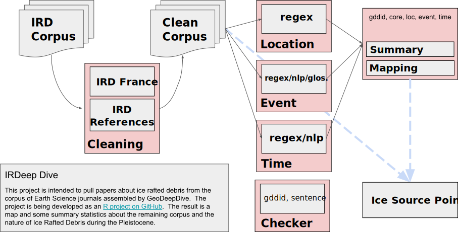
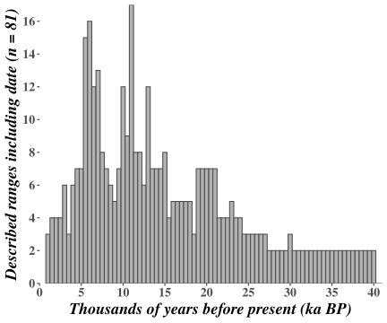

## Introduction

Peer-reviewed papers communicate knowledge to their audiences through figures, text and tables. These elements have been refined over generations to efficiently communicate scientific insight to human readers, but the volume and variety of the peer-reviewed literature has challenged meta-analysis and efficient extraction of the underlying primary data. Efforts to improve the practice of data archiving in structured, sustainable data repositories  are increasing [@sansone2019fairsharing] as individuals and groups recognize the importance of data sharing and curation [@pagesSteering]. Despite these efforts, however, a large volume of data and information still exists exclusively in published form as text within manuscripts, embedded in tables, or graphically within figures. In response, new automated software tools are being developed to extract information directly from the scientific literature. Various fields are developing tools for automated extraction of meaningful information from the scientific literature, including natural language processing (NLP) and other forms of machine learning (ML), the vast majority of which is being developed and deployed to extract information from general and freely available content, like Twitter feeds and publication abstracts. The development of these new software tools has rapidly outpaced their deployment in the geosciences to digital libraries and infrastructures that can can address questions at scales not available to traditional meta-analyses.

GeoDeepDive ([http://geodeepdive.org]())  is a digital library and computing system that currently contains over 11 million publications from multiple commercial and open-access content providers. Early versions of GeoDeepDive have been used to extract fossil occurrences from the scientific literature [@peters2014machine], e.g. to  better understand the temporal patterns and possible drivers of stromatolite resurgences in the geological past [@peters2017rise]. However, the newness of GeoDeepDive as a platform and the few available software tools to leverage it has limited its impact. Here we provide a sample workflow and accompanying R package that leads the reader through key, public elements of GeoDeepDive.  As a case study, we retrieve documents on the distribution of ice-rafted debris (IRD) from the Pliocene to present and extract both geographic coordinates and temporal information. We choose to focus our effort on IRD because of the near uniqueness of the acronym in the geoscience literature and because IRD is almost exclusively restricted to ocean settings, thus simplifying identification of false positives – occurrences of IRD that do not refer to ice-rafted debris – in the training dataset. IRD distribution in marine sediments provides a key constraint on cryosphere development, yielding insight into past climate evolution [*e.g.*, @hemming2004heinrich].

One implementation of GeoDeepDive uses sentences as the atomic unit, managing the sentence-level data within a PostgreSQL database. Each sentence within a paper is identified by 1) a unique document id (GDDID, or `gddid` in the accompanying code; an internally unique identifier to accommodate publications that may or may not have their own formal digital object identifier [DOI]) and 2) a sentence number that is assigned and unique within the paper. A separate table relates GDDIDs to publication metadata (e.g. title, journal, authors, etc.). Hence, GeoDeepDive workflows and their individual steps effectively operate at two distinct levels: sentence and document-level. Because GeoDeepDive (GDD) also provides unique IDs for each journal and links these to the sentence IDs, journal-level analytics are possible. GDD makes use of Stanford NLP [@manning2014stanford], so it is also possible to obtain word-level analysis using indexing within sentences. For this paper, we focus on "sentence"- and "document"-level analytics, because of our focus on extracting geospatial and temporal information for individual records.



**Figure 1**: *Workflow used to go from a list of documents that mention ice-rafted debris (IRD; IRD is the actual search string in this case) and (Pliocene or Pleistocene or Holocene) to a vetted set of the documents, and finally a summary of the documents and relevant information.*

This paper presents a sample workflow, intended to provide meaningful but preliminary results, with the main goal of illustrating the potential of sentence-level query capabilities in GDD, and showing potential users how GDD can be used to extract information from text.  In this example workflow, we will identify papers with mentions of ice-rafted debris (IRD) in the Pliocene and Pleistocene (Fig. 1), extract space and time coordinates using an R Toolkit called geodiveR ([http://github.com/EarthCubeGeochron/geodiveR]()), and store the data and code in a GitHub repository ([http://github.com/EarthCubeGeoChron]()).

Many publications document the existence of IRD at the level of individual marine drilling sites, but assembling this information across publications into large-scale mapped syntheses is a non-trivial task that has traditionally taken years of painstaking literature compilation [@stern2013north;@ruddiman_late_1977;@heinrich1988origin;@hemming2004heinrich]. A comprehensive, accurate database of IRD deposits and their spatial distribution extracted with through a combination of advanced software and human expertise from the published scientific literature can help the scientific community better understand and characterize ice sheet dynamics over the last 5.3 million years, ideally leading to a better understanding of how glaciers respond to changes in climate and ocean circulation.

The goal is not to remove the expert (*e.g*., sedimentologist, paleoceanographer) from decision-making processes, but, rather, to show how the DeepDive infrastructure can be employed to perform research tasks more efficiently.  Various subtleties and complexities persist that are not yet tractable to machine learning.  For example, ice-rafted debris is part of a complex of sedimentary deposits within ocean sediments, including iceberg, ice shelf, and sea ice rafted debris [@powell_glacimarine_1984]. Differences between the processes resulting in sediment entrainment and deposition between these types of sediment may result in issues of interpretation [@andrews_abrupt_1998]. Sedimentological features can be used to differentiate particle sizes and shapes to offer a better understanding of the sources of sediments identified as ice-sourced [@st2015microfeatures], and thus provide a more complete picture of the processes that led to deposition.  The geospatial and temporal information retrieved by GDD require vetting.

Nonetheless, by providing a comprehensive corpus of documents, with identified publications, timings, and locations for identified deposits it becomes possible to identify potential outliers or misidentified samples, to re-sample existing physical cores where there may be uncertainty in identification, and ultimately, to generate a more complete model of sea-ice patterns during the Pleistocene.  As a first step forward, this paper provides a model workflow to be carried out with the DeepDive infrastructure.  We begin with a general walkthrough of the analytical steps and various considerations that arise at each stage, then move to a specific walkthrough that focuses on identifying papers with IRD records from the Pliocene and Pleistocene, extracts spatial and temporal coordinates, and maps the returned results.  We show that a relatively simple framework is already able to recover a substantial body of useful information that can inform further data processing, cleaning, and interpretation that would be part of a more formal analysis of patterns of paleo-oceanographic patterns during the Pleistocene.

## Workflow Overview

### Initial Returns and RegEx

Processing the entirety of the documents within GDD is time consuming because the body of accesible papers (the corpus) contains over 11 million peer-reviewed publications. For any given goal, such as finding all instances of IRD, only a small fraction of the total corpus is relevant.  Keywords are a common first solution to reducing data volume. Particular keywords within a document can be used to identify the subset of all documents that are potentially relevant.  The GDD public API ([https://geodeepdive.org/api]()) supports simple string matching using keywords. Here, we chose terms that would return a sufficient breadth of documents for this trial study.  We used the acronym "IRD", as well as constraints on geologic time intervals, "Holocene", "Pleistocene" and "Pliocene". In our example dataset, this returned 5,315 total documents.

Useful information about these terms can be derived from the "snippets" route of GeoDeepDive's API. Snippets harnesses an ElasticSearch index spanning the full text of all PDFs that have a "native" text layer (*i.e*., PDFs with searchable text in them already, which constitutes the vast majority of PDFs distributed by journal publishers):

```
https://geodeepdive.org/api/snippets?term=IRD&full_results=true
```


The response to this API call is a JSON object that indicates the total number of "hits" of the term (n = 35772 as of 2020-03-26), basic bibliographic citation information for each document containing the term, including a link to the original PDF distributed by the publisher, and a "snippet" of text around mentions of the term in the full text of the document:


```
## [
##   {
##     "pubname": "South African Geographical Journal",
##     "publisher": "Taylor and Francis",
##     "_gddid": "5946b1c8cf58f13cac0191e7",
##     "title": "Reviews/Resensies",
##     "doi": "10.1080/03736245.1976.10559569",
##     "coverDate": "1976 04",
##     "URL": "http://www.tandfonline.com/doi/abs/10.1080/03736245.1976.10559569",
##     "authors": "Young, Bruce; Davies, R. J.; Hart, G. H. T.",
##     "highlight": [
##       "materials for course work in the second part. The th,<em class=\"hl\">ird<\/em> and fourth parl~ of the book. 0n the other hand,"
##     ]
##   }
## ]
## 
```

By default, the matching terms are highlighted with HTML tags (to remove the tags, the parameter `&clean=true` can be added to the URL for the `snippet` API). Because of the large number of results in the case above, the results include a link to the next page of documents containing the term, allowing the user to scroll through large sets of results.


The GeoDeepDive `snippet` API also supports searches that combine multiple terms.  The following API call, which returns only papers that contain both "IRD" and "Pleistocene" returns 4208 hits as of 2020-03-26, far fewer than the more expansive search.

```
https://geodeepdive.org/api/snippets?term=IRD,Pleistocene&inclusive=TRUE&full_results=true
```

The GeoDeepDive API, however, is not designed to provide full functionality, but rather   is designed to be deployed in user-constructed applications.  Hence, the GDD API is suitable only for limited data extraction tasks. More powerful analyses require analysis of the PostgreSQL representation of the document text data.

Here, text matching and data extraction from the retrieved body of papers in PostgreSQL uses existing PostgreSQL text and string functions, plus regular expression matching in R using the stringr package [@stringr]. The use of the Stanford NLP library also allows GDD workflows to take advantage of parts-of-speech tagging, and more advanced NLP tools, but these capabilities are not employed in this demonstration workflow.

### Subsetting and Cleaning

We begin our analysis with a subset of the data, consisting of 150 papers, that was pared down from the total set of the corpus, using the keyword constraints described above. The subset of papers may still include papers that are not appropriate (i.e. IRD may refer to something other than ice-rafted debris). To obtain a training dataset, we run a second round of same text matching, using the same keywords and rules used at the document level, but now enforced at the sentence level. For example, "IRD" must be located in a sentence with another term (e.g., "IRD" and "Holocene"). These additional rules restrict the total list returned to 81 documents for which any sentence contains a match to the keyword.

Searching for IRD as a keyword retrieves articles that use IRD as an acronym for Ice-Rafted Debris, but it also, for instance, retrieves articles mentioning the French Research **I**nstitute of **R**esearch for **D**evelopment. Throughout this paper we will refer to *rules*; generally these are statements that can resolve to a boolean (TRUE/FALSE) output. So for example, within our subset we could search for all occurrences of IRD and CNRS:


```r
sentence <- "this,is,a,IRD,and,CNRS,sentence,we,didnt,want,."
stringr::str_detect(sentence, "IRD") & !stringr::str_detect(sentence, "CNRS")
```

This statement will evaluate to `TRUE` if `IRD` appears in a sentence without `CNRS`.  If we apply this sentence-level test at the document level (`any(test == TRUE)`) we can estimate which papers are most likely to have the correct mention of `IRD` for our purposes. This then further reduces the number of papers (and sentences) for our training dataset.

## Extracting Data

After cleaning and subsetting, we develop a series of tests and workflows to iteratively extract information. In many cases this requires further text matching, and packages in R such as stringr were useful for accomplishing this task. Additional support can come from the NLP output that can be generated for the data. In all of these cases, we generate clear rules to be tested, and then apply them to the document.

Because understanding both the IRD distribution in ocean sediments and the timing of the deposition of IRD through the Pliocene and Pleistocene is critical for interpreting past ice dynamics, spatial coordinates and geochronologic constraints of the IRD deposits need to be identified within the paper. As with the earlier cleaning process, any paper that contains neither spatial coordinates or ages, or one but not the other, is here deemed not of interest.  Less restrictive searches could be defined.

Extracting the spatial location and age of an IRD occurrence within a paper that contains "IRD", however, is not sufficient. We need to be able to distinguish between an age related to the event we are interested in versus an age reported in a paper for some other reason.  So, again, we must develop general rules that allow distinguishing of all ages from ages of interest, and all spatial locations from spatial locations of interest.

## Exploratory Iteration

There are a number of reasons to continue to refine the rules used in this workflow to discover data. First, extraction of text from the PDF and optical character recognition (OCR) is not always accurate, so that some sentences and words are parsed incorrectly. This problem is particularly acute for geographic coordinates (see below). Second, many words have multiple meanings, leading to false positives if only string-matching is used, as the IRD example illustrates. Third, semantic terms and concepts often vary subtly within and among disciplines and journals. As a simple example, if we were interested in retrieving paleoecological information we would need to know that *paleoecology* and *palaeoecology* refer to essentially identical concepts. Similarly, ice rafted debris may also be referred to as sand-sized layers in the marine context [e.g. @ruddiman_north_1977], while a paleoceanographer might want careful separation among different kinds of IRD, e.g. iceberg-rafted debris (IBRD), ice shelf rafted debris (ISRD), or sea ice rafted debris (SIRD). Fourth, the context and placement of words matters. For example, temporal information like 'Holocene' and 'Pliocene' may be found in the Methods, where they refer to marine core locations, or in the Discussion, where they might refer to global climate trends.

Some potential pitfalls include:

  * OCR matching - commonly mistaken letters (O, Q, o)
  * Age reporting variety in units or time datum (e.g., kyr vs. ka)
  * Age reporting variety (e.g. radiocarbon years vs. calendar years vs. stratigraphic units)
  * GDD sentence construction (failure of GDD to identify proper sentence bounds, complex punctuations)

Repeatedly reviewing matches at the sentence level and at the document level (i.e., "Why did this match or why didn't this paper return a match?"), then refining the workflow rule-sets accordingly, is critical to developing a clear workflow and high-value corpus. In many cases, beginning with very broad tests and slowly paring down to more precise tests is an appropriate approach. In this case, tools like `RMarkdown` are very helpful for interactive data exploration, using packages like `DT` [@dt2020] and `leaflet` [@leaflet2019]. We can assess the distribution of age-like elements within a paper and determine if they match with our initial expectations (e.g. "Why does the article 'Debris fields in the Miocene' contain Holocene-aged matches?"; "Why does a paper about Korea report locations in Belize?"). Depending on the success of the algorithm, the tests can be revised and the process repeated until an acceptable match is found.

### Reproducible and Validated Workflows for a Dynamic Literature

As the GDD workflow develops and refines, we can begin to report on patterns and findings. Some of these may be semi-qualitative (e.g. "The majority of sites are dated to the LGM"), while others may involve statistical analysis (e.g., "The presence of IRD increases after the Mid-Pliocene Transition (*p<0.05*)"). In an analysis where the underlying dataset is static or a version has been frozen, it is reasonable to develop a paper and report these findings.

However, the publication database in GDD is far from static; the GDD infrastructure acquires more than 10,000 papers per day from multiple sources. Given this, some patterns will change over time as more information is brought to bear. For example, a new ocean drilling campaign might reveal new insights into the spatiotemporal distribution of IRD, or the addition of new records may reveal previously undiscovered search artifacts within the publication record. For this reason the use of assertions or testable statements that can be evaluated to TRUE or FALSE within the workflow become critically important. In R we can use the `assertthat` package [@assertthat2019] to support test-driven development and assertions within the workflow.

Test-driven development is common in software development. As developers create new features, a good practice is to first develop tests for the features, to ensure that feature behavior matches expectations. The analogy in our scientific workflow is that findings are features, and as we report them, we want to be assured that those findings are valid. In R the assertthat package provides a tool for testing statements, and providing robust feedback through custom error messages [@assertthat2019].


```r
howmany_dates <- all_sentences %>%
  mutate(hasAge = stringr::str_detect(words,
    "regular expression for dates")) %>%
  group_by(gddid) %>%
  summarise(age_sentences = any(hasAge),
            n = n())

# We initially find that less than 10% of papers have dates in them, and report that as an important finding in the paper.

percent_ages <- sum(howmany_dates$age_sentences) / nrow(howmany_dates)

assertthat::assert_that(percent_ages < 0.1,
  msg = "More than 10% of papers have ages.")
```

**Text Box 1**. *From sentences returned by GDD (all_sentences) create a new column called 'hasAge' that is a boolean variable to test whether an age is found.  Once the variable has been created, group the data to test whether any of the papers (each with a unique gddid) has an age reported in the paper, and then count the total number of reported ages within the paper.  If we expect that most papers won't have reported ages, we can create an assertion, in this case that only 10% of papers have a reported age.  If this assertion fails, then a custom error message is returned.*

With this workflow overview we now have mapped out an iterative process that is also responsive to the underlying data. We have developed clear tests under which our findings are valid. We can create a document that combines our code and text in an integrated manner, supporting FAIR Principles [@wilkinson2016fair], and supporting the next generation of reproducible research. In the following section we run through this workflow in detail.

## Ice Rafted Debris Case Study and Discussion

### Finding Spatial Matches

To begin, we load the packages that will be used, and then import the data:


```r
library(geodiveR)
library(ggplot2)
library(jsonlite) # (Ooms et al., 2018)
library(readr) # (Wickham et al., 2018)
library(dplyr) # (Wickham et al., 2019)
library(stringr)
library(leaflet)
library(purrr) # (Henry et al., 2019)
library(DT)
library(assertthat)

sourcing <- list.files('R', pattern = ".R$", full.names = TRUE) %>%
  map(source, echo = FALSE, print = FALSE, verbose = FALSE)

publications <- fromJSON(txt = 'input/bibjson', flatten = TRUE)

if(!file.exists('input/sentences_nlp352')){
  data(nlp)
  full_nlp <- nlp
  rm(nlp)
  colnames(full_nlp) <- c('_gddid', 'sentence', 'wordIndex',
                          'word', 'partofspeech', 'specialclass',
                          'wordsAgain', 'wordtype', 'wordmodified')
} else {

  full_nlp <- readr::read_tsv('input/sentences_nlp352',
                         trim_ws = TRUE,
                         col_names = c('_gddid', 'sentence', 'wordIndex',
                                       'word', 'partofspeech', 'specialclass',
                                       'wordsAgain', 'wordtype', 'wordmodified'))
}

#  uses the clean_corpus.R function within geodiveR
#  (implements the IRD search-and-refinement rules mentioned
#   above in 'Exploratory Iteration')

nlp_clean <- clean_corpus(x = full_nlp, pubs = publications)

nlp <- nlp_clean$nlp
```

This code produces an output object that includes a key for the publication (`_gddid`, linking to the `publications` variable), the sentence number of the parsed text, and then both the parsed text and some results from natural language processing. We also obtain a list of gddids to keep or drop given the regular expressions we used to find instances of IRD in the affiliations or references sections of the papers. This analysis returns 1 publications:

<!--html_preserve--><div id="htmlwidget-aaead03385ae56515d23" style="width:100%;height:auto;" class="datatables html-widget"></div>
<script type="application/json" data-for="htmlwidget-aaead03385ae56515d23">{"x":{"filter":"none","data":[["_gddid","sentence","wordIndex","word","partofspeech","specialclass","wordsAgain","wordtype","wordmodified"],["550578e8e1382326932d8d3a","1","<code>{1,2,3,4,5,6,7,8,9,10,11,12,13 ... }<\/code>","<code>{ARTICLE,IN,PRESS,Quaternary,S ... }<\/code>","<code>{NN,IN,NNP,NNP,NNP,NNP,CD,(,CD ... }<\/code>","<code>{O,O,O,O,O,O,NUMBER,O,DATE,O,D ... }<\/code>","<code>{article,in,PRESS,Quaternary,S ... }<\/code>","<code>{nsubj,case,compound,compound, ... }<\/code>","<code>{90,6,6,6,6,1,6,0,6,0,13,0,1,1 ... }<\/code>"],["Unique article identifier","Unique sentence identifier within article","Index of words within sentence","Verbatim OCR word","Parts of speech, based on <a href='https://www.ling.upenn.edu/courses/Fall_2003/ling001/penn_treebank_pos.html'>Penn State TreeView<\/a>","Special classes (numbers, dates, &cetera)","Words again","Word types, based on <a href='http://universaldependencies.org/introduction.html'>universal dependencies<\/a>.","The word that the <code>wordtype<\/code> is modifying."]],"container":"<table class=\"display\">\n  <thead>\n    <tr>\n      <th> <\/th>\n      <th>value<\/th>\n      <th>description<\/th>\n    <\/tr>\n  <\/thead>\n<\/table>","options":{"dom":"t","order":[],"autoWidth":false,"orderClasses":false,"columnDefs":[{"orderable":false,"targets":0}]}},"evals":[],"jsHooks":[]}</script><!--/html_preserve-->

**Table 1.** Columns returned by GeoDeepDive for use in text matching and extraction, along with an example of each column entry.


### Extracting Spatial Coordinates

We are interested in using GDD to obtain site coordinates for locations that contain IRD data spanning the Pliocene and Pleistocene.  The goal is to provide relevant site information for use in meta-analysis, or for comparing results to existing geographic locations from the relevant geocoded publications and then linking back to the publications using DOIs.

To obtain geographical coordinates from the paper we must consider several potential issues.  The first is that not all coordinates will necessarily refer to an actual ocean core.  We may also, inadvertently, find numeric objects that appear to be coordinates, but are in fact simply numbers.  Therefore, we must identify what exactly we think coordinates might look like and build a regular expression (or set of regular expressions) to accurately extract these values.  Since we will process DMS coordinates differently than DD coordinates, we generate two regular expressions:


```r
dms_regex <- "[\\{,]([-]?[1]?[0-9]{1,2}?)(?:(?:,[°◦o],)|(?:[O])|(?:,`{2},))([1]?[0-9]{1,2}(?:.[0-9]*)),[′'`]?[,]?([[0-9]{0,2}]?)[\"]?[,]?([NESWnesw]?),"

dd_regex <- "[\\{,][-]?[1]?[0-9]{1,2}\\.[0-9]{1,}[,]?[NESWnesw],"
```

These regular expressions allow for negative or positive coordinate systems, that may start with a `1`, and then are followed by one or two digits (`{1,2}`).  From there we see differences in the structure, reflecting the need to capture the degree symbols, or, in the case of decimal degrees, the decimal component of the coordinates.  The regular expressions are more rigorous (i.e., have fewer matching options) for the decimal degrees than for DMS coordinates.  DMS coordinates reported in documents may be interpreted in non-standard ways by OCR.

The regex commands were constructed to work with the `stringr` package [@stringr2019], so that we obtain five elements from any match, including the full match, the degrees, the minutes, the seconds (which may be an empty string), and the quadrant (NESW).


```r
degmin <- str_match_all(nlp$word, dms_regex)
decdeg <- str_match_all(nlp$word, dd_regex)
```

We expect that all coordinates are reported as pairs within sentences, and so we are most interested in finding all sentences that contain pairs of coordinates. We start by finding the publications with sentences that have coordinate pairs:

<!--html_preserve--><div id="htmlwidget-4f48ab6691b8f948e6fa" style="width:100%;height:auto;" class="datatables html-widget"></div>
<script type="application/json" data-for="htmlwidget-4f48ab6691b8f948e6fa">{"x":{"filter":"none","data":[["1","2","3","4","5","6","7","8","9","10","11","12","13","14","15","16","17","18","19","20","21","22","23","24","25","26","27","28"],["{To address the stability and duration of the last interglaciation in continental Asia , the advanced hydraulic piston cores BDP96-2 ( 53 ◦ 41 48 N , 108 ◦ 21 06 E ) and BDP-98 ( 53 ◦ 44 48 N , 108 ◦ 24 34 E ) of the Baikal Drilling Project ( BDP-Members , 1997 , 2000 ) were sampled at 1 cm ( ca. 250 yr ) and 2 cm ( 350 -- 400 yr ) , respectively .}","{Location , lithology , and chronology Location and sedimentary environment Core PC-013 was collected from the Greenland rise , north of the Eirik Ridge on the northern flank of a subsidiary ridge ( 58 `` 13 ` N , 48 `` 22 ` W ) , at a water depth of 3380 m ( Fig. 1 ) .}","{Site 1101 ( latitude 64 ° 22.3 ′ S , longitude 70 ° 15.6 ′ W , 3280 m ) is located on Drift 4 , one in a series of eight drift deposits that occur along the northwest flank of the Antarctic Peninsula continental rise ( Fig. 1 ; Barker et al. , 1999 ; Uenzelmann-Neben , 2006 ) .}","{On Table 1 Core inventory Core 9404468 9404469 9404470 9404471 9404472 9404473 9404474 9404475 9404476 13/01-U -02 13/01-U -02 Latitude WGS84 57 ° 45.078 ′ 57 ° 45.281 ′ 57 ° 45.357 ′ 57 ° 45.540 ′ 57 ° 45.982 ′ 58 ° 16.084 ′ 58 ° 15.511 ′ 58 ° 14.772 ′ 58 ° 13.728 ′ 57 ° 59.085 ′ 57 ° 59.085 ′ Longitude WGS84 8 ° 35.133 ′ 8 ° 35.170 ′ 8 ° 35.191 ′ 8 ° 35.171 ′ 8 ° 35.219 ′ 5 ° 51.608 ′ 5 ° 50.763 ′ 5 ° 49.588 ′ 5 ° 47.939 ′ 8 ° 22.008 ′ 8 ° 22.008 ′ Water depth ( m ) 279 290 292 300 340 339 343 348 339 505 505 Core type Gravity Gravity Gravity Gravity Gravity Gravity Gravity Gravity Gravity Borehole Borehole Core length / interval ( m ) 2.70 4.00 3.00 3.30 4.05 2.55 2.95 3.40 2.50 90.0 -- 90.5 110.0 -- 110.3 boomer records , reflections are more variable in character , and subunits appear to vary in thickness over short distances ( Fig. 6 ) .}","{Site 963 -LSB- 4 -RSB- Sedimentary material of Ocean Drilling Program ( ODP ) Hole 963D ( longitude 37 ° 02.1480 N , latitude 13 ° 10.6860 E ) was recovered in the Sicily Strait between the Adventure Bank and the Gela basin , at 469.1 m below sea level ( Figure 1 ) .}","{-LSB- 26 -RSB- During the Vicomed I cruise , carried out from September to October 1986 , 32.5 % of F. profunda was found in water samples at station SIC ( 37 ° 27.30 N ; 11 ° 32.70 E ) , which is only a few kilometers away from ODP Site 963 , when the base of the summer thermocline was located at about 55 m depth .}","{CORE STRATIGRAPHY The cores were dated using a combination of biostratigraphy ( diatoms and radiolaria ) and chemical ( barium ) and isotope TABLE 1 Site Information on Sediment Cores Discussed in This Paper from the Continental Rise of the Antarctic Peninsula and the Weddell and Scotia Seas1 Core number Location Water depth Recovery ( m ) ( m ) Antarctic Peninsula Weddell and Scotia Seas PC106 PC108 PC110 PC111 PC113 PC038 PC041 KC083 PC079 KC064 KC097 66 ◦ 18.8 S , 76 ◦ 58.7 W 65 ◦ 42 S , 73 ◦ 38 W 65 ◦ 08.8 S , 70 ◦ 35.3 W 64 ◦ 19 S , 70 ◦ 26.2 W 63 ◦ 27.3 S , 68 ◦ 58 W 63 ◦ 10.0 S , 42 ◦ 43.5 W 62 ◦ 04.0 S , 40 ◦ 35.0 W 59 ◦ 22.2 S , 42 ◦ 43.5 W 56 ◦ 45.0 S , 43 ◦ 16.9 W 53 ◦ 52.1 S , 48 ◦ 20.3 W 53 ◦ 21.0 S , 54 ◦ 41.0 W 3662 3601 3025 3357 3552 3802 3310 3900 3733 4304 3058 9.27 9.15 7.55 10.93 10.80 5.96 9.35 2.3 8.0 3.2 2.82 1 Core locations are shown in Figures 1 and 2 .}","{Cores 1 2 3 4 5 6 7 8 SU92-03 PE109-13 KC24-19 MD03-2697 MD99-2331 MD95-2040 MD95-2042 MD99-2339 Latitude N 43 ° 11.750 42 ° 34.32 ′ 42 ° 08.98 ′ 42 ° 09 ′ 59 N 42 ° 09 ′ 00 N 40 ° 34.91 ′ 37 ° 47.99 ′ 35 ° 14.76 ′ Longitude W 10 ° 6.780 9 ° 41.4 ′ 10 ° 29.96 ′ 9 ° 42 ′ 10 W 09 ° 40 ′ 90 W 9 ° 51 .}","{MD04-2820CQ MD04-2820CQ was retrieved from the Goban Spur area ( 49 05.290 N ; 13 25.900 W ; Fig. 1 ) and is a reoccupation of the OMEX-2K core site ( see Hall and McCave , 1998a , b ; Scourse et al. , 2000 ; Haapaniemi et al. , 2010 ) .}","{A gravity core , GH95 -- 1208 ( lat 43 ° 46 ′ N , long 138 ° 50 ′ E , water depth 3435 m ) , was collected during the GH 95 cruise of the R/V Hakurei-Maru of the Geological Survey of Japan from the eastern margin of the Japan Basin in the northeastern Japan Sea .}","{A piston core , MD01 -- 2407 ( lat 37 ° 11 ′ N , long 134 ° 11 ′ E , water depth 930 m ) , was collected during the IMAGES-WEPAMA cruise of the R/V Marion Dufresne from a small depression on the Oki Ridge in the southwestern Japan Sea .}","{Lithological Data The 16 m long Calypso core ( giant piston core ) GS10-163-3PC ( 68 ° 05.0978 ′ N , 09 ° 52.1969 ′ E , 1178 m water depth ) was retrieved with R/V G.O. Sars in June 2010 ( Figures 2 and 3 ) .}","{Map showing sampling location of core PC-2 ( latitude : 50 ° 23.70 N , longitude : 148 ° 19.40 E , water depth : 1258 m , core length : 10.23 m ) in the Sea of Okhotsk .}","{MeanHoloceneBenthicForaminiferafli13CandCd/Ca , WaterColumnCdandPhosporuCsoncentrationasn , dCalculated Foraminiferal Water Column Cd Partition Coefficients Core SectionAge , Water Samples / • 13C , Cd/Ca , Cdwater , P , Dtt kyr Depmth , Rel • licaat % esP0DB -LSB- • mmolol-l -LSB- lnmko • - l • -RSB- gmko • ` l • thisstudBy oy -LSB- l1e992 -RSB- SO75-26KL SO82-05 M16004 M23414 Hol ( 3.0-8 .5 ) Hol ( 0-9 ) Hol ( 0.6-9 .6 ) Hol ( 3.0-8 .9 ) 1099 1416 1512 2196 8/14 4/8 4/8 10/24 1.015 1.347 1.030 1.120 0.047 0.103 0.036 0.081 0.17 b 0.24 d 0.17 b 0.24 d 0.86 n.a. 1.21 n.a. 3.1 c 4.3 e 2.1 c 3.3 e 1.3 1.5 1.6 2.2 a Numberof sampledepths/numboefranalyses .}","{Environmental setting The studied core MD04-2861 is located in the Arabian Sea , off the tectonically-active Makran margin ( 24.13 N ; 63.91 E ; 2049 m depth ) ( Bourget et al. , 2011 ; Ellouz-Zimmermann et al. , 2007 ; Kukowski et al. , 2001 ; Fig. 1A ) .}","{Core ID VC03 VC04 VC05 VC06 VC07 VC08 VC09 VC10 VC11 VC12 VC13 VC14 Latitude 69 10.810 N 69 09.970 N 69 09.600 N 69 08.940 N 69 08.620 N 69 08.350 N 69 05.790 N 69 05.950 N 69 06.900 N 69 53.120 N 69 58.460 N 69 56.970 N Longitude 51 11.610 W 51 10.150 W 51 31.630 W 52 04.140 W 52 18.880 W 52 38.240 W 51 23.650 W 51 31.220 W 52 25.600 W 51 53.150 W 51 44.470 W 51 40.350 W Area Disko Disko Disko Disko Disko Disko Disko Disko Disko Vaigat Vaigat Vaigat Depth -LSB- m -RSB- 545 263 389 439 439 429 294 351 410 616 341 386 Length -LSB- m -RSB- 1.57 1.10 5.87 4.94 5.46 3.91 5.98 4.86 3.25 3.66 3.40 4.66 cores should be treated as estimates .}","{DOI : 10.1002 / jqs .1503 Late Holocene environmental conditions in Coronation Gulf , southwestern Canadian Arctic Archipelago : evidence from dinoflagellate cysts , other non-pollen palynomorphs , and pollen ANNA J. PIEN ´ KOWSKI \" 1, \" * , y PETA J. MUDIE \" 2\" JOHN H. ENGLAND \" 1\" JOHN N. SMITH3 and MARK F. A. FURZE4 1Department of Earth and Atmospheric Sciences , University of Alberta , Edmonton , Alberta , Canada 2Geological Survey of Canada -- Atlantic , Dartmouth , Nova Scotia , Canada 3Department of Fisheries and Oceans , Bedford Institute of Oceanography , Dartmouth , Nova Scotia , Canada 4Earth and Planetary Science Division , Department of Physical Sciences , Grant MacEwan University , Edmonton , Alberta , Canada Received 19 November 2010 ; Revised 22 February 2011 ; Accepted 27 February 2011 ABSTRACT : Boxcore 99LSSL-001 ( 68.0958 N , 114.1868 W ; 211 m water depth ) from Coronation Gulf represents the first decadalscale marine palynology and late Holocene sediment record for the southwestern part of the Northwest Passage .}","{Materials and methods Core materials Boxcore 99LSSL-001 was retrieved from southwestern Coronation Gulf ( 68.0958 N , 114.1868 W ; Tundra Northwest research cruise , CCGS Louis S. St-Laurent , 1999 ) in a small , deep ( 211 m ) basin 48 km NE of the Coppermine River mouth ( Fig. 1b ) .}","{( f ) Percentage of N. pachyderma ( s. ) from core DAPC2 ( 58 58.100 N , 09 36.750 W , 1709 m water depth ) ( Knutz et al. , 2007 ) .}","{( g ) Ice-rafted debris flux from core DAPC2 ( 58 58.100 N , 09 36.750 W , 1709 m water depth ) ( Knutz et al. , 2007 ) .}","{( h ) Records of ice-rafted debris from core P-013 ( 58 12.59 N , 47 22.40 W , 3380 m water depth ) ( powder blue fill ) ( Hillaire-Marcel and Bilodeau , 2000 ) and core SU8118 ( 37 460N , 10 110W , 3135 m depth ) ( light blue ) ( Bard et al. , 2000 ) showing Heinrich events 0e2 .}","{307 hole U1317E samples ( drilled at 51 22.80 N , 11 43.10 W ; 792.2 m water depth ) .}","{Core location and oceanography Marine sediment core CD154 17-17K ( 33 ◦ 19.2 S ; 29 ◦ 28.2 E ; 3333 m water depth ) was recovered from the Natal Valley , south west Indian Ocean during the RRS Charles Darwin Cruise 154 ( Hall and Zahn , 2004 ) .}","{Lithic fragments ( > 150 μm fraction ) were counted in marine sediment core MD02-2588 , ( 41 ◦ 19.9 S ; 25 ◦ 49.4 E ; 2907 m water depth ) every 2 cm between Marine Isotope Stages ( MIS ) 1 -- 5 .}","{However , a recently published high-resolution record from the Ag - ulhas Bank , South Atlantic ( Marino et al. , 2013 ) ( sediment core MD96-2080 , 36 ◦ 19.2 S , 19 ◦ 28.2 E , 2488 m water depth , Fig. 1 ) spanning MIS 5 -- 8 offers the opportunity to compare both loca - tions on millennial-scale basis , as both records overlap during the period between 76 -- 98 kyr .}","{In the present study , to provide further information about the origin of the Heinrich layers ( HL ) and the effect of the HE on oceanographic conditions , we have examined the distributions of selected types of biomarkers ( C37alkenones , tetrapyrrole pigments and aromatic hydrocarbons ) in the core BOFS 5K ( East Thulean Rise ; 50 ° 41.3 N , 21 ° 51.9 ` W , 3547m water depth ; Fig. 1 ; McCave , 1989 ) , in which the HL ( I-IV ) were located from the relative abundance of coarse fraction lithic debris ( ice rafted debris , IRD ) and whole core magnetic susceptibility ( Fig. 2a , b Maslin , 1993 ; Maslin et al. , 1995 ) .}","{Site U1386 Integrated Ocean Drilling Program ( IODP ) Site U1386 was drilled during Expedition 339 in November to January 2011/2012 and is located southeast of the Portuguese Margin mounded on the Faro Drift along the Alvarez Cabral Moat at 36 ° 49.68 ′ N ; − 7 ° 45.32 ′ W in 561 m water depth ( Fig. 1B and C ) .}","{Lon 7 ° 45.32 W 9 ° 43.97 E 7 ° 31.80 W 2 ° 37.26 E Water depth ( m ) 561 501 1170 1841 Water mass Upper MOW1 LIW2 Lower MOW3 WMDW4 Table 2 Age control points used for the construction of the chronology at Site U1386 based on alignment of the normalized Br counts at Site U1386 to the planktic δ18O Record of the Iberian Margin core MD01-2444 ( Barker et al. , 2011 ; Hodell et al. , 2013 ) ( Fig. 2A and B ) .}"],["2002","1994","2009","2008","2008","2008","2001","2015","2016","2007","2007","2014","2005","2000","2011","2017","2011","2011","2012","2012","2012","2012","2013","2013","2013","1997","2015","2015"],["The Stability and the Abrupt Ending of the Last Interglaciation in Southeastern Siberia","High-resolution rock magnetic study of a Late Pleistocene core from the Labrador Sea","Mid-Pliocene to Recent abyssal current flow along the Antarctic Peninsula: Results from ODP Leg 178, Site 1101","Postglacial depositional environments and sedimentation rates in the Norwegian Channel off southern Norway","Holocene millennial-scale productivity variations in the Sicily Channel (Mediterranean Sea)","Holocene millennial-scale productivity variations in the Sicily Channel (Mediterranean Sea)","Late Quaternary Iceberg Rafting along the Antarctic Peninsula Continental Rise and in the Weddell and Scotia Seas","Atlantic sea surface temperatures estimated from planktonic foraminifera off the Iberian Margin over the last 40Ka BP","Last glacial period cryptotephra deposits in an eastern North Atlantic marine sequence: Exploring linkages to the Greenland ice-cores","Millennial-scale fluctuations in seasonal sea-ice and deep-water formation in the Japan Sea during the late Quaternary","Millennial-scale fluctuations in seasonal sea-ice and deep-water formation in the Japan Sea during the late Quaternary","Origin of shallow submarine mass movements and their glide planes-Sedimentological and geotechnical analyses from the continental slope off northern Norway","Decreased surface salinity in the Sea of Okhotsk during the last glacial period estimated from alkenones","Upper ocean circulation in the glacial North Atlantic from benthic foraminiferal isotope and trace element fingerprinting","New Arabian Sea records help decipher orbital timing of Indo-Asian monsoon","Seafloor geomorphology and glacimarine sedimentation associated with fast-flowing ice sheet outlet glaciers in Disko Bay, West Greenland","Late Holocene environmental conditions in Coronation Gulf, southwestern Canadian Arctic Archipelago: evidence from dinoflagellate cysts, other non-pollen palynomorphs, and pollen","Late Holocene environmental conditions in Coronation Gulf, southwestern Canadian Arctic Archipelago: evidence from dinoflagellate cysts, other non-pollen palynomorphs, and pollen","Response of the Irish Ice Sheet to abrupt climate change during the last deglaciation","Response of the Irish Ice Sheet to abrupt climate change during the last deglaciation","Response of the Irish Ice Sheet to abrupt climate change during the last deglaciation","Ice-rafting from the British–Irish ice sheet since the earliest Pleistocene (2.6 million years ago): implications for long-term mid-latitudinal ice-sheet growth in the North Atlantic region","Millennial-scale Agulhas Current variability and its implications for salt-leakage through the Indian–Atlantic Ocean Gateway","Millennial-scale Agulhas Current variability and its implications for salt-leakage through the Indian–Atlantic Ocean Gateway","Millennial-scale Agulhas Current variability and its implications for salt-leakage through the Indian–Atlantic Ocean Gateway","Biomarker evidence for “Heinrich” events","New insights into upper MOW variability over the last 150kyr from IODP 339 Site U1386 in the Gulf of Cadiz","New insights into upper MOW variability over the last 150kyr from IODP 339 Site U1386 in the Gulf of Cadiz"]],"container":"<table class=\"display\">\n  <thead>\n    <tr>\n      <th> <\/th>\n      <th>word<\/th>\n      <th>year<\/th>\n      <th>title<\/th>\n    <\/tr>\n  <\/thead>\n<\/table>","options":{"dom":"t","order":[],"autoWidth":false,"orderClasses":false,"columnDefs":[{"orderable":false,"targets":0}]}},"evals":[],"jsHooks":[]}</script><!--/html_preserve-->

**Table 2**. Sample sentences from the IRD corpus that contain matches to the coordinate regular expression rule.

Even here, we can see that many of these matches work, but that some of the matches are incomplete.  There appears to be a much lower proportion of sites returned than we might otherwise expect.  Given that there are 81 articles in the NLP dataset with matches to IRD related terms, it is surprising that only 20 appear to support regex matches to coordinate pairs.  We would expect that the description of sites or locations using coordinate pairs should be common practice. The observed outcome is likely to be, in part, an issue with the OCR/regex processing. A next iterative step would be to review potential matches more thoroughly to find additional methods of detecting the coordinate systems.

### Converting Coordinates

Given the geographic coordinate strings, we need to be able to transform them to reliable latitude and longitude pairs with sufficient confidence to actually map the records.  These two functions convert the GeoDeepDive (GDD) word elements pulled out by the regular expression searches into decimal degrees that can account for reported locations.


```r
convert_dec <- function(x, i) {

  drop_comma <- gsub(',', '', x) %>%
    substr(., c(1,1), nchar(.) - 1) %>%
    as.numeric %>%
    unlist

  domain <- (str_detect(x, 'N') * 1 +
    str_detect(x, 'E') * 1 +
    str_detect(x, 'W') * -1 +
    str_detect(x, 'S') * -1) *
    drop_comma

  publ <- match(nlp$`_gddid`[i], publications$`_gddid`)

  point_pairs <- data.frame(sentence = nlp$sentence[i],
                            string = nlp$word[i],
                            lat = domain[str_detect(x, 'N') | str_detect(x, 'S')],
                            lng = domain[str_detect(x, 'E') | str_detect(x, 'W')],
                            publications[publ,],
                            stringsAsFactors = FALSE) %>%
                  rename(gddid = X_gddid)

  return(point_pairs)
}

convert_dm <- function(x, i) {

  # We use the `i` index so that we can keep the coordinate outputs from the
  #  regex in a smaller list.
  dms <- data.frame(deg = as.numeric(x[,2]),
                    min = as.numeric(x[,3]) / 60,
                    sec = as.numeric(x[,4]) / 60 ^ 2,
                    stringsAsFactors = FALSE)

  dms <- rowSums(dms, na.rm = TRUE)

  domain <- (str_detect(x[,5], 'N') * 1 +
    str_detect(x[,5], 'E') * 1 +
    str_detect(x[,5], 'W') * -1 +
    str_detect(x[,5], 'S') * -1) *
    dms

  publ <- match(nlp$`_gddid`[i], publications$`_gddid`)

  point_pairs <- data.frame(sentence = nlp$sentence[i],
                            string = nlp$word[i],
                            lat = domain[x[,5] %in% c('N', 'S')],
                            lng = domain[x[,5] %in% c('E', 'W')],
                            publications[publ,],
                            stringsAsFactors = FALSE) %>%
                  rename(gddid = X_gddid)

  return(point_pairs)
}
```

Once we are done converting coordinate strings to reliable latitude and longitude pairs, we need to apply those functions to the set of records we've extracted to build a composite table:


```r
coordinates <- list()
coord_idx <- 1

for (i in 1:length(decdeg)) {
  if ((length(decdeg[[i]]) %% 2 == 0 |
      length(degmin[[i]]) %% 2 == 0) & length(degmin[[i]]) > 0) {

    if (any(str_detect(decdeg[[i]], '[NS]')) &
       sum(str_detect(decdeg[[i]], '[EW]')) == sum(str_detect(decdeg[[i]], '[NS]'))) {
      coordinates[[coord_idx]] <- convert_dec(decdeg[[i]], i)
      coord_idx <- coord_idx + 1
    }
    if (any(str_detect(degmin[[i]], '[NS]')) &
       sum(str_detect(degmin[[i]], '[EW]')) == sum(str_detect(degmin[[i]], '[NS]'))) {
      coordinates[[coord_idx]] <- convert_dm(degmin[[i]], i)
      coord_idx <- coord_idx + 1
    }
  }
}

coordinates_df <- coordinates %>% bind_rows %>%
  mutate(sentence = gsub(',', ' ', sentence)) %>%
  mutate(sentence = str_replace_all(sentence, '-LRB-', '(')) %>%
  mutate(sentence = str_replace_all(sentence, '-RRB-', ')')) %>%
  mutate(sentence = str_replace_all(sentence, '" "', ','))

coordinates_df$doi <- coordinates_df$identifier %>% map(function(x) x$id) %>% unlist

leaflet(coordinates_df) %>%
  addProviderTiles(providers$Esri.WorldImagery) %>%
  addCircleMarkers(popup = paste0('<b>', coordinates_df$title, '</b><br>',
                                  '<a href=https://doi.org/',
                                  coordinates_df$doi,'>Publication Link</a><br>',
                                  '<b>Sentence:</b><br>',
                                  '<small>',gsub(',', ' ', coordinates_df$string),
                                  '</small>'))
```

<!--html_preserve--><div id="htmlwidget-aab9991fe05b64601bb7" style="width:672px;height:480px;" class="leaflet html-widget"></div>
<script type="application/json" data-for="htmlwidget-aab9991fe05b64601bb7">{"x":{"options":{"crs":{"crsClass":"L.CRS.EPSG3857","code":null,"proj4def":null,"projectedBounds":null,"options":{}}},"calls":[{"method":"addProviderTiles","args":["Esri.WorldImagery",null,null,{"errorTileUrl":"","noWrap":false,"detectRetina":false}]},{"method":"addCircleMarkers","args":[[53,53,58.2166666666667,-64.3716666666667,2.148,37.0358,27.3,37.455,-18.8,-8.8,-27.3,-10,-4,-22.2,-45,-52.1,-21,43.7666666666667,37.1833333333333,68.0849633333333,23.7,50.395,-19.2,-33.32,-19.9,-41.3316666666667,-19.2,-36.32,50.6883333333333,36.828],[108,108,-48.3666666666667,-70.26,10.686,13.1781,32.7,11.545,-58.7,-35.3,-26.2,-43.5,-35,-43.5,-16.9,-20.3,-41,138.833333333333,134.183333333333,9.86994833333333,19.4,148.323333333333,28.2,29.47,49.4,25.8233333333333,28.2,19.47,-21.865,-7.75533333333333],10,null,null,{"interactive":true,"className":"","stroke":true,"color":"#03F","weight":5,"opacity":0.5,"fill":true,"fillColor":"#03F","fillOpacity":0.2},null,null,["<b>The Stability and the Abrupt Ending of the Last Interglaciation in Southeastern Siberia<\/b><br><a href=https://doi.org/10.1006/qres.2002.2329>Publication Link<\/a><br><b>Sentence:<\/b><br><small>{To address the stability and duration of the last interglaciation in continental Asia \" \" the advanced hydraulic piston cores BDP96-2 -LRB- 53 ◦ 41 48 N \" \" 108 ◦ 21 06 E -RRB- and BDP-98 -LRB- 53 ◦ 44 48 N \" \" 108 ◦ 24 34 E -RRB- of the Baikal Drilling Project -LRB- BDP-Members \" \" 1997 \" \" 2000 -RRB- were sampled at 1 cm -LRB- ca. 250 yr -RRB- and 2 cm -LRB- 350 -- 400 yr -RRB- \" \" respectively .}<\/small>","<b>The Stability and the Abrupt Ending of the Last Interglaciation in Southeastern Siberia<\/b><br><a href=https://doi.org/10.1006/qres.2002.2329>Publication Link<\/a><br><b>Sentence:<\/b><br><small>{To address the stability and duration of the last interglaciation in continental Asia \" \" the advanced hydraulic piston cores BDP96-2 -LRB- 53 ◦ 41 48 N \" \" 108 ◦ 21 06 E -RRB- and BDP-98 -LRB- 53 ◦ 44 48 N \" \" 108 ◦ 24 34 E -RRB- of the Baikal Drilling Project -LRB- BDP-Members \" \" 1997 \" \" 2000 -RRB- were sampled at 1 cm -LRB- ca. 250 yr -RRB- and 2 cm -LRB- 350 -- 400 yr -RRB- \" \" respectively .}<\/small>","<b>High-resolution rock magnetic study of a Late Pleistocene core from the Labrador Sea<\/b><br><a href=https://doi.org/10.1139/e94-009>Publication Link<\/a><br><b>Sentence:<\/b><br><small>{Location \" \" lithology \" \" and chronology Location and sedimentary environment Core PC-013 was collected from the Greenland rise \" \" north of the Eirik Ridge on the northern flank of a subsidiary ridge -LRB- 58 `` 13 ` N \" \" 48 `` 22 ` W -RRB- \" \" at a water depth of 3380 m -LRB- Fig. 1 -RRB- .}<\/small>","<b>Mid-Pliocene to Recent abyssal current flow along the Antarctic Peninsula: Results from ODP Leg 178, Site 1101<\/b><br><a href=https://doi.org/10.1016/j.palaeo.2009.09.011>Publication Link<\/a><br><b>Sentence:<\/b><br><small>{Site 1101 -LRB- latitude 64 ° 22.3 ′ S \" \" longitude 70 ° 15.6 ′ W \" \" 3280 m -RRB- is located on Drift 4 \" \" one in a series of eight drift deposits that occur along the northwest flank of the Antarctic Peninsula continental rise -LRB- Fig. 1 ; Barker et al. \" \" 1999 ; Uenzelmann-Neben \" \" 2006 -RRB- .}<\/small>","<b>Holocene millennial-scale productivity variations in the Sicily Channel (Mediterranean Sea)<\/b><br><a href=https://doi.org/10.1029/2007PA001581>Publication Link<\/a><br><b>Sentence:<\/b><br><small>{Site 963 -LSB- 4 -RSB- Sedimentary material of Ocean Drilling Program -LRB- ODP -RRB- Hole 963D -LRB- longitude 37 ° 02.1480 N \" \" latitude 13 ° 10.6860 E -RRB- was recovered in the Sicily Strait between the Adventure Bank and the Gela basin \" \" at 469.1 m below sea level -LRB- Figure 1 -RRB- .}<\/small>","<b>Holocene millennial-scale productivity variations in the Sicily Channel (Mediterranean Sea)<\/b><br><a href=https://doi.org/10.1029/2007PA001581>Publication Link<\/a><br><b>Sentence:<\/b><br><small>{Site 963 -LSB- 4 -RSB- Sedimentary material of Ocean Drilling Program -LRB- ODP -RRB- Hole 963D -LRB- longitude 37 ° 02.1480 N \" \" latitude 13 ° 10.6860 E -RRB- was recovered in the Sicily Strait between the Adventure Bank and the Gela basin \" \" at 469.1 m below sea level -LRB- Figure 1 -RRB- .}<\/small>","<b>Holocene millennial-scale productivity variations in the Sicily Channel (Mediterranean Sea)<\/b><br><a href=https://doi.org/10.1029/2007PA001581>Publication Link<\/a><br><b>Sentence:<\/b><br><small>{-LSB- 26 -RSB- During the Vicomed I cruise \" \" carried out from September to October 1986 \" \" 32.5 % of F. profunda was found in water samples at station SIC -LRB- 37 ° 27.30 N ; 11 ° 32.70 E -RRB- \" \" which is only a few kilometers away from ODP Site 963 \" \" when the base of the summer thermocline was located at about 55 m depth .}<\/small>","<b>Holocene millennial-scale productivity variations in the Sicily Channel (Mediterranean Sea)<\/b><br><a href=https://doi.org/10.1029/2007PA001581>Publication Link<\/a><br><b>Sentence:<\/b><br><small>{-LSB- 26 -RSB- During the Vicomed I cruise \" \" carried out from September to October 1986 \" \" 32.5 % of F. profunda was found in water samples at station SIC -LRB- 37 ° 27.30 N ; 11 ° 32.70 E -RRB- \" \" which is only a few kilometers away from ODP Site 963 \" \" when the base of the summer thermocline was located at about 55 m depth .}<\/small>","<b>Late Quaternary Iceberg Rafting along the Antarctic Peninsula Continental Rise and in the Weddell and Scotia Seas<\/b><br><a href=https://doi.org/10.1006/qres.2001.2267>Publication Link<\/a><br><b>Sentence:<\/b><br><small>{CORE STRATIGRAPHY The cores were dated using a combination of biostratigraphy -LRB- diatoms and radiolaria -RRB- and chemical -LRB- barium -RRB- and isotope TABLE 1 Site Information on Sediment Cores Discussed in This Paper from the Continental Rise of the Antarctic Peninsula and the Weddell and Scotia Seas1 Core number Location Water depth Recovery -LRB- m -RRB- -LRB- m -RRB- Antarctic Peninsula Weddell and Scotia Seas PC106 PC108 PC110 PC111 PC113 PC038 PC041 KC083 PC079 KC064 KC097 66 ◦ 18.8 S \" \" 76 ◦ 58.7 W 65 ◦ 42 S \" \" 73 ◦ 38 W 65 ◦ 08.8 S \" \" 70 ◦ 35.3 W 64 ◦ 19 S \" \" 70 ◦ 26.2 W 63 ◦ 27.3 S \" \" 68 ◦ 58 W 63 ◦ 10.0 S \" \" 42 ◦ 43.5 W 62 ◦ 04.0 S \" \" 40 ◦ 35.0 W 59 ◦ 22.2 S \" \" 42 ◦ 43.5 W 56 ◦ 45.0 S \" \" 43 ◦ 16.9 W 53 ◦ 52.1 S \" \" 48 ◦ 20.3 W 53 ◦ 21.0 S \" \" 54 ◦ 41.0 W 3662 3601 3025 3357 3552 3802 3310 3900 3733 4304 3058 9.27 9.15 7.55 10.93 10.80 5.96 9.35 2.3 8.0 3.2 2.82 1 Core locations are shown in Figures 1 and 2 .}<\/small>","<b>Late Quaternary Iceberg Rafting along the Antarctic Peninsula Continental Rise and in the Weddell and Scotia Seas<\/b><br><a href=https://doi.org/10.1006/qres.2001.2267>Publication Link<\/a><br><b>Sentence:<\/b><br><small>{CORE STRATIGRAPHY The cores were dated using a combination of biostratigraphy -LRB- diatoms and radiolaria -RRB- and chemical -LRB- barium -RRB- and isotope TABLE 1 Site Information on Sediment Cores Discussed in This Paper from the Continental Rise of the Antarctic Peninsula and the Weddell and Scotia Seas1 Core number Location Water depth Recovery -LRB- m -RRB- -LRB- m -RRB- Antarctic Peninsula Weddell and Scotia Seas PC106 PC108 PC110 PC111 PC113 PC038 PC041 KC083 PC079 KC064 KC097 66 ◦ 18.8 S \" \" 76 ◦ 58.7 W 65 ◦ 42 S \" \" 73 ◦ 38 W 65 ◦ 08.8 S \" \" 70 ◦ 35.3 W 64 ◦ 19 S \" \" 70 ◦ 26.2 W 63 ◦ 27.3 S \" \" 68 ◦ 58 W 63 ◦ 10.0 S \" \" 42 ◦ 43.5 W 62 ◦ 04.0 S \" \" 40 ◦ 35.0 W 59 ◦ 22.2 S \" \" 42 ◦ 43.5 W 56 ◦ 45.0 S \" \" 43 ◦ 16.9 W 53 ◦ 52.1 S \" \" 48 ◦ 20.3 W 53 ◦ 21.0 S \" \" 54 ◦ 41.0 W 3662 3601 3025 3357 3552 3802 3310 3900 3733 4304 3058 9.27 9.15 7.55 10.93 10.80 5.96 9.35 2.3 8.0 3.2 2.82 1 Core locations are shown in Figures 1 and 2 .}<\/small>","<b>Late Quaternary Iceberg Rafting along the Antarctic Peninsula Continental Rise and in the Weddell and Scotia Seas<\/b><br><a href=https://doi.org/10.1006/qres.2001.2267>Publication Link<\/a><br><b>Sentence:<\/b><br><small>{CORE STRATIGRAPHY The cores were dated using a combination of biostratigraphy -LRB- diatoms and radiolaria -RRB- and chemical -LRB- barium -RRB- and isotope TABLE 1 Site Information on Sediment Cores Discussed in This Paper from the Continental Rise of the Antarctic Peninsula and the Weddell and Scotia Seas1 Core number Location Water depth Recovery -LRB- m -RRB- -LRB- m -RRB- Antarctic Peninsula Weddell and Scotia Seas PC106 PC108 PC110 PC111 PC113 PC038 PC041 KC083 PC079 KC064 KC097 66 ◦ 18.8 S \" \" 76 ◦ 58.7 W 65 ◦ 42 S \" \" 73 ◦ 38 W 65 ◦ 08.8 S \" \" 70 ◦ 35.3 W 64 ◦ 19 S \" \" 70 ◦ 26.2 W 63 ◦ 27.3 S \" \" 68 ◦ 58 W 63 ◦ 10.0 S \" \" 42 ◦ 43.5 W 62 ◦ 04.0 S \" \" 40 ◦ 35.0 W 59 ◦ 22.2 S \" \" 42 ◦ 43.5 W 56 ◦ 45.0 S \" \" 43 ◦ 16.9 W 53 ◦ 52.1 S \" \" 48 ◦ 20.3 W 53 ◦ 21.0 S \" \" 54 ◦ 41.0 W 3662 3601 3025 3357 3552 3802 3310 3900 3733 4304 3058 9.27 9.15 7.55 10.93 10.80 5.96 9.35 2.3 8.0 3.2 2.82 1 Core locations are shown in Figures 1 and 2 .}<\/small>","<b>Late Quaternary Iceberg Rafting along the Antarctic Peninsula Continental Rise and in the Weddell and Scotia Seas<\/b><br><a href=https://doi.org/10.1006/qres.2001.2267>Publication Link<\/a><br><b>Sentence:<\/b><br><small>{CORE STRATIGRAPHY The cores were dated using a combination of biostratigraphy -LRB- diatoms and radiolaria -RRB- and chemical -LRB- barium -RRB- and isotope TABLE 1 Site Information on Sediment Cores Discussed in This Paper from the Continental Rise of the Antarctic Peninsula and the Weddell and Scotia Seas1 Core number Location Water depth Recovery -LRB- m -RRB- -LRB- m -RRB- Antarctic Peninsula Weddell and Scotia Seas PC106 PC108 PC110 PC111 PC113 PC038 PC041 KC083 PC079 KC064 KC097 66 ◦ 18.8 S \" \" 76 ◦ 58.7 W 65 ◦ 42 S \" \" 73 ◦ 38 W 65 ◦ 08.8 S \" \" 70 ◦ 35.3 W 64 ◦ 19 S \" \" 70 ◦ 26.2 W 63 ◦ 27.3 S \" \" 68 ◦ 58 W 63 ◦ 10.0 S \" \" 42 ◦ 43.5 W 62 ◦ 04.0 S \" \" 40 ◦ 35.0 W 59 ◦ 22.2 S \" \" 42 ◦ 43.5 W 56 ◦ 45.0 S \" \" 43 ◦ 16.9 W 53 ◦ 52.1 S \" \" 48 ◦ 20.3 W 53 ◦ 21.0 S \" \" 54 ◦ 41.0 W 3662 3601 3025 3357 3552 3802 3310 3900 3733 4304 3058 9.27 9.15 7.55 10.93 10.80 5.96 9.35 2.3 8.0 3.2 2.82 1 Core locations are shown in Figures 1 and 2 .}<\/small>","<b>Late Quaternary Iceberg Rafting along the Antarctic Peninsula Continental Rise and in the Weddell and Scotia Seas<\/b><br><a href=https://doi.org/10.1006/qres.2001.2267>Publication Link<\/a><br><b>Sentence:<\/b><br><small>{CORE STRATIGRAPHY The cores were dated using a combination of biostratigraphy -LRB- diatoms and radiolaria -RRB- and chemical -LRB- barium -RRB- and isotope TABLE 1 Site Information on Sediment Cores Discussed in This Paper from the Continental Rise of the Antarctic Peninsula and the Weddell and Scotia Seas1 Core number Location Water depth Recovery -LRB- m -RRB- -LRB- m -RRB- Antarctic Peninsula Weddell and Scotia Seas PC106 PC108 PC110 PC111 PC113 PC038 PC041 KC083 PC079 KC064 KC097 66 ◦ 18.8 S \" \" 76 ◦ 58.7 W 65 ◦ 42 S \" \" 73 ◦ 38 W 65 ◦ 08.8 S \" \" 70 ◦ 35.3 W 64 ◦ 19 S \" \" 70 ◦ 26.2 W 63 ◦ 27.3 S \" \" 68 ◦ 58 W 63 ◦ 10.0 S \" \" 42 ◦ 43.5 W 62 ◦ 04.0 S \" \" 40 ◦ 35.0 W 59 ◦ 22.2 S \" \" 42 ◦ 43.5 W 56 ◦ 45.0 S \" \" 43 ◦ 16.9 W 53 ◦ 52.1 S \" \" 48 ◦ 20.3 W 53 ◦ 21.0 S \" \" 54 ◦ 41.0 W 3662 3601 3025 3357 3552 3802 3310 3900 3733 4304 3058 9.27 9.15 7.55 10.93 10.80 5.96 9.35 2.3 8.0 3.2 2.82 1 Core locations are shown in Figures 1 and 2 .}<\/small>","<b>Late Quaternary Iceberg Rafting along the Antarctic Peninsula Continental Rise and in the Weddell and Scotia Seas<\/b><br><a href=https://doi.org/10.1006/qres.2001.2267>Publication Link<\/a><br><b>Sentence:<\/b><br><small>{CORE STRATIGRAPHY The cores were dated using a combination of biostratigraphy -LRB- diatoms and radiolaria -RRB- and chemical -LRB- barium -RRB- and isotope TABLE 1 Site Information on Sediment Cores Discussed in This Paper from the Continental Rise of the Antarctic Peninsula and the Weddell and Scotia Seas1 Core number Location Water depth Recovery -LRB- m -RRB- -LRB- m -RRB- Antarctic Peninsula Weddell and Scotia Seas PC106 PC108 PC110 PC111 PC113 PC038 PC041 KC083 PC079 KC064 KC097 66 ◦ 18.8 S \" \" 76 ◦ 58.7 W 65 ◦ 42 S \" \" 73 ◦ 38 W 65 ◦ 08.8 S \" \" 70 ◦ 35.3 W 64 ◦ 19 S \" \" 70 ◦ 26.2 W 63 ◦ 27.3 S \" \" 68 ◦ 58 W 63 ◦ 10.0 S \" \" 42 ◦ 43.5 W 62 ◦ 04.0 S \" \" 40 ◦ 35.0 W 59 ◦ 22.2 S \" \" 42 ◦ 43.5 W 56 ◦ 45.0 S \" \" 43 ◦ 16.9 W 53 ◦ 52.1 S \" \" 48 ◦ 20.3 W 53 ◦ 21.0 S \" \" 54 ◦ 41.0 W 3662 3601 3025 3357 3552 3802 3310 3900 3733 4304 3058 9.27 9.15 7.55 10.93 10.80 5.96 9.35 2.3 8.0 3.2 2.82 1 Core locations are shown in Figures 1 and 2 .}<\/small>","<b>Late Quaternary Iceberg Rafting along the Antarctic Peninsula Continental Rise and in the Weddell and Scotia Seas<\/b><br><a href=https://doi.org/10.1006/qres.2001.2267>Publication Link<\/a><br><b>Sentence:<\/b><br><small>{CORE STRATIGRAPHY The cores were dated using a combination of biostratigraphy -LRB- diatoms and radiolaria -RRB- and chemical -LRB- barium -RRB- and isotope TABLE 1 Site Information on Sediment Cores Discussed in This Paper from the Continental Rise of the Antarctic Peninsula and the Weddell and Scotia Seas1 Core number Location Water depth Recovery -LRB- m -RRB- -LRB- m -RRB- Antarctic Peninsula Weddell and Scotia Seas PC106 PC108 PC110 PC111 PC113 PC038 PC041 KC083 PC079 KC064 KC097 66 ◦ 18.8 S \" \" 76 ◦ 58.7 W 65 ◦ 42 S \" \" 73 ◦ 38 W 65 ◦ 08.8 S \" \" 70 ◦ 35.3 W 64 ◦ 19 S \" \" 70 ◦ 26.2 W 63 ◦ 27.3 S \" \" 68 ◦ 58 W 63 ◦ 10.0 S \" \" 42 ◦ 43.5 W 62 ◦ 04.0 S \" \" 40 ◦ 35.0 W 59 ◦ 22.2 S \" \" 42 ◦ 43.5 W 56 ◦ 45.0 S \" \" 43 ◦ 16.9 W 53 ◦ 52.1 S \" \" 48 ◦ 20.3 W 53 ◦ 21.0 S \" \" 54 ◦ 41.0 W 3662 3601 3025 3357 3552 3802 3310 3900 3733 4304 3058 9.27 9.15 7.55 10.93 10.80 5.96 9.35 2.3 8.0 3.2 2.82 1 Core locations are shown in Figures 1 and 2 .}<\/small>","<b>Late Quaternary Iceberg Rafting along the Antarctic Peninsula Continental Rise and in the Weddell and Scotia Seas<\/b><br><a href=https://doi.org/10.1006/qres.2001.2267>Publication Link<\/a><br><b>Sentence:<\/b><br><small>{CORE STRATIGRAPHY The cores were dated using a combination of biostratigraphy -LRB- diatoms and radiolaria -RRB- and chemical -LRB- barium -RRB- and isotope TABLE 1 Site Information on Sediment Cores Discussed in This Paper from the Continental Rise of the Antarctic Peninsula and the Weddell and Scotia Seas1 Core number Location Water depth Recovery -LRB- m -RRB- -LRB- m -RRB- Antarctic Peninsula Weddell and Scotia Seas PC106 PC108 PC110 PC111 PC113 PC038 PC041 KC083 PC079 KC064 KC097 66 ◦ 18.8 S \" \" 76 ◦ 58.7 W 65 ◦ 42 S \" \" 73 ◦ 38 W 65 ◦ 08.8 S \" \" 70 ◦ 35.3 W 64 ◦ 19 S \" \" 70 ◦ 26.2 W 63 ◦ 27.3 S \" \" 68 ◦ 58 W 63 ◦ 10.0 S \" \" 42 ◦ 43.5 W 62 ◦ 04.0 S \" \" 40 ◦ 35.0 W 59 ◦ 22.2 S \" \" 42 ◦ 43.5 W 56 ◦ 45.0 S \" \" 43 ◦ 16.9 W 53 ◦ 52.1 S \" \" 48 ◦ 20.3 W 53 ◦ 21.0 S \" \" 54 ◦ 41.0 W 3662 3601 3025 3357 3552 3802 3310 3900 3733 4304 3058 9.27 9.15 7.55 10.93 10.80 5.96 9.35 2.3 8.0 3.2 2.82 1 Core locations are shown in Figures 1 and 2 .}<\/small>","<b>Late Quaternary Iceberg Rafting along the Antarctic Peninsula Continental Rise and in the Weddell and Scotia Seas<\/b><br><a href=https://doi.org/10.1006/qres.2001.2267>Publication Link<\/a><br><b>Sentence:<\/b><br><small>{CORE STRATIGRAPHY The cores were dated using a combination of biostratigraphy -LRB- diatoms and radiolaria -RRB- and chemical -LRB- barium -RRB- and isotope TABLE 1 Site Information on Sediment Cores Discussed in This Paper from the Continental Rise of the Antarctic Peninsula and the Weddell and Scotia Seas1 Core number Location Water depth Recovery -LRB- m -RRB- -LRB- m -RRB- Antarctic Peninsula Weddell and Scotia Seas PC106 PC108 PC110 PC111 PC113 PC038 PC041 KC083 PC079 KC064 KC097 66 ◦ 18.8 S \" \" 76 ◦ 58.7 W 65 ◦ 42 S \" \" 73 ◦ 38 W 65 ◦ 08.8 S \" \" 70 ◦ 35.3 W 64 ◦ 19 S \" \" 70 ◦ 26.2 W 63 ◦ 27.3 S \" \" 68 ◦ 58 W 63 ◦ 10.0 S \" \" 42 ◦ 43.5 W 62 ◦ 04.0 S \" \" 40 ◦ 35.0 W 59 ◦ 22.2 S \" \" 42 ◦ 43.5 W 56 ◦ 45.0 S \" \" 43 ◦ 16.9 W 53 ◦ 52.1 S \" \" 48 ◦ 20.3 W 53 ◦ 21.0 S \" \" 54 ◦ 41.0 W 3662 3601 3025 3357 3552 3802 3310 3900 3733 4304 3058 9.27 9.15 7.55 10.93 10.80 5.96 9.35 2.3 8.0 3.2 2.82 1 Core locations are shown in Figures 1 and 2 .}<\/small>","<b>Millennial-scale fluctuations in seasonal sea-ice and deep-water formation in the Japan Sea during the late Quaternary<\/b><br><a href=https://doi.org/10.1016/j.palaeo.2006.11.026>Publication Link<\/a><br><b>Sentence:<\/b><br><small>{A gravity core \" \" GH95 -- 1208 -LRB- lat 43 ° 46 ′ N \" \" long 138 ° 50 ′ E \" \" water depth 3435 m -RRB- \" \" was collected during the GH 95 cruise of the R/V Hakurei-Maru of the Geological Survey of Japan from the eastern margin of the Japan Basin in the northeastern Japan Sea .}<\/small>","<b>Millennial-scale fluctuations in seasonal sea-ice and deep-water formation in the Japan Sea during the late Quaternary<\/b><br><a href=https://doi.org/10.1016/j.palaeo.2006.11.026>Publication Link<\/a><br><b>Sentence:<\/b><br><small>{A piston core \" \" MD01 -- 2407 -LRB- lat 37 ° 11 ′ N \" \" long 134 ° 11 ′ E \" \" water depth 930 m -RRB- \" \" was collected during the IMAGES-WEPAMA cruise of the R/V Marion Dufresne from a small depression on the Oki Ridge in the southwestern Japan Sea .}<\/small>","<b>Origin of shallow submarine mass movements and their glide planes-Sedimentological and geotechnical analyses from the continental slope off northern Norway<\/b><br><a href=https://doi.org/10.1002/2013JF003068>Publication Link<\/a><br><b>Sentence:<\/b><br><small>{Lithological Data The 16 m long Calypso core -LRB- giant piston core -RRB- GS10-163-3PC -LRB- 68 ° 05.0978 ′ N \" \" 09 ° 52.1969 ′ E \" \" 1178 m water depth -RRB- was retrieved with R/V G.O. Sars in June 2010 -LRB- Figures 2 and 3 -RRB- .}<\/small>","<b>Decreased surface salinity in the Sea of Okhotsk during the last glacial period estimated from alkenones<\/b><br><a href=https://doi.org/10.1029/2004GL022177>Publication Link<\/a><br><b>Sentence:<\/b><br><small>{Map showing sampling location of core PC-2 -LRB- latitude : 50 ° 23.70 N \" \" longitude : 148 ° 19.40 E \" \" water depth : 1258 m \" \" core length : 10.23 m -RRB- in the Sea of Okhotsk .}<\/small>","<b>Decreased surface salinity in the Sea of Okhotsk during the last glacial period estimated from alkenones<\/b><br><a href=https://doi.org/10.1029/2004GL022177>Publication Link<\/a><br><b>Sentence:<\/b><br><small>{Map showing sampling location of core PC-2 -LRB- latitude : 50 ° 23.70 N \" \" longitude : 148 ° 19.40 E \" \" water depth : 1258 m \" \" core length : 10.23 m -RRB- in the Sea of Okhotsk .}<\/small>","<b>Millennial-scale Agulhas Current variability and its implications for salt-leakage through the Indian–Atlantic Ocean Gateway<\/b><br><a href=https://doi.org/10.1016/j.epsl.2013.09.035>Publication Link<\/a><br><b>Sentence:<\/b><br><small>{Core location and oceanography Marine sediment core CD154 17-17K -LRB- 33 ◦ 19.2 S ; 29 ◦ 28.2 E ; 3333 m water depth -RRB- was recovered from the Natal Valley \" \" south west Indian Ocean during the RRS Charles Darwin Cruise 154 -LRB- Hall and Zahn \" \" 2004 -RRB- .}<\/small>","<b>Millennial-scale Agulhas Current variability and its implications for salt-leakage through the Indian–Atlantic Ocean Gateway<\/b><br><a href=https://doi.org/10.1016/j.epsl.2013.09.035>Publication Link<\/a><br><b>Sentence:<\/b><br><small>{Core location and oceanography Marine sediment core CD154 17-17K -LRB- 33 ◦ 19.2 S ; 29 ◦ 28.2 E ; 3333 m water depth -RRB- was recovered from the Natal Valley \" \" south west Indian Ocean during the RRS Charles Darwin Cruise 154 -LRB- Hall and Zahn \" \" 2004 -RRB- .}<\/small>","<b>Millennial-scale Agulhas Current variability and its implications for salt-leakage through the Indian–Atlantic Ocean Gateway<\/b><br><a href=https://doi.org/10.1016/j.epsl.2013.09.035>Publication Link<\/a><br><b>Sentence:<\/b><br><small>{Lithic fragments -LRB- > 150 μm fraction -RRB- were counted in marine sediment core MD02-2588 \" \" -LRB- 41 ◦ 19.9 S ; 25 ◦ 49.4 E ; 2907 m water depth -RRB- every 2 cm between Marine Isotope Stages -LRB- MIS -RRB- 1 -- 5 .}<\/small>","<b>Millennial-scale Agulhas Current variability and its implications for salt-leakage through the Indian–Atlantic Ocean Gateway<\/b><br><a href=https://doi.org/10.1016/j.epsl.2013.09.035>Publication Link<\/a><br><b>Sentence:<\/b><br><small>{Lithic fragments -LRB- > 150 μm fraction -RRB- were counted in marine sediment core MD02-2588 \" \" -LRB- 41 ◦ 19.9 S ; 25 ◦ 49.4 E ; 2907 m water depth -RRB- every 2 cm between Marine Isotope Stages -LRB- MIS -RRB- 1 -- 5 .}<\/small>","<b>Millennial-scale Agulhas Current variability and its implications for salt-leakage through the Indian–Atlantic Ocean Gateway<\/b><br><a href=https://doi.org/10.1016/j.epsl.2013.09.035>Publication Link<\/a><br><b>Sentence:<\/b><br><small>{However \" \" a recently published high-resolution record from the Ag - ulhas Bank \" \" South Atlantic -LRB- Marino et al. \" \" 2013 -RRB- -LRB- sediment core MD96-2080 \" \" 36 ◦ 19.2 S \" \" 19 ◦ 28.2 E \" \" 2488 m water depth \" \" Fig. 1 -RRB- spanning MIS 5 -- 8 offers the opportunity to compare both loca - tions on millennial-scale basis \" \" as both records overlap during the period between 76 -- 98 kyr .}<\/small>","<b>Millennial-scale Agulhas Current variability and its implications for salt-leakage through the Indian–Atlantic Ocean Gateway<\/b><br><a href=https://doi.org/10.1016/j.epsl.2013.09.035>Publication Link<\/a><br><b>Sentence:<\/b><br><small>{However \" \" a recently published high-resolution record from the Ag - ulhas Bank \" \" South Atlantic -LRB- Marino et al. \" \" 2013 -RRB- -LRB- sediment core MD96-2080 \" \" 36 ◦ 19.2 S \" \" 19 ◦ 28.2 E \" \" 2488 m water depth \" \" Fig. 1 -RRB- spanning MIS 5 -- 8 offers the opportunity to compare both loca - tions on millennial-scale basis \" \" as both records overlap during the period between 76 -- 98 kyr .}<\/small>","<b>Biomarker evidence for “Heinrich” events<\/b><br><a href=https://doi.org/10.1016/S0016-7037(97)00046-X>Publication Link<\/a><br><b>Sentence:<\/b><br><small>{In the present study \" \" to provide further information about the origin of the Heinrich layers -LRB- HL -RRB- and the effect of the HE on oceanographic conditions \" \" we have examined the distributions of selected types of biomarkers -LRB- C37alkenones \" \" tetrapyrrole pigments and aromatic hydrocarbons -RRB- in the core BOFS 5K -LRB- East Thulean Rise ; 50 ° 41.3 N \" \" 21 ° 51.9 ` W \" \" 3547m water depth ; Fig. 1 ; McCave \" \" 1989 -RRB- \" \" in which the HL -LRB- I-IV -RRB- were located from the relative abundance of coarse fraction lithic debris -LRB- ice rafted debris \" \" IRD -RRB- and whole core magnetic susceptibility -LRB- Fig. 2a \" \" b Maslin \" \" 1993 ; Maslin et al. \" \" 1995 -RRB- .}<\/small>","<b>New insights into upper MOW variability over the last 150kyr from IODP 339 Site U1386 in the Gulf of Cadiz<\/b><br><a href=https://doi.org/10.1016/j.margeo.2015.08.014>Publication Link<\/a><br><b>Sentence:<\/b><br><small>{Site U1386 Integrated Ocean Drilling Program -LRB- IODP -RRB- Site U1386 was drilled during Expedition 339 in November to January 2011/2012 and is located southeast of the Portuguese Margin mounded on the Faro Drift along the Alvarez Cabral Moat at 36 ° 49.68 ′ N ; − 7 ° 45.32 ′ W in 561 m water depth -LRB- Fig. 1B and C -RRB- .}<\/small>"],null,null,{"interactive":false,"permanent":false,"direction":"auto","opacity":1,"offset":[0,0],"textsize":"10px","textOnly":false,"className":"","sticky":true},null]}],"limits":{"lat":[-64.3716666666667,68.0849633333333],"lng":[-70.26,148.323333333333]}},"evals":[],"jsHooks":[]}</script><!--/html_preserve-->

**Figure 3**: *Leaflet map depicting sites that mention IRD and contain coordinate information and an IRD event. Each dot can be clicked to pull up: the title of the paper, the link to the publication, the sentence(s) containing spatial coordinates and other relevant IRD information. Out of the 150 papers in the test dataset, we found 11 papers with extractable spatial coordinates, comprising a total of 30 coordinate pairs (References included in leaflet map include: [@baeten2014origin;@cofaigh2001late;@stoner1994high;@simon2013millennial;@seki2005decreased;@rosell1997biomarker;@rea2016magnetic;@prokopenko2002stability;@kaboth2016new;@ikehara2007millennial;incarbona2008holocene].*

After cleaning and subsetting the corpus, we find 11 papers with 30 coordinate pairs out of 150 documents in the IRDDive test dataset (Figure 3). This test suggests further improvements that can be made to the current methods.  First, in some cases, we find papers where IRD is simply referenced, and the paper does not report primary data. Second, in some cases we find IRD but no coordinates or other core metadata; some papers simply do not contain coordinate information. Third, some papers mention IRD in the core data for continental cores (see Fig. 3 Central Asia location). These might possibly be valid instances of IRD in lacustrine deposits [@smith2000diamictic], or might represent papers that mention IRD without representing primary data. One solution would be to cross-reference the returned IRD coordinates with the location of continents (past or present) and remove coordinate pairs that fall within the continental boundaries. A fourth and last step would be to further refine the regex to obtain additional mentions of IRD, e.g. as 'IRD-rich layers', 'IRD-rich deposits', 'Heinrich layers', etc.

### Extracting ages and age ranges

The next step is to extract ages and age ranges that may be associated with IRD events. This requires building regular expressions that pull dates with many different naming conventions (e.g., years BP, kyr BP, ka BP, a BP, Ma BP, *etc*.)


```r
is_date <- str_detect(nlp$word, ",BP,")
is_range <- str_detect(nlp$word, "(\\d+(?:[.]\\d+)*),((?:-{1,2})|(?:to)),(\\d+(?:[.]\\d+)*),([a-zA-Z]+,BP),")

date_range <- str_extract_all(nlp$word,
                   "(\\d+(?:[.]\\d+)*),((?:-{1,2})|(?:to)),(\\d+(?:[.]\\d+)*),([a-zA-Z]+,BP),") %>%
              map(function(x) {
                data.frame(range = paste(x, collapse = ";"),
                           stringsAsFactors = FALSE)
                }) %>%
              bind_rows() %>%
              mutate(gddid = nlp$`_gddid`,
                     sentence = nlp$sentence,
                     words = nlp$word)

# Extract the ranges within sentences.  If there are multiple ranges then
# collapse them into a single string using a semi-colon.
number <- str_extract_all(nlp$word,
                          ",(\\d+(?:[\\.\\s]\\d+){0,1}),.*?,yr.*?,") %>%
              map(function(x) {
                data.frame(age = paste(x, collapse = ";"),
                           stringsAsFactors = FALSE)
                }) %>%
              bind_rows() %>%
              mutate(gddid = nlp$`_gddid`,
                     sentence = nlp$sentence) %>%
              left_join(x = ., y = date_range,  by = c('gddid', 'sentence'))
```


When we apply the code to the documents in the IRD corpus we begin to see patterns of dates (Table 3). A limitation of the regular expression presented here is that the regular expression for the variable `is_range`, would only match `BP` ages prepended by a scale (a, ka, Ma). As currently defined, `is_range` only allows one term between matched numbers and the string `BP`.  Thus more detailed methods would need to be used to capture all age descriptors and types.  Ultimately, multiple matching terms are likely required to find the breadth of age terms.


```r
if(docType == 'docx') {
  date_range %>%
    arrange(sample(1:nrow(date_range))) %>%
    filter(!range == "") %>%
    distinct(range, .keep_all=TRUE) %>%
    flextable::flextable()
} else {
  date_range %>%
    arrange(sample(1:nrow(date_range))) %>%
    filter(!range == "") %>%
    distinct(range, .keep_all=TRUE) %>%
    datatable(escape = FALSE, rownames = TRUE, options = list(dom='t'))
}
```

<!--html_preserve--><div id="htmlwidget-79d159d9de3861171650" style="width:100%;height:auto;" class="datatables html-widget"></div>
<script type="application/json" data-for="htmlwidget-79d159d9de3861171650">{"x":{"filter":"none","data":[["1","2","3","4","5","6","7","8","9","10","11","12","13","14","15","16","17","18","19","20","21","22","23","24","25","26","27","28","29","30","31","32","33","34","35","36","37","38","39","40","41","42"],["400,--,100,a,BP,","12.9,to,11.8,ka,BP,;30,to,23,ka,BP,","40,--,15,kyr,BP,","1.8,--,1,ka,BP,","10.0,--,9.7,ka,BP,","15.1,--,13.1,ka,BP,","10,--,13,ka,BP,;13,--,15,ka,BP,","14.5,--,13,ka,BP,","6.9,--,6.8,ka,BP,","24,--,16,ka,BP,","15,--,13,ka,BP,","8,--,4,ka,BP,","11.2,--,11.0,ka,BP,","8,--,7,ka,BP,","10.6,--,10.3,ka,BP,;10,--,9.7,ka,BP,;9.5,--,8.5,ka,BP,;6.9,--,6.8,ka,BP,","6.1,--,5.9,ka,BP,","19,--,21,ka,BP,","7.4,to,4.2,ka,BP,","3.8,to,1.8,ka,BP,","15,to,18,ka,BP,","5.5,--,3.1,ka,BP,","13,--,10,ka,BP,","3,--,2,ka,BP,","1.8,--,1.0,ka,BP,","11,--,3,ka,BP,","11.2,--,11.0,ka,BP,;7.6,--,7.4,ka,BP,;5.6,--,5.3,ka,BP,;11.2,--,11.0,ka,BP,","11.2,--,11.0,ka,BP,;11,--,10.4,ka,BP,;10.2,--,9.7,ka,BP,;9.1,--,8.8,ka,BP,;7.1,--,7.0,ka,BP,;6.2,--,5.8,ka,BP,;4.8,--,4.7,ka,BP,","6,--,7,ka,BP,;6.9,--,6.8,ka,BP,","6,--,7,ka,BP,","11,--,6,ky,BP,","7.5,--,7.0,ka,BP,","8.7,--,8,ka,BP,","27,to,15,ka,BP,","19,to,21,ka,BP,","8,to,4,ka,BP,","11.4,--,12.0,ka,BP,","5.9,--,6.1,ka,BP,","12,--,11,ka,BP,","9.5,--,8.5,ka,BP,","40,--,30,ka,BP,","7.2,--,7.1,ka,BP,","19,--,23,ka,BP,"],["57ff9942cf58f1164ccca4bb","55f42deecf58f16256a222e5","54b43279e138239d868524dc","568ee0d4cf58f11e8bd69762","54cd3e08e138236bcc92a36c","54b43279e138239d868524dc","54b43279e138239d868524dc","54b43279e138239d868524dc","54cd3e08e138236bcc92a36c","54b43277e138239d86851ff6","54b43279e138239d868524dc","54cd3e08e138236bcc92a36c","54cd3e08e138236bcc92a36c","54cd3e08e138236bcc92a36c","54cd3e08e138236bcc92a36c","54cd3e08e138236bcc92a36c","55f42deecf58f16256a222e5","55052064e1382326932d8bce","55052064e1382326932d8bce","55f42deecf58f16256a222e5","55052064e1382326932d8bce","54b43279e138239d868524dc","568ee0d4cf58f11e8bd69762","568ee0d4cf58f11e8bd69762","55052064e1382326932d8bce","54cd3e08e138236bcc92a36c","54cd3e08e138236bcc92a36c","54cd3e08e138236bcc92a36c","54cd3e08e138236bcc92a36c","5804c1f8cf58f15c39fc6017","54cd3e08e138236bcc92a36c","568ee0d4cf58f11e8bd69762","55075de2e1382326932d9538","55f42deecf58f16256a222e5","54cd3e08e138236bcc92a36c","54b43279e138239d868524dc","54cd3e08e138236bcc92a36c","54b43279e138239d868524dc","54cd3e08e138236bcc92a36c","568eea27cf58f11e8bd69806","54cd3e08e138236bcc92a36c","568eea27cf58f11e8bd69806"],[399,116,484,157,160,318,310,337,121,393,317,187,127,142,120,6,131,169,364,200,326,248,288,226,14,147,159,109,122,8,131,231,88,199,111,212,178,298,161,280,151,94],["{Ice,caps,on,Devon,\",\",Meighen,\",\",and,Ellesmere,islands,-LRB-,Fig.,1a,-RRB-,show,colder,conditions,ca.,400,--,100,a,BP,\",\",when,sea-ice,ice,shelves,may,have,also,reached,their,Holocene,Copyright,ß,2011,John,Wiley,&,Sons,\",\",Ltd.,.}","{For,the,analysis,of,SSTs,\",\",the,chronological,intervals,established,by,Salgueiro,et,al.,-LRB-,2014,-RRB-,were,used,:,i,-RRB-,the,last,8,ka,BP,for,the,Holocene,\",\",in,order,to,avoid,climatic,oscillations,at,the,beginning,of,this,interval,;,ii,-RRB-,from,12.9,to,11.8,ka,BP,for,the,Younger,Dryas,;,iii,-RRB-,the,period,between,21,and,19,ka,BP,for,the,Last,Glacial,Maximum,\",\",despite,the,facts,that,the,maximum,extension,of,Northern,Hemisphere,ice,sheets,and,minimum,sea,level,have,occurred,between,30,and,19,ka,BP,-LRB-,Lambeck,et,al.,\",\",2002,-RRB-,but,to,avoid,the,complex,SST,signal,recorded,along,the,Iberian,Margin,between,30,to,23,ka,BP,related,to,HS2,and,other,climatic,oscillations,-LRB-,Voelker,et,al.,\",\",2009,-RRB-,.}","{Southwest,Scandinavia,\",\",40,--,15,kyr,BP,:,palaeogeography,and,environmental,change,.}","{-LSB-,23,-RSB-,Four,main,intervals,of,decreases,in,F.,profunda,can,be,seen,between,about,8.7,--,8.2,\",\",6.2,--,5.3,\",\",3.2,--,2.3,\",\",and,1.8,--,1,ka,BP,-LRB-,Figure,2,-RRB-,.}","{10.0,--,9.7,ka,BP,peak,of,spore,;,9.5,ka,BP,from,warm-temp,to,subtr,.}","{Radiocarbon,ages,from,the,17,m,thick,post-till,succession,in,Troll,borehole,8903,\",\",gave,a,sedimentation,rate,of,ca.,2,mm/year,for,the,period,15.1,--,13.1,ka,BP,-LRB-,Haflidason,et,al.,\",\",1998,-RRB-,.}","{Left,column,:,Holocene,;,middle,column,:,10,--,13,ka,BP,;,right,column,:,13,--,15,ka,BP,.}","{•,Unit,C,was,deposited,in,the,Norwegian,Channel,west,of,Lista,ca.,14.5,--,13,ka,BP,.}","{Only,the,thermal,optimum,at,6.9,--,6.8,ka,BP,-LRB-,Fig.,4a,-RRB-,accompanied,by,a,high,spore,peak,which,probably,indicates,a,precipitation,event,.}","{Moraines,along,the,southern,coast,of,Disko,Island,indicate,that,during,the,last,glacial,-LRB-,ca.,24,--,16,ka,BP,-RRB-,grounded,ice,filled,Disko,Bay,completely,-LRB-,Fig.,9a,;,Ingólfsson,et,al.,\",\",1990,;,Funder,et,al.,\",\",2011,-RRB-,.}","{In,the,channel,off,Egersund,--,Lista,\",\",up,to,200,m,of,sediments,-LRB-,units,E,\",\",D,&,C,-RRB-,were,deposited,during,the,first,phase,of,the,deglaciation,-LRB-,ca.,15,--,13,ka,BP,-RRB-,\",\",giving,a,sedimentation,rate,of,ca.,100,mm/year,or,more,.}","{The,diminishing,of,Neolithic,culture,in,northern,China,possibly,resulted,from,the,ending,of,a,long,warmer,period,8,--,4,ka,BP,in,China,rather,than,a,severe,cold,event,at,this,time,.}","{Salix,pollen,percentage,values,peak,during,Holocene,-LRB-,Fig.,4b,-RRB-,as,follows,:,11.2,--,11.0,ka,BP,;,9.4,ka,BP,;,8.9,ka,BP,;,7.1,ka,BP,;,7.2,ka,BP,;,7.5,ka,BP,;,5.2,ka,BP,;,5.0,ka,BP,;,4.0,ka,BP,;,3.7,ka,BP,.}","{As,shown,in,this,study,\",\",7.0,ka,BP,is,a,turning,point,of,abrupt,change,from,cold,-LRB-,at,7.1,ka,BP,and,before,-RRB-,to,a,remarkable,warm,phase,-LRB-,at,6.9,ka,BP,and,middle,Holocene,thermal,optimal,-RRB-,and,from,relatively,dry,-LRB-,8,--,7,ka,BP,-RRB-,to,abruptly,wet,conditions,at,6.9,ka,BP,-LRB-,Fig.,5a,and,b,-RRB-,which,suggests,significant,changes,in,ocean-atmosphere,circulation,patterns,.}","{The,high,humidity,intervals,inferred,by,percentages,of,spores,-LRB-,Fig.,5b,-RRB-,\",\",occur,at,10.6,--,10.3,ka,BP,;,10,--,9.7,ka,BP,;,9.5,--,8.5,ka,BP,and,6.9,--,6.8,ka,BP,.}","{The,Holocene,thermal,optimum,is,represented,by,an,altitudinal,tropical,forest,at,6.1,--,5.9,ka,BP,and,6.9,ka,BP,and,only,the,latter,was,accompanied,by,wet,conditions,\",\",indicating,decoupling,of,thermal,and,precipitation,mechanism,in,the,middle,Holocene,.}","{For,the,LGM,-LRB-,19,--,21,ka,BP,-RRB-,estimated,mean,SSTs,are,at,16,°,C,-LRB-,min,--,max,:,10,--,20,°,C,-RRB-,.}","{For,a,1/4,0:9,\",\",this,advance,begins,anywhere,from,7.4,to,4.2,ka,BP,\",\",while,for,a,1/4,0:8,it,does,not,begin,before,4.9,ka,BP,.}","{For,example,\",\",DTHTM,1/4,3,and,4,C,produce,clearly,distinguishable,ice,distributions,from,3.8,to,1.8,ka,BP,-LRB-,Fig.,3,-RRB-,.}","{During,the,HS1,\",\",conditions,that,prevail,in,the,vicinity,of,the,present,oceanic,Polar,Front,occurred,at,the,northwest,Iberian,Margin,at,least,until,the,latitude,of,42,°,N,and,persisted,there,for,at,least,3,ka,BP,-LRB-,15,to,18,ka,BP,-RRB-,\",\",associated,with,abrupt,and,intense,cooling,in,SSTs,.}","{For,this,reason,\",\",we,do,not,interpret,our,results,as,plausible,estimates,of,sediment,concentration,during,the,intervals,spanning,5.5,--,3.1,ka,BP,.}","{Sedimentation,rates,decreased,drastically,at,the,Skagen,3,location,in,the,period,13,--,10,ka,BP,\",\",indicated,by,an,age,of,10150,years,BP,at,114.8,m,depth,in,the,core,.}","{Atmospheric,Circulation,Pattern,-LSB-,40,-RSB-,All,three,main,periods,indicating,strengthened,atmo,-,spheric,circulation,in,the,Northern,Hemisphere,at,about,9,--,8,\",\",6,--,5,\",\",and,3,--,2,ka,BP,-LSB-,Meeker,and,Mayewski,\",\",2002,;,Mayewski,et,al.,\",\",2004,-RSB-,coincide,with,Sicily,Channel,increases,in,productivity,.}","{-LSB-,30,-RSB-,Four,main,intervals,of,productivity,increases,can,be,seen,between,about,8.7,--,8.2,\",\",6.2,--,5.3,\",\",3.2,--,2.3,\",\",and,1.8,--,1.0,ka,BP,.}","{These,studies,reveal,HTM,summer,temperature,anomalies,of,$,0:5,--,3:0,C,relative,to,the,20th,century,mean,\",\",peaking,anywhere,from,$,11,--,3,ka,BP,-LRB-,e.g.,Kaufman,et,al.,\",\",2004,-RRB-,.}","{Given,the,response,of,vegetation,to,abrupt,climate,change,with,a,lag,of,0,--,-LRB-,150,-RRB-,200,yr,-LSB-,44,-RSB-,\",\",the,prominent,cold,and,dry,phases,-LRB-,temperate,forest,-RRB-,revealed,in,the,vegetation,i.e.,11.2,--,11.0,ka,BP,;,7.5,ka,BP,;,7.2,ka,BP,;,7.1,ka,BP,;,5.2,ka,BP,;,5.0,ka,BP,and,4.9,ka,BP,\",\",coincide,with,the,most,broad,\",\",P.M.,Liew,et,al.,/,Earth,and,Planetary,Science,Letters,250,-LRB-,2006,-RRB-,596,--,605,603,Table,2,Comparison,among,events,of,Be-10,peaks,\",\",shifting,forests,-LRB-,relatively,prominent,which,excluding,those,shifts,between,subtropical,forest,and,warm-temperate,forest,-RRB-,and,Salix,peaks,High,Be-10,peak,Change,to,colder,forest,type,Existence,of,Salix,peak,11.2,ka,BP,10.4,ka,BP,9.6,ka,BP,7.6,--,7.4,ka,BP,5.6,--,5.3,ka,BP,4.2,ka,BP,3.5,ka,BP,11.2,--,11.0,ka,BP,from,subtr,.}","{11.2,--,11.0,ka,BP,Absent,9.4,ka,BP,7.5,\",\",7.2,\",\",7.1,ka,BP,5.2,;,5.0,\",\",4.9,ka,BP,4.0,ka,BP,Absent,Low,Be-10,peak,11,--,10.4,ka,BP,10.2,--,9.7,ka,BP,9.1,--,8.8,ka,BP,7.9,ka,BP,7.1,--,7.0,ka,BP,6.2,--,5.8,ka,BP,4.8,--,4.7,ka,BP,3.9,ka,BP,Change,to,warmer,vergetation,type,or,with,high,spore,value,10.8,;,temp,to,warm-temp,.}","{Although,higher,humidity,of,the,Holocene,optimum,has,been,proposed,in,previous,studies,-LSB-,3,-RSB-,\",\",our,record,indicates,that,the,period,between,8,and,4.5,ka,BP,is,relatively,low,in,humidity,compared,with,the,higher,humidity,indicated,by,spores,in,the,early,Holocene,\",\",except,between,6,--,7,ka,BP,when,the,amount,of,spores,is,still,significant,and,specifically,a,short,wet,period,may,exist,at,6.9,--,6.8,ka,BP,-LRB-,Fig.,5b,-RRB-,.}","{This,phenomenon,shows,that,thermal,and,humidity,conditions,may,decouple,during,the,thermal,optimal,6,--,7,ka,BP,.}","{During,the,Early,Holocene,wet,period,-LRB-,the,`,Green,Sahara,`,\",\",ca,11,--,6,ky,BP,-RRB-,Neolithic,villages,were,established,in,west,Egypt,\",\",some,of,these,were,oases,settlements,fed,by,groundwater,from,the,Nubian,Sandstone,.}","{Cold,events,represented,by,strong,winter,monsoon,at,intervals,between,7.5,--,7.0,ka,BP,are,also,recognized,by,a,Sr/Ca,study,of,corals,of,the,South,China,Sea,-LSB-,38,-RSB-,and,the,more,negative,signal,of,δ18O,of,Dunde,Ice,core,at,this,time,-LSB-,30,-RSB-,.}","{The,broader,interval,8.7,--,8,ka,BP,is,characterized,by,increased,volcanic,aerosols,associated,with,eruptions,that,might,have,contributed,to,cool,the,Northern,Hemisphere,-LSB-,Zielinski,et,al.,\",\",1996,-RSB-,and,by,general,drought,and,low,lake,levels,in,Africa,-LSB-,Gasse,\",\",2000,-RSB-,.}","{In,this,paper,\",\",the,outcome,from,the,analyses,of,these,results,is,presented,as,a,comprehensive,\",\",but,thoughtful,and,cautious,interpretation,of,the,history,of,the,BIIS,\",\",between,the,onset,of,the,LGM,until,\",\",but,not,including,\",\",the,Bølling,/,Allerød,Interstadial,-LRB-,27,to,15,ka,BP,-RRB-,.}","{Our,data,document,that,at,least,for,the,interval,between,19,to,21,ka,BP,the,Polar,Front,was,situated,north,of,43,°,N,.}","{Abrupt,cold,warm,fluctuations,shown,by,the,shift,of,forest,type,occurs,in,the,warm,period,from,8,to,4,ka,BP,.}","{Three,14C,ages,of,small,shells,found,in,the,cores,indicate,that,the,sediments,were,deposited,ca.,11.4,--,12.0,ka,BP,-LRB-,Table,2,-RRB-,.}","{However,\",\",the,warmer,interval,at,about,5.9,--,6.1,ka,BP,coincides,with,the,broader,but,not,the,lowest,trough,of,Be-10,curve,and,the,warm,but,punctuated,wet,event,at,6.9,ka,BP,\",\",probably,indicate,the,orbital,forcing,or,ocean-atmosphere,circulation,changes,superposed,on,solar,variability,that,influences,abrupt,climate,change,.}","{was,deposited,around,12,--,11,ka,BP,-LRB-,Dekko,and,Rokoengen,\",\",1978,;,Rokoengen,et,al.,\",\",1982,-RRB-,\",\",and,a,lag,of,coarse,gravel,and,rounded,pebbles,covering,the,till,in,the,northern,North,Sea,Plateau,indicates,that,the,sea,level,was,at,least,120,m,lower,than,today,-LRB-,Rise,and,Rokoengen,\",\",1984,-RRB-,.}","{9.5,--,8.5,ka,BP,peak,of,spore,7.9,ka,BP,from,warm-temp,.}","{Reconstructions,by,Cortijo,et,al.,-LSB-,1997,-RSB-,of,the,H4,period,-LRB-,40,--,30,ka,BP,-RRB-,show,cooling,of,up,to,2,°,C,between,40,and,60,°,N,in,the,North,Atlantic,\",\",while,salinity,anomalies,were,restricted,to,south,of,50,°,N,.}","{7.5,;,7.2,--,7.1,ka,BP,from,subtr,.}","{The,CLIMAP,LGM,time,slice,has,not,been,precisely,defined,and,possibly,includes,Heinrich,events,\",\",while,the,MARGO,data,is,more,accurately,defined,as,from,the,19,--,23,ka,BP,period,\",\",and,therefore,excludes,any,influence,of,Heinrich,events,.}"]],"container":"<table class=\"display\">\n  <thead>\n    <tr>\n      <th> <\/th>\n      <th>range<\/th>\n      <th>gddid<\/th>\n      <th>sentence<\/th>\n      <th>words<\/th>\n    <\/tr>\n  <\/thead>\n<\/table>","options":{"dom":"t","columnDefs":[{"className":"dt-right","targets":3},{"orderable":false,"targets":0}],"order":[],"autoWidth":false,"orderClasses":false}},"evals":[],"jsHooks":[]}</script><!--/html_preserve-->
**Table 3**. *A sample of recovered age ranges reported in the NLP corpus that is associated with IRD records based on regular expression captures.  The sentence number within a paper provides some indication of whether the age range is identifying broader global patterns of change (age ranges defined in the paper's Introduction), or elements specific to the current study.*

At this stage of the workflow, we have successfully identified instances of dates in the papers where there are references to IRD (Table 1), but we do not know if these ages are associated with specific IRD events. Nonetheless, when we map the data (Figure 3), we observe clusters that are consistent with IRD distributions found in the primary literature but with some notable exceptions (e.g., over land). A next step would be to begin to match the dates to specific units.

<!-- -->

**Figure 4**.  *Incidence of time periods covered by ranges described in papers (e.g., "5 - 7 ka BP").  Individual papers may report multiple time ranges, and not all time ranges reported may be directly related to Ice Rafted Debris events.*

One avenue for further exploration is to use the sentence position within the document to provide context for a retrieved geographic coordinate or age.  For example, the distribution of coordinates within papers shows a well defined pattern (Figure 4). Coordinates are generally presented in the Abstract, Introduction or Methods section, but rarely elsewhere. This differs from the distribution of ages and age ranges within papers, which appear throughout papers, although age ranges tend to be most frequent in the results, discussion and conclusions.  Age information also often appears in the titles of papers presented in the References section.  This is a promising avenue for further study.

Of course, while the methods presented here do extract ages and geographic locations, it should be clear that this alone is not sufficient to fully understand process.  Rather, this demonstration shows how these new capabilities enable an unprecedentedly detailed and powerful searches into the scientific literature, accelerate the pace and scale of scientific synthesis and insight.


**Figure 5**: *Relative location of ages and spatial coordinates reported in GDD documents (i.e., are ages or spatial coordinates generally located at the beginning, middle, or end of a paper?).  The line segments above represent the approximate position of the term "Abstract", "Methods", etc. in papers, not the extent of those terms.*


##  8. Conclusions

Here we have provided a model workflow to obtain coordinate and age information associated with IRD deposits, a GitHub Repository for open code development and sharing, and an R toolkit ([http://github.com/EarthCubeGeochron/geodiveR]()).  The specific case study showcased here is designed to help researchers study the dynamics of ice sheets over the last 5 million years, while GeoDeepDive and the post-processing analytical workflows shown here will be helpful to those wanting to query for space and time information using GeoDeepDive. This will allow other researchers to import their own data from their own search logic, and output text and coordinates relevant to a researcher's question. The GitHub Repository and R package can act as building blocks that serve researchers not only in the geosciences, but allied disciplines as well.

##  Data Availability

All data are publicly available at [http://github.com/EarthCubeGeoChron/IRDDive]() and [http://github.com/EarthCubeGeochron/geodiveR]().

##  Acknowledgements
Funding for this research was provided by the National Science Foundation (#EAR-1740694 to Goring, Marcott, Meyers, Peters, Singer, and Williams). The authors also acknowledge I. Ross, J. Czaplewski, A. Zaffos, E. Ito, and J. Husson for helpful discussions.

##  Author Contributions
All authors contributed to study design. J.M., S.Y., and S.J.G. performed analysis and developed the GitHub repository and R package. J.M., S.J.G., and S.A.M. wrote the paper with input from the rest of the authors.
