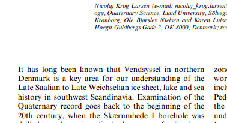

# Converting the paper to larger datasets:

## Basic Indexes

There are a few columns we'll use heavily for indexing, and as foreign and primary keys:

**publications**
  * publisher
  * title
  * year
  * volume
  * gddid (Primary Key, UNIQUE)
  * type
  * pages
  * number
  * volume
  * journalname

**author**
  * gddid (foreign key, to publications)
  * author

**links**
  * gddid (foreign key, to publications)
  * type
  * id

**sentences**
  * gddid (foreign key, to publications)
  * sentence
  * wordindex
  * words
  * partsofspeech
  * namedentities
  * lemmas
  * deppaths
  * depparents

```sql
ALTER TABLE publications ADD PRIMARY KEY (gddid);
ALTER TABLE authors ADD CONSTRAINT aufk FOREIGN KEY (gddid) REFERENCES publications(gddid);
ALTER TABLE links ADD CONSTRAINT lnfk FOREIGN KEY (gddid) REFERENCES publications(gddid);
ALTER TABLE sentences ADD CONSTRAINT sntfk FOREIGN KEY (gddid) REFERENCES publications(gddid);
```

With `regex` searches it's useful to use a trigram index, supported by the [postgres extension pg_trgm](https://www.postgresql.org/docs/current/pgtrgm.html):

```sql
CREATE EXTENSION pg_trgm;
```

Once the extension is added to the server we can then use trigrams, which break up strings into sequences of three letters, providing faster matching and supporting `LIKE` and regex matching much faster:

```sql
CREATE INDEX idx_trgm ON sentences
USING GiST(words GiST_trgm_ops);
```
*`runtime: 4min 7sec`*

The current IRD corpus has 2,530,000 sentences from 3,900 papers.  We can identify 9,800 sentences that match either `IRD` or `(rafted).*(debris)` (*runtime: 22sec*).

```sql
SELECT COUNT(*) as cwds
  	FROM
  		sentences AS sent
  	WHERE  LOWER(sent.words) ~ '.*".ird",.*' OR
         LOWER(sent.words) ~ '(rafted).*(debris)'
```

Where is the paper abstract?  First figure out why we don't match in some papers:

```sql
WITH abstracthit AS (
  SELECT DISTINCT gddid as cwds
  FROM
    sentences AS sent
  WHERE
    LOWER(sent.words) ~ '.*abstract.*')
SELECT *
FROM
  publications AS pub
WHERE gddid NOT IN (SELECT * FROM abstracthit)
```

This returns 658 articles where the Abstract could not be found with a simple text search.

Since we'll likely be doing a similar task with the Introduction, References and other sections we can make this into a function:

```sql
CREATE OR REPLACE FUNCTION findpaperloc(_location CHARACTER VARYING)
RETURNS TABLE (
  journal TEXT,
  total BIGINT,
  missing BIGINT
)
LANGUAGE sql
AS $function$
  WITH abstracthit AS (
    SELECT DISTINCT gddid as cwds
    FROM
      sentences AS sent
    WHERE
      sent.words ~ _location),
  misscount AS (
  	SELECT pub."journal.name.name", COUNT(*)
  	FROM
  	  publications AS pub
  	WHERE gddid NOT IN (SELECT * FROM abstracthit)
  	GROUP BY pub."journal.name.name"),
  alljrnl AS (
  	SELECT pub."journal.name.name", COUNT(*)
  	FROM
    		publications AS pub
  	GROUP BY pub."journal.name.name")
  SELECT
  	alljrnl."journal.name.name",
  	alljrnl.count AS total,
  	misscount.count AS missing
  FROM
  alljrnl
  FULL JOIN misscount ON alljrnl."journal.name.name" = misscount."journal.name.name"
$function$
```

This lets us do things like $chi$^2 tests on the presence or absence of paper sections, or certain terms within journals, so that we can decide whether we need general solutions for matching, or more specific solutions.

## Introduction

```sql
SELECT * FROM findpaperloc(_location := 'Introduction')
```

Returns a total of 190 rows (our initial search for Ice Rafted Debris returned hits from 190 total journals).

Journal                                                     | Total | Missing |
------------------------------------------------------------|-------|---------|--
Proceedings of the IODP                                     | 28    | 14      |
Journal of Phycology                                        | 1     |         |
GSA Bulletin                                                | 2     | 2       |
International Ocean Discovery Program Scientific Prospectus | 2     | 1       |
Anthropocene                                                | 1     |         |
Interdisciplinary Science Reviews                           | 1     | 1       |
SEPM Journal of Sedimentary Research                        | 24    | 22      |
International Journal of Coal Geology                       | 1     | 1       |
Water-Resources Investigations Report                       | 21    |         |


Understanding issues.

One journal that seems to stand out is the **SEPM Journal of Sedimentary Research**.  There are 24 articles that are returned, but 22 articles seem to fail their match to `Introduction`.  This is because when we look at papers in the journal, we see that the all use `INTRODUCTION` in all caps.

We could drop caps, to `introduction`, but for most matches the word would begin with an uppercase `I`.  Using the search string `(INTRODUCTION}|(Introduction)` still gives us a number of failures:
Journal                                                      | Total | Missing |
-------------------------------------------------------------|-------|---------|--
World Archaeology                                            | 1     | 1       |
Palaeontology                                                | 1     | 1       |
Gsa Today                                                    | 1     | 1       |
American Journal of Physical Anthropology                    | 1     | 1       |
Systems Biology in Reproductive Medicine                     | 1     | 1       |
Geografisk Tidsskrift-Danish Journal of Geography            | 1     | 1       |
International Journal of Coal Geology                        | 1     | 1       |
OPEC Review                                                  | 1     | 1       |
Alcheringa: An Australasian Journal of Palaeontology         | 1     | 1       |
Interdisciplinary Science Reviews                            | 1     | 1       |
Weather                                                      | 1     | 1       |
Journal of Vertebrate Paleontology                           | 1     | 1       |
Trends in Ecology & Evolution                                | 1     | 1       |
Norsk Geografisk Tidsskrift - Norwegian Journal of Geography | 2     | 1       |
Transactions of the New York Academy of Sciences             | 2     | 1       |
International Ocean Discovery Program Scientific Prospectus  | 2     | 1       |
Environmental Microbiology                                   | 3     | 1       |
Terra Nova                                                   | 4     | 1       |
Professional Paper                                           | 4     | 1       |
Deep Sea Research and Oceanographic Abstracts                | 5     | 1       |
Journal of Paleontology                                      | 5     | 1       |
Geografiska Annaler, Series A: Physical Geography            | 8     | 1       |
Organic Geochemistry                                         | 10    | 1       |
Progress in Oceanography                                     | 10    | 1       |
Open-File Report                                             | 11    | 1       |
Proceedings of the Geologists' Association                   | 12    | 1       |
Continental Shelf Research                                   | 15    | 1       |
Deep Sea Research Part I: Oceanographic Research Papers      | 17    | 1       |
Deep Sea Research Part II: Topical Studies in Oceanography   | 34    | 1       |
Geological Society of America Bulletin                       | 49    | 1       |
Sedimentary Geology                                          | 66    | 1       |
Geochemistry, Geophysics, Geosystems                         | 83    | 1       |
Astronomy & Geophysics                                       | 2     | 2       |
Lithosphere                                                  | 2     | 2       |
Lethaia                                                      | 2     | 2       |
International Journal of Climatology                         | 3     | 2       |
Journal of Structural Geology                                | 3     | 2       |
Limnology and Oceanography                                   | 3     | 2       |
Journal of Geophysical Research                              | 20    | 2       |
SEPM Journal of Sedimentary Research                         | 24    | 2       |
Sedimentology                                                | 71    | 2       |
Proceedings of the International Ocean Discovery Program     | 4     | 3       |
GFF                                                          | 7     | 3       |
Geology                                                      | 55    | 3       |
Canadian Journal of Earth Sciences                           | 84    | 3       |
Developments in Marine Geology                               | 11    | 4       |
Earth-Science Reviews                                        | 54    | 4       |
Paleoceanography                                             | 265   | 4       |
Geol                                                         | 92    | 5       |
Geology Today                                                | 7     | 7       |
Quaternary Research                                          | 89    | 7       |
Global and Planetary Change                                  | 128   | 7       |
Geochimica et Cosmochimica Acta                              | 45    | 8       |
Earth and Planetary Science Letters                          | 210   | 8       |
Marine Geology                                               | 277   | 8       |
Journal of Quaternary Science                                | 128   | 12      |
Proceedings of the IODP                                      | 28    | 14      |
Proceedings of the Ocean Drilling Program                    | 148   | 14      |
Initial Reports of the Deep Sea Drilling Project             | 56    | 15      |
Journal of African Earth Sciences                            | 23    | 16      |
Palaeogeography, Palaeoclimatology, Palaeoecology            | 302   | 16      |
Deep Sea Research Part B. Oceanographic Literature Review    | 22    | 22      |
Quaternary Science Reviews                                   | 542   | 22      |
Eos, Transactions American Geophysical Union                 | 26    | 25      |
Quaternary International                                     | 160   | 80      |
Boreas                                                       | 116   | 104     |

We can look at the articles that fail matches, and we will do that in the future, using the following function:

```sql
CREATE OR REPLACE FUNCTION findmissingpapers(_location CHARACTER VARYING)
RETURNS TABLE (LIKE publications)
LANGUAGE sql
AS $function$
  WITH abstracthit AS (
    SELECT DISTINCT gddid as cwds
    FROM
      sentences AS sent
    WHERE
      sent.words ~ _location)
  SELECT pub.*
  FROM
    publications AS pub
  WHERE gddid NOT IN (SELECT * FROM abstracthit)
$function$
```

But, it turns out that the 20 missing papers are actually a set of papers in the `publications` table that do not have corresponding entries in the sentences table.

So, the missing papers are:

```sql
SELECT * FROM findmissingpapers('(INTRODUCTION}|(Introduction)')
```

Which gives us a set of papers.  If we pull one of the ones from *Boreas* (which is missing 104 of 116 papers) we can see that it doesn't have an "Introduction" section at all.



There are also a whole set of articles in *Quaternary International* from 2012 that are part of a set of abstracts from the INQUA congress in Bern, Switzerland.

These seem like issues that can generally be managed, to some degree.

## Study Area or Methods

```sql
SELECT * FROM findpaperloc(_location := '"Study","Area"')
```


Number of sentences in a paper, number of papers:
```sql
  WITH cts AS (
  	SELECT gddid, COUNT(words) as cwds
  	FROM
  		sentences AS sent
  	WHERE  sent.words ~ '.*IRD",.*' OR
         toLower(sent.words) ~ '(rafted).*(debris)'
  	GROUP BY gddid)
  SELECT cwds, COUNT(*) AS refs
  FROM cts
  GROUP BY cwds
  ORDER BY cwds
```
